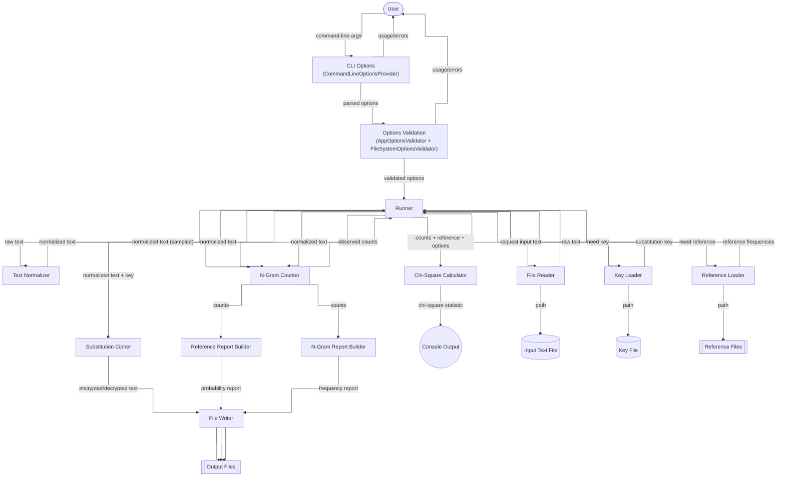

# Kryptografia i kryptoanaliza

## Laboratorium 1

### Grupa 1ID24B

### Autorzy: Kamil Fudala, Andrzej Szczytyński

### Zadanie 1

Dokonaj implementacji programu szyfrującego i deszyfrującego zadany tekst.

1. Tekst jawny powinien być importowany do programu z pliku tekstowego, którego nazwa określona powinna być
   po zdefiniowanym argumencie / fladze: -i.
2. Wynik pracy programu powinien być eksportowany do pliku tekstowego, którego nazwa określona powinna być
   po zdefiniowanym argumencie / fladze: -o.
3. Klucz powinien być importowany z pliku tekstowego, którego nazwa powinna być określona po zdefiniowanym
   argumencie / fladze: -k.
4. Tryb pracy programu powinien być określony poprzez flagi: -e dla procesu szyfrowania, -d dla procesu deszyfrowania.

#### Wyniki

Przeprowadzono szyfrowanie tekstu jawnego kluczem podstawieniowym, co dało szyfrogram istotnie różny od oryginału.
Wykonano następnie deszyfrowanie, które odtworzyło treść w postaci znormalizowanej do wielkich liter A-Z bez znaków
nieliterowych. Wyniki są zgodne z założeniami, algorytm działa poprawnie, a odzyskany tekst pokrywa się z
przetworzonym wejściem.

- Szyfrowanie

  ```
  ➜  Task01 (main) dotnet run --project Task01/Task01.csproj -- -e -k key.txt -i plaintext.txt -o ciphertext.txt                                                                                                                           ✗ ✭
  ➜  Task01 (main) diff plaintext.txt ciphertext.txt                                                                                                                                                                                       ✗ ✭
  1,4c1
  < Once upon a time, in a quiet village surrounded by hills and forests, there lived a young boy who loved to read stories.
  < He spent his evenings by the fireplace, turning the pages of old books filled with adventures and mysteries.
  < The more he read, the more he dreamed of distant lands and brave heroes.
  < One day, he decided that his own life should become a story worth telling.
  ---
  > GFETXHGFQZODTOFQJXOTZCOSSQUTLXKKGXFRTRWNIOSSLQFRYGKTLZLZITKTSOCTRQNGXFUWGNVIGSGCTRZGKTQRLZGKOTLITLHTFZIOLTCTFOFULWNZITYOKTHSQETZXKFOFUZITHQUTLGYGSRWGGALYOSSTRVOZIQRCTFZXKTLQFRDNLZTKOTLZITDGKTITKTQRZITDGKTITRKTQDTRGYROLZQFZSQFRLQFRWKQCTITKGTLGFTRQNITRTEORTRZIQZIOLGVFSOYTLIGXSRWTEGDTQLZGKNVGKZIZTSSOFU
  \ No newline at end of file
  ```

- Deszyfrowanie

  ```
  ➜  Task01 (main) dotnet run --project Task01/Task01.csproj -- -d -k key.txt -i ciphertext.txt -o recovered.txt                                                                                                                           ✗ ✭
  ➜  Task01 (main) diff plaintext.txt recovered.txt                                                                                                                                                                                          ✭
  1,4c1
  < Once upon a time, in a quiet village surrounded by hills and forests, there lived a young boy who loved to read stories.
  < He spent his evenings by the fireplace, turning the pages of old books filled with adventures and mysteries.
  < The more he read, the more he dreamed of distant lands and brave heroes.
  < One day, he decided that his own life should become a story worth telling.
  ---
  > ONCEUPONATIMEINAQUIETVILLAGESURROUNDEDBYHILLSANDFORESTSTHERELIVEDAYOUNGBOYWHOLOVEDTOREADSTORIESHESPENTHISEVENINGSBYTHEFIREPLACETURNINGTHEPAGESOFOLDBOOKSFILLEDWITHADVENTURESANDMYSTERIESTHEMOREHEREADTHEMOREHEDREAMEDOFDISTANTLANDSANDBRAVEHEROESONEDAYHEDECIDEDTHATHISOWNLIFESHOULDBECOMEASTORYWORTHTELLING
  \ No newline at end of file
  ```

### Zadanie 2

Rozbudować program z poprzedniego przykładu poprzez dodanie do niego funkcjonalności generowania statystyk liczności
występowania n-gramów (sekwencji kolejnych liter), to jest mono-gramów (pojedynczych liter), bi-gramów (wyrazów
dwuliterowych), tri-gramów (wyrazów trzyliterowych) oraz quad-gramów (wyrazów czteroliterowych). Funkcjonalność ta
powinna być wyzwalana poprzez dodanie do programu jednej z następujących flag: -g1, -g2, -g3 lub
-g4, po której powinna zostać określona nazwa pliku, do którego zapisane zostaną wyniki.

#### Wyniki

Wygenerowano statystyki częstości mono-, bi-, tri- i quad-gramów z uprzednio znormalizowanego tekstu (A-Z).
Zliczenia zapisano do plików monograms.txt, bigrams.txt, trigrams.txt, quadgrams.txt w formacie "n-gram liczność".
Wyniki są zgodne z założeniami: dla wyższych n dominuje liczność 1, a otrzymane listy poprawnie odzwierciedlają n-gramy
występujące w tekście.

- Monogramy

  ```
  ➜  Task02 (main) dotnet run --project Task02/Task02.csproj -- -i plaintext.txt -g1 monograms.txt                   ✭
  ➜  Task02 (main) cat monograms.txt | tail -n 10                                                                    ✭
  B 6
  F 6
  G 6
  M 6
  V 6
  C 4
  P 4
  W 4
  K 1
  Q 1
  ```

- Bigramy

  ```
  ➜  Task02 (main) dotnet run --project Task02/Task02.csproj -- -i plaintext.txt -g2 bigrams.txt                     ✭
  ➜  Task02 (main) cat bigrams.txt | tail -n 10                                                                      ✭
  UL 1
  UP 1
  VI 1
  WH 1
  WI 1
  WN 1
  WO 1
  YO 1
  YS 1
  YT 1
  ```

- Trigramy

  ```
  ➜  Task02 (main) dotnet run --project Task02/Task02.csproj -- -i plaintext.txt -g3 trigrams.txt                    ✭
  ➜  Task02 (main) cat trigrams.txt | tail -n 10                                                                     ✭
  WIT 1
  WNL 1
  WOR 1
  YHE 1
  YHI 1
  YOU 1
  YST 1
  YTH 1
  YWH 1
  YWO 1                                                                                               ✭
  ```

- Quadgramy

  ```
  ➜  Task02 (main) dotnet run --project Task02/Task02.csproj -- -i plaintext.txt -g4 quadgrams.txt                   ✭
  ➜  Task02 (main) cat quadgrams.txt | tail -n 10                                                                    ✭
  WITH 1
  WNLI 1
  WORT 1
  YHED 1
  YHIL 1
  YOUN 1
  YSTE 1
  YTHE 1
  YWHO 1
  YWOR 1
  ```

### Zadanie 3

Uzupełnij program z poprzedniego zadania, tak aby w przypadku podania flagi -rX, gdzie X jest liczbą należącą do
zbioru {1, 2, 3, 4} a następnie nazwy pliku, program odczytywał z niego referencyjną bazę n-gramów. Liczby z
podanego zbioru odpowiadają: {mono-gramom, bi-gramom, tri-gramom, quad-gramom}.

#### Wyniki

Zbudowano bazy referencyjne n-gramów (1-4) z pliku corpus.txt, który zawiera kilka książek pozyskanych z GITenberg.
Obliczono statystykę $\chi^2$ dla znormalizowanego plaintext.txt względem tych baz, uzyskując kolejno: 23.92 (mono),
415.66 (
bi), 5231.10 (tri), 45365.80 (quad).
Zaobserwowany wzrost wartości wraz z rzędem n-gramów jest zgodny z założeniami (więcej rzadkich klas i mniejsze $E_i$).

- Bazy referencyjne

  ```
  ➜  Task03 (main) dotnet run --project Task03/Task03.csproj -- -i corpus.txt -b1 mono_ref.txt -b2 bi_ref.txt -b3 tri_ref.txt -b4 quad_ref.txt                                                                                               ✭
  ```

- Monogramy

  ```
  ➜  Task03 (main) dotnet run --project Task03/Task03.csproj -- -i plaintext.txt -s -r1 mono_ref.txt                                                                                                                                         ✭
  23.920623209756698
  ```

- Bigramy

  ```
  ➜  Task03 (main) dotnet run --project Task03/Task03.csproj -- -i plaintext.txt -s -r2 bi_ref.txt                                                                                                                                           ✭
  415.6565528488983
  ```

- Trigramy

  ```
  ➜  Task03 (main) dotnet run --project Task03/Task03.csproj -- -i plaintext.txt -s -r3 tri_ref.txt                                                                                                                                          ✭
  5231.103323340586
  ```

- Quadgramy

  ```
  ➜  Task03 (main) dotnet run --project Task03/Task03.csproj -- -i plaintext.txt -s -r4 quad_ref.txt                                                                                                                                         ✭
  45365.80049320461
  ```

### Zadanie 4

Wykonać eksperymenty::

- Dokonaj obserwacji wyniku testu $\chi^2$ dla tekstu jawnego i zaszyfrowanego o różnych długościach.
- Wiadomo, iż wynik testu może być znacząco zaburzony w przypadku gdy brane są pod uwagę symbole (n-gramy),
  które rzadko występują w tekście, np w przypadku mono-gramów języka angielskiego są to litery: J, K, Q, X oraz
  Z (patrz odczytana tablica częstości mono-gramów). Zbadaj wynik testu $\chi^2$ w przypadku gdy do wyznaczenia
  testu pominięte zostaną rzadko występujące n-gramy.

#### Diagram przepływu danych dla zadań 1-4



#### Implementacja

- IAppOptionsProvider.cs - Interfejs określa kontrakt dostawcy opcji aplikacji. Udostępnia metodę TryGetOptions, która próbuje sparsować argumenty CLI do AppOptions i zgłasza błędy walidacji. Dzięki temu warstwa infrastruktury może jednolicie przekazywać konfigurację dalej.

  ```csharp
  using Task04.Application.Models;

  namespace Task04.Application.Abstractions;

  public interface IAppOptionsProvider
  {
      bool TryGetOptions(string[] args, out AppOptions options, out List<string> errors);
  }
  ```

- IChiSquareCalculator.cs - Interfejs opisuje usługę obliczającą statystykę chi-kwadrat dla zadanego tekstu. Zapewnia metodę Compute przyjmującą znormalizowane dane, rząd n-gramów oraz bazę referencyjną. Dzięki temu logika analityczna jest odseparowana od reszty aplikacji.

    ```csharp
    using Task04.Application.Models;

    namespace Task04.Application.Abstractions;

    public interface IChiSquareCalculator
    {
        double Compute(string normalizedText, int n, NGramReference reference, ChiSquareOptions? options = null);
    }
    ```

- IFileReader.cs - Minimalistyczny interfejs abstrakcji odczytu plików. Udostępnia metodę ReadAll zwracającą całą zawartość wskazanego pliku tekstowego. Pozwala to testować pozostałe komponenty bez bezpośredniej zależności od systemu plików.

    ```csharp
    namespace Task04.Application.Abstractions;

    public interface IFileReader
    {
        string ReadAll(string path);
    }
    ```

- IFileWriter.cs - Interfejs odpowiadający za zapis danych na dysk. Wystawia metodę WriteAll przyjmującą ścieżkę i zawartość tekstową do utrwalenia. Abstrakcja umożliwia łatwą podmianę implementacji w testach lub innych środowiskach.

    ```csharp
    namespace Task04.Application.Abstractions;

    public interface IFileWriter
    {
        void WriteAll(string path, string content);
    }
    ```

- IKeyLoader.cs - Kontrakt opisuje komponent odpowiedzialny za wczytywanie klucza podstawieniowego z pliku. Definiuje metodę Load zwracającą obiekt SubstitutionKey po przeprowadzeniu walidacji i parsowania danych. Pozwala to ukryć szczegóły formatu klucza przed pozostałymi warstwami.

    ```csharp
    using Task04.Domain;

    namespace Task04.Application.Abstractions;

    public interface IKeyLoader
    {
        SubstitutionKey Load(string path);
    }
    ```

- INGramLoader.cs - Interfejs opisuje licznik n-gramów wykorzystywany przy analizie tekstu. Udostępnia metodę Count, która przyjmuje znormalizowany tekst i długość n-gramu, zwracając histogram wystąpień. Dzięki temu implementacja zliczania może być wymieniana niezależnie od reszty systemu.

    ```csharp
    namespace Task04.Application.Abstractions;

    public interface INGramCounter
    {
        IReadOnlyDictionary<string, int> Count(string normalized, int n);
    }
    ```

- IOptionsValidator.cs - Interfejs agreguje reguły walidacji konfiguracji aplikacji. Metoda Validate przyjmuje AppOptions i zwraca listę komunikatów błędów, jeśli wykryto niespójności. Dzięki temu można składać wiele niezależnych walidatorów.

    ```csharp
    using Task04.Application.Models;

    namespace Task04.Application.Abstractions;

    public interface IOptionsValidator
    {
        IReadOnlyList<string> Validate(AppOptions options);
    }
    ```

- IReferenceLoader.cs - Interfejs określa sposób wczytywania referencyjnych baz n-gramów. Metoda Load zwraca obiekt NGramReference z prawdopodobieństwami wymaganymi do testów statystycznych. Umożliwia to separację formatu pliku od warstwy obliczeniowej.

    ```csharp
    namespace Task04.Application.Abstractions;

    public interface IReferenceLoader
    {
        NGramReference Load(string path);
    }
    ```

- IRunner.cs - Interfejs reprezentuje główny przebieg programu w zależności od wybranych opcji. Udostępnia metodę Run przyjmującą AppOptions i zwracającą kod zakończenia procesu. Koncentracja logiki uruchomieniowej w jednym komponencie ułatwia testowanie scenariuszy.

    ```csharp
    using Task04.Application.Models;

    namespace Task04.Application.Abstractions;

    public interface IRunner
    {
        int Run(AppOptions options);
    }
    ```

- ISubstitutionCipher.cs - Interfejs definiuje operacje szyfrujące i deszyfrujące na znormalizowanych ciągach znaków. Wymaga implementacji metod Encrypt oraz Decrypt pracujących na obiekcie SubstitutionKey. Zapewnia to polimorficzną obsługę różnych wariantów szyfrów podstawieniowych.

    ```csharp
    using Task04.Domain;

    namespace Task04.Application.Abstractions;

    public interface ISubstitutionCipher
    {
        string Encrypt(string normalizedPlaintext, SubstitutionKey key);
        string Decrypt(string normalizedCiphertext, SubstitutionKey key);
    }
    ```

- ITextNormalizer.cs - Interfejs izoluje logikę normalizacji tekstu przed dalszymi obliczeniami. Metoda Normalize otrzymuje dowolny ciąg wejściowy i zwraca wersję oczyszczoną do formatu A–Z. Dzięki temu reszta aplikacji pracuje na przewidywalnym zbiorze znaków.

    ```csharp
    namespace Task04.Application.Abstractions;

    public interface ITextNormalizer
    {
        string Normalize(string input);
    }
    ```

- NGramReference.cs - Klasa przechowuje bazę prawdopodobieństw n-gramów określonego rzędu. W konstruktorze weryfikuje poprawność argumentów i zapewnia niezmienność kolekcji. Obiekt ten stanowi wejście do obliczeń testu chi-kwadrat.

    ```csharp
    namespace Task04.Application.Abstractions;

    public sealed class NGramReference
    {
        public int Order { get; }
        public IReadOnlyDictionary<string, double> Probabilities { get; }

        public NGramReference(int order, IReadOnlyDictionary<string, double> probabilities)
        {
            ArgumentOutOfRangeException.ThrowIfLessThan(order, 1);
            Order = order;
            Probabilities = probabilities ?? throw new ArgumentNullException(nameof(probabilities));
        }
    }
    ```

- AnalysisService.cs - Klasa agreguje zależności analityczne (licznik n-gramów, loader referencji i kalkulator chi-kwadrat). Udostępnia właściwości pozwalające innym komponentom korzystać z tych usług jako spójnego zestawu. Dzięki temu Runner otrzymuje jedną fasadę dla zadań analitycznych.

    ```csharp
    using Task04.Application.Abstractions;

    namespace Task04.Application.Analysis;

    public sealed class AnalysisServices(
        INGramCounter nGramCounter,
        IReferenceLoader referenceLoader,
        IChiSquareCalculator chiSquare)
    {
        public INGramCounter NGramCounter { get; } = nGramCounter ?? throw new ArgumentNullException(nameof(nGramCounter));

        public IReferenceLoader ReferenceLoader { get; } =
            referenceLoader ?? throw new ArgumentNullException(nameof(referenceLoader));

        public IChiSquareCalculator ChiSquare { get; } = chiSquare ?? throw new ArgumentNullException(nameof(chiSquare));
    }
    ```

- ChiSquareCalculator.cs - Implementacja oblicza wartość statystyki chi-kwadrat dla obserwowanych n-gramów. Korzysta z licznika n-gramów do wyznaczenia częstości oraz stosuje wybrane opcje filtrowania. Dzięki temu można badać zgodność tekstu z bazą referencyjną.

    ```csharp
    using Task04.Application.Abstractions;
    using Task04.Application.Models;

    namespace Task04.Application.Analysis;

    public sealed class ChiSquareCalculator(INGramCounter counter) : IChiSquareCalculator
    {
        private readonly INGramCounter _counter = counter ?? throw new ArgumentNullException(nameof(counter));

        public double Compute(string normalizedText, int n, NGramReference reference, ChiSquareOptions? options = null)
        {
            ArgumentNullException.ThrowIfNull(reference);
            if (reference.Order != n) throw new InvalidDataException($"Reference order {reference.Order} != n={n}.");

            var counts = _counter.Count(normalizedText ?? throw new ArgumentNullException(nameof(normalizedText)), n);
            var total = counts.Values.Sum();
            if (total == 0) return 0.0;

            var exclude = options?.Exclude ?? new HashSet<string>(StringComparer.Ordinal);
            var minE = options?.MinExpected;

            var missing = counts.Keys.Where(k => !reference.Probabilities.ContainsKey(k) && !exclude.Contains(k)).ToArray();
            if (missing.Length > 0)
                throw new InvalidDataException(
                    $"Reference base misses {missing.Length} n-grams present in text: {string.Join(",", missing.Take(10))}{(missing.Length > 10 ? ", ..." : "")}");

            var t = 0.0;
            foreach (var (g, pi) in reference.Probabilities)
            {
                if (exclude.Contains(g)) continue;

                var ei = total * pi;
                if (minE is { } thr && ei < thr) continue;

                counts.TryGetValue(g, out var ci);
                var diff = ci - ei;
                t += diff * diff / ei;
            }

            return t;
        }
    }
    ```

- NGramCounter.cs - Klasa odpowiedzialna za zliczanie wystąpień n-gramów w znormalizowanym tekście. Przechodzi po ciągu znaków, budując słownik częstotliwości i obsługując komentarze oraz walidację wejścia. Wyniki służą zarówno do raportów częstości, jak i do statystyk chi-kwadrat.

    ```csharp
    using Task04.Application.Abstractions;

    namespace Task04.Application.Analysis;

    public sealed class NGramCounter : INGramCounter
    {
        public IReadOnlyDictionary<string, int> Count(string normalized, int n)
        {
            ArgumentNullException.ThrowIfNull(normalized);
            if (n <= 0) throw new ArgumentOutOfRangeException(nameof(n), "n must be >= 1.");
            if (normalized.Length < n) return new Dictionary<string, int>();

            var dict = new Dictionary<string, int>(StringComparer.Ordinal);
            for (var i = 0; i <= normalized.Length - n; i++)
            {
                var gram = normalized.Substring(i, n);
                dict.TryGetValue(gram, out var c);
                dict[gram] = c + 1;
            }

            return dict;
        }
    }
    ```

- NGramReportBuilder.cs - Statyczna klasa buduje raport zliczeń n-gramów w formacie tekstowym. Sortuje dane według liczności i leksykalnie, a następnie zapisuje każdą parę "n-gram liczność" w osobnej linii. Ułatwia to generowanie wyników dla użytkownika.

    ```csharp
    using System.Globalization;

    namespace Task04.Application.Analysis;

    public static class NGramReportBuilder
    {
        public static string Build(IReadOnlyDictionary<string, int> counts)
        {
            var sb = new System.Text.StringBuilder();
            foreach (var kv in counts
                        .OrderByDescending(kv => kv.Value)
                        .ThenBy(kv => kv.Key, StringComparer.Ordinal))
            {
                sb.Append(CultureInfo.InvariantCulture, $"{kv.Key} {kv.Value}");
                sb.AppendLine();
            }

            return sb.ToString();
        }
    }
    ```

- ReferenceReportBuilder.cs - Narzędzie generuje raport prawdopodobieństw na podstawie zliczeń n-gramów. Oblicza udział każdego n-gramu w sumie i wypisuje wynik w stabilnej kolejności. Pozwala to tworzyć pliki referencyjne wykorzystywane w dalszych analizach.

    ```csharp
    using System.Globalization;

    namespace Task04.Application.Analysis;

    public static class ReferenceReportBuilder
    {
        public static string BuildProbabilities(IReadOnlyDictionary<string, int> counts)
        {
            var total = counts.Values.Sum();
            if (total == 0) return string.Empty;

            var sb = new System.Text.StringBuilder();
            foreach (var kv in counts
                        .OrderByDescending(k => k.Value)
                        .ThenBy(k => k.Key, StringComparer.Ordinal))
            {
                var p = (double)kv.Value / total;
                sb.Append(CultureInfo.InvariantCulture, $"{kv.Key} {p}");
                sb.AppendLine();
            }

            return sb.ToString();
        }
    }
    ```

- SubstitutionCipher.cs - Implementacja szyfru podstawieniowego wykonuje transformację znak po znaku zgodnie z mapą klucza. Wspólna metoda Transform obsługuje zarówno szyfrowanie, jak i deszyfrowanie oraz waliduje kompletność mapowania. Dzięki temu operacje na tekście są deterministyczne i bezpieczne.

    ```csharp
    using System.Text;
    using Task04.Application.Abstractions;
    using Task04.Domain;

    namespace Task04.Application.Cipher;

    public sealed class SubstitutionCipher : ISubstitutionCipher
    {
        public string Encrypt(string normalizedPlaintext, SubstitutionKey key)
            => Transform(normalizedPlaintext, key.Forward);

        public string Decrypt(string normalizedCiphertext, SubstitutionKey key)
            => Transform(normalizedCiphertext, key.Reverse);

        private static string Transform(string input, IReadOnlyDictionary<char, char> map)
        {
            ArgumentNullException.ThrowIfNull(input);
            var sb = new StringBuilder(input.Length);
            foreach (var c in input)
            {
                if (!map.TryGetValue(c, out var m))
                    throw new InvalidDataException($"Character '{c}' not present in key.");
                sb.Append(m);
            }

            return sb.ToString();
        }
    }
    ```

- AppOptions.cs - Klasa modeluje wszystkie możliwe opcje konfiguracyjne programu. Zawiera właściwości reprezentujące ścieżki plików, tryby pracy, opcje eksperymentów oraz pomocnicze właściwości logiczne. Umożliwia to spójne przekazywanie ustawień między warstwami aplikacji.

    ```csharp
    using Task04.Domain.Enums;

    namespace Task04.Application.Models;

    public sealed class AppOptions
    {
        public string? InputPath { get; init; }

        public string? OutputPath { get; init; }
        public string? KeyPath { get; init; }
        public OperationMode Mode { get; init; } = OperationMode.Unspecified;

        public string? G1OutputPath { get; init; }
        public string? G2OutputPath { get; init; }
        public string? G3OutputPath { get; init; }
        public string? G4OutputPath { get; init; }

        public string? B1OutputPath { get; init; }
        public string? B2OutputPath { get; init; }
        public string? B3OutputPath { get; init; }
        public string? B4OutputPath { get; init; }

        public bool ComputeChiSquare { get; init; }
        public string? R1Path { get; init; }
        public string? R2Path { get; init; }
        public string? R3Path { get; init; }
        public string? R4Path { get; init; }


        public int? SampleLength { get; init; }
        public double? MinExpected { get; init; }
        public string? ExcludeCsv { get; init; }

        public bool ShowHelp { get; init; }

        public bool AnyNGramRequested =>
            !string.IsNullOrWhiteSpace(G1OutputPath) ||
            !string.IsNullOrWhiteSpace(G2OutputPath) ||
            !string.IsNullOrWhiteSpace(G3OutputPath) ||
            !string.IsNullOrWhiteSpace(G4OutputPath);

        public bool AnyRefBuildRequested =>
            !string.IsNullOrWhiteSpace(B1OutputPath) ||
            !string.IsNullOrWhiteSpace(B2OutputPath) ||
            !string.IsNullOrWhiteSpace(B3OutputPath) ||
            !string.IsNullOrWhiteSpace(B4OutputPath);

        public int? ReferenceOrder
        {
            get
            {
                if (!string.IsNullOrWhiteSpace(R1Path)) return 1;
                if (!string.IsNullOrWhiteSpace(R2Path)) return 2;
                if (!string.IsNullOrWhiteSpace(R3Path)) return 3;
                if (!string.IsNullOrWhiteSpace(R4Path)) return 4;
                return null;
            }
        }

        public string? ReferencePath =>
            ReferenceOrder switch
            {
                1 => R1Path,
                2 => R2Path,
                3 => R3Path,
                4 => R4Path,
                _ => null
            };
    }
    ```

- ChiSquareOptions.cs - Rekord przechowuje dodatkowe ustawienia dla kalkulatora chi-kwadrat. Obejmuje zestaw n-gramów do wykluczenia oraz opcjonalny próg oczekiwanej liczności. Pozwala to konfigurować analizy eksperymentalne bez modyfikacji głównej logiki.

    ```csharp
    namespace Task04.Application.Models;

    public sealed class ChiSquareOptions(ISet<string> exclude, double? minExpected)
    {
        public ISet<string> Exclude { get; } = exclude ?? throw new ArgumentNullException(nameof(exclude));
        public double? MinExpected { get; } = minExpected;
    }
    ```

- ReferenceLoader.cs - Klasa parsuje pliki referencyjne z prawdopodobieństwami n-gramów, dbając o walidację formatu. Odczytuje linie, filtruje komentarze, sprawdza spójność rzędu oraz sumę prawdopodobieństw. W efekcie zwraca gotowy obiekt NGramReference do dalszych obliczeń.

    ```csharp
    using System.Globalization;
    using Task04.Application.Abstractions;

    namespace Task04.Application.Reference;

    public sealed class ReferenceLoader(IFileReader reader) : IReferenceLoader
    {
        private readonly IFileReader _reader = reader ?? throw new ArgumentNullException(nameof(reader));

        public NGramReference Load(string path)
        {
            var text = _reader.ReadAll(path);
            var dict = new Dictionary<string, double>(StringComparer.Ordinal);
            int? order = null;
            var lineNo = 0;

            using var sr = new StringReader(text);
            while (sr.ReadLine() is { } line)
            {
                lineNo++;
                if (!TryGetTokens(line, out var tokens)) continue;

                var gram = ParseGram(tokens[0], lineNo);
                order = EnsureAndGetOrder(order, gram.Length, lineNo);

                var p = ParseProbability(tokens[1], lineNo);
                AddUnique(dict, gram, p, lineNo);
            }

            EnsureNotEmpty(order, dict);
            EnsureSumToOne(dict);

            return new NGramReference(order!.Value, dict);
        }

        private static bool TryGetTokens(string line, out string[] tokens)
        {
            var trimmed = StripComment(line).Trim();
            if (trimmed.Length == 0)
            {
                tokens = [];
                return false;
            }

            tokens = trimmed.Split((char[]?)null, StringSplitOptions.RemoveEmptyEntries);
            return tokens.Length != 2
                ? throw new InvalidDataException($"Ref line invalid: expected 2 tokens, got {tokens.Length}.")
                : true;
        }

        private static string ParseGram(string token, int lineNo)
        {
            var gram = token.ToUpperInvariant();
            return !gram.All(c => c is >= 'A' and <= 'Z')
                ? throw new InvalidDataException($"Ref line {lineNo}: gram must be A–Z only, got '{token}'.")
                : gram;
        }

        private static int EnsureAndGetOrder(int? current, int length, int lineNo)
        {
            if (current is null) return length;
            return length != current.Value
                ? throw new InvalidDataException($"Ref line {lineNo}: mixed n-gram lengths.")
                : current.Value;
        }

        private static double ParseProbability(string token, int lineNo)
        {
            if (!double.TryParse(token, NumberStyles.Float, CultureInfo.InvariantCulture, out var p))
                throw new InvalidDataException($"Ref line {lineNo}: invalid probability '{token}'.");
            return p is < 0d or > 1d
                ? throw new InvalidDataException($"Ref line {lineNo}: probability out of range [0,1].")
                : p;
        }

        private static void AddUnique(Dictionary<string, double> dict, string gram, double p, int lineNo)
        {
            if (!dict.TryAdd(gram, p))
                throw new InvalidDataException($"Ref line {lineNo}: duplicate gram '{gram}'.");
        }

        private static void EnsureNotEmpty(int? order, Dictionary<string, double> dict)
        {
            if (order is null || dict.Count == 0)
                throw new InvalidDataException("Reference file is empty.");
        }

        private static void EnsureSumToOne(Dictionary<string, double> dict)
        {
            var sum = dict.Values.Sum();
            if (Math.Abs(sum - 1d) > 1e-6)
                throw new InvalidDataException(
                    $"Reference probabilities must sum to 1. Current sum={sum.ToString(CultureInfo.InvariantCulture)}.");
        }

        private static string StripComment(string s)
        {
            var idx = s.IndexOf('#');
            return idx >= 0 ? s[..idx] : s;
        }
    }
    ```

- TextNormalizer.cs - Implementacja normalizatora konwertuje tekst do wielkich liter A–Z i usuwa znaki niealfabetyczne. Utrzymuje spójny format wejścia dla operacji kryptograficznych i statystycznych. Dzięki temu wszystkie moduły zakładają identyczny alfabet roboczy.

    ```csharp
    using Task04.Application.Abstractions;

    namespace Task04.Application.Text;

    public sealed class TextNormalizer : ITextNormalizer
    {
        public string Normalize(string input)
        {
            ArgumentNullException.ThrowIfNull(input);
            return new string(
                input.Select(char.ToUpperInvariant)
                    .Where(c => c is >= 'A' and <= 'Z')
                    .ToArray());
        }
    }
    ```

- AppOptionsValidator.cs - Walidator sprawdza spójność logiczną opcji aplikacji, weryfikując wymagane ścieżki i kombinacje flag. Grupuje reguły dla poszczególnych trybów działania i generuje komunikaty błędów. Chroni to użytkownika przed uruchomieniem programu w niepoprawnej konfiguracji.

    ```csharp
    using Task04.Application.Abstractions;
    using Task04.Application.Models;
    using Task04.Domain.Enums;

    namespace Task04.Application.Validation;

    public sealed class AppOptionsValidator : IOptionsValidator
    {
        public IReadOnlyList<string> Validate(AppOptions options)
        {
            if (options.ShowHelp) return [];
            var errors = new List<string>();

            var hasCipher = options.Mode is not OperationMode.Unspecified;
            var hasNgrams = options.AnyNGramRequested;
            var hasChi2 = options.ComputeChiSquare || options.ReferenceOrder is not null;
            var hasBuild = options.AnyRefBuildRequested;

            ValidateModeSelection(hasCipher, hasNgrams, hasChi2, hasBuild, errors);
            if (errors.Count > 0) return errors;

            if (hasCipher) ValidateCipher(options, errors);
            if (hasNgrams) ValidateRequiresInput(options, errors);
            if (hasBuild) ValidateRequiresCorpus(options, errors);
            if (hasChi2) ValidateChiSquare(options, errors);

            return errors;
        }

        private static void ValidateModeSelection(bool hasCipher, bool hasNgrams, bool hasChi2, bool hasBuild,
            List<string> errors)
        {
            var selected = (hasCipher ? 1 : 0) + (hasNgrams ? 1 : 0) + (hasChi2 ? 1 : 0) + (hasBuild ? 1 : 0);
            switch (selected)
            {
                case 0:
                    errors.Add("Select one mode: cipher | n-grams | chi-square | build-ref.");
                    return;
                case > 1:
                    errors.Add("Cannot mix modes. Choose exactly one.");
                    break;
            }
        }

        private static void ValidateCipher(AppOptions o, List<string> errors)
        {
            if (string.IsNullOrWhiteSpace(o.InputPath)) errors.Add("Missing input path. Use -i <file>.");
            if (string.IsNullOrWhiteSpace(o.OutputPath)) errors.Add("Missing output path. Use -o <file>.");
            if (string.IsNullOrWhiteSpace(o.KeyPath)) errors.Add("Missing key path. Use -k <file>.");
        }

        private static void ValidateRequiresInput(AppOptions o, List<string> errors)
        {
            if (string.IsNullOrWhiteSpace(o.InputPath)) errors.Add("Missing input path. Use -i <file>.");
        }

        private static void ValidateRequiresCorpus(AppOptions o, List<string> errors)
        {
            if (string.IsNullOrWhiteSpace(o.InputPath)) errors.Add("Missing input path. Use -i <corpus_file>.");
        }

        private static void ValidateChiSquare(AppOptions o, List<string> errors)
        {
            if (!o.ComputeChiSquare) errors.Add("Chi-square requires -s flag.");
            if (string.IsNullOrWhiteSpace(o.InputPath)) errors.Add("Missing input path. Use -i <file>.");

            var rCount = CountProvided(o.R1Path, o.R2Path, o.R3Path, o.R4Path);
            switch (rCount)
            {
                case 0:
                    errors.Add("Missing reference file. Use -r1|-r2|-r3|-r4 <file>.");
                    break;
                case > 1:
                    errors.Add("Select exactly one reference base: -r1 or -r2 or -r3 or -r4.");
                    break;
            }

            if (o.SampleLength is <= 0) errors.Add("Sample length must be > 0.");
            if (o.MinExpected is <= 0) errors.Add("Min expected (--minE) must be > 0.");
        }

        private static int CountProvided(params string?[] paths) =>
            paths.Count(p => !string.IsNullOrWhiteSpace(p));
    }
    ```

- KeyLoader.cs - Klasa odpowiedzialna za odczyt i walidację plików z kluczem podstawieniowym. Parsuje mapowania liter, usuwa komentarze, sprawdza bijekcję i składa SubstitutionKey. Zapewnia to poprawność klucza przed użyciem w szyfrze.

    ```csharp
    using System.Globalization;
    using System.Text;
    using Task04.Application.Abstractions;
    using Task04.Domain;

    namespace Task04.Application;

    public sealed class KeyLoader(IFileReader reader) : IKeyLoader
    {
        private readonly IFileReader _reader = reader ?? throw new ArgumentNullException(nameof(reader));

        public SubstitutionKey Load(string path)
        {
            var text = _reader.ReadAll(path);
            var forward = ParseForwardMap(text);
            return SubstitutionKey.FromForward(forward);
        }

        private static Dictionary<char, char> ParseForwardMap(string raw)
        {
            var map = new Dictionary<char, char>(26);
            using var sr = new StringReader(raw);
            var lineNo = 0;

            while (sr.ReadLine() is { } line)
            {
                lineNo++;
                var trimmed = StripComment(line).Trim();
                if (trimmed.Length == 0) continue;

                var parts = trimmed.Split((char[]?)null, StringSplitOptions.RemoveEmptyEntries);
                if (parts.Length != 2)
                    throw new InvalidDataException($"Key line {lineNo}: expected exactly 2 tokens, got {parts.Length}.");

                var lhs = ParseLetter(parts[0], lineNo, position: 1);
                var rhs = ParseLetter(parts[1], lineNo, position: 2);

                if (map.ContainsKey(lhs))
                    throw new InvalidDataException($"Key line {lineNo}: duplicate left letter '{lhs}'.");

                if (map.ContainsValue(rhs))
                    throw new InvalidDataException($"Key line {lineNo}: duplicate right letter '{rhs}'.");

                map[lhs] = rhs;
            }

            ValidateBijection(map);
            return map;
        }

        private static string StripComment(string s)
        {
            var idx = s.IndexOf('#');
            return idx >= 0 ? s[..idx] : s;
        }

        private static char ParseLetter(string token, int lineNo, int position)
        {
            if (token.Length != 1)
                throw new InvalidDataException(
                    $"Key line {lineNo}: token {position} must be single letter, got \"{token}\".");

            var c = char.ToUpperInvariant(token[0]);
            return !Alphabet.IsUpperLatin(c)
                ? throw new InvalidDataException($"Key line {lineNo}: token {position} must be A–Z, got '{token}'.")
                : c;
        }

        private static void ValidateBijection(Dictionary<char, char> map)
        {
            var missingLhs = Alphabet.LatinUpper.Where(c => !map.ContainsKey(c)).ToArray();
            var rhsSet = map.Values.ToHashSet();
            var missingRhs = Alphabet.LatinUpper.Where(c => !rhsSet.Contains(c)).ToArray();

            var sb = new StringBuilder();
            if (missingLhs.Length > 0)
                sb.Append(CultureInfo.InvariantCulture, $"Missing left letters: {string.Join(",", missingLhs)}. ");
            if (missingRhs.Length > 0)
                sb.Append(CultureInfo.InvariantCulture, $"Missing right letters: {string.Join(",", missingRhs)}. ");

            if (sb.Length > 0)
                throw new InvalidDataException($"Key validation failed. {sb}");

            if (map.Count != 26)
                throw new InvalidDataException($"Key must define 26 mappings, got {map.Count}.");
        }
    }
    ```

- Runner.cs - Główna klasa wykonawcza orchestruje przepływ danych w zależności od wybranego trybu. Normalizuje tekst, ładuje klucz lub bazę referencyjną, deleguje do szyfru, analiz i generatorów raportów, a następnie zapisuje wyniki. Obsługuje również błędy, zwracając odpowiednie kody wyjścia.

    ```csharp
    using System.Globalization;
    using Task04.Application.Abstractions;
    using Task04.Application.Analysis;
    using Task04.Application.Models;
    using Task04.Domain.Enums;

    namespace Task04.Application;

    public sealed class Runner(
        IKeyLoader keyLoader,
        IFileReader reader,
        IFileWriter writer,
        ITextNormalizer normalizer,
        ISubstitutionCipher cipher,
        AnalysisServices analysis)
        : IRunner
    {
        private readonly IKeyLoader _keyLoader = keyLoader ?? throw new ArgumentNullException(nameof(keyLoader));
        private readonly IFileReader _reader = reader ?? throw new ArgumentNullException(nameof(reader));
        private readonly IFileWriter _writer = writer ?? throw new ArgumentNullException(nameof(writer));
        private readonly ITextNormalizer _normalizer = normalizer ?? throw new ArgumentNullException(nameof(normalizer));
        private readonly ISubstitutionCipher _cipher = cipher ?? throw new ArgumentNullException(nameof(cipher));

        private readonly INGramCounter _ngrams =
            analysis.NGramCounter ?? throw new ArgumentNullException(nameof(analysis));

        private readonly IReferenceLoader _refLoader = analysis.ReferenceLoader;
        private readonly IChiSquareCalculator _chi2 = analysis.ChiSquare;

        public int Run(AppOptions options)
        {
            try
            {
                var normalized = _normalizer.Normalize(_reader.ReadAll(options.InputPath!));

                if (options.Mode is not OperationMode.Unspecified)
                    return ProcessCipher(options, normalized);

                if (options.ComputeChiSquare)
                    return ProcessChiSquare(options, normalized);

                return options.AnyRefBuildRequested
                    ? ProcessBuild(options, normalized)
                    : ProcessCounts(options, normalized);
            }
            catch (Exception ex)
            {
                Console.Error.WriteLine($"ERROR: {ex.Message}");
                return 1;
            }
        }

        private int ProcessCipher(AppOptions options, string normalized)
        {
            var key = _keyLoader.Load(options.KeyPath!);
            var result = options.Mode switch
            {
                OperationMode.Encrypt => _cipher.Encrypt(normalized, key),
                OperationMode.Decrypt => _cipher.Decrypt(normalized, key),
                OperationMode.Unspecified => throw new InvalidOperationException("Mode not set."),
                _ => throw new ArgumentOutOfRangeException(nameof(options), $"Unknown mode: {options.Mode}.")
            };
            _writer.WriteAll(options.OutputPath!, result);
            return 0;
        }

        private int ProcessChiSquare(AppOptions options, string normalized)
        {
            if (options.SampleLength is { } nlen && nlen < normalized.Length)
                normalized = normalized[..nlen];

            var reference = _refLoader.Load(options.ReferencePath!);
            var n = options.ReferenceOrder!.Value;

            var exclude = ParseExclusions(options.ExcludeCsv, n);
            var csOpts = new ChiSquareOptions(exclude, options.MinExpected);

            var t = _chi2.Compute(normalized, n, reference, csOpts);
            Console.WriteLine(t.ToString(CultureInfo.InvariantCulture));
            return 0;
        }

        private int ProcessBuild(AppOptions options, string normalized)
        {
            BuildRefIfRequested(normalized, 1, options.B1OutputPath);
            BuildRefIfRequested(normalized, 2, options.B2OutputPath);
            BuildRefIfRequested(normalized, 3, options.B3OutputPath);
            BuildRefIfRequested(normalized, 4, options.B4OutputPath);
            return 0;
        }

        private int ProcessCounts(AppOptions options, string normalized)
        {
            GenerateIfRequested(normalized, 1, options.G1OutputPath);
            GenerateIfRequested(normalized, 2, options.G2OutputPath);
            GenerateIfRequested(normalized, 3, options.G3OutputPath);
            GenerateIfRequested(normalized, 4, options.G4OutputPath);
            return 0;
        }

        private static HashSet<string> ParseExclusions(string? csv, int n)
        {
            var set = new HashSet<string>(StringComparer.Ordinal);
            if (string.IsNullOrWhiteSpace(csv)) return set;

            foreach (var tok in csv.Split(',', StringSplitOptions.RemoveEmptyEntries))
            {
                var g = tok.Trim().ToUpperInvariant();
                if (g.Length == n && g.All(c => c is >= 'A' and <= 'Z'))
                    set.Add(g);
            }

            return set;
        }

        private void GenerateIfRequested(string normalized, int n, string? outPath)
        {
            if (string.IsNullOrWhiteSpace(outPath)) return;
            var counts = _ngrams.Count(normalized, n);
            var report = NGramReportBuilder.Build(counts);
            _writer.WriteAll(outPath, report);
        }

        private void BuildRefIfRequested(string normalized, int n, string? outPath)
        {
            if (string.IsNullOrWhiteSpace(outPath)) return;
            var counts = _ngrams.Count(normalized, n);
            var report = ReferenceReportBuilder.BuildProbabilities(counts);
            _writer.WriteAll(outPath, report);
        }
    }
    ```

- OperationMode.cs - Wyliczenie definiuje tryby pracy aplikacji: brak wyboru, szyfrowanie lub deszyfrowanie. Używane jest przy interpretacji flag CLI i sterowaniu logiką w Runnerze. Dzięki niemu kod pozostaje czytelny zamiast operować na surowych wartościach bool.

    ```csharp
    namespace Task04.Domain.Enums;

    public enum OperationMode
    {
        Unspecified = 0,
        Encrypt = 1,
        Decrypt = 2
    }
    ```

- Alphabet.cs - Pomocnicza klasa domenowa przechowuje stałą z alfabetem łacińskim oraz metodę sprawdzającą wielkie litery. Ujednolica to użycie alfabetu w całej aplikacji. Dzięki temu walidacja znaków jest scentralizowana.

    ```csharp
    namespace Task04.Domain;

    public static class Alphabet
    {
        public const string LatinUpper = "ABCDEFGHIJKLMNOPQRSTUVWXYZ";

        public static bool IsUpperLatin(char c) => c is >= 'A' and <= 'Z';
    }
    ```

- SubstitutionKey.cs - Klasa enkapsuluje dwie mapy znaków reprezentujące klucz podstawieniowy. Zapewnia dostęp do kierunku przód/tył oraz metodę tworzącą klucz na podstawie mapowania bezpośredniego. Chroni to przed niespójnymi danymi i upraszcza operacje szyfrowania.

    ```csharp
    namespace Task04.Domain;

    public sealed class SubstitutionKey(IReadOnlyDictionary<char, char> forward, IReadOnlyDictionary<char, char> reverse)
    {
        public IReadOnlyDictionary<char, char> Forward { get; } =
            forward ?? throw new ArgumentNullException(nameof(forward));

        public IReadOnlyDictionary<char, char> Reverse { get; } =
            reverse ?? throw new ArgumentNullException(nameof(reverse));

        public static SubstitutionKey FromForward(IDictionary<char, char> forward)
        {
            ArgumentNullException.ThrowIfNull(forward);
            var rev = new Dictionary<char, char>(26);
            foreach (var kv in forward)
                rev[kv.Value] = kv.Key;
            return new SubstitutionKey(new Dictionary<char, char>(forward), rev);
        }
    }
    ```

- CommandLineOptionsProvider.cs - Klasa parsuje argumenty linii poleceń przy użyciu Microsoft.Extensions.Configuration. Mapuje aliasy przełączników na klucze konfiguracyjne i buduje obiekt AppOptions wraz z listą błędów. Dzięki temu wspiera wszystkie tryby pracy programu z jednego miejsca.

    ```csharp
    using System.Globalization;
    using Microsoft.Extensions.Configuration;
    using Task04.Application.Abstractions;
    using Task04.Application.Models;
    using Task04.Domain.Enums;

    namespace Task04.Infrastructure.CLI;

    public sealed class CommandLineOptionsProvider : IAppOptionsProvider
    {
        private static readonly Dictionary<string, string> SwitchMap =
            new(StringComparer.OrdinalIgnoreCase)
            {
                ["-i"] = "input", ["--input"] = "input",
                ["-o"] = "output", ["--output"] = "output",
                ["-k"] = "key", ["--key"] = "key",
                ["-e"] = "encrypt", ["--encrypt"] = "encrypt",
                ["-d"] = "decrypt", ["--decrypt"] = "decrypt",
                ["-h"] = "help", ["--help"] = "help",

                ["-g1"] = "g1", ["-g2"] = "g2", ["-g3"] = "g3", ["-g4"] = "g4",

                ["-b1"] = "b1", ["-b2"] = "b2", ["-b3"] = "b3", ["-b4"] = "b4",

                ["-r1"] = "r1", ["-r2"] = "r2", ["-r3"] = "r3", ["-r4"] = "r4",
                ["-s"] = "chisq", ["--chisq"] = "chisq",

                ["-nlen"] = "nlen",
                ["--minE"] = "mine",
                ["--exclude"] = "exclude"
            };

        public bool TryGetOptions(string[] args, out AppOptions options, out List<string> errors)
        {
            errors = [];

            var normalized = NormalizeBooleanSwitches(args);
            IConfiguration config = new ConfigurationBuilder()
                .AddCommandLine(normalized, SwitchMap)
                .Build();

            var input = config["input"];
            var output = config["output"];
            var key = config["key"];

            var g1 = config["g1"];
            var g2 = config["g2"];
            var g3 = config["g3"];
            var g4 = config["g4"];
            var b1 = config["b1"];
            var b2 = config["b2"];
            var b3 = config["b3"];
            var b4 = config["b4"];
            var r1 = config["r1"];
            var r2 = config["r2"];
            var r3 = config["r3"];
            var r4 = config["r4"];

            var encrypt = ParseBool(config["encrypt"]);
            var decrypt = ParseBool(config["decrypt"]);
            var help = ParseBool(config["help"]);
            var chisq = ParseBool(config["chisq"]);

            int? nlen = int.TryParse(config["nlen"], out var nTmp) ? nTmp : null;
            double? minE = double.TryParse(config["mine"], NumberStyles.Float, CultureInfo.InvariantCulture, out var dTmp)
                ? dTmp
                : null;
            var exclude = config["exclude"];

            var mode = OperationMode.Unspecified;
            switch (encrypt)
            {
                case true when decrypt:
                    errors.Add("Cannot use -e and -d together.");
                    break;
                case true:
                    mode = OperationMode.Encrypt;
                    break;
                default:
                {
                    if (decrypt)
                    {
                        mode = OperationMode.Decrypt;
                    }

                    break;
                }
            }

            options = new AppOptions
            {
                InputPath = input,
                OutputPath = output,
                KeyPath = key,
                Mode = mode,
                ShowHelp = help,

                G1OutputPath = g1, G2OutputPath = g2, G3OutputPath = g3, G4OutputPath = g4,
                B1OutputPath = b1, B2OutputPath = b2, B3OutputPath = b3, B4OutputPath = b4,

                ComputeChiSquare = chisq,
                R1Path = r1, R2Path = r2, R3Path = r3, R4Path = r4,

                SampleLength = nlen,
                MinExpected = minE,
                ExcludeCsv = exclude
            };

            return errors.Count == 0;
        }

        private static string[] NormalizeBooleanSwitches(string[] args)
        {
            return args
                .Select((t, i) => (t, NextIsValue(args, i)) switch
                {
                    ("-e" or "--encrypt", false) => "--encrypt=true",
                    ("-d" or "--decrypt", false) => "--decrypt=true",
                    ("-h" or "--help", _) => "--help=true",
                    ("-s" or "--chisq", _) => "--chisq=true",
                    _ => t
                })
                .ToArray();

            static bool NextIsValue(string[] a, int idx) =>
                idx + 1 < a.Length && !a[idx + 1].StartsWith('-');
        }

        private static bool ParseBool(string? value) =>
            bool.TryParse(value, out var b) && b;
    }
    ```

- Printer.cs - Pomocnicza klasa infrastruktury odpowiada za wypisywanie komunikatów błędów oraz instrukcji użycia. Zawiera metody wypisujące listy komunikatów na stderr oraz szczegółowy help na stdout. Centralizuje to formatowanie komunikatów CLI.

    ```csharp
    namespace Task04.Infrastructure.Common;

    internal static class Printer
    {
        public static void Errors(IEnumerable<string> errors)
        {
            foreach (var e in errors)
                Console.Error.WriteLine($"ERROR: {e}");
        }

        public static void Usage()
        {
            Console.WriteLine("""

                            Usage:
                                # cipher
                                dotnet run -- -i <input> -o <output> -k <key> (-e | -d)

                                # n-gram generation (counts)
                                dotnet run -- -i <input> [-g1 <mono_out>] [-g2 <bi_out>] [-g3 <tri_out>] [-g4 <quad_out>]

                                # build reference from corpus (probabilities)
                                dotnet run -- -i <corpus> [-b1 <mono_ref>] [-b2 <bi_ref>] [-b3 <tri_ref>] [-b4 <quad_ref>]

                                # chi-square test against reference
                                dotnet run -- -i <input> -s -r1 <mono_ref> | -r2 <bi_ref> | -r3 <tri_ref> | -r4 <quad_ref>

                                # chi-square experiments
                                dotnet run -- -i <input> -s -r1 <mono_ref> -nlen 1000
                                dotnet run -- -i <input> -s -r1 <mono_ref> --exclude J,K,Q,X,Z
                                dotnet run -- -i <input> -s -r3 <tri_ref> --minE 5

                            Flags:
                                -i, --input     Input text file.
                                -o, --output    Output file (cipher).
                                -k, --key       Substitution key file (cipher).
                                -e, --encrypt   Encrypt.
                                -d, --decrypt   Decrypt.
                                -g1..-g4        Output files for n-gram COUNT tables.
                                -b1..-b4        Output files for reference PROBABILITY tables.
                                -r1..-r4        Reference file for chi-square of order 1..4.
                                -s, --chisq     Compute chi-square statistic and print to stdout.
                                -nlen           Limit normalized input length for chi-square.
                                --exclude       Comma-separated n-grams to exclude (e.g., J,K,Q,X,Z).
                                --minE          Skip classes with expected count < value.
                                -h, --help      Show this help.

                            Examples:
                                # cipher
                                dotnet run -- -e -i plaintext.txt -o cipher.txt -k key.txt
                                dotnet run -- -d -i cipher.txt   -o plain.txt  -k key.txt

                                # n-gram counts
                                dotnet run -- -i text.txt -g2 bigrams.txt
                                dotnet run -- -i text.txt -g1 mono.txt -g2 bi.txt -g3 tri.txt -g4 quad.txt

                                # build reference from corpus
                                dotnet run -- -i corpus.txt -b2 bi_ref.txt
                                dotnet run -- -i corpus.txt -b1 mono_ref.txt -b4 quad_ref.txt

                                # chi-square test
                                dotnet run -- -i analyzed.txt -s -r2 bi_ref.txt

                                # chi-square experiments
                                dotnet run -- -i analyzed.txt -s -r1 mono_ref.txt -nlen 1000
                                dotnet run -- -i analyzed.txt -s -r1 mono_ref.txt --exclude J,K,Q,X,Z
                                dotnet run -- -i analyzed.txt -s -r3 tri_ref.txt  --minE 5

                            """);
        }
    }
    ```

- FileReader.cs - Implementacja IFileReader korzysta z File.ReadAllText do pobrania zawartości pliku. Zapewnia prostą warstwę abstrakcji nad systemem plików. W przypadku błędów IO propaguje standardowe wyjątki .NET.

    ```csharp
    using Task04.Application.Abstractions;

    namespace Task04.Infrastructure.IO;

    public sealed class FileReader : IFileReader
    {
        public string ReadAll(string path)
        {
            return string.IsNullOrWhiteSpace(path)
                ? throw new ArgumentException("Path is null or empty.", nameof(path))
                : File.ReadAllText(path);
        }
    }
    ```

- FileWriter.cs - Klasa realizuje zapis tekstu do pliku przy użyciu File.WriteAllText. W ten sposób zapewnia konkretną implementację IFileWriter. Pozwala to Runnerowi utrwalać wyniki bez zależności od szczegółów IO.

    ```csharp
    using Task04.Application.Abstractions;

    namespace Task04.Infrastructure.IO;

    public sealed class FileWriter : IFileWriter
    {
        public void WriteAll(string path, string content)
        {
            if (string.IsNullOrWhiteSpace(path))
                throw new ArgumentException("Path is null or empty.", nameof(path));

            var full = Path.GetFullPath(path);
            var dir = Path.GetDirectoryName(full) ?? ".";
            Directory.CreateDirectory(dir);

            var tmp = Path.Combine(dir, $"{Path.GetFileName(full)}.{Guid.NewGuid():N}.tmp");
            File.WriteAllText(tmp, content);
            File.Move(tmp, full, overwrite: true);
        }
    }
    ```

- FileSystemOptionsValidator.cs - Walidator sprawdza, czy ścieżki wprowadzone przez użytkownika istnieją oraz nie kolidują ze sobą. Weryfikuje dostępność pliku wejściowego i poprawność docelowych lokalizacji wyjściowych. Wspiera również rozpoznawanie konfliktów między plikami i katalogami.

    ```csharp
    using Task04.Application.Abstractions;
    using Task04.Application.Models;
    using Task04.Domain.Enums;

    namespace Task04.Infrastructure.Validation;

    #pragma warning disable S2325
    public sealed class FileSystemOptionsValidator : IOptionsValidator
    {
        public IReadOnlyList<string> Validate(AppOptions options)
        {
            if (options.ShowHelp) return [];

            var errors = new List<string>();
            if (options.InputPath is null || !File.Exists(options.InputPath))
                errors.Add($"Input file not found: {options.InputPath}");

            var hasCipher = options.Mode is not OperationMode.Unspecified;
            var hasNgrams = options.AnyNGramRequested;
            var hasChi2 = options.ComputeChiSquare || options.ReferenceOrder is not null;
            var hasBuild = options.AnyRefBuildRequested;

            if (hasCipher)
            {
                if (options.KeyPath is null || !File.Exists(options.KeyPath))
                    errors.Add($"Key file not found: {options.KeyPath}");
                ValidateOutputPath(options.OutputPath, options.InputPath, errors);
            }

            if (hasNgrams)
            {
                ValidateOutputPath(options.G1OutputPath, options.InputPath, errors, "-g1");
                ValidateOutputPath(options.G2OutputPath, options.InputPath, errors, "-g2");
                ValidateOutputPath(options.G3OutputPath, options.InputPath, errors, "-g3");
                ValidateOutputPath(options.G4OutputPath, options.InputPath, errors, "-g4");
            }

            if (hasBuild)
            {
                ValidateOutputPath(options.B1OutputPath, options.InputPath, errors, "-b1");
                ValidateOutputPath(options.B2OutputPath, options.InputPath, errors, "-b2");
                ValidateOutputPath(options.B3OutputPath, options.InputPath, errors, "-b3");
                ValidateOutputPath(options.B4OutputPath, options.InputPath, errors, "-b4");
            }

            if (!hasChi2) return errors;
            var rPath = options.ReferencePath;
            if (rPath is null || !File.Exists(rPath))
                errors.Add($"Reference file not found: {rPath}");

            return errors;
        }

        private static void ValidateOutputPath(string? outputPath, string? inputPath, List<string> errors,
            string? label = null)
        {
            if (string.IsNullOrWhiteSpace(outputPath)) return;

            if (Directory.Exists(outputPath))
                errors.Add($"{Prefix(label)}Output path points to a directory.");

            var inFull = GetFullPathOrNull(inputPath);
            var outFull = GetFullPathOrNull(outputPath);

            if (inFull is not null && outFull is not null && PathsEqual(inFull, outFull))
                errors.Add($"{Prefix(label)}Input and output paths must differ.");

            if (outFull is null || Path.GetDirectoryName(outFull) is null)
                errors.Add($"{Prefix(label)}Output path is invalid.");
        }

        private static string? GetFullPathOrNull(string? path)
        {
            if (string.IsNullOrWhiteSpace(path)) return null;
            try
            {
                return Path.GetFullPath(path);
            }
            catch
            {
                return null;
            }
        }

        private static bool PathsEqual(string a, string b)
        {
            var cmp = OperatingSystem.IsWindows() ? StringComparer.OrdinalIgnoreCase : StringComparer.Ordinal;
            return cmp.Equals(a, b);
        }

        private static string Prefix(string? label) => string.IsNullOrEmpty(label) ? "" : $"{label}: ";
    }
    ```

- Program.cs - Punkt wejścia konfiguruje zależności i uruchamia Runnera. Parsuje argumenty, wykonuje walidacje, buduje usługi (normalizator, loader, analizę) i przekazuje je do głównego przebiegu. Odpowiada również za wyświetlanie pomocy oraz kody wyjścia aplikacji.

    ```csharp
    using Task04.Application;
    using Task04.Application.Abstractions;
    using Task04.Application.Analysis;
    using Task04.Application.Cipher;
    using Task04.Application.Reference;
    using Task04.Application.Text;
    using Task04.Application.Validation;
    using Task04.Infrastructure.CLI;
    using Task04.Infrastructure.Common;
    using Task04.Infrastructure.IO;
    using Task04.Infrastructure.Validation;

    namespace Task04;

    #pragma warning disable CA1859
    internal static class Program
    {
        private static int Main(string[] args)
        {
            IAppOptionsProvider provider = new CommandLineOptionsProvider();
            if (!provider.TryGetOptions(args, out var options, out var parseErrors))
            {
                Printer.Errors(parseErrors);
                Printer.Usage();
                return 2;
            }

            if (options.ShowHelp)
            {
                Printer.Usage();
                return 0;
            }

            var validators = new IOptionsValidator[]
            {
                new AppOptionsValidator(),
                new FileSystemOptionsValidator()
            };

            var allErrors = validators.SelectMany(v => v.Validate(options)).ToList();
            if (allErrors.Count > 0)
            {
                Printer.Errors(allErrors);
                Printer.Usage();
                return 2;
            }

            var reader = new FileReader();
            var ngrams = new NGramCounter();

            var analysis = new AnalysisServices(
                nGramCounter: ngrams,
                referenceLoader: new ReferenceLoader(reader),
                chiSquare: new ChiSquareCalculator(ngrams));

            IRunner runner = new Runner(
                keyLoader: new KeyLoader(reader),
                reader: reader,
                writer: new FileWriter(),
                normalizer: new TextNormalizer(),
                cipher: new SubstitutionCipher(),
                analysis: analysis);

            return runner.Run(options);
        }
    }
    ```

#### Wyniki

Zbudowano bazy referencyjne n-gramów (1-4) z pliku corpus.txt zawierającego kilka książek z GITenberg i wykonano
eksperymenty $\chi^2$ dla znormalizowanego tekstu jawnego oraz szyfrogramu przy różnych długościach próbek.
Zaobserwowano stabilizację i niskie wartości $\chi^2$ dla tekstu jawnego oraz wielokrotnie wyższe wartości dla
szyfrogramu.
Wykluczenie rzadkich n-gramów i próg $E_i$ obniżyły wynik zgodnie z oczekiwanym wpływem rzadkich klas.
Część wysokich wartości oraz komunikaty o brakujących n-gramach wynika z ograniczonego corpus.txt (zwłaszcza dla
4-gramów). Powiększenie korpusu, zastosowanie progu $E_i$ lub smoothingu redukuje ten efekt, co pozostaje zgodne z
założeniami.

- Bazy referencyjne

```
➜ Task04 (main) dotnet run --project Task04/Task04.csproj -- -i corpus.txt -b1 mono_ref.txt -b2 bi_ref.txt -b3 tri_ref.txt -b4 quad_ref.txt ✭
```

- Tekst jawny dla różnych długości próbek

```
➜ Task04 (main) dotnet run --project Task04/Task04.csproj -- -i plaintext.txt -s -r1 mono_ref.txt -nlen 200 ✭
dotnet run --project Task04/Task04.csproj -- -i plaintext.txt -s -r1 mono_ref.txt -nlen 500
dotnet run --project Task04/Task04.csproj -- -i plaintext.txt -s -r1 mono_ref.txt -nlen 1000

dotnet run --project Task04/Task04.csproj -- -i plaintext.txt -s -r2 bi_ref.txt -nlen 200
dotnet run --project Task04/Task04.csproj -- -i plaintext.txt -s -r2 bi_ref.txt -nlen 500
dotnet run --project Task04/Task04.csproj -- -i plaintext.txt -s -r2 bi_ref.txt -nlen 1000

dotnet run --project Task04/Task04.csproj -- -i plaintext.txt -s -r3 tri_ref.txt -nlen 200
dotnet run --project Task04/Task04.csproj -- -i plaintext.txt -s -r3 tri_ref.txt -nlen 500
dotnet run --project Task04/Task04.csproj -- -i plaintext.txt -s -r3 tri_ref.txt -nlen 1000

dotnet run --project Task04/Task04.csproj -- -i plaintext.txt -s -r4 quad_ref.txt -nlen 200
dotnet run --project Task04/Task04.csproj -- -i plaintext.txt -s -r4 quad_ref.txt -nlen 500
dotnet run --project Task04/Task04.csproj -- -i plaintext.txt -s -r4 quad_ref.txt -nlen 1000
20.148664764820452
23.920623209756698
23.920623209756698
434.753653515586
415.6565528488983
415.6565528488983
5648.123878741224
5231.103323340586
5231.103323340586
49989.3929392947
45365.80049320461
45365.80049320461
```

- Szyfrogram dla różnych długości próbek

```
➜ Task04 (main) dotnet run --project Task04/Task04.csproj -- -e -i plaintext.txt -o ciphertext.txt -k key.txt ✭

dotnet run --project Task04/Task04.csproj -- -i ciphertext.txt -s -r1 mono_ref.txt -nlen 200
dotnet run --project Task04/Task04.csproj -- -i ciphertext.txt -s -r1 mono_ref.txt -nlen 500
dotnet run --project Task04/Task04.csproj -- -i ciphertext.txt -s -r1 mono_ref.txt -nlen 1000

dotnet run --project Task04/Task04.csproj -- -i ciphertext.txt -s -r2 bi_ref.txt -nlen 200
dotnet run --project Task04/Task04.csproj -- -i ciphertext.txt -s -r2 bi_ref.txt -nlen 500
dotnet run --project Task04/Task04.csproj -- -i ciphertext.txt -s -r2 bi_ref.txt -nlen 1000

dotnet run --project Task04/Task04.csproj -- -i ciphertext.txt -s -r3 tri_ref.txt -nlen 200
dotnet run --project Task04/Task04.csproj -- -i ciphertext.txt -s -r3 tri_ref.txt -nlen 500
dotnet run --project Task04/Task04.csproj -- -i ciphertext.txt -s -r3 tri_ref.txt -nlen 1000

dotnet run --project Task04/Task04.csproj -- -i ciphertext.txt -s -r4 quad_ref.txt -nlen 200
dotnet run --project Task04/Task04.csproj -- -i ciphertext.txt -s -r4 quad_ref.txt -nlen 500
dotnet run --project Task04/Task04.csproj -- -i ciphertext.txt -s -r4 quad_ref.txt -nlen 1000
2209.9569475273233
3363.8014254193768
3363.8014254193768
ERROR: Reference base misses 4 n-grams present in text: QZ,JX,XK,QN
ERROR: Reference base misses 7 n-grams present in text: QZ,JX,XK,QN,QD,ZQ,KZ
ERROR: Reference base misses 7 n-grams present in text: QZ,JX,XK,QN,QD,ZQ,KZ
ERROR: Reference base misses 68 n-grams present in text: TXH,XHG,HGF,GFQ,FQZ,QZO,FQJ,QJX,JXO,QUT, ...
ERROR: Reference base misses 106 n-grams present in text: TXH,XHG,HGF,GFQ,FQZ,QZO,FQJ,QJX,JXO,QUT, ...
ERROR: Reference base misses 106 n-grams present in text: TXH,XHG,HGF,GFQ,FQZ,QZO,FQJ,QJX,JXO,QUT, ...
ERROR: Reference base misses 154 n-grams present in text: FETX,ETXH,TXHG,XHGF,HGFQ,GFQZ,FQZO,QZOD,ZODT,OFQJ, ...
ERROR: Reference base misses 229 n-grams present in text: FETX,ETXH,TXHG,XHGF,HGFQ,GFQZ,FQZO,QZOD,ZODT,OFQJ, ...
ERROR: Reference base misses 229 n-grams present in text: FETX,ETXH,TXHG,XHGF,HGFQ,GFQZ,FQZO,QZOD,ZODT,OFQJ, ...
```

- Wykluczenia dla każdego rzędu

```
dotnet run --project Task04/Task04.csproj -- -i plaintext.txt -s -r1 mono_ref.txt --exclude J,K,Q,X,Z -nlen 1000
dotnet run --project Task04/Task04.csproj -- -i ciphertext.txt -s -r1 mono_ref.txt --exclude J,K,Q,X,Z -nlen 1000

dotnet run --project Task04/Task04.csproj -- -i plaintext.txt -s -r2 bi_ref.txt --exclude QJ,XZ,JQ,KQ,ZQ -nlen 1000
dotnet run --project Task04/Task04.csproj -- -i ciphertext.txt -s -r2 bi_ref.txt --exclude QJ,XZ,JQ,KQ,ZQ -nlen 1000

dotnet run --project Task04/Task04.csproj -- -i plaintext.txt -s -r3 tri_ref.txt --exclude THE,AND,QQQ -nlen 1000
dotnet run --project Task04/Task04.csproj -- -i ciphertext.txt -s -r3 tri_ref.txt --exclude THE,AND,QQQ -nlen 1000

dotnet run --project Task04/Task04.csproj -- -i plaintext.txt -s -r4 quad_ref.txt --exclude THAT,THIS,QZXQ -nlen 1000
dotnet run --project Task04/Task04.csproj -- -i ciphertext.txt -s -r4 quad_ref.txt --exclude THAT,THIS,QZXQ -nlen 1000

# 4) Próg oczekiwanej liczności (--minE)

dotnet run --project Task04/Task04.csproj -- -i plaintext.txt -s -r1 mono_ref.txt --minE 5 -nlen 5000
dotnet run --project Task04/Task04.csproj -- -i ciphertext.txt -s -r1 mono_ref.txt --minE 5 -nlen 5000

dotnet run --project Task04/Task04.csproj -- -i plaintext.txt -s -r2 bi_ref.txt --minE 5 -nlen 5000
dotnet run --project Task04/Task04.csproj -- -i ciphertext.txt -s -r2 bi_ref.txt --minE 5 -nlen 5000

dotnet run --project Task04/Task04.csproj -- -i plaintext.txt -s -r3 tri_ref.txt --minE 5 -nlen 5000
dotnet run --project Task04/Task04.csproj -- -i ciphertext.txt -s -r3 tri_ref.txt --minE 5 -nlen 5000

dotnet run --project Task04/Task04.csproj -- -i plaintext.txt -s -r4 quad_ref.txt --minE 5 -nlen 5000
dotnet run --project Task04/Task04.csproj -- -i ciphertext.txt -s -r4 quad_ref.txt --minE 5 -nlen 5000
```
