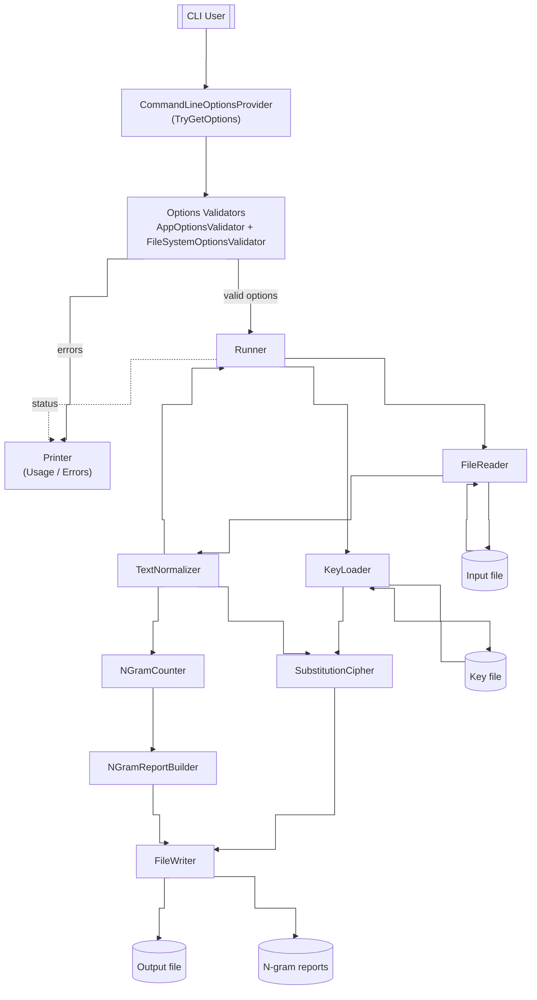
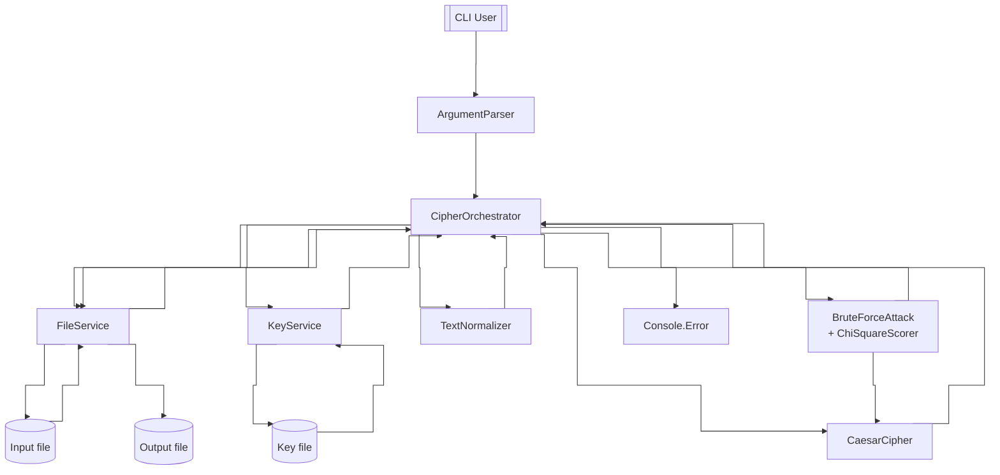
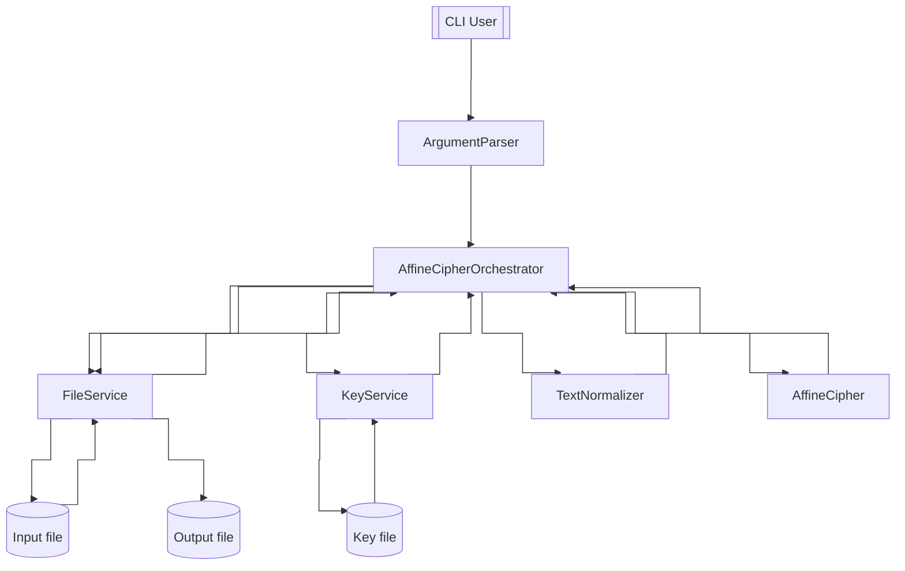
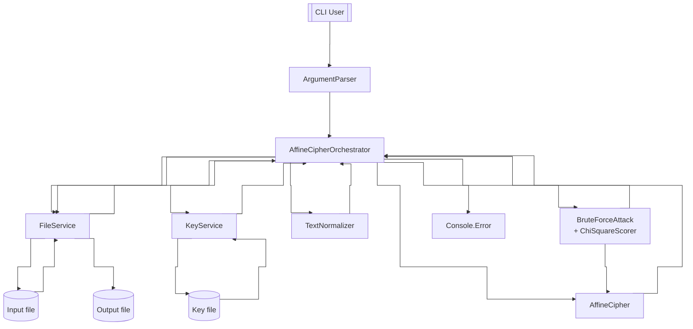

# Kryptografia i kryptoanaliza

## Laboratorium 2

### Grupa 1ID24B

### Autorzy: Kamil Fudala, Andrzej Szczytyński

### Zadanie 1

Napisz program implementujący algorytm szyfru przesuwnego (Szyfr Cezara).

1. Tekst jawny powinien być importowany do programu z pliku tekstowego, którego nazwa określona powinna być po zdefiniowanym argumencie / fladze: -i.
2. Wynik pracy programu powinien być eksportowany do pliku tekstowego, którego nazwa określona powinna być po zdefiniowanym argumencie / fladze: -o.
3. Klucz powinien być określany za pomocą parametru / flagi -k.
4. Tryb pracy programu powinien być określony poprzez flagi: -e dla procesu szyfrowania, -d dla procesu deszyfrowania.

#### Diagram przepływu danych



#### Implementacja

#### Wyniki

- Szyfrowanie

    ```
    ➜  Task01 (main) dotnet run -- \                          
    -e \
    -k Samples/key.txt \
    -i Samples/plaintext.txt \
    -o Samples/cipher.txt

    ➜  Task01 (main) diff Samples/plaintext.txt Samples/cipher.txt 
    1,3c1
    < Every morning the small town wakes up in a quiet and gentle way. People leave their homes, make coffee, read a little, and get ready for another day at work, at school, or at home. The air is cool and clear after a calm night, and there is a slow steady rhythm to the early hours. A few cars move along the main street, and a bus stops near the corner to take older people to the center. A baker opens the door of the little store and the warm smell of fresh bread goes into the street. A dog sits near the door and waits with patient eyes.
    < 
    < Later in the day the town becomes more active. Children talk and laugh. Neighbors meet and share short news about daily life, about family, and about small plans for the weekend. Nothing dramatic happens here. There is no rush, no panic, no loud event. It is simple, steady, and human. People help one another in direct and honest ways, and the result is trust. In the evening the lights come on in every home, dinner is made, and the town slows down again. The day ends the same way it began, in calm and in quiet, and everyone feels ready to rest.
    ---
    > HYHUBPRUQLQJWKHVPDOOWRZQZDNHVXSLQDTXLHWDQGJHQWOHZDBSHRSOHOHDYHWKHLUKRPHVPDNHFRIIHHUHDGDOLWWOHDQGJHWUHDGBIRUDQRWKHUGDBDWZRUNDWVFKRRORUDWKRPHWKHDLULVFRRODQGFOHDUDIWHUDFDOPQLJKWDQGWKHUHLVDVORZVWHDGBUKBWKPWRWKHHDUOBKRXUVDIHZFDUVPRYHDORQJWKHPDLQVWUHHWDQGDEXVVWRSVQHDUWKHFRUQHUWRWDNHROGHUSHRSOHWRWKHFHQWHUDEDNHURSHQVWKHGRRURIWKHOLWWOHVWRUHDQGWKHZDUPVPHOORIIUHVKEUHDGJRHVLQWRWKHVWUHHWDGRJVLWVQHDUWKHGRRUDQGZDLWVZLWKSDWLHQWHBHVODWHULQWKHGDBWKHWRZQEHFRPHVPRUHDFWLYHFKLOGUHQWDONDQGODXJKQHLJKERUVPHHWDQGVKDUHVKRUWQHZVDERXWGDLOBOLIHDERXWIDPLOBDQGDERXWVPDOOSODQVIRUWKHZHHNHQGQRWKLQJGUDPDWLFKDSSHQVKHUHWKHUHLVQRUXVKQRSDQLFQRORXGHYHQWLWLVVLPSOHVWHDGBDQGKXPDQSHRSOHKHOSRQHDQRWKHULQGLUHFWDQGKRQHVWZDBVDQGWKHUHVXOWLVWUXVWLQWKHHYHQLQJWKHOLJKWVFRPHRQLQHYHUBKRPHGLQQHULVPDGHDQGWKHWRZQVORZVGRZQDJDLQWKHGDBHQGVWKHVDPHZDBLWEHJDQLQFDOPDQGLQTXLHWDQGHYHUBRQHIHHOVUHDGBWRUHVW
    \ No newline at end of file
    ```

- Deszyfrowanie

    ```
    ➜  Task01 (main) dotnet run -- \                          
    -e \
    -k Samples/key.txt \
    ➜  Task01 (main) dotnet run -- \                              
    -d \                                                                                                     
    -k Samples/key.txt \
    -i Samples/cipher.txt \
    -o Samples/decrypted.txt

    ➜  Task01 (main) diff Samples/plaintext.txt Samples/decrypted.txt 
    1,3c1
    < Every morning the small town wakes up in a quiet and gentle way. People leave their homes, make coffee, read a little, and get ready for another day at work, at school, or at home. The air is cool and clear after a calm night, and there is a slow steady rhythm to the early hours. A few cars move along the main street, and a bus stops near the corner to take older people to the center. A baker opens the door of the little store and the warm smell of fresh bread goes into the street. A dog sits near the door and waits with patient eyes.
    < 
    < Later in the day the town becomes more active. Children talk and laugh. Neighbors meet and share short news about daily life, about family, and about small plans for the weekend. Nothing dramatic happens here. There is no rush, no panic, no loud event. It is simple, steady, and human. People help one another in direct and honest ways, and the result is trust. In the evening the lights come on in every home, dinner is made, and the town slows down again. The day ends the same way it began, in calm and in quiet, and everyone feels ready to rest.
    ---
    > EVERYMORNINGTHESMALLTOWNWAKESUPINAQUIETANDGENTLEWAYPEOPLELEAVETHEIRHOMESMAKECOFFEEREADALITTLEANDGETREADYFORANOTHERDAYATWORKATSCHOOLORATHOMETHEAIRISCOOLANDCLEARAFTERACALMNIGHTANDTHEREISASLOWSTEADYRHYTHMTOTHEEARLYHOURSAFEWCARSMOVEALONGTHEMAINSTREETANDABUSSTOPSNEARTHECORNERTOTAKEOLDERPEOPLETOTHECENTERABAKEROPENSTHEDOOROFTHELITTLESTOREANDTHEWARMSMELLOFFRESHBREADGOESINTOTHESTREETADOGSITSNEARTHEDOORANDWAITSWITHPATIENTEYESLATERINTHEDAYTHETOWNBECOMESMOREACTIVECHILDRENTALKANDLAUGHNEIGHBORSMEETANDSHARESHORTNEWSABOUTDAILYLIFEABOUTFAMILYANDABOUTSMALLPLANSFORTHEWEEKENDNOTHINGDRAMATICHAPPENSHERETHEREISNORUSHNOPANICNOLOUDEVENTITISSIMPLESTEADYANDHUMANPEOPLEHELPONEANOTHERINDIRECTANDHONESTWAYSANDTHERESULTISTRUSTINTHEEVENINGTHELIGHTSCOMEONINEVERYHOMEDINNERISMADEANDTHETOWNSLOWSDOWNAGAINTHEDAYENDSTHESAMEWAYITBEGANINCALMANDINQUIETANDEVERYONEFEELSREADYTOREST
    \ No newline at end of file
    ```

### Zadanie 2

Rozbuduj program z poprzedniego zadania poprzez implementację ataku typu brute-force na szyfrogram wygenerowany przy pomocy algorytmu przesuwnego.

1. Algorytm powinien być wyzwalany po użyciu flagi -a z parametrem bf.

#### Diagram przepływu danych



#### Implementacja

#### Wyniki

- Atak Brute-force

    ```
    ➜  Task02 (main) dotnet run -- \                                                                        
    -a bf \
    -i Samples/cipher.txt \
    -o Samples/recovered.txt

    key=3 chi2=29.1437 english=True
    ➜  Task02 (main) diff Samples/cipher.txt Samples/recovered.txt                                            
    1c1
    < HYHUBPRUQLQJWKHVPDOOWRZQZDNHVXSLQDTXLHWDQGJHQWOHZDBSHRSOHOHDYHWKHLUKRPHVPDNHFRIIHHUHDGDOLWWOHDQGJHWUHDGBIRUDQRWKHUGDBDWZRUNDWVFKRRORUDWKRPHWKHDLULVFRRODQGFOHDUDIWHUDFDOPQLJKWDQGWKHUHLVDVORZVWHDGBUKBWKPWRWKHHDUOBKRXUVDIHZFDUVPRYHDORQJWKHPDLQVWUHHWDQGDEXVVWRSVQHDUWKHFRUQHUWRWDNHROGHUSHRSOHWRWKHFHQWHUDEDNHURSHQVWKHGRRURIWKHOLWWOHVWRUHDQGWKHZDUPVPHOORIIUHVKEUHDGJRHVLQWRWKHVWUHHWDGRJVLWVQHDUWKHGRRUDQGZDLWVZLWKSDWLHQWHBHVODWHULQWKHGDBWKHWRZQEHFRPHVPRUHDFWLYHFKLOGUHQWDONDQGODXJKQHLJKERUVPHHWDQGVKDUHVKRUWQHZVDERXWGDLOBOLIHDERXWIDPLOBDQGDERXWVPDOOSODQVIRUWKHZHHNHQGQRWKLQJGUDPDWLFKDSSHQVKHUHWKHUHLVQRUXVKQRSDQLFQRORXGHYHQWLWLVVLPSOHVWHDGBDQGKXPDQSHRSOHKHOSRQHDQRWKHULQGLUHFWDQGKRQHVWZDBVDQGWKHUHVXOWLVWUXVWLQWKHHYHQLQJWKHOLJKWVFRPHRQLQHYHUBKRPHGLQQHULVPDGHDQGWKHWRZQVORZVGRZQDJDLQWKHGDBHQGVWKHVDPHZDBLWEHJDQLQFDOPDQGLQTXLHWDQGHYHUBRQHIHHOVUHDGBWRUHVW
    \ No newline at end of file
    ---
    > EVERYMORNINGTHESMALLTOWNWAKESUPINAQUIETANDGENTLEWAYPEOPLELEAVETHEIRHOMESMAKECOFFEEREADALITTLEANDGETREADYFORANOTHERDAYATWORKATSCHOOLORATHOMETHEAIRISCOOLANDCLEARAFTERACALMNIGHTANDTHEREISASLOWSTEADYRHYTHMTOTHEEARLYHOURSAFEWCARSMOVEALONGTHEMAINSTREETANDABUSSTOPSNEARTHECORNERTOTAKEOLDERPEOPLETOTHECENTERABAKEROPENSTHEDOOROFTHELITTLESTOREANDTHEWARMSMELLOFFRESHBREADGOESINTOTHESTREETADOGSITSNEARTHEDOORANDWAITSWITHPATIENTEYESLATERINTHEDAYTHETOWNBECOMESMOREACTIVECHILDRENTALKANDLAUGHNEIGHBORSMEETANDSHARESHORTNEWSABOUTDAILYLIFEABOUTFAMILYANDABOUTSMALLPLANSFORTHEWEEKENDNOTHINGDRAMATICHAPPENSHERETHEREISNORUSHNOPANICNOLOUDEVENTITISSIMPLESTEADYANDHUMANPEOPLEHELPONEANOTHERINDIRECTANDHONESTWAYSANDTHERESULTISTRUSTINTHEEVENINGTHELIGHTSCOMEONINEVERYHOMEDINNERISMADEANDTHETOWNSLOWSDOWNAGAINTHEDAYENDSTHESAMEWAYITBEGANINCALMANDINQUIETANDEVERYONEFEELSREADYTOREST
    \ No newline at end of file
    ```

### Zadanie 3

Napisz program analogiczny do programu z zadania 1, który tym razem implementuje szyfr afiniczny.

#### Diagram przepływu danych



#### Implementacja

#### Wyniki

- Szyfrowanie

    ```
    ➜  Task03 (main) dotnet run -- \                                                                          
    -e \
    -k Samples/key.txt \
    -i Samples/plaintext.txt \
    -o Samples/cipher.txt

    ➜  Task03 (main) diff Samples/plaintext.txt Samples/cipher.txt                                            
    1,3c1
    < Every morning the small town wakes up in a quiet and gentle way. People leave their homes, make coffee, read a little, and get ready for another day at work, at school, or at home. The air is cool and clear after a calm night, and there is a slow steady rhythm to the early hours. A few cars move along the main street, and a bus stops near the corner to take older people to the center. A baker opens the door of the little store and the warm smell of fresh bread goes into the street. A dog sits near the door and waits with patient eyes.
    < 
    < Later in the day the town becomes more active. Children talk and laugh. Neighbors meet and share short news about daily life, about family, and about small plans for the weekend. Nothing dramatic happens here. There is no rush, no panic, no loud event. It is simple, steady, and human. People help one another in direct and honest ways, and the result is trust. In the evening the lights come on in every home, dinner is made, and the town slows down again. The day ends the same way it began, in calm and in quiet, and everyone feels ready to rest.
    ---
    > CJCPYQAPVWVMZRCUQILLZAOVOIGCUEFWVIKEWCZIVXMCVZLCOIYFCAFLCLCIJCZRCWPRAQCUQIGCSAHHCCPCIXILWZZLCIVXMCZPCIXYHAPIVAZRCPXIYIZOAPGIZUSRAALAPIZRAQCZRCIWPWUSAALIVXSLCIPIHZCPISILQVWMRZIVXZRCPCWUIULAOUZCIXYPRYZRQZAZRCCIPLYRAEPUIHCOSIPUQAJCILAVMZRCQIWVUZPCCZIVXINEUUZAFUVCIPZRCSAPVCPZAZIGCALXCPFCAFLCZAZRCSCVZCPINIGCPAFCVUZRCXAAPAHZRCLWZZLCUZAPCIVXZRCOIPQUQCLLAHHPCURNPCIXMACUWVZAZRCUZPCCZIXAMUWZUVCIPZRCXAAPIVXOIWZUOWZRFIZWCVZCYCULIZCPWVZRCXIYZRCZAOVNCSAQCUQAPCISZWJCSRWLXPCVZILGIVXLIEMRVCWMRNAPUQCCZIVXURIPCURAPZVCOUINAEZXIWLYLWHCINAEZHIQWLYIVXINAEZUQILLFLIVUHAPZRCOCCGCVXVAZRWVMXPIQIZWSRIFFCVURCPCZRCPCWUVAPEURVAFIVWSVALAEXCJCVZWZWUUWQFLCUZCIXYIVXREQIVFCAFLCRCLFAVCIVAZRCPWVXWPCSZIVXRAVCUZOIYUIVXZRCPCUELZWUZPEUZWVZRCCJCVWVMZRCLWMRZUSAQCAVWVCJCPYRAQCXWVVCPWUQIXCIVXZRCZAOVULAOUXAOVIMIWVZRCXIYCVXUZRCUIQCOIYWZNCMIVWVSILQIVXWVKEWCZIVXCJCPYAVCHCCLUPCIXYZAPCUZ
    \ No newline at end of file
    ```

- Deszyfrowanie

    ```
    ➜  Task03 (main) dotnet run -- \                                                                          
    -d \
    -k Samples/key.txt \
    -i Samples/cipher.txt \
    -o Samples/decrypted.txt

    ➜  Task03 (main) diff Samples/cipher.txt Samples/decrypted.txt                                            
    1c1
    < CJCPYQAPVWVMZRCUQILLZAOVOIGCUEFWVIKEWCZIVXMCVZLCOIYFCAFLCLCIJCZRCWPRAQCUQIGCSAHHCCPCIXILWZZLCIVXMCZPCIXYHAPIVAZRCPXIYIZOAPGIZUSRAALAPIZRAQCZRCIWPWUSAALIVXSLCIPIHZCPISILQVWMRZIVXZRCPCWUIULAOUZCIXYPRYZRQZAZRCCIPLYRAEPUIHCOSIPUQAJCILAVMZRCQIWVUZPCCZIVXINEUUZAFUVCIPZRCSAPVCPZAZIGCALXCPFCAFLCZAZRCSCVZCPINIGCPAFCVUZRCXAAPAHZRCLWZZLCUZAPCIVXZRCOIPQUQCLLAHHPCURNPCIXMACUWVZAZRCUZPCCZIXAMUWZUVCIPZRCXAAPIVXOIWZUOWZRFIZWCVZCYCULIZCPWVZRCXIYZRCZAOVNCSAQCUQAPCISZWJCSRWLXPCVZILGIVXLIEMRVCWMRNAPUQCCZIVXURIPCURAPZVCOUINAEZXIWLYLWHCINAEZHIQWLYIVXINAEZUQILLFLIVUHAPZRCOCCGCVXVAZRWVMXPIQIZWSRIFFCVURCPCZRCPCWUVAPEURVAFIVWSVALAEXCJCVZWZWUUWQFLCUZCIXYIVXREQIVFCAFLCRCLFAVCIVAZRCPWVXWPCSZIVXRAVCUZOIYUIVXZRCPCUELZWUZPEUZWVZRCCJCVWVMZRCLWMRZUSAQCAVWVCJCPYRAQCXWVVCPWUQIXCIVXZRCZAOVULAOUXAOVIMIWVZRCXIYCVXUZRCUIQCOIYWZNCMIVWVSILQIVXWVKEWCZIVXCJCPYAVCHCCLUPCIXYZAPCUZ
    \ No newline at end of file
    ---
    > EVERYMORNINGTHESMALLTOWNWAKESUPINAQUIETANDGENTLEWAYPEOPLELEAVETHEIRHOMESMAKECOFFEEREADALITTLEANDGETREADYFORANOTHERDAYATWORKATSCHOOLORATHOMETHEAIRISCOOLANDCLEARAFTERACALMNIGHTANDTHEREISASLOWSTEADYRHYTHMTOTHEEARLYHOURSAFEWCARSMOVEALONGTHEMAINSTREETANDABUSSTOPSNEARTHECORNERTOTAKEOLDERPEOPLETOTHECENTERABAKEROPENSTHEDOOROFTHELITTLESTOREANDTHEWARMSMELLOFFRESHBREADGOESINTOTHESTREETADOGSITSNEARTHEDOORANDWAITSWITHPATIENTEYESLATERINTHEDAYTHETOWNBECOMESMOREACTIVECHILDRENTALKANDLAUGHNEIGHBORSMEETANDSHARESHORTNEWSABOUTDAILYLIFEABOUTFAMILYANDABOUTSMALLPLANSFORTHEWEEKENDNOTHINGDRAMATICHAPPENSHERETHEREISNORUSHNOPANICNOLOUDEVENTITISSIMPLESTEADYANDHUMANPEOPLEHELPONEANOTHERINDIRECTANDHONESTWAYSANDTHERESULTISTRUSTINTHEEVENINGTHELIGHTSCOMEONINEVERYHOMEDINNERISMADEANDTHETOWNSLOWSDOWNAGAINTHEDAYENDSTHESAMEWAYITBEGANINCALMANDINQUIETANDEVERYONEFEELSREADYTOREST
    \ No newline at end of file
    ```

### Zadanie 4

Rozbuduj program z poprzedniego zadania poprzez implementację ataku typu brute-force na szyfrogram zaimplementowany przy pomocy szyfru afinicznego. Sposób pracy z programem powinien być analogiczny do pracy z programem z zadania 2.

#### Diagram przepływu danych



#### Implementacja

#### Wyniki

- Atak Brute-force

    ```
    ➜  Task04 (main) dotnet run -- \                                                                          
    -a bf \
    -i Samples/cipher.txt \
    -o Samples/recovered.txt

    a=5 b=8 chi2=29.1437 english=True
    ➜  Task04 (main) diff Samples/cipher.txt Samples/recovered.txt                                            
    1c1
    < CJCPYQAPVWVMZRCUQILLZAOVOIGCUEFWVIKEWCZIVXMCVZLCOIYFCAFLCLCIJCZRCWPRAQCUQIGCSAHHCCPCIXILWZZLCIVXMCZPCIXYHAPIVAZRCPXIYIZOAPGIZUSRAALAPIZRAQCZRCIWPWUSAALIVXSLCIPIHZCPISILQVWMRZIVXZRCPCWUIULAOUZCIXYPRYZRQZAZRCCIPLYRAEPUIHCOSIPUQAJCILAVMZRCQIWVUZPCCZIVXINEUUZAFUVCIPZRCSAPVCPZAZIGCALXCPFCAFLCZAZRCSCVZCPINIGCPAFCVUZRCXAAPAHZRCLWZZLCUZAPCIVXZRCOIPQUQCLLAHHPCURNPCIXMACUWVZAZRCUZPCCZIXAMUWZUVCIPZRCXAAPIVXOIWZUOWZRFIZWCVZCYCULIZCPWVZRCXIYZRCZAOVNCSAQCUQAPCISZWJCSRWLXPCVZILGIVXLIEMRVCWMRNAPUQCCZIVXURIPCURAPZVCOUINAEZXIWLYLWHCINAEZHIQWLYIVXINAEZUQILLFLIVUHAPZRCOCCGCVXVAZRWVMXPIQIZWSRIFFCVURCPCZRCPCWUVAPEURVAFIVWSVALAEXCJCVZWZWUUWQFLCUZCIXYIVXREQIVFCAFLCRCLFAVCIVAZRCPWVXWPCSZIVXRAVCUZOIYUIVXZRCPCUELZWUZPEUZWVZRCCJCVWVMZRCLWMRZUSAQCAVWVCJCPYRAQCXWVVCPWUQIXCIVXZRCZAOVULAOUXAOVIMIWVZRCXIYCVXUZRCUIQCOIYWZNCMIVWVSILQIVXWVKEWCZIVXCJCPYAVCHCCLUPCIXYZAPCUZ
    \ No newline at end of file
    ---
    > EVERYMORNINGTHESMALLTOWNWAKESUPINAQUIETANDGENTLEWAYPEOPLELEAVETHEIRHOMESMAKECOFFEEREADALITTLEANDGETREADYFORANOTHERDAYATWORKATSCHOOLORATHOMETHEAIRISCOOLANDCLEARAFTERACALMNIGHTANDTHEREISASLOWSTEADYRHYTHMTOTHEEARLYHOURSAFEWCARSMOVEALONGTHEMAINSTREETANDABUSSTOPSNEARTHECORNERTOTAKEOLDERPEOPLETOTHECENTERABAKEROPENSTHEDOOROFTHELITTLESTOREANDTHEWARMSMELLOFFRESHBREADGOESINTOTHESTREETADOGSITSNEARTHEDOORANDWAITSWITHPATIENTEYESLATERINTHEDAYTHETOWNBECOMESMOREACTIVECHILDRENTALKANDLAUGHNEIGHBORSMEETANDSHARESHORTNEWSABOUTDAILYLIFEABOUTFAMILYANDABOUTSMALLPLANSFORTHEWEEKENDNOTHINGDRAMATICHAPPENSHERETHEREISNORUSHNOPANICNOLOUDEVENTITISSIMPLESTEADYANDHUMANPEOPLEHELPONEANOTHERINDIRECTANDHONESTWAYSANDTHERESULTISTRUSTINTHEEVENINGTHELIGHTSCOMEONINEVERYHOMEDINNERISMADEANDTHETOWNSLOWSDOWNAGAINTHEDAYENDSTHESAMEWAYITBEGANINCALMANDINQUIETANDEVERYONEFEELSREADYTOREST
    \ No newline at end of file
    ```
