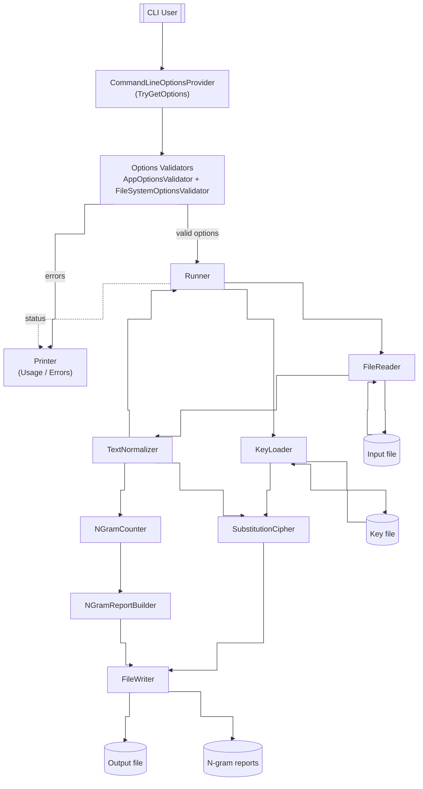
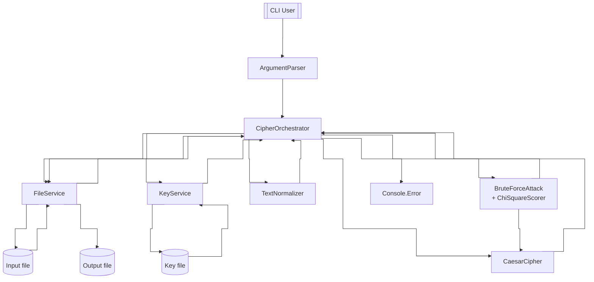
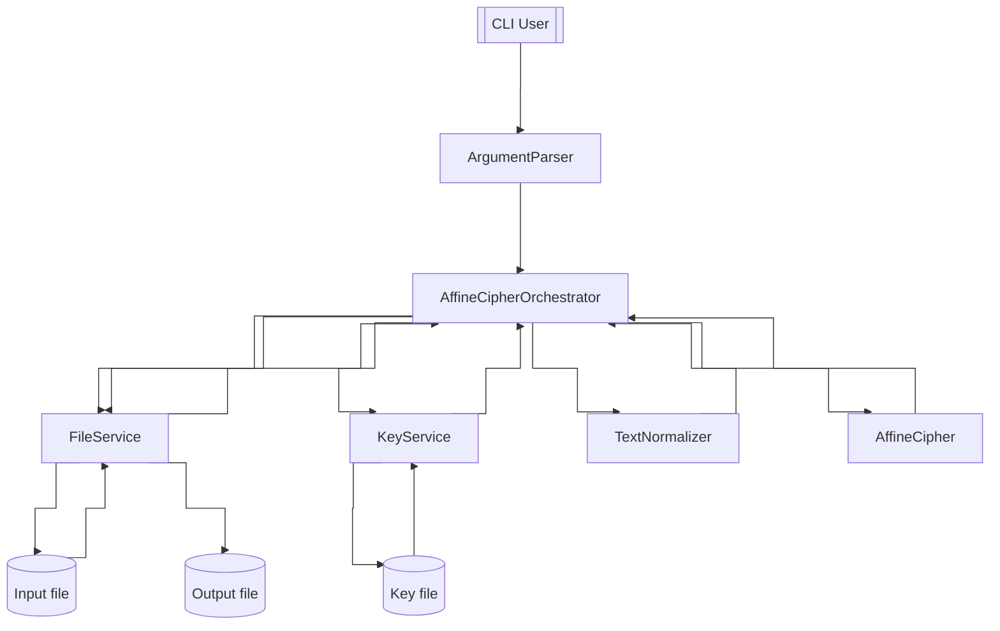
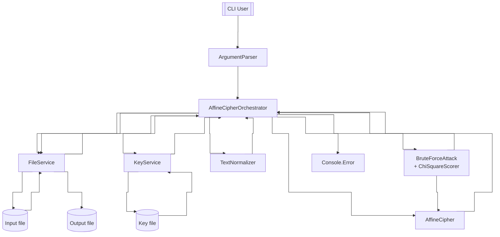

# Kryptografia i kryptoanaliza

## Laboratorium 2

### Grupa 1ID24B

### Autorzy: Kamil Fudala, Andrzej Szczytyński

### Zadanie 1

Napisz program implementujący algorytm szyfru przesuwnego (Szyfr Cezara).

1. Tekst jawny powinien być importowany do programu z pliku tekstowego, którego nazwa określona powinna być po zdefiniowanym argumencie / fladze: -i.
2. Wynik pracy programu powinien być eksportowany do pliku tekstowego, którego nazwa określona powinna być po zdefiniowanym argumencie / fladze: -o.
3. Klucz powinien być określany za pomocą parametru / flagi -k.
4. Tryb pracy programu powinien być określony poprzez flagi: -e dla procesu szyfrowania, -d dla procesu deszyfrowania.

#### Diagram przepływu danych

#### Implementacja

#### Wyniki

### Zadanie 2

Rozbuduj program z poprzedniego zadania poprzez implementację ataku typu brute-force na szyfrogram wygenerowany przy pomocy algorytmu przesuwnego.

1. Algorytm powinien być wyzwalany po użyciu flagi -a z parametrem bf.

#### Diagram przepływu danych

#### Implementacja

#### Wyniki

### Zadanie 3

Napisz program analogiczny do programu z zadania 1, który tym razem implementuje szyfr afiniczny.

#### Diagram przepływu danych

#### Implementacja

#### Wyniki

### Zadanie 4

Rozbuduj program z poprzedniego zadania poprzez implementację ataku typu brute-force na szyfrogram zaimplementowany przy pomocy szyfru afinicznego. Sposób pracy z programem powinien być analogiczny do pracy z programem z zadania 2.

#### Diagram przepływu danych

#### Implementacja

#### Wyniki
