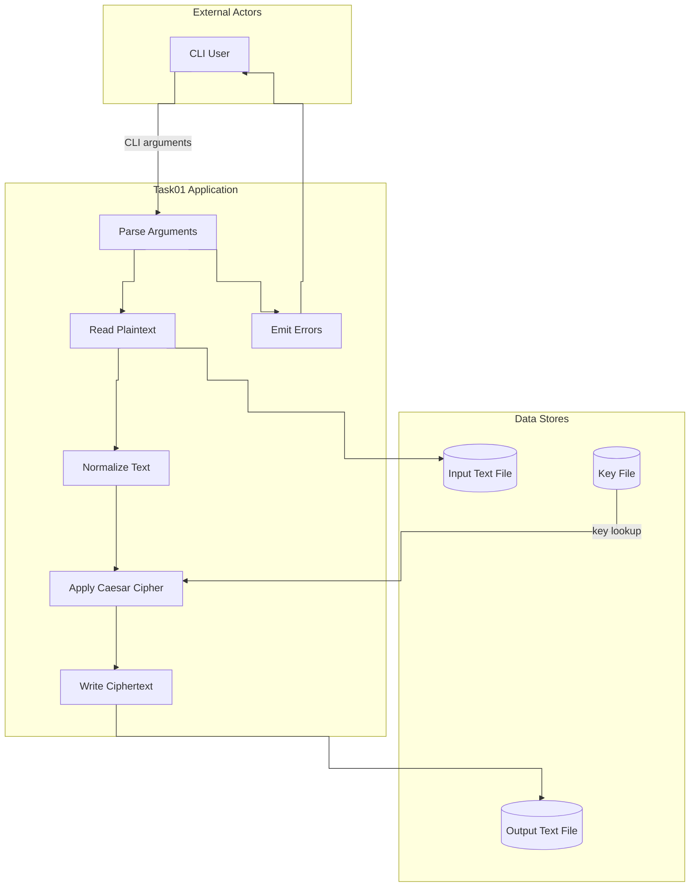
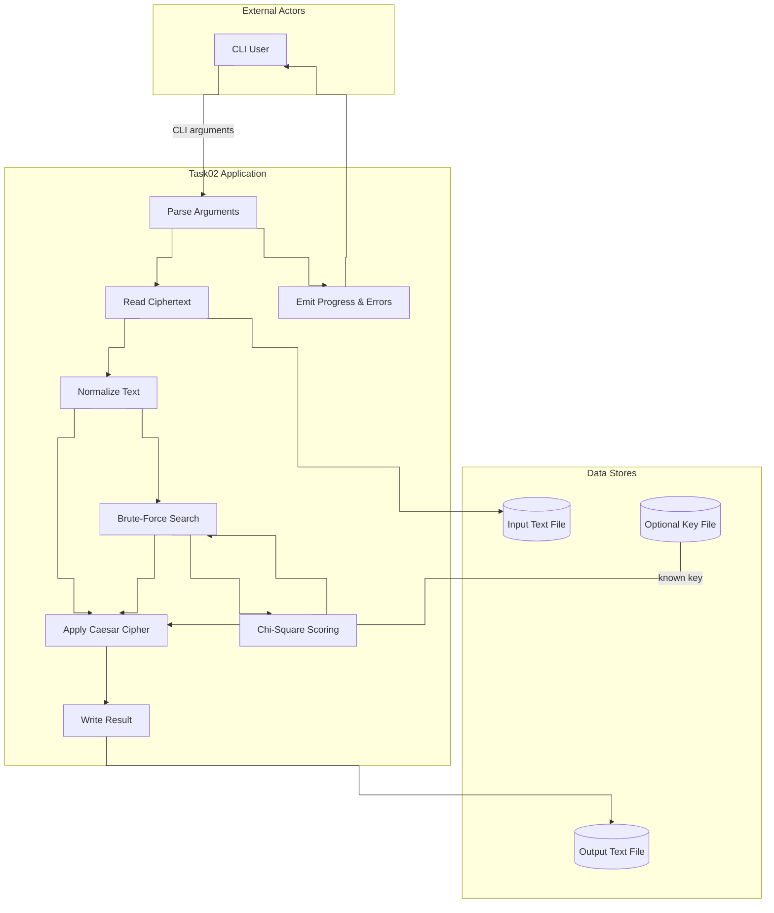
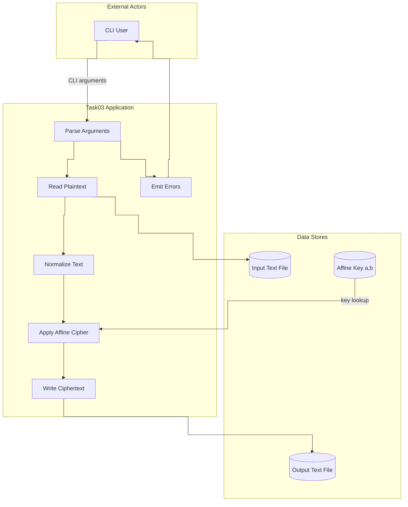
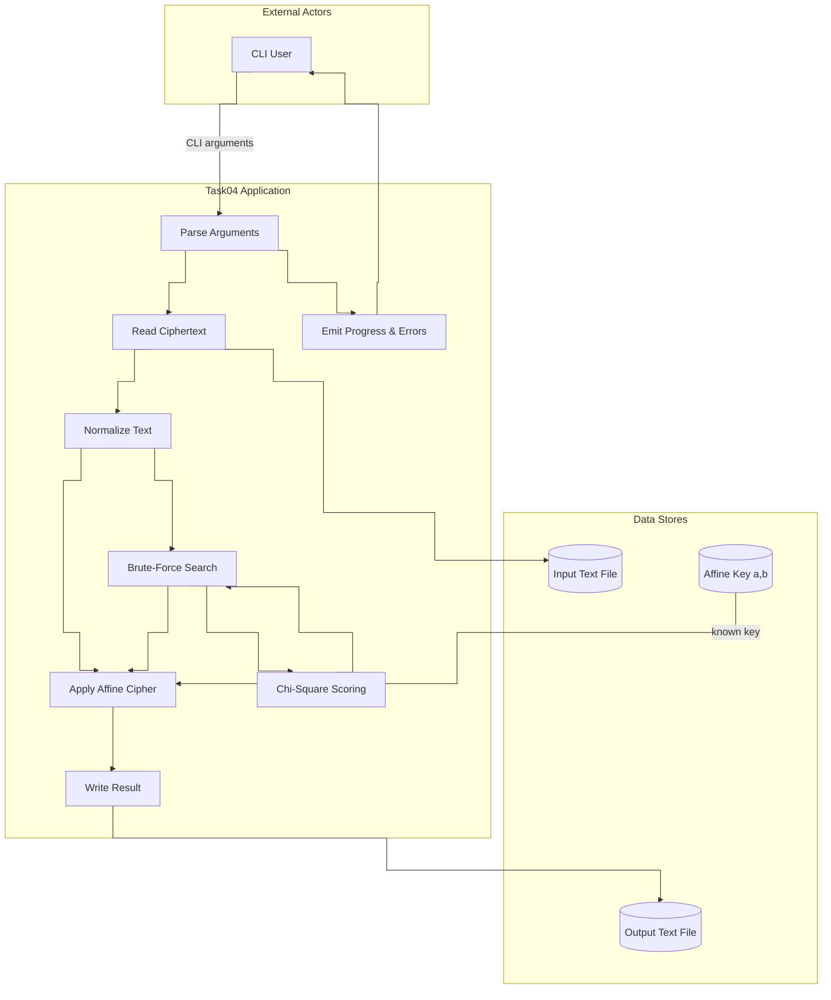

# Kryptografia i kryptoanaliza

## Laboratorium 2

### Grupa 1ID24B

### Autorzy: Kamil Fudala, Andrzej Szczytyński

### Zadanie 1

Napisz program implementujący algorytm szyfru przesuwnego (Szyfr Cezara).

1. Tekst jawny powinien być importowany do programu z pliku tekstowego, którego nazwa określona powinna być po zdefiniowanym argumencie / fladze: -i.
2. Wynik pracy programu powinien być eksportowany do pliku tekstowego, którego nazwa określona powinna być po zdefiniowanym argumencie / fladze: -o.
3. Klucz powinien być określany za pomocą parametru / flagi -k.
4. Tryb pracy programu powinien być określony poprzez flagi: -e dla procesu szyfrowania, -d dla procesu deszyfrowania.

#### Diagram przepływu danych



#### Implementacja

- IArgumentParser.cs
    Plik udostępnia interfejs z jedną metodą Parse przyjmującą tablicę argumentów z linii poleceń.
    Implementacje muszą zbudować obiekt Arguments obejmujący ścieżki wejścia, wyjścia, pliku klucza oraz tryb Operation.
    Kontrakt zakłada zgłaszanie ArgumentException, gdy brakuje wymaganej flagi lub pojawia się konflikt trybów pracy.

    ```csharp
    using Task01.Application.Services;

    namespace Task01.Application.Abstractions;

    public interface IArgumentParser
    {
        Arguments Parse(string[] args);
    }
    ```

- ICipherOrchestrator.cs
    Interfejs definiuje asynchroniczną metodę RunAsync, która przyjmuje obiekt Arguments i zwraca ProcessingResult.
    Zwracany Task pozwala implementacji wykonać czytanie i zapis plików bez blokowania wątku.
    W strukturze wyniku zawarty jest kod zakończenia oraz komunikat błędu przeznaczony dla warstwy CLI.
  
    ```csharp
    using Task01.Application.Models;
    using Task01.Application.Services;

    namespace Task01.Application.Abstractions;

    public interface ICipherOrchestrator
    {
        Task<ProcessingResult> RunAsync(Arguments args);
    }
    ```

- IFileService.cs
    Interfejs zawiera deklaracje metod ReadAllTextAsync i WriteAllTextAsync odpowiedzialnych za pracę na plikach tekstowych.
    Obie operacje przyjmują ścieżkę pliku i działają w oparciu o asynchroniczne strumienie .NET.
    Kontrakt przenosi szczegóły sposobu otwierania plików i używanego kodowania poza logikę aplikacji.

    ```csharp
    namespace Task01.Application.Abstractions;

    public interface IFileService
    {
        Task<string> ReadAllTextAsync(string path);
        Task WriteAllTextAsync(string path, string content);
    }
    ```

- IKeyService.cs
    Interfejs określa metodę GetKeyAsync zwracającą liczbę całkowitą wczytaną z pliku klucza.
    Implementacja powinna odciąć puste linie oraz białe znaki zanim spróbuje sparsować wartość.
    Obsługa FormatException sygnalizuje błędny format klucza już na etapie odczytu.

    ```csharp
    namespace Task01.Application.Abstractions;

    public interface IKeyService
    {
        Task<int> GetKeyAsync(string keyFilePath);
    }
    ```

- ArgumentParser.cs
    Klasa iteruje po tablicy tokenów CLI i rozpoznaje kombinację flag -e/-d/-k/-i/-o dla szyfratora.
    Metoda ResolveMode blokuje równoczesny wybór szyfrowania i deszyfrowania, a ReadValue pilnuje obecności parametrów po każdej fladze.
    Przy brakujących danych lub nieznanej fladze parser zgłasza ArgumentException z precyzyjnym komunikatem.

    ```csharp
    using Task01.Application.Abstractions;
    using Task01.Application.Services;

    namespace Task01.Application.Models;

    public sealed class ArgumentParser : IArgumentParser
    {
        public Arguments Parse(string[] args)
        {
            if (args is null || args.Length == 0)
            {
                throw new ArgumentException("Missing arguments");
            }

            Operation? mode = null;
            string? keyPath = null;
            string? inputPath = null;
            string? outputPath = null;

            for (var i = 0; i < args.Length; i++)
            {
                var token = args[i];

                switch (token)
                {
                    case "-e":
                    case "-d":
                        mode = ResolveMode(token, mode);
                        break;

                    case "-k":
                        keyPath = ReadValue(args, ref i, "-k");
                        break;

                    case "-i":
                        inputPath = ReadValue(args, ref i, "-i");
                        break;

                    case "-o":
                        outputPath = ReadValue(args, ref i, "-o");
                        break;

                    default:
                        throw new ArgumentException("Unknown argument " + token);
                }
            }

            return BuildArguments(mode, keyPath, inputPath, outputPath);
        }

        private static Operation ResolveMode(string flag, Operation? current)
        {
            var next = flag == "-e" ? Operation.Encrypt : Operation.Decrypt;

            if (current is null)
            {
                return next;
            }

            return current == next ? current.Value : throw new ArgumentException("Flags -e and -d cannot be used together");
        }

        private static string ReadValue(string[] args, ref int index, string flag)
        {
            index++;
            if (index >= args.Length || string.IsNullOrWhiteSpace(args[index]))
            {
                throw new ArgumentException("Missing value for " + flag);
            }

            return args[index];
        }

        private static Arguments BuildArguments(Operation? mode, string? keyPath, string? inputPath, string? outputPath)
        {
            if (mode is null)
            {
                throw new ArgumentException("Missing -e or -d");
            }

            if (string.IsNullOrWhiteSpace(keyPath))
            {
                throw new ArgumentException("Missing -k <keyfile>");
            }

            if (string.IsNullOrWhiteSpace(inputPath))
            {
                throw new ArgumentException("Missing -i <inputfile>");
            }

            if (string.IsNullOrWhiteSpace(outputPath))
            {
                throw new ArgumentException("Missing -o <outputfile>");
            }

            return new Arguments(
                mode.Value,
                keyPath,
                inputPath,
                outputPath
            );
        }
    }
    ```

- Operation.cs
    Enumeracja Operation przechowuje dwie wartości: Encrypt i Decrypt odpowiadające trybom algorytmu.
    Parser zapisuje wybraną wartość w rekordzie Arguments, a orkiestrator według niej wywołuje Encrypt lub Decrypt.
    Rozdzielenie trybów w typie wyliczeniowym eliminuje potrzebę porównywania surowych napisów flag.

    ```csharp
    namespace Task01.Application.Models;

    public enum Operation
    {
        Encrypt,
        Decrypt
    }
    ```

- ProcessingResult.cs
    Rekord ProcessingResult przechowuje kod wyjścia oraz opcjonalny komunikat błędu zwracany przez orkiestrator.
    Właściwość IsSuccess sprawdza, czy ExitCode jest równy zero i steruje wypisywaniem komunikatów w Program.cs.
    Warstwa CLI rozpoznaje powodzenie operacji na podstawie tej struktury, bez obsługi wyjątków po swojej stronie.

    ```csharp
    namespace Task01.Application.Models;

    public readonly record struct ProcessingResult(
        int ExitCode,
        string? Message
    )
    {
        public bool IsSuccess => ExitCode == 0;
    }
    ```

- Arguments.cs
    Rekord Arguments zawiera Operation, ścieżkę do pliku klucza, pliku wejściowego oraz pliku wyjściowego.
    Obiekt tworzony przez parser trafia do CipherOrchestrator i kieruje procesem odczytu oraz zapisu danych.
    Zgromadzenie parametrów w jednym typie upraszcza przekazywanie konfiguracji między warstwami aplikacji.

    ```csharp
    using Task01.Application.Models;

    namespace Task01.Application.Services;

    public sealed record Arguments(
        Operation Operation,
        string KeyFilePath,
        string InputFilePath,
        string OutputFilePath
    );
    ```

- CipherOrchestrator.cs
    Klasa orkiestratora pobiera tekst z pliku, normalizuje go i wywołuje Encrypt lub Decrypt na ICaesarCipher zależnie od Operation.
    Po uzyskaniu wyniku zapisuje go na dysku i zwraca ProcessingResult z kodem powodzenia.
    Bloki catch mapują wyjątki IO oraz FormatException na konkretne kody błędów przekazywane użytkownikowi.

    ```csharp
    using Task01.Application.Abstractions;
    using Task01.Application.Models;
    using Task01.Domain.Abstractions;

    namespace Task01.Application.Services;

    public sealed class CipherOrchestrator(
        IFileService fileService,
        IKeyService keyService,
        ITextNormalizer textNormalizer,
        ICaesarCipher cipher)
        : ICipherOrchestrator
    {
        private const string Alphabet = "ABCDEFGHIJKLMNOPQRSTUVWXYZ";

        public async Task<ProcessingResult> RunAsync(Arguments args)
        {
            try
            {
                var rawInput = await fileService.ReadAllTextAsync(args.InputFilePath).ConfigureAwait(false);

                var normalized = textNormalizer.Normalize(rawInput);

                var key = await keyService.GetKeyAsync(args.KeyFilePath).ConfigureAwait(false);

                var outputText = args.Operation == Operation.Encrypt
                    ? cipher.Encrypt(normalized, Alphabet, key)
                    : cipher.Decrypt(normalized, Alphabet, key);

                await fileService.WriteAllTextAsync(args.OutputFilePath, outputText).ConfigureAwait(false);

                return new ProcessingResult(0, null);
            }
            catch (FormatException)
            {
                return new ProcessingResult(3, "Invalid key");
            }
            catch (FileNotFoundException)
            {
                return new ProcessingResult(2, "File error");
            }
            catch (DirectoryNotFoundException)
            {
                return new ProcessingResult(2, "File error");
            }
            catch (UnauthorizedAccessException)
            {
                return new ProcessingResult(2, "File error");
            }
            catch (IOException)
            {
                return new ProcessingResult(2, "File error");
            }
            catch (Exception)
            {
                return new ProcessingResult(99, "Unexpected error");
            }
        }
    }
    ```

- ICaesarCipher.cs
    Interfejs ICaesarCipher udostępnia metody Encrypt i Decrypt działające na znormalizowanym tekście.
    Parametry obejmują alfabet oraz przesunięcie klucza liczone modulo długość alfabetu.
    Tak zdefiniowany kontrakt umożliwia wymianę implementacji szyfru bez zmian w pozostałej logice.
  
    ```csharp
    namespace Task01.Domain.Abstractions;

    public interface ICaesarCipher
    {
        string Encrypt(string normalizedText, string alphabet, int key);
        string Decrypt(string normalizedText, string alphabet, int key);
    }
    ```

- ITextNormalizer.cs
    Interfejs ITextNormalizer definiuje metodę Normalize odpowiedzialną za przygotowanie tekstu przed szyfrowaniem.
    Zwracany łańcuch powinien zawierać wyłącznie dopuszczone znaki alfabetu w jednolitej wielkości liter.
    Moduły szyfrujące zakładają po tej operacji wejście złożone wyłącznie z wielkich liter.

    ```csharp
    namespace Task01.Domain.Abstractions;

    public interface ITextNormalizer
    {
        string Normalize(string input);
    }
    ```

- CaesarCipher.cs
    Ta klasa implementuje logikę szyfru Cezara, wykonując przesunięcia znaków w alfabecie.
    Metody Encrypt i Decrypt korzystają ze wspólnej funkcji transformującej, która obsługuje mapowanie indeksów.
    Kod dba również o poprawne traktowanie ujemnych przesunięć poprzez funkcję Mod.

    ```csharp
    using Task01.Domain.Abstractions;

    namespace Task01.Domain.Services;

    public sealed class CaesarCipher : ICaesarCipher
    {
        public string Encrypt(string normalizedText, string alphabet, int key)
        {
            return Transform(normalizedText, alphabet, key, true);
        }

        public string Decrypt(string normalizedText, string alphabet, int key)
        {
            return Transform(normalizedText, alphabet, key, false);
        }

        private static string Transform(string text, string alphabet, int key, bool encrypt)
        {
            if (string.IsNullOrEmpty(text))
            {
                return string.Empty;
            }

            var n = alphabet.Length;
            if (n == 0)
            {
                return string.Empty;
            }

            var map = BuildIndexMap(alphabet);

            var src = text.AsSpan();
            var dst = new char[src.Length];

            var kEff = Mod(key, n);

            for (var i = 0; i < src.Length; i++)
            {
                var c = src[i];

                if (!map.TryGetValue(c, out var idx))
                {
                    throw new InvalidOperationException("Character not found in alphabet");
                }

                var newIdx = encrypt
                    ? idx + kEff
                    : idx - kEff;

                newIdx = Mod(newIdx, n);

                dst[i] = alphabet[newIdx];
            }

            return new string(dst);
        }

        private static Dictionary<char, int> BuildIndexMap(string alphabet)
        {
            var dict = new Dictionary<char, int>(alphabet.Length);
            for (var i = 0; i < alphabet.Length; i++)
            {
                dict[alphabet[i]] = i;
            }

            return dict;
        }

        private static int Mod(int value, int m)
        {
            return value % m is var r && r < 0 ? r + m : r;
        }
    }
    ```

- TextNormalizer.cs
    Implementacja TextNormalizer przechodzi po każdym znaku wejściowego łańcucha i odrzuca wszystkie znaki spoza zakresu liter A-Z.
    Zachowane znaki są konwertowane do wielkich liter z użyciem char.ToUpperInvariant i dołączane do StringBuildera.
    Wynikiem jest ciąg wielkich liter pozbawiony spacji, cyfr oraz znaków interpunkcyjnych.

    ```csharp
    using Task01.Domain.Abstractions;

    namespace Task01.Domain.Services;

    public sealed class TextNormalizer : ITextNormalizer
    {
        public string Normalize(string input)
        {
            if (string.IsNullOrEmpty(input))
                return string.Empty;

            var span = input.AsSpan();
            var sb = new StringBuilder(span.Length);

            foreach (var c in span)
            {
                if (c is (< 'A' or > 'Z') and (< 'a' or > 'z'))
                {
                    continue;
                }

                var upper = char.ToUpperInvariant(c);
                sb.Append(upper);
            }

            return sb.ToString();
        }
    }
    ```

- FileService.cs
    FileService otwiera pliki poprzez FileStream skonfigurowany w trybie asynchronicznym z buforem 4096 bajtów.
    Metoda ReadAllTextAsync korzysta ze StreamReadera w kodowaniu UTF-8, a WriteAllTextAsync zapisuje tekst bez znacznika BOM.
    Skupienie operacji wejścia-wyjścia w tej klasie upraszcza obsługę błędów związanych z dyskiem.

    ```csharp
    using Task01.Application.Abstractions;

    namespace Task01.Infrastructure.Services;

    public sealed class FileService : IFileService
    {
        private static readonly Encoding Utf8NoBom = new UTF8Encoding(false);

        public async Task<string> ReadAllTextAsync(string path)
        {
            const FileOptions fileOptions = FileOptions.Asynchronous | FileOptions.SequentialScan;

            await using var fs = new FileStream(
                path,
                FileMode.Open,
                FileAccess.Read,
                FileShare.Read,
                4096,
                fileOptions
            );

            using var reader = new StreamReader(fs, Encoding.UTF8, true);

            return await reader.ReadToEndAsync().ConfigureAwait(false);
        }

        public async Task WriteAllTextAsync(string path, string content)
        {
            const FileOptions fileOptions = FileOptions.Asynchronous | FileOptions.SequentialScan;

            await using var fs = new FileStream(
                path,
                FileMode.Create,
                FileAccess.Write,
                FileShare.None,
                4096,
                fileOptions
            );

            await using var writer = new StreamWriter(fs, Utf8NoBom);

            await writer.WriteAsync(content.AsMemory()).ConfigureAwait(false);
            await writer.FlushAsync().ConfigureAwait(false);
        }
    }
    ```

- KeyService.cs
    KeyService korzysta z IFileService, aby pobrać treść pliku klucza jako tekst.
    Metoda wydziela pierwszą linię, usuwa otaczające białe znaki i próbuje sparsować liczbę całkowitą w kulturze InvariantCulture.
    Jeżeli plik jest pusty lub wartość nie jest liczbą, serwis zgłasza FormatException z opisem problemu.

    ```csharp
    using Task01.Application.Abstractions;

    namespace Task01.Infrastructure.Services;

    public sealed class KeyService(IFileService fileService) : IKeyService
    {
        public async Task<int> GetKeyAsync(string keyFilePath)
        {
            var raw = await fileService.ReadAllTextAsync(keyFilePath).ConfigureAwait(false);

            if (string.IsNullOrWhiteSpace(raw))
            {
                throw new FormatException("Key file is empty");
            }

            var span = raw.AsSpan();

            var firstLineEnd = span.IndexOfAny('\r', '\n');
            if (firstLineEnd >= 0)
            {
                span = span[..firstLineEnd];
            }

            span = TrimWhite(span);

            if (span.IsEmpty)
            {
                throw new FormatException("Key not found");
            }

            return TryParseInvariantInt(span, out var value)
                ? value
                : throw new FormatException("Key is not a valid integer");
        }

        private static ReadOnlySpan<char> TrimWhite(ReadOnlySpan<char> value)
        {
            var start = 0;
            var end = value.Length - 1;

            while (start <= end && char.IsWhiteSpace(value[start]))
            {
                start++;
            }

            while (end >= start && char.IsWhiteSpace(value[end]))
            {
                end--;
            }

            return start > end ? ReadOnlySpan<char>.Empty : value.Slice(start, end - start + 1);
        }

        private static bool TryParseInvariantInt(ReadOnlySpan<char> span, out int result)
        {
            return int.TryParse(span, NumberStyles.Integer, CultureInfo.InvariantCulture, out result);
        }
    }
    ```

- GlobalUsings.cs
    Plik gromadzi globalne dyrektywy using dla przestrzeni System, System.IO, System.Text i System.Globalization.
    W efekcie pozostałe pliki nie muszą powtarzać tych deklaracji u góry.
    Lista obejmuje również System.Collections.Generic oraz System.Threading.Tasks używane w implementacjach szyfrów.

    ```csharp
    global using System;
    global using System.Collections.Generic;
    global using System.Globalization;
    global using System.IO;
    global using System.Text;
    global using System.Threading.Tasks;
    ```

- Program.cs
    Program.cs ustawia kulturę na InvariantCulture, tworzy obiekty usług i przechowuje je w lokalnych zmiennych.
    Parser analizuje tablicę args, a wynik trafia do RunAsync w CipherOrchestrator.
    Blok try/catch przechwytuje ArgumentException i inne błędy, wypisuje komunikat na STDERR i ustawia Environment.ExitCode.

    ```csharp
    #pragma warning disable CA1859

    using Task01.Application.Abstractions;
    using Task01.Application.Models;
    using Task01.Application.Services;
    using Task01.Domain.Abstractions;
    using Task01.Domain.Services;
    using Task01.Infrastructure.Services;

    CultureInfo.CurrentCulture = CultureInfo.InvariantCulture;
    CultureInfo.CurrentUICulture = CultureInfo.InvariantCulture;

    IFileService fileService = new FileService();
    IKeyService keyService = new KeyService(fileService);

    ITextNormalizer textNormalizer = new TextNormalizer();
    ICaesarCipher cipher = new CaesarCipher();

    ICipherOrchestrator orchestrator = new CipherOrchestrator(
        fileService,
        keyService,
        textNormalizer,
        cipher
    );

    IArgumentParser parser = new ArgumentParser();

    ProcessingResult result;

    try
    {
        var parsed = parser.Parse(args);

        result = await orchestrator.RunAsync(parsed);
    }
    catch (ArgumentException ex)
    {
        result = new ProcessingResult(1, ex.Message);
    }
    catch (Exception)
    {
        result = new ProcessingResult(99, "Unexpected error");
    }

    if (!result.IsSuccess && !string.IsNullOrEmpty(result.Message))
    {
        await Console.Error.WriteLineAsync(result.Message);
    }

    Environment.ExitCode = result.ExitCode;
    ```

#### Wyniki

Przeprowadzono proces szyfrowania z użyciem klucza oraz alfabetu A–Z, w wyniku czego uzyskano szyfrogram wyraźnie różny od tekstu jawnego zarówno pod względem treści, jak i struktury znaków. Następnie wykonano deszyfrowanie szyfrogramu, które odtworzyło tekst wejściowy w postaci znormalizowanej do wielkich liter bez spacji i znaków nieliterowych, co potwierdza poprawność odwzorowania. Uzyskane wyniki wynikają z faktu, że implementacja stosuje deterministyczne przekształcenie Cezara na stałym alfabecie angielskim oraz jednolity etap normalizacji wejścia i wyjścia, więc szyfrowanie jest odwracalne, ale format tekstu po deszyfrowaniu jest już kanoniczny, a nie oryginalny.

- Szyfrowanie

    ```
    ➜  Task01 (main) dotnet run -- \                          
    -e \
    -k Samples/key.txt \
    -i Samples/plaintext.txt \
    -o Samples/cipher.txt

    ➜  Task01 (main) diff Samples/plaintext.txt Samples/cipher.txt 
    1,3c1
    < Every morning the small town wakes up in a quiet and gentle way. People leave their homes, make coffee, read a little, and get ready for another day at work, at school, or at home. The air is cool and clear after a calm night, and there is a slow steady rhythm to the early hours. A few cars move along the main street, and a bus stops near the corner to take older people to the center. A baker opens the door of the little store and the warm smell of fresh bread goes into the street. A dog sits near the door and waits with patient eyes.
    < 
    < Later in the day the town becomes more active. Children talk and laugh. Neighbors meet and share short news about daily life, about family, and about small plans for the weekend. Nothing dramatic happens here. There is no rush, no panic, no loud event. It is simple, steady, and human. People help one another in direct and honest ways, and the result is trust. In the evening the lights come on in every home, dinner is made, and the town slows down again. The day ends the same way it began, in calm and in quiet, and everyone feels ready to rest.
    ---
    > HYHUBPRUQLQJWKHVPDOOWRZQZDNHVXSLQDTXLHWDQGJHQWOHZDBSHRSOHOHDYHWKHLUKRPHVPDNHFRIIHHUHDGDOLWWOHDQGJHWUHDGBIRUDQRWKHUGDBDWZRUNDWVFKRRORUDWKRPHWKHDLULVFRRODQGFOHDUDIWHUDFDOPQLJKWDQGWKHUHLVDVORZVWHDGBUKBWKPWRWKHHDUOBKRXUVDIHZFDUVPRYHDORQJWKHPDLQVWUHHWDQGDEXVVWRSVQHDUWKHFRUQHUWRWDNHROGHUSHRSOHWRWKHFHQWHUDEDNHURSHQVWKHGRRURIWKHOLWWOHVWRUHDQGWKHZDUPVPHOORIIUHVKEUHDGJRHVLQWRWKHVWUHHWDGRJVLWVQHDUWKHGRRUDQGZDLWVZLWKSDWLHQWHBHVODWHULQWKHGDBWKHWRZQEHFRPHVPRUHDFWLYHFKLOGUHQWDONDQGODXJKQHLJKERUVPHHWDQGVKDUHVKRUWQHZVDERXWGDLOBOLIHDERXWIDPLOBDQGDERXWVPDOOSODQVIRUWKHZHHNHQGQRWKLQJGUDPDWLFKDSSHQVKHUHWKHUHLVQRUXVKQRSDQLFQRORXGHYHQWLWLVVLPSOHVWHDGBDQGKXPDQSHRSOHKHOSRQHDQRWKHULQGLUHFWDQGKRQHVWZDBVDQGWKHUHVXOWLVWUXVWLQWKHHYHQLQJWKHOLJKWVFRPHRQLQHYHUBKRPHGLQQHULVPDGHDQGWKHWRZQVORZVGRZQDJDLQWKHGDBHQGVWKHVDPHZDBLWEHJDQLQFDOPDQGLQTXLHWDQGHYHUBRQHIHHOVUHDGBWRUHVW
    \ No newline at end of file
    ```

- Deszyfrowanie

    ```
    ➜  Task01 (main) dotnet run -- \                          
    -e \
    -k Samples/key.txt \
    ➜  Task01 (main) dotnet run -- \                              
    -d \                                                                                                     
    -k Samples/key.txt \
    -i Samples/cipher.txt \
    -o Samples/decrypted.txt

    ➜  Task01 (main) diff Samples/plaintext.txt Samples/decrypted.txt 
    1,3c1
    < Every morning the small town wakes up in a quiet and gentle way. People leave their homes, make coffee, read a little, and get ready for another day at work, at school, or at home. The air is cool and clear after a calm night, and there is a slow steady rhythm to the early hours. A few cars move along the main street, and a bus stops near the corner to take older people to the center. A baker opens the door of the little store and the warm smell of fresh bread goes into the street. A dog sits near the door and waits with patient eyes.
    < 
    < Later in the day the town becomes more active. Children talk and laugh. Neighbors meet and share short news about daily life, about family, and about small plans for the weekend. Nothing dramatic happens here. There is no rush, no panic, no loud event. It is simple, steady, and human. People help one another in direct and honest ways, and the result is trust. In the evening the lights come on in every home, dinner is made, and the town slows down again. The day ends the same way it began, in calm and in quiet, and everyone feels ready to rest.
    ---
    > EVERYMORNINGTHESMALLTOWNWAKESUPINAQUIETANDGENTLEWAYPEOPLELEAVETHEIRHOMESMAKECOFFEEREADALITTLEANDGETREADYFORANOTHERDAYATWORKATSCHOOLORATHOMETHEAIRISCOOLANDCLEARAFTERACALMNIGHTANDTHEREISASLOWSTEADYRHYTHMTOTHEEARLYHOURSAFEWCARSMOVEALONGTHEMAINSTREETANDABUSSTOPSNEARTHECORNERTOTAKEOLDERPEOPLETOTHECENTERABAKEROPENSTHEDOOROFTHELITTLESTOREANDTHEWARMSMELLOFFRESHBREADGOESINTOTHESTREETADOGSITSNEARTHEDOORANDWAITSWITHPATIENTEYESLATERINTHEDAYTHETOWNBECOMESMOREACTIVECHILDRENTALKANDLAUGHNEIGHBORSMEETANDSHARESHORTNEWSABOUTDAILYLIFEABOUTFAMILYANDABOUTSMALLPLANSFORTHEWEEKENDNOTHINGDRAMATICHAPPENSHERETHEREISNORUSHNOPANICNOLOUDEVENTITISSIMPLESTEADYANDHUMANPEOPLEHELPONEANOTHERINDIRECTANDHONESTWAYSANDTHERESULTISTRUSTINTHEEVENINGTHELIGHTSCOMEONINEVERYHOMEDINNERISMADEANDTHETOWNSLOWSDOWNAGAINTHEDAYENDSTHESAMEWAYITBEGANINCALMANDINQUIETANDEVERYONEFEELSREADYTOREST
    \ No newline at end of file
    ```

### Zadanie 2

Rozbuduj program z poprzedniego zadania poprzez implementację ataku typu brute-force na szyfrogram wygenerowany przy pomocy algorytmu przesuwnego.

1. Algorytm powinien być wyzwalany po użyciu flagi -a z parametrem bf.

#### Diagram przepływu danych



#### Implementacja

- IArgumentParser.cs
    Plik udostępnia interfejs z jedną metodą Parse przyjmującą tablicę argumentów z linii poleceń.
    Implementacje muszą zbudować obiekt Arguments obejmujący ścieżki wejścia, wyjścia, pliku klucza oraz tryb Operation.
    Kontrakt zakłada zgłaszanie ArgumentException, gdy brakuje wymaganej flagi lub pojawia się konflikt trybów pracy.

    ```csharp
    using Task02.Application.Services;

    namespace Task02.Application.Abstractions;

    public interface IArgumentParser
    {
        Arguments Parse(string[] args);
    }
    ```

- ICipherOrchestrator.cs
    Interfejs definiuje asynchroniczną metodę RunAsync, która przyjmuje obiekt Arguments i zwraca ProcessingResult.
    Zwracany Task pozwala implementacji wykonać czytanie i zapis plików bez blokowania wątku.
    W strukturze wyniku zawarty jest kod zakończenia oraz komunikat błędu przeznaczony dla warstwy CLI.

    ```csharp
    using Task02.Application.Models;
    using Task02.Application.Services;

    namespace Task02.Application.Abstractions;

    public interface ICipherOrchestrator
    {
        Task<ProcessingResult> RunAsync(Arguments args);
    }
    ```

- IFileService.cs
    Interfejs zawiera deklaracje metod ReadAllTextAsync i WriteAllTextAsync odpowiedzialnych za pracę na plikach tekstowych.
    Obie operacje przyjmują ścieżkę pliku i działają w oparciu o asynchroniczne strumienie .NET.
    Kontrakt przenosi szczegóły sposobu otwierania plików i używanego kodowania poza logikę aplikacji.

    ```csharp
    namespace Task02.Application.Abstractions;

    public interface IFileService
    {
        Task<string> ReadAllTextAsync(string path);
        Task WriteAllTextAsync(string path, string content);
    }
    ```

- IKeyService.cs
    Interfejs określa metodę GetKeyAsync zwracającą liczbę całkowitą wczytaną z pliku klucza.
    Implementacja powinna odciąć puste linie oraz białe znaki zanim spróbuje sparsować wartość.
    Obsługa FormatException sygnalizuje błędny format klucza już na etapie odczytu.

    ```csharp
    namespace Task02.Application.Abstractions;

    public interface IKeyService
    {
        Task<int> GetKeyAsync(string keyFilePath);
    }
    ```

- ArgumentParser.cs
    Klasa iteruje po tablicy tokenów CLI i rozpoznaje kombinację flag -e/-d/-k/-i/-o dla szyfratora.
    Metoda ResolveMode blokuje równoczesny wybór szyfrowania i deszyfrowania, a ReadValue pilnuje obecności parametrów po każdej fladze.
    Przy brakujących danych lub nieznanej fladze parser zgłasza ArgumentException z precyzyjnym komunikatem.

    ```csharp
    using Task02.Application.Abstractions;
    using Task02.Application.Services;

    namespace Task02.Application.Models;

    public sealed class ArgumentParser : IArgumentParser
    {
        public Arguments Parse(string[] args)
        {
            if (args is null || args.Length == 0)
            {
                throw new ArgumentException("Missing arguments");
            }

            Operation? op = null;
            string? keyPath = null;
            string? inputPath = null;
            string? outputPath = null;

            var i = 0;
            while (i < args.Length)
            {
                var token = args[i];

                switch (token)
                {
                    case "-e":
                        op = ResolveExclusive(op, Operation.Encrypt);
                        break;

                    case "-d":
                        op = ResolveExclusive(op, Operation.Decrypt);
                        break;

                    case "-a":
                        var attackMode = ReadNext(args, ref i, "-a");
                        if (attackMode != "bf")
                        {
                            throw new ArgumentException("Unsupported attack mode " + attackMode);
                        }

                        op = ResolveExclusive(op, Operation.BruteForce);
                        break;

                    case "-k":
                        keyPath = ReadNext(args, ref i, "-k");
                        break;

                    case "-i":
                        inputPath = ReadNext(args, ref i, "-i");
                        break;

                    case "-o":
                        outputPath = ReadNext(args, ref i, "-o");
                        break;

                    default:
                        throw new ArgumentException("Unknown argument " + token);
                }

                i++;
            }

            return BuildArguments(op, keyPath, inputPath, outputPath);
        }

        private static Operation ResolveExclusive(Operation? current, Operation next)
        {
            if (current is null)
            {
                return next;
            }

            return current == next
                ? current.Value
                : throw new ArgumentException("Conflicting operation flags");
        }

        private static string ReadNext(string[] args, ref int index, string flag)
        {
            index++;
            if (index >= args.Length || string.IsNullOrWhiteSpace(args[index]))
            {
                throw new ArgumentException("Missing value for " + flag);
            }

            return args[index];
        }

        private static Arguments BuildArguments(Operation? op, string? keyPath, string? inputPath, string? outputPath)
        {
            if (op is null)
            {
                throw new ArgumentException("Missing -e or -d or -a bf");
            }

            if (string.IsNullOrWhiteSpace(inputPath))
            {
                throw new ArgumentException("Missing -i <inputfile>");
            }

            if (string.IsNullOrWhiteSpace(outputPath))
            {
                throw new ArgumentException("Missing -o <outputfile>");
            }

            if (op != Operation.BruteForce && string.IsNullOrWhiteSpace(keyPath))
            {
                throw new ArgumentException("Missing -k <keyfile>");
            }

            return new Arguments(
                op.Value,
                keyPath,
                inputPath,
                outputPath
            );
        }
    }
    ```

- Operation.cs
    Enumeracja Operation przechowuje dwie wartości: Encrypt i Decrypt odpowiadające trybom algorytmu.
    Parser zapisuje wybraną wartość w rekordzie Arguments, a orkiestrator według niej wywołuje Encrypt lub Decrypt.
    Rozdzielenie trybów w typie wyliczeniowym eliminuje potrzebę porównywania surowych napisów flag.

    ```csharp
    namespace Task02.Application.Models;

    public enum Operation
    {
        Encrypt,
        Decrypt,
        BruteForce
    }
    ```

- ProcessingResult.cs
    Rekord ProcessingResult przechowuje kod wyjścia oraz opcjonalny komunikat błędu zwracany przez orkiestrator.
    Właściwość IsSuccess sprawdza, czy ExitCode jest równy zero i steruje wypisywaniem komunikatów w Program.cs.
    Warstwa CLI rozpoznaje powodzenie operacji na podstawie tej struktury, bez obsługi wyjątków po swojej stronie.

    ```csharp
    namespace Task02.Application.Models;

    public readonly record struct ProcessingResult(
        int ExitCode,
        string? Message
    );
    ```

- Arguments.cs
    Rekord Arguments zawiera Operation, ścieżkę do pliku klucza, pliku wejściowego oraz pliku wyjściowego.
    Obiekt tworzony przez parser trafia do CipherOrchestrator i kieruje procesem odczytu oraz zapisu danych.
    Zgromadzenie parametrów w jednym typie upraszcza przekazywanie konfiguracji między warstwami aplikacji.

    ```csharp
    using Task02.Application.Models;

    namespace Task02.Application.Services;

    public sealed record Arguments(
        Operation Operation,
        string? KeyFilePath,
        string InputFilePath,
        string OutputFilePath
    );
    ```

- CipherOrchestrator.cs
    Klasa orkiestratora pobiera tekst z pliku, normalizuje go i wywołuje Encrypt lub Decrypt na ICaesarCipher zależnie od Operation.
    Po uzyskaniu wyniku zapisuje go na dysku i zwraca ProcessingResult z kodem powodzenia.
    Bloki catch mapują wyjątki IO oraz FormatException na konkretne kody błędów przekazywane użytkownikowi.

    ```csharp
    using Task02.Application.Abstractions;
    using Task02.Application.Models;
    using Task02.Domain.Abstractions;

    namespace Task02.Application.Services;

    public sealed class CipherOrchestrator(
        IFileService fileService,
        IKeyService keyService,
        ITextNormalizer normalizer,
        ICaesarCipher cipher,
        IBruteForceAttack bruteForce)
        : ICipherOrchestrator
    {
        private const string Alphabet = "ABCDEFGHIJKLMNOPQRSTUVWXYZ";

        public async Task<ProcessingResult> RunAsync(Arguments args)
        {
            try
            {
                return args.Operation switch
                {
                    Operation.Encrypt => await RunEncryptAsync(args).ConfigureAwait(false),
                    Operation.Decrypt => await RunDecryptAsync(args).ConfigureAwait(false),
                    Operation.BruteForce => await RunBruteForceAsync(args).ConfigureAwait(false),
                    _ => new ProcessingResult(1, "Unsupported operation")
                };
            }
            catch (FormatException)
            {
                return new ProcessingResult(3, "Invalid key");
            }
            catch (FileNotFoundException)
            {
                return new ProcessingResult(2, "File error");
            }
            catch (DirectoryNotFoundException)
            {
                return new ProcessingResult(2, "File error");
            }
            catch (UnauthorizedAccessException)
            {
                return new ProcessingResult(2, "File error");
            }
            catch (IOException)
            {
                return new ProcessingResult(2, "File error");
            }
            catch (Exception)
            {
                return new ProcessingResult(99, "Unexpected error");
            }
        }

        private async Task<ProcessingResult> RunEncryptAsync(Arguments args)
        {
            var raw = await fileService.ReadAllTextAsync(args.InputFilePath).ConfigureAwait(false);
            var norm = normalizer.Normalize(raw);

            var key = await keyService.GetKeyAsync(args.KeyFilePath!).ConfigureAwait(false);

            var output = cipher.Encrypt(norm, Alphabet, key);

            await fileService.WriteAllTextAsync(args.OutputFilePath, output).ConfigureAwait(false);

            return new ProcessingResult(0, null);
        }

        private async Task<ProcessingResult> RunDecryptAsync(Arguments args)
        {
            var raw = await fileService.ReadAllTextAsync(args.InputFilePath).ConfigureAwait(false);
            var norm = normalizer.Normalize(raw);

            var key = await keyService.GetKeyAsync(args.KeyFilePath!).ConfigureAwait(false);

            var output = cipher.Decrypt(norm, Alphabet, key);

            await fileService.WriteAllTextAsync(args.OutputFilePath, output).ConfigureAwait(false);

            return new ProcessingResult(0, null);
        }

        private async Task<ProcessingResult> RunBruteForceAsync(Arguments args)
        {
            var raw = await fileService.ReadAllTextAsync(args.InputFilePath).ConfigureAwait(false);
            var norm = normalizer.Normalize(raw);

            var result = bruteForce.BreakCipher(norm);

            await fileService.WriteAllTextAsync(args.OutputFilePath, result.Plaintext).ConfigureAwait(false);

            var msg = $"key={result.Key} chi2={result.ChiSquare:F4} english={result.LooksEnglish}";

            return new ProcessingResult(0, msg);
        }
    }
    ```

- BruteForceAttack.cs
    Klasa BruteForceAttack sprawdza wszystkie 26 przesunięć szyfru Cezara i zapamiętuje wariant o najniższej wartości chi-kwadrat.
    Każdy kandydat powstaje poprzez wywołanie ICaesarCipher.Decrypt, a wynik jest oceniany metodą IChiSquareScorer.Score.
    Po zakończeniu pętli metoda porównuje najlepszy wynik z progiem ChiSquared.InvCDF, aby ustalić, czy tekst przypomina język angielski.

    ```csharp
    using MathNet.Numerics.Distributions;
    using Task02.Domain.Models;

    namespace Task02.Domain.Abstractions;

    public sealed class BruteForceAttack(ICaesarCipher cipher, IChiSquareScorer scorer) : IBruteForceAttack
    {
        private const string Alphabet = "ABCDEFGHIJKLMNOPQRSTUVWXYZ";

        public BruteForceResult BreakCipher(string cipherText)
        {
            if (string.IsNullOrEmpty(cipherText))
            {
                return new BruteForceResult(string.Empty, 0, double.PositiveInfinity, false);
            }

            var bestPlain = string.Empty;
            var bestScore = double.PositiveInfinity;
            var bestKey = 0;

            for (var key = 0; key < 26; key++)
            {
                var candidate = cipher.Decrypt(cipherText, Alphabet, key);
                var score = scorer.Score(candidate);

                if (score >= bestScore)
                {
                    continue;
                }

                bestScore = score;
                bestPlain = candidate;
                bestKey = key;
            }

            const double df = 25.0;
            const double p = 0.95;
            var critical = ChiSquared.InvCDF(df, p);

            var looksEnglish = bestScore <= critical;

            return new BruteForceResult(
                bestPlain,
                bestKey,
                bestScore,
                looksEnglish
            );
        }
    }
    ```

- ChiSquareCalculator.cs
    Zaprezentowany kod ChiSquareScorer przechowuje tablicę oczekiwanych częstotliwości liter języka angielskiego.
    Metoda Score zlicza wystąpienia liter w tekście, oblicza wartość statystyki chi-kwadrat i zwraca ją jako miarę dopasowania.
    Wysokie wyniki oznaczają małe podobieństwo, dlatego atak brute-force wybiera wariant z najmniejszą wartością.

    ```csharp
    namespace Task02.Domain.Abstractions;

    public sealed class ChiSquareScorer : IChiSquareScorer
    {
        private static readonly double[] ExpectedFrequencies =
        [
            0.08167, // A
            0.01492, // B
            0.02782, // C
            0.04253, // D
            0.12702, // E
            0.02228, // F
            0.02015, // G
            0.06094, // H
            0.06966, // I
            0.00153, // J
            0.00772, // K
            0.04025, // L
            0.02406, // M
            0.06749, // N
            0.07507, // O
            0.01929, // P
            0.00095, // Q
            0.05987, // R
            0.06327, // S
            0.09056, // T
            0.02758, // U
            0.00978, // V
            0.02360, // W
            0.00150, // X
            0.01974, // Y
            0.00074 // Z
        ];

        public double Score(string text)
        {
            if (string.IsNullOrEmpty(text))
            {
                return double.PositiveInfinity;
            }

            var counts = new int[26];
            var span = text.AsSpan();

            foreach (var c in span)
            {
                var idx = c - 'A';
                if ((uint)idx < 26u)
                {
                    counts[idx]++;
                }
            }

            var n = span.Length;
            if (n == 0)
            {
                return double.PositiveInfinity;
            }

            var chi2 = 0d;

            for (var i = 0; i < 26; i++)
            {
                var expected = ExpectedFrequencies[i] * n;
                var observed = counts[i];
                var diff = observed - expected;
                chi2 += diff * diff / expected;
            }

            return chi2;
        }
    }
    ```

- IBruteForceAttack.cs
    Interfejs IBruteForceAttack deklaruje metodę BreakCipher zwracającą strukturę BruteForceResult.
    Parametr wejściowy to znormalizowany szyfrogram, który ma zostać złamany.
    Zwrot tej struktury gwarantuje dostęp do klucza, odszyfrowanego tekstu i oceny jakości rozwiązania.

    ```csharp
    using Task02.Domain.Models;

    namespace Task02.Domain.Abstractions;

    public interface IBruteForceAttack
    {
        BruteForceResult BreakCipher(string cipherText);
    }
    ```

- ICaesarCipher.cs
    Interfejs ICaesarCipher udostępnia metody Encrypt i Decrypt działające na znormalizowanym tekście.
    Parametry obejmują alfabet oraz przesunięcie klucza liczone modulo długość alfabetu.
    Tak zdefiniowany kontrakt umożliwia wymianę implementacji szyfru bez zmian w pozostałej logice.

    ```csharp
    namespace Task02.Domain.Abstractions;

    public interface ICaesarCipher
    {
        string Encrypt(string normalizedText, string alphabet, int key);
        string Decrypt(string normalizedText, string alphabet, int key);
    }
    ```

- IChiSquareScorer.cs
    Interfejs IChiSquareScorer udostępnia pojedynczą metodę Score przyjmującą tekst do oceny.
    Implementacje zwracają wartość statystyki chi-kwadrat, którą wykorzystuje BruteForceAttack.
    Oddzielenie kontraktu pozwala podstawić inną metrykę bez modyfikowania kodu ataku.

    ```csharp
    namespace Task02.Domain.Abstractions;

    public interface IChiSquareScorer
    {
        double Score(string text);
    }
    ```

- ITextNormalizer.cs
    Interfejs ITextNormalizer definiuje metodę Normalize odpowiedzialną za przygotowanie tekstu przed szyfrowaniem.
    Zwracany łańcuch powinien zawierać wyłącznie dopuszczone znaki alfabetu w jednolitej wielkości liter.
    Moduły szyfrujące zakładają po tej operacji wejście złożone wyłącznie z wielkich liter.

    ```csharp
    namespace Task02.Domain.Abstractions;

    public interface ITextNormalizer
    {
        string Normalize(string input);
    }
    ```

- BruteForceResult.cs
    Rekord BruteForceResult przechowuje odszyfrowany tekst, użyty klucz, wartość chi-kwadrat i flagę looksEnglish.
    Zgromadzone pola pozwalają orkiestratorowi zapisać plaintext i przygotować komunikat podsumowujący atak.
    Niemutowalna struktura record struct chroni dane przed przypadkową modyfikacją po zwróceniu wyniku.

    ```csharp
    namespace Task02.Domain.Models;

    public readonly record struct BruteForceResult(
        string Plaintext,
        int Key,
        double ChiSquare,
        bool LooksEnglish
    );
    ```

- CaesarCipher.cs
    Ta klasa implementuje logikę szyfru Cezara, wykonując przesunięcia znaków w alfabecie.
    Metody Encrypt i Decrypt korzystają ze wspólnej funkcji transformującej, która obsługuje mapowanie indeksów.
    Kod dba również o poprawne traktowanie ujemnych przesunięć poprzez funkcję Mod.

    ```csharp
    using Task02.Domain.Abstractions;

    namespace Task02.Domain.Services;

    public class CaesarCipher : ICaesarCipher
    {
        public string Encrypt(string normalizedText, string alphabet, int key)
        {
            return Transform(normalizedText, alphabet, key, true);
        }

        public string Decrypt(string normalizedText, string alphabet, int key)
        {
            return Transform(normalizedText, alphabet, key, false);
        }

        private static string Transform(string text, string alphabet, int key, bool encrypt)
        {
            if (string.IsNullOrEmpty(text))
            {
                return string.Empty;
            }

            var n = alphabet.Length;
            if (n == 0)
            {
                return string.Empty;
            }

            var map = BuildIndexMap(alphabet);

            var src = text.AsSpan();
            var dst = new char[src.Length];

            var kEff = Mod(key, n);

            for (var i = 0; i < src.Length; i++)
            {
                var c = src[i];

                if (!map.TryGetValue(c, out var idx))
                {
                    throw new InvalidOperationException("Character not found in alphabet");
                }

                var newIdx = encrypt ? idx + kEff : idx - kEff;

                newIdx = Mod(newIdx, n);

                dst[i] = alphabet[newIdx];
            }

            return new string(dst);
        }

        private static Dictionary<char, int> BuildIndexMap(string alphabet)
        {
            var dict = new Dictionary<char, int>(alphabet.Length);
            for (var i = 0; i < alphabet.Length; i++)
            {
                dict[alphabet[i]] = i;
            }

            return dict;
        }

        private static int Mod(int value, int m)
        {
            return value % m is var r && r < 0 ? r + m : r;
        }
    }
    ```

- TextNormalizer.cs
    Implementacja TextNormalizer przechodzi po każdym znaku wejściowego łańcucha i odrzuca wszystkie znaki spoza zakresu liter A-Z.
    Zachowane znaki są konwertowane do wielkich liter z użyciem char.ToUpperInvariant i dołączane do StringBuildera.
    Wynikiem jest ciąg wielkich liter pozbawiony spacji, cyfr oraz znaków interpunkcyjnych.

    ```csharp
    using Task02.Domain.Abstractions;

    namespace Task02.Domain.Services;

    public sealed class TextNormalizer : ITextNormalizer
    {
        public string Normalize(string input)
        {
            if (string.IsNullOrEmpty(input))
            {
                return string.Empty;
            }

            var span = input.AsSpan();
            var sb = new StringBuilder(span.Length);

            foreach (var c in span)
            {
                if (c is (< 'A' or > 'Z') and (< 'a' or > 'z'))
                {
                    continue;
                }

                var upper = char.ToUpperInvariant(c);
                sb.Append(upper);
            }

            return sb.ToString();
        }
    }
    ```

- FileService.cs
    FileService otwiera pliki poprzez FileStream skonfigurowany w trybie asynchronicznym z buforem 4096 bajtów.
    Metoda ReadAllTextAsync korzysta ze StreamReadera w kodowaniu UTF-8, a WriteAllTextAsync zapisuje tekst bez znacznika BOM.
    Skupienie operacji wejścia-wyjścia w tej klasie upraszcza obsługę błędów związanych z dyskiem.

    ```csharp
    using Task02.Application.Abstractions;

    namespace Task02.Infrastructure.Services;

    public sealed class FileService : IFileService
    {
        private static readonly Encoding Utf8NoBom = new UTF8Encoding(false);

        public async Task<string> ReadAllTextAsync(string path)
        {
            const FileOptions fileOptions = FileOptions.Asynchronous | FileOptions.SequentialScan;

            await using var fs = new FileStream(
                path,
                FileMode.Open,
                FileAccess.Read,
                FileShare.Read,
                4096,
                fileOptions
            );

            using var reader = new StreamReader(fs, Encoding.UTF8, true);

            return await reader.ReadToEndAsync().ConfigureAwait(false);
        }

        public async Task WriteAllTextAsync(string path, string content)
        {
            const FileOptions fileOptions = FileOptions.Asynchronous | FileOptions.SequentialScan;

            await using var fs = new FileStream(
                path,
                FileMode.Create,
                FileAccess.Write,
                FileShare.None,
                4096,
                fileOptions
            );

            await using var writer = new StreamWriter(fs, Utf8NoBom);

            await writer.WriteAsync(content.AsMemory()).ConfigureAwait(false);
            await writer.FlushAsync().ConfigureAwait(false);
        }
    }
    ```

- KeyService.cs
    KeyService korzysta z IFileService, aby pobrać treść pliku klucza jako tekst.
    Metoda wydziela pierwszą linię, usuwa otaczające białe znaki i próbuje sparsować liczbę całkowitą w kulturze InvariantCulture.
    Jeżeli plik jest pusty lub wartość nie jest liczbą, serwis zgłasza FormatException z opisem problemu.

    ```csharp
    using Task02.Application.Abstractions;

    namespace Task02.Infrastructure.Services;

    public sealed class KeyService(IFileService fileService) : IKeyService
    {
        public async Task<int> GetKeyAsync(string keyFilePath)
        {
            var raw = await fileService.ReadAllTextAsync(keyFilePath).ConfigureAwait(false);

            if (string.IsNullOrWhiteSpace(raw))
            {
                throw new FormatException("Key file is empty");
            }

            var span = raw.AsSpan();

            var firstLineEnd = span.IndexOfAny('\r', '\n');
            if (firstLineEnd >= 0)
            {
                span = span[..firstLineEnd];
            }

            span = TrimWhite(span);

            if (span.IsEmpty)
            {
                throw new FormatException("Key not found");
            }

            return TryParseInvariantInt(span, out var value)
                ? value
                : throw new FormatException("Key is not a valid integer");
        }

        private static ReadOnlySpan<char> TrimWhite(ReadOnlySpan<char> value)
        {
            var start = 0;
            var end = value.Length - 1;

            while (start <= end && char.IsWhiteSpace(value[start]))
            {
                start++;
            }

            while (end >= start && char.IsWhiteSpace(value[end]))
            {
                end--;
            }

            return start > end ? ReadOnlySpan<char>.Empty : value.Slice(start, end - start + 1);
        }

        private static bool TryParseInvariantInt(ReadOnlySpan<char> span, out int result)
        {
            return int.TryParse(span, NumberStyles.Integer, CultureInfo.InvariantCulture, out result);
        }
    }
    ```

- GlobalUsings.cs
    Plik gromadzi globalne dyrektywy using dla przestrzeni System, System.IO, System.Text i System.Globalization.
    W efekcie pozostałe pliki nie muszą powtarzać tych deklaracji u góry.
    Lista obejmuje również System.Collections.Generic oraz System.Threading.Tasks używane w implementacjach szyfrów.

    ```csharp
    global using System;
    global using System.Collections.Generic;
    global using System.Globalization;
    global using System.IO;
    global using System.Text;
    global using System.Threading.Tasks;
    ```

- Program.cs
    Program.cs ustawia kulturę na InvariantCulture, tworzy obiekty usług i przechowuje je w lokalnych zmiennych.
    Parser analizuje tablicę args, a wynik trafia do RunAsync w CipherOrchestrator.
    Blok try/catch przechwytuje ArgumentException i inne błędy, wypisuje komunikat na STDERR i ustawia Environment.ExitCode.

    ```csharp
    #pragma warning disable CA1859

    using Task02.Application.Abstractions;
    using Task02.Application.Models;
    using Task02.Application.Services;
    using Task02.Domain.Abstractions;
    using Task02.Domain.Services;
    using Task02.Infrastructure.Services;

    CultureInfo.CurrentCulture = CultureInfo.InvariantCulture;
    CultureInfo.CurrentUICulture = CultureInfo.InvariantCulture;

    IFileService fileService = new FileService();
    IKeyService keyService = new KeyService(fileService);

    ITextNormalizer normalizer = new TextNormalizer();
    ICaesarCipher cipher = new CaesarCipher();
    IChiSquareScorer scorer = new ChiSquareScorer();
    IBruteForceAttack brute = new BruteForceAttack(cipher, scorer);

    ICipherOrchestrator orchestrator = new CipherOrchestrator(
        fileService,
        keyService,
        normalizer,
        cipher,
        brute
    );

    IArgumentParser parser = new ArgumentParser();

    ProcessingResult result;

    try
    {
        var parsed = parser.Parse(args);

        result = await orchestrator.RunAsync(parsed);
    }
    catch (ArgumentException ex)
    {
        result = new ProcessingResult(1, ex.Message);
    }
    catch (Exception)
    {
        result = new ProcessingResult(99, "Unexpected error");
    }

    if (!string.IsNullOrEmpty(result.Message))
    {
        await Console.Error.WriteLineAsync(result.Message);
    }

    Environment.ExitCode = result.ExitCode;
    ```

#### Wyniki

Przeprowadzono atak brute-force na szyfrogram, w wyniku którego odzyskano tekst odpowiadający treści oryginalnej (po normalizacji do wielkich liter A–Z) oraz poprawnie wyznaczono klucz przesunięcia równy 3. Oceniono także dopasowanie odzyskanego tekstu do języka angielskiego przy użyciu testu chi-kwadrat, uzyskując wartość statystyki $\chi^2$ = 29.1437 oraz klasyfikację english=True. Wynik ten jest zgodny z założeniem, że spośród wszystkich możliwych przesunięć tylko jedno prowadzi do rozkładu częstości liter zbliżonego do rozkładu teoretycznego języka angielskiego, a próg istotności $(df = 25,\ p = 0.95)$ pozwala ten przypadek jednoznacznie wskazać jako najbardziej prawdopodobny tekst jawny.

- Atak Brute-force

    ```
    ➜  Task02 (main) dotnet run -- \                                                                        
    -a bf \
    -i Samples/cipher.txt \
    -o Samples/recovered.txt

    key=3 chi2=29.1437 english=True
    ➜  Task02 (main) diff Samples/cipher.txt Samples/recovered.txt                                            
    1c1
    < HYHUBPRUQLQJWKHVPDOOWRZQZDNHVXSLQDTXLHWDQGJHQWOHZDBSHRSOHOHDYHWKHLUKRPHVPDNHFRIIHHUHDGDOLWWOHDQGJHWUHDGBIRUDQRWKHUGDBDWZRUNDWVFKRRORUDWKRPHWKHDLULVFRRODQGFOHDUDIWHUDFDOPQLJKWDQGWKHUHLVDVORZVWHDGBUKBWKPWRWKHHDUOBKRXUVDIHZFDUVPRYHDORQJWKHPDLQVWUHHWDQGDEXVVWRSVQHDUWKHFRUQHUWRWDNHROGHUSHRSOHWRWKHFHQWHUDEDNHURSHQVWKHGRRURIWKHOLWWOHVWRUHDQGWKHZDUPVPHOORIIUHVKEUHDGJRHVLQWRWKHVWUHHWDGRJVLWVQHDUWKHGRRUDQGZDLWVZLWKSDWLHQWHBHVODWHULQWKHGDBWKHWRZQEHFRPHVPRUHDFWLYHFKLOGUHQWDONDQGODXJKQHLJKERUVPHHWDQGVKDUHVKRUWQHZVDERXWGDLOBOLIHDERXWIDPLOBDQGDERXWVPDOOSODQVIRUWKHZHHNHQGQRWKLQJGUDPDWLFKDSSHQVKHUHWKHUHLVQRUXVKQRSDQLFQRORXGHYHQWLWLVVLPSOHVWHDGBDQGKXPDQSHRSOHKHOSRQHDQRWKHULQGLUHFWDQGKRQHVWZDBVDQGWKHUHVXOWLVWUXVWLQWKHHYHQLQJWKHOLJKWVFRPHRQLQHYHUBKRPHGLQQHULVPDGHDQGWKHWRZQVORZVGRZQDJDLQWKHGDBHQGVWKHVDPHZDBLWEHJDQLQFDOPDQGLQTXLHWDQGHYHUBRQHIHHOVUHDGBWRUHVW
    \ No newline at end of file
    ---
    > EVERYMORNINGTHESMALLTOWNWAKESUPINAQUIETANDGENTLEWAYPEOPLELEAVETHEIRHOMESMAKECOFFEEREADALITTLEANDGETREADYFORANOTHERDAYATWORKATSCHOOLORATHOMETHEAIRISCOOLANDCLEARAFTERACALMNIGHTANDTHEREISASLOWSTEADYRHYTHMTOTHEEARLYHOURSAFEWCARSMOVEALONGTHEMAINSTREETANDABUSSTOPSNEARTHECORNERTOTAKEOLDERPEOPLETOTHECENTERABAKEROPENSTHEDOOROFTHELITTLESTOREANDTHEWARMSMELLOFFRESHBREADGOESINTOTHESTREETADOGSITSNEARTHEDOORANDWAITSWITHPATIENTEYESLATERINTHEDAYTHETOWNBECOMESMOREACTIVECHILDRENTALKANDLAUGHNEIGHBORSMEETANDSHARESHORTNEWSABOUTDAILYLIFEABOUTFAMILYANDABOUTSMALLPLANSFORTHEWEEKENDNOTHINGDRAMATICHAPPENSHERETHEREISNORUSHNOPANICNOLOUDEVENTITISSIMPLESTEADYANDHUMANPEOPLEHELPONEANOTHERINDIRECTANDHONESTWAYSANDTHERESULTISTRUSTINTHEEVENINGTHELIGHTSCOMEONINEVERYHOMEDINNERISMADEANDTHETOWNSLOWSDOWNAGAINTHEDAYENDSTHESAMEWAYITBEGANINCALMANDINQUIETANDEVERYONEFEELSREADYTOREST
    \ No newline at end of file
    ```

### Zadanie 3

Napisz program analogiczny do programu z zadania 1, który tym razem implementuje szyfr afiniczny.

#### Diagram przepływu danych



#### Implementacja

- IArgumentParser.cs
    Plik udostępnia interfejs z jedną metodą Parse przyjmującą tablicę argumentów z linii poleceń.
    Implementacje muszą zbudować obiekt Arguments obejmujący ścieżki wejścia, wyjścia, pliku klucza oraz tryb Operation.
    Kontrakt zakłada zgłaszanie ArgumentException, gdy brakuje wymaganej flagi lub pojawia się konflikt trybów pracy.

    ```csharp
    using Task03.Application.Services;

    namespace Task03.Application.Abstractions;

    public interface IArgumentParser
    {
        Arguments Parse(string[] args);
    }
    ```

- ICipherOrchestrator.cs
    Interfejs definiuje asynchroniczną metodę RunAsync, która przyjmuje obiekt Arguments i zwraca ProcessingResult.
    Zwracany Task pozwala implementacji wykonać czytanie i zapis plików bez blokowania wątku.
    W strukturze wyniku zawarty jest kod zakończenia oraz komunikat błędu przeznaczony dla warstwy CLI.

    ```csharp
    using Task03.Application.Models;
    using Task03.Application.Services;

    namespace Task03.Application.Abstractions;

    public interface ICipherOrchestrator
    {
        Task<ProcessingResult> RunAsync(Arguments args);
    }
    ```

- IFileService.cs
    Interfejs zawiera deklaracje metod ReadAllTextAsync i WriteAllTextAsync odpowiedzialnych za pracę na plikach tekstowych.
    Obie operacje przyjmują ścieżkę pliku i działają w oparciu o asynchroniczne strumienie .NET.
    Kontrakt przenosi szczegóły sposobu otwierania plików i używanego kodowania poza logikę aplikacji.

    ```csharp
    namespace Task03.Application.Abstractions;

    public interface IFileService
    {
        Task<string> ReadAllTextAsync(string path);
        Task WriteAllTextAsync(string path, string content);
    }
    ```

- KeyService.cs
    KeyService korzysta z IFileService, aby pobrać treść pliku klucza jako tekst.
    Metoda wydziela pierwszą linię, usuwa otaczające białe znaki i próbuje sparsować liczbę całkowitą w kulturze InvariantCulture.
    Jeżeli plik jest pusty lub wartość nie jest liczbą, serwis zgłasza FormatException z opisem problemu.

    ```csharp
    namespace Task03.Application.Abstractions;

    public interface IKeyService
    {
        Task<(int A, int B)> GetKeyAsync(string keyFilePath);
    }
    ```

- ArgumentParser.cs
    Klasa iteruje po tablicy tokenów CLI i rozpoznaje kombinację flag -e/-d/-k/-i/-o dla szyfratora.
    Metoda ResolveMode blokuje równoczesny wybór szyfrowania i deszyfrowania, a ReadValue pilnuje obecności parametrów po każdej fladze.
    Przy brakujących danych lub nieznanej fladze parser zgłasza ArgumentException z precyzyjnym komunikatem.

    ```csharp
    using Task03.Application.Abstractions;
    using Task03.Application.Services;

    namespace Task03.Application.Models;

    public sealed class ArgumentParser : IArgumentParser
    {
        public Arguments Parse(string[] args)
        {
            if (args is null || args.Length == 0)
            {
                throw new ArgumentException("Missing arguments");
            }

            Operation? mode = null;
            string? keyPath = null;
            string? inputPath = null;
            string? outputPath = null;

            for (var i = 0; i < args.Length; i++)
            {
                var token = args[i];

                switch (token)
                {
                    case "-e":
                    case "-d":
                        mode = ResolveMode(token, mode);
                        break;

                    case "-k":
                        keyPath = ReadValue(args, ref i, "-k");
                        break;

                    case "-i":
                        inputPath = ReadValue(args, ref i, "-i");
                        break;

                    case "-o":
                        outputPath = ReadValue(args, ref i, "-o");
                        break;

                    default:
                        throw new ArgumentException("Unknown argument " + token);
                }
            }

            return BuildArguments(mode, keyPath, inputPath, outputPath);
        }

        private static Operation ResolveMode(string flag, Operation? current)
        {
            var next = flag == "-e" ? Operation.Encrypt : Operation.Decrypt;

            if (current is null)
            {
                return next;
            }

            return current == next ? current.Value : throw new ArgumentException("Flags -e and -d cannot be used together");
        }

        private static string ReadValue(string[] args, ref int index, string flag)
        {
            index++;
            if (index >= args.Length || string.IsNullOrWhiteSpace(args[index]))
            {
                throw new ArgumentException("Missing value for " + flag);
            }

            return args[index];
        }

        private static Arguments BuildArguments(Operation? mode, string? keyPath, string? inputPath, string? outputPath)
        {
            if (mode is null)
            {
                throw new ArgumentException("Missing -e or -d");
            }

            if (string.IsNullOrWhiteSpace(keyPath))
            {
                throw new ArgumentException("Missing -k <keyfile>");
            }

            if (string.IsNullOrWhiteSpace(inputPath))
            {
                throw new ArgumentException("Missing -i <inputfile>");
            }

            if (string.IsNullOrWhiteSpace(outputPath))
            {
                throw new ArgumentException("Missing -o <outputfile>");
            }

            return new Arguments(
                mode.Value,
                keyPath,
                inputPath,
                outputPath
            );
        }
    }
    ```

- Operation.cs
    Enumeracja Operation przechowuje dwie wartości: Encrypt i Decrypt odpowiadające trybom algorytmu.
    Parser zapisuje wybraną wartość w rekordzie Arguments, a orkiestrator według niej wywołuje Encrypt lub Decrypt.
    Rozdzielenie trybów w typie wyliczeniowym eliminuje potrzebę porównywania surowych napisów flag.

    ```csharp
    namespace Task03.Application.Models;

    public enum Operation
    {
        Encrypt,
        Decrypt
    }
    ```

- ProcessingResult.cs
    Rekord ProcessingResult przechowuje kod wyjścia oraz opcjonalny komunikat błędu zwracany przez orkiestrator.
    Właściwość IsSuccess sprawdza, czy ExitCode jest równy zero i steruje wypisywaniem komunikatów w Program.cs.
    Warstwa CLI rozpoznaje powodzenie operacji na podstawie tej struktury, bez obsługi wyjątków po swojej stronie.

    ```csharp
    namespace Task03.Application.Models;

    public readonly record struct ProcessingResult(
        int ExitCode,
        string? Message
    )
    {
        public bool IsSuccess => ExitCode == 0;
    }
    ```

- Arguments.cs
    Rekord Arguments zawiera Operation, ścieżkę do pliku klucza, pliku wejściowego oraz pliku wyjściowego.
    Obiekt tworzony przez parser trafia do CipherOrchestrator i kieruje procesem odczytu oraz zapisu danych.
    Zgromadzenie parametrów w jednym typie upraszcza przekazywanie konfiguracji między warstwami aplikacji.

    ```csharp
    using Task03.Application.Models;

    namespace Task03.Application.Services;

    public sealed record Arguments(
        Operation Operation,
        string KeyFilePath,
        string InputFilePath,
        string OutputFilePath
    );
    ```

- CipherOrchestrator.cs
    Klasa orkiestratora pobiera tekst z pliku, normalizuje go i wywołuje Encrypt lub Decrypt na ICaesarCipher zależnie od Operation.
    Po uzyskaniu wyniku zapisuje go na dysku i zwraca ProcessingResult z kodem powodzenia.
    Bloki catch mapują wyjątki IO oraz FormatException na konkretne kody błędów przekazywane użytkownikowi.

    ```csharp
    using Task03.Application.Abstractions;
    using Task03.Application.Models;
    using Task03.Domain.Abstractions;

    namespace Task03.Application.Services;

    public sealed class CipherOrchestrator(
        IFileService fileService,
        IKeyService keyService,
        ITextNormalizer textNormalizer,
        IAffineCipher cipher)
        : ICipherOrchestrator
    {
        private const string Alphabet = "ABCDEFGHIJKLMNOPQRSTUVWXYZ";

        public async Task<ProcessingResult> RunAsync(Arguments args)
        {
            try
            {
                var rawInput = await fileService.ReadAllTextAsync(args.InputFilePath).ConfigureAwait(false);

                var normalized = textNormalizer.Normalize(rawInput);

                var (a, b) = await keyService.GetKeyAsync(args.KeyFilePath).ConfigureAwait(false);

                var outputText = args.Operation == Operation.Encrypt
                    ? cipher.Encrypt(normalized, Alphabet, a, b)
                    : cipher.Decrypt(normalized, Alphabet, a, b);

                await fileService.WriteAllTextAsync(args.OutputFilePath, outputText).ConfigureAwait(false);

                return new ProcessingResult(0, null);
            }
            catch (FormatException)
            {
                return new ProcessingResult(3, "Invalid key");
            }
            catch (InvalidOperationException)
            {
                return new ProcessingResult(3, "Invalid key");
            }
            catch (FileNotFoundException)
            {
                return new ProcessingResult(2, "File error");
            }
            catch (DirectoryNotFoundException)
            {
                return new ProcessingResult(2, "File error");
            }
            catch (UnauthorizedAccessException)
            {
                return new ProcessingResult(2, "File error");
            }
            catch (IOException)
            {
                return new ProcessingResult(2, "File error");
            }
            catch (Exception)
            {
                return new ProcessingResult(99, "Unexpected error");
            }
        }
    }
    ```

- IAffineCipher.cs
    Interfejs IAffineCipher określa metody Encrypt i Decrypt przyjmujące parametry klucza (a, b) oraz alfabet.
    Parametr `a` musi być odwracalny modulo długość alfabetu, co implementacje powinny weryfikować.
    Zwracany tekst stanowi efekt funkcji afinicznej zastosowanej do każdego znaku.

    ```csharp
    namespace Task03.Domain.Abstractions;

    public interface IAffineCipher
    {
        string Encrypt(string normalizedText, string alphabet, int a, int b);
        string Decrypt(string normalizedText, string alphabet, int a, int b);
    }
    ```

- ITextNormalizer.cs
    Interfejs ITextNormalizer definiuje metodę Normalize odpowiedzialną za przygotowanie tekstu przed szyfrowaniem.
    Zwracany łańcuch powinien zawierać wyłącznie dopuszczone znaki alfabetu w jednolitej wielkości liter.
    Moduły szyfrujące zakładają po tej operacji wejście złożone wyłącznie z wielkich liter.

    ```csharp
    namespace Task03.Domain.Abstractions;

    public interface ITextNormalizer
    {
        string Normalize(string input);
    }
    ```

- AffineCipher.cs
    AffineCipher implementuje funkcję `E(x) = (a * x + b) mod 26` oraz jej odwrotność dla deszyfrowania.
    Kod sprawdza odwracalność współczynnika `a`, oblicza modularną odwrotność i korzysta z mapy indeksów alfabetu.
    Oddzielne metody Gcd i Mod pomagają utrzymać poprawność obliczeń w przypadku ujemnych wartości.

    ```csharp
    using Task03.Domain.Abstractions;

    namespace Task03.Domain.Services;

    public sealed class AffineCipher : IAffineCipher
    {
        public string Encrypt(string normalizedText, string alphabet, int a, int b)
        {
            return TransformEncrypt(normalizedText, alphabet, a, b);
        }

        public string Decrypt(string normalizedText, string alphabet, int a, int b)
        {
            return TransformDecrypt(normalizedText, alphabet, a, b);
        }

        private static string TransformEncrypt(string text, string alphabet, int a, int b)
        {
            if (string.IsNullOrEmpty(text))
            {
                return string.Empty;
            }

            var m = alphabet.Length;
            if (m == 0)
            {
                return string.Empty;
            }

            var map = BuildIndexMap(alphabet);

            var src = text.AsSpan();
            var dst = new char[src.Length];

            for (var i = 0; i < src.Length; i++)
            {
                var c = src[i];
                if (!map.TryGetValue(c, out var x))
                {
                    throw new InvalidOperationException("Character not found in alphabet");
                }

                var encIndex = Mod(a * x + b, m);
                dst[i] = alphabet[encIndex];
            }

            return new string(dst);
        }

        private static string TransformDecrypt(string text, string alphabet, int a, int b)
        {
            if (string.IsNullOrEmpty(text))
            {
                return string.Empty;
            }

            var m = alphabet.Length;
            if (m == 0)
            {
                return string.Empty;
            }

            var map = BuildIndexMap(alphabet);

            var aInv = ModInverse(a, m);

            var src = text.AsSpan();
            var dst = new char[src.Length];

            for (var i = 0; i < src.Length; i++)
            {
                var c = src[i];
                if (!map.TryGetValue(c, out var y))
                {
                    throw new InvalidOperationException("Character not found in alphabet");
                }

                var decIndex = Mod(aInv * (y - b), m);
                dst[i] = alphabet[decIndex];
            }

            return new string(dst);
        }

        private static Dictionary<char, int> BuildIndexMap(string alphabet)
        {
            var dict = new Dictionary<char, int>(alphabet.Length);
            for (var i = 0; i < alphabet.Length; i++)
            {
                dict[alphabet[i]] = i;
            }

            return dict;
        }

        private static int Mod(int value, int m)
        {
            return value % m is var r && r < 0 ? r + m : r;
        }

        private static int ModInverse(int a, int m)
        {
            a = Mod(a, m);
            for (var x = 1; x < m; x++)
            {
                if (Mod(a * x, m) == 1)
                {
                    return x;
                }
            }

            throw new InvalidOperationException("Key 'a' is not invertible modulo alphabet length");
        }
    }
    ```

- TextNormalizer.cs
    Implementacja TextNormalizer przechodzi po każdym znaku wejściowego łańcucha i odrzuca wszystkie znaki spoza zakresu liter A-Z.
    Zachowane znaki są konwertowane do wielkich liter z użyciem char.ToUpperInvariant i dołączane do StringBuildera.
    Wynikiem jest ciąg wielkich liter pozbawiony spacji, cyfr oraz znaków interpunkcyjnych.

    ```csharp
    using Task03.Domain.Abstractions;

    namespace Task03.Domain.Services;

    public sealed class TextNormalizer : ITextNormalizer
    {
        public string Normalize(string input)
        {
            if (string.IsNullOrEmpty(input))
            {
                return string.Empty;
            }

            var span = input.AsSpan();
            var sb = new StringBuilder(span.Length);

            foreach (var c in span)
            {
                if (c is (< 'A' or > 'Z') and (< 'a' or > 'z'))
                {
                    continue;
                }

                var upper = char.ToUpperInvariant(c);
                sb.Append(upper);
            }

            return sb.ToString();
        }
    }
    ```

- FileService.cs
    FileService otwiera pliki poprzez FileStream skonfigurowany w trybie asynchronicznym z buforem 4096 bajtów.
    Metoda ReadAllTextAsync korzysta ze StreamReadera w kodowaniu UTF-8, a WriteAllTextAsync zapisuje tekst bez znacznika BOM.
    Skupienie operacji wejścia-wyjścia w tej klasie upraszcza obsługę błędów związanych z dyskiem.

    ```csharp
    using Task03.Application.Abstractions;

    namespace Task03.Infrastructure.Services;

    public sealed class FileService : IFileService
    {
        private static readonly Encoding Utf8NoBom = new UTF8Encoding(false);

        public async Task<string> ReadAllTextAsync(string path)
        {
            const FileOptions fileOptions = FileOptions.Asynchronous | FileOptions.SequentialScan;

            await using var fs = new FileStream(
                path,
                FileMode.Open,
                FileAccess.Read,
                FileShare.Read,
                4096,
                fileOptions
            );

            using var reader = new StreamReader(fs, Encoding.UTF8, true);

            return await reader.ReadToEndAsync().ConfigureAwait(false);
        }

        public async Task WriteAllTextAsync(string path, string content)
        {
            const FileOptions fileOptions = FileOptions.Asynchronous | FileOptions.SequentialScan;

            await using var fs = new FileStream(
                path,
                FileMode.Create,
                FileAccess.Write,
                FileShare.None,
                4096,
                fileOptions
            );

            await using var writer = new StreamWriter(fs, Utf8NoBom);

            await writer.WriteAsync(content.AsMemory()).ConfigureAwait(false);
            await writer.FlushAsync().ConfigureAwait(false);
        }
    }
    ```

- KeyService.cs
    KeyService korzysta z IFileService, aby pobrać treść pliku klucza jako tekst.
    Metoda wydziela pierwszą linię, usuwa otaczające białe znaki i próbuje sparsować liczbę całkowitą w kulturze InvariantCulture.
    Jeżeli plik jest pusty lub wartość nie jest liczbą, serwis zgłasza FormatException z opisem problemu.

    ```csharp
    using Task03.Application.Abstractions;

    namespace Task03.Infrastructure.Services;

    public sealed class KeyService(IFileService fileService) : IKeyService
    {
        public async Task<(int A, int B)> GetKeyAsync(string keyFilePath)
        {
            var raw = await fileService.ReadAllTextAsync(keyFilePath).ConfigureAwait(false);

            if (string.IsNullOrWhiteSpace(raw))
            {
                throw new FormatException("Key file is empty");
            }

            var span = raw.AsSpan();

            var firstLineEnd = span.IndexOfAny('\r', '\n');
            if (firstLineEnd >= 0)
            {
                span = span[..firstLineEnd];
            }

            span = TrimWhite(span);

            if (span.IsEmpty)
            {
                throw new FormatException("Key not found");
            }

            SplitTwo(span, out var firstPart, out var secondPart);

            if (!TryParseInvariantInt(firstPart, out var a) ||
                !TryParseInvariantInt(secondPart, out var b))
            {
                throw new FormatException("Key is not valid");
            }

            return !IsInvertibleMod26(a) ? throw new FormatException("Key 'a' is not invertible modulo 26") : (a, b);
        }

        private static ReadOnlySpan<char> TrimWhite(ReadOnlySpan<char> value)
        {
            var start = 0;
            var end = value.Length - 1;

            while (start <= end && char.IsWhiteSpace(value[start]))
            {
                start++;
            }

            while (end >= start && char.IsWhiteSpace(value[end]))
            {
                end--;
            }

            return start > end
                ? ReadOnlySpan<char>.Empty
                : value.Slice(start, end - start + 1);
        }

        private static void SplitTwo(ReadOnlySpan<char> span, out ReadOnlySpan<char> first, out ReadOnlySpan<char> second)
        {
            var sep = span.IndexOfAny(' ', '\t');
            if (sep < 0)
            {
                throw new FormatException("Key must contain two integers");
            }

            first = span[..sep];

            var restStart = sep + 1;
            while (restStart < span.Length && char.IsWhiteSpace(span[restStart]))
            {
                restStart++;
            }

            if (restStart >= span.Length)
            {
                throw new FormatException("Key must contain two integers");
            }

            second = span[restStart..];

            first = TrimWhite(first);
            second = TrimWhite(second);
        }

        private static bool TryParseInvariantInt(ReadOnlySpan<char> s, out int value)
        {
            return int.TryParse(
                s,
                NumberStyles.Integer,
                CultureInfo.InvariantCulture,
                out value
            );
        }

        private static bool IsInvertibleMod26(int a)
        {
            a = Mod(a, 26);
            return Gcd(a, 26) == 1;
        }

        private static int Gcd(int x, int y)
        {
            while (y != 0)
            {
                var t = x % y;
                x = y;
                y = t;
            }

            return x < 0 ? -x : x;
        }

        private static int Mod(int v, int m)
        {
            var r = v % m;
            return r < 0 ? r + m : r;
        }
    }
    ```

- GlobalUsings.cs
    Plik gromadzi globalne dyrektywy using dla przestrzeni System, System.IO, System.Text i System.Globalization.
    W efekcie pozostałe pliki nie muszą powtarzać tych deklaracji u góry.
    Lista obejmuje również System.Collections.Generic oraz System.Threading.Tasks używane w implementacjach szyfrów.

    ```csharp
    global using System;
    global using System.Collections.Generic;
    global using System.Globalization;
    global using System.IO;
    global using System.Text;
    global using System.Threading.Tasks;
    ```

- Program.cs
    Program.cs ustawia kulturę na InvariantCulture, tworzy obiekty usług i przechowuje je w lokalnych zmiennych.
    Parser analizuje tablicę args, a wynik trafia do RunAsync w CipherOrchestrator.
    Blok try/catch przechwytuje ArgumentException i inne błędy, wypisuje komunikat na STDERR i ustawia Environment.ExitCode.

    ```csharp
    #pragma warning disable CA1859

    using Task03.Application.Abstractions;
    using Task03.Application.Models;
    using Task03.Application.Services;
    using Task03.Domain.Abstractions;
    using Task03.Domain.Services;
    using Task03.Infrastructure.Services;

    CultureInfo.CurrentCulture = CultureInfo.InvariantCulture;
    CultureInfo.CurrentUICulture = CultureInfo.InvariantCulture;

    IFileService fileService = new FileService();
    IKeyService keyService = new KeyService(fileService);

    ITextNormalizer textNormalizer = new TextNormalizer();
    IAffineCipher cipher = new AffineCipher();

    ICipherOrchestrator orchestrator = new CipherOrchestrator(
        fileService,
        keyService,
        textNormalizer,
        cipher
    );

    IArgumentParser parser = new ArgumentParser();

    ProcessingResult result;

    try
    {
        var parsed = parser.Parse(args);

        result = await orchestrator.RunAsync(parsed);
    }
    catch (ArgumentException ex)
    {
        result = new ProcessingResult(1, ex.Message);
    }
    catch (Exception)
    {
        result = new ProcessingResult(99, "Unexpected error");
    }

    if (!result.IsSuccess && !string.IsNullOrEmpty(result.Message))
    {
        await Console.Error.WriteLineAsync(result.Message);
    }

    Environment.ExitCode = result.ExitCode;
    ```

#### Wyniki

Przeprowadzono szyfrowanie tekstu jawnego szyfrem afinicznym, co doprowadziło do uzyskania szyfrogramu o silnie zmienionej postaci, bez bezpośredniego podobieństwa wizualnego do wejścia. Następnie wykonano deszyfrowanie z użyciem tego samego klucza (a, b), w wyniku czego odzyskano tekst równoważny semantycznie oryginałowi, podany w postaci znormalizowanej do wielkich liter A–Z oraz pozbawionej spacji i znaków nieliterowych. Zauważone zachowanie wynika z własności szyfru afinicznego, w którym przekształcenie $E(x) = (a \cdot x + b) \bmod 26$ jest odwracalne przy gcd(a, 26) = 1, więc po stronie deszyfracji zastosowanie odwrotności modularnej do (a) pozwala jednoznacznie odtworzyć dane źródłowe niezależnie od struktury szyfrogramu.

- Szyfrowanie

    ```
    ➜  Task03 (main) dotnet run -- \                                                                          
    -e \
    -k Samples/key.txt \
    -i Samples/plaintext.txt \
    -o Samples/cipher.txt

    ➜  Task03 (main) diff Samples/plaintext.txt Samples/cipher.txt                                            
    1,3c1
    < Every morning the small town wakes up in a quiet and gentle way. People leave their homes, make coffee, read a little, and get ready for another day at work, at school, or at home. The air is cool and clear after a calm night, and there is a slow steady rhythm to the early hours. A few cars move along the main street, and a bus stops near the corner to take older people to the center. A baker opens the door of the little store and the warm smell of fresh bread goes into the street. A dog sits near the door and waits with patient eyes.
    < 
    < Later in the day the town becomes more active. Children talk and laugh. Neighbors meet and share short news about daily life, about family, and about small plans for the weekend. Nothing dramatic happens here. There is no rush, no panic, no loud event. It is simple, steady, and human. People help one another in direct and honest ways, and the result is trust. In the evening the lights come on in every home, dinner is made, and the town slows down again. The day ends the same way it began, in calm and in quiet, and everyone feels ready to rest.
    ---
    > CJCPYQAPVWVMZRCUQILLZAOVOIGCUEFWVIKEWCZIVXMCVZLCOIYFCAFLCLCIJCZRCWPRAQCUQIGCSAHHCCPCIXILWZZLCIVXMCZPCIXYHAPIVAZRCPXIYIZOAPGIZUSRAALAPIZRAQCZRCIWPWUSAALIVXSLCIPIHZCPISILQVWMRZIVXZRCPCWUIULAOUZCIXYPRYZRQZAZRCCIPLYRAEPUIHCOSIPUQAJCILAVMZRCQIWVUZPCCZIVXINEUUZAFUVCIPZRCSAPVCPZAZIGCALXCPFCAFLCZAZRCSCVZCPINIGCPAFCVUZRCXAAPAHZRCLWZZLCUZAPCIVXZRCOIPQUQCLLAHHPCURNPCIXMACUWVZAZRCUZPCCZIXAMUWZUVCIPZRCXAAPIVXOIWZUOWZRFIZWCVZCYCULIZCPWVZRCXIYZRCZAOVNCSAQCUQAPCISZWJCSRWLXPCVZILGIVXLIEMRVCWMRNAPUQCCZIVXURIPCURAPZVCOUINAEZXIWLYLWHCINAEZHIQWLYIVXINAEZUQILLFLIVUHAPZRCOCCGCVXVAZRWVMXPIQIZWSRIFFCVURCPCZRCPCWUVAPEURVAFIVWSVALAEXCJCVZWZWUUWQFLCUZCIXYIVXREQIVFCAFLCRCLFAVCIVAZRCPWVXWPCSZIVXRAVCUZOIYUIVXZRCPCUELZWUZPEUZWVZRCCJCVWVMZRCLWMRZUSAQCAVWVCJCPYRAQCXWVVCPWUQIXCIVXZRCZAOVULAOUXAOVIMIWVZRCXIYCVXUZRCUIQCOIYWZNCMIVWVSILQIVXWVKEWCZIVXCJCPYAVCHCCLUPCIXYZAPCUZ
    \ No newline at end of file
    ```

- Deszyfrowanie

    ```
    ➜  Task03 (main) dotnet run -- \                                                                          
    -d \
    -k Samples/key.txt \
    -i Samples/cipher.txt \
    -o Samples/decrypted.txt

    ➜  Task03 (main) diff Samples/cipher.txt Samples/decrypted.txt                                            
    1c1
    < CJCPYQAPVWVMZRCUQILLZAOVOIGCUEFWVIKEWCZIVXMCVZLCOIYFCAFLCLCIJCZRCWPRAQCUQIGCSAHHCCPCIXILWZZLCIVXMCZPCIXYHAPIVAZRCPXIYIZOAPGIZUSRAALAPIZRAQCZRCIWPWUSAALIVXSLCIPIHZCPISILQVWMRZIVXZRCPCWUIULAOUZCIXYPRYZRQZAZRCCIPLYRAEPUIHCOSIPUQAJCILAVMZRCQIWVUZPCCZIVXINEUUZAFUVCIPZRCSAPVCPZAZIGCALXCPFCAFLCZAZRCSCVZCPINIGCPAFCVUZRCXAAPAHZRCLWZZLCUZAPCIVXZRCOIPQUQCLLAHHPCURNPCIXMACUWVZAZRCUZPCCZIXAMUWZUVCIPZRCXAAPIVXOIWZUOWZRFIZWCVZCYCULIZCPWVZRCXIYZRCZAOVNCSAQCUQAPCISZWJCSRWLXPCVZILGIVXLIEMRVCWMRNAPUQCCZIVXURIPCURAPZVCOUINAEZXIWLYLWHCINAEZHIQWLYIVXINAEZUQILLFLIVUHAPZRCOCCGCVXVAZRWVMXPIQIZWSRIFFCVURCPCZRCPCWUVAPEURVAFIVWSVALAEXCJCVZWZWUUWQFLCUZCIXYIVXREQIVFCAFLCRCLFAVCIVAZRCPWVXWPCSZIVXRAVCUZOIYUIVXZRCPCUELZWUZPEUZWVZRCCJCVWVMZRCLWMRZUSAQCAVWVCJCPYRAQCXWVVCPWUQIXCIVXZRCZAOVULAOUXAOVIMIWVZRCXIYCVXUZRCUIQCOIYWZNCMIVWVSILQIVXWVKEWCZIVXCJCPYAVCHCCLUPCIXYZAPCUZ
    \ No newline at end of file
    ---
    > EVERYMORNINGTHESMALLTOWNWAKESUPINAQUIETANDGENTLEWAYPEOPLELEAVETHEIRHOMESMAKECOFFEEREADALITTLEANDGETREADYFORANOTHERDAYATWORKATSCHOOLORATHOMETHEAIRISCOOLANDCLEARAFTERACALMNIGHTANDTHEREISASLOWSTEADYRHYTHMTOTHEEARLYHOURSAFEWCARSMOVEALONGTHEMAINSTREETANDABUSSTOPSNEARTHECORNERTOTAKEOLDERPEOPLETOTHECENTERABAKEROPENSTHEDOOROFTHELITTLESTOREANDTHEWARMSMELLOFFRESHBREADGOESINTOTHESTREETADOGSITSNEARTHEDOORANDWAITSWITHPATIENTEYESLATERINTHEDAYTHETOWNBECOMESMOREACTIVECHILDRENTALKANDLAUGHNEIGHBORSMEETANDSHARESHORTNEWSABOUTDAILYLIFEABOUTFAMILYANDABOUTSMALLPLANSFORTHEWEEKENDNOTHINGDRAMATICHAPPENSHERETHEREISNORUSHNOPANICNOLOUDEVENTITISSIMPLESTEADYANDHUMANPEOPLEHELPONEANOTHERINDIRECTANDHONESTWAYSANDTHERESULTISTRUSTINTHEEVENINGTHELIGHTSCOMEONINEVERYHOMEDINNERISMADEANDTHETOWNSLOWSDOWNAGAINTHEDAYENDSTHESAMEWAYITBEGANINCALMANDINQUIETANDEVERYONEFEELSREADYTOREST
    \ No newline at end of file
    ```

### Zadanie 4

Rozbuduj program z poprzedniego zadania poprzez implementację ataku typu brute-force na szyfrogram zaimplementowany przy pomocy szyfru afinicznego. Sposób pracy z programem powinien być analogiczny do pracy z programem z zadania 2.

#### Diagram przepływu danych



#### Implementacja

- IArgumentParser.cs
    Plik udostępnia interfejs z jedną metodą Parse przyjmującą tablicę argumentów z linii poleceń.
    Implementacje muszą zbudować obiekt Arguments obejmujący ścieżki wejścia, wyjścia, pliku klucza oraz tryb Operation.
    Kontrakt zakłada zgłaszanie ArgumentException, gdy brakuje wymaganej flagi lub pojawia się konflikt trybów pracy.

    ```csharp
    using Task04.Application.Services;

    namespace Task04.Application.Abstractions;

    public interface IArgumentParser
    {
        Arguments Parse(string[] args);
    }
    ```

- ICipherOrchestrator.cs
    Interfejs definiuje asynchroniczną metodę RunAsync, która przyjmuje obiekt Arguments i zwraca ProcessingResult.
    Zwracany Task pozwala implementacji wykonać czytanie i zapis plików bez blokowania wątku.
    W strukturze wyniku zawarty jest kod zakończenia oraz komunikat błędu przeznaczony dla warstwy CLI.

    ```csharp
    using Task04.Application.Models;
    using Task04.Application.Services;

    namespace Task04.Application.Abstractions;

    public interface ICipherOrchestrator
    {
        Task<ProcessingResult> RunAsync(Arguments args);
    }
    ```

- IFileService.cs
    Interfejs zawiera deklaracje metod ReadAllTextAsync i WriteAllTextAsync odpowiedzialnych za pracę na plikach tekstowych.
    Obie operacje przyjmują ścieżkę pliku i działają w oparciu o asynchroniczne strumienie .NET.
    Kontrakt przenosi szczegóły sposobu otwierania plików i używanego kodowania poza logikę aplikacji.

    ```csharp
    namespace Task04.Application.Abstractions;

    public interface IFileService
    {
        Task<string> ReadAllTextAsync(string path);
        Task WriteAllTextAsync(string path, string content);
    }
    ```

- IKeyService.cs
    Interfejs określa metodę GetKeyAsync zwracającą liczbę całkowitą wczytaną z pliku klucza.
    Implementacja powinna odciąć puste linie oraz białe znaki zanim spróbuje sparsować wartość.
    Obsługa FormatException sygnalizuje błędny format klucza już na etapie odczytu.

    ```csharp
    namespace Task04.Application.Abstractions;

    public interface IKeyService
    {
        Task<(int A, int B)> GetKeyAsync(string keyFilePath);
    }
    ```

- ArgumentParser.cs
    Klasa iteruje po tablicy tokenów CLI i rozpoznaje kombinację flag -e/-d/-k/-i/-o dla szyfratora.
    Metoda ResolveMode blokuje równoczesny wybór szyfrowania i deszyfrowania, a ReadValue pilnuje obecności parametrów po każdej fladze.
    Przy brakujących danych lub nieznanej fladze parser zgłasza ArgumentException z precyzyjnym komunikatem.

    ```csharp
    using Task04.Application.Abstractions;
    using Task04.Application.Services;

    namespace Task04.Application.Models;

    public sealed class ArgumentParser : IArgumentParser
    {
        public Arguments Parse(string[] args)
        {
            if (args is null || args.Length == 0)
            {
                throw new ArgumentException("Missing arguments");
            }

            Operation? op = null;
            string? keyPath = null;
            string? inputPath = null;
            string? outputPath = null;

            var i = 0;
            while (i < args.Length)
            {
                var token = args[i];

                switch (token)
                {
                    case "-e":
                        op = ResolveExclusive(op, Operation.Encrypt);
                        break;

                    case "-d":
                        op = ResolveExclusive(op, Operation.Decrypt);
                        break;

                    case "-a":
                        var attackMode = ReadNext(args, ref i, "-a");
                        if (attackMode != "bf")
                        {
                            throw new ArgumentException("Unsupported attack mode " + attackMode);
                        }

                        op = ResolveExclusive(op, Operation.BruteForce);
                        break;

                    case "-k":
                        keyPath = ReadNext(args, ref i, "-k");
                        break;

                    case "-i":
                        inputPath = ReadNext(args, ref i, "-i");
                        break;

                    case "-o":
                        outputPath = ReadNext(args, ref i, "-o");
                        break;

                    default:
                        throw new ArgumentException("Unknown argument " + token);
                }

                i++;
            }

            return BuildArguments(op, keyPath, inputPath, outputPath);
        }

        private static Operation ResolveExclusive(Operation? current, Operation next)
        {
            if (current is null)
            {
                return next;
            }

            return current == next ? current.Value : throw new ArgumentException("Conflicting operation flags");
        }

        private static string ReadNext(string[] args, ref int index, string flag)
        {
            index++;
            if (index >= args.Length || string.IsNullOrWhiteSpace(args[index]))
            {
                throw new ArgumentException("Missing value for " + flag);
            }

            return args[index];
        }

        private static Arguments BuildArguments(Operation? op, string? keyPath, string? inputPath, string? outputPath)
        {
            if (op is null)
            {
                throw new ArgumentException("Missing -e or -d or -a bf");
            }

            if (string.IsNullOrWhiteSpace(inputPath))
            {
                throw new ArgumentException("Missing -i <inputfile>");
            }

            if (string.IsNullOrWhiteSpace(outputPath))
            {
                throw new ArgumentException("Missing -o <outputfile>");
            }

            if (op != Operation.BruteForce && string.IsNullOrWhiteSpace(keyPath))
            {
                throw new ArgumentException("Missing -k <keyfile>");
            }

            return new Arguments(op.Value, keyPath, inputPath, outputPath);
        }
    }
    ```

- Operation.cs
    Enumeracja Operation przechowuje dwie wartości: Encrypt i Decrypt odpowiadające trybom algorytmu.
    Parser zapisuje wybraną wartość w rekordzie Arguments, a orkiestrator według niej wywołuje Encrypt lub Decrypt.
    Rozdzielenie trybów w typie wyliczeniowym eliminuje potrzebę porównywania surowych napisów flag.

    ```csharp
    namespace Task04.Application.Models;

    public enum Operation
    {
        Encrypt,
        Decrypt,
        BruteForce
    }
    ```

- ProcessingResult.cs
    Rekord ProcessingResult przechowuje kod wyjścia oraz opcjonalny komunikat błędu zwracany przez orkiestrator.
    Właściwość IsSuccess sprawdza, czy ExitCode jest równy zero i steruje wypisywaniem komunikatów w Program.cs.
    Warstwa CLI rozpoznaje powodzenie operacji na podstawie tej struktury, bez obsługi wyjątków po swojej stronie.

    ```csharp
    namespace Task04.Application.Models;

    public readonly record struct ProcessingResult(
        int ExitCode,
        string? Message
    );
    ```

- Arguments.cs
    Rekord Arguments zawiera Operation, ścieżkę do pliku klucza, pliku wejściowego oraz pliku wyjściowego.
    Obiekt tworzony przez parser trafia do CipherOrchestrator i kieruje procesem odczytu oraz zapisu danych.
    Zgromadzenie parametrów w jednym typie upraszcza przekazywanie konfiguracji między warstwami aplikacji.

    ```csharp
    using Task04.Application.Models;

    namespace Task04.Application.Services;

    public sealed record Arguments(
        Operation Operation,
        string? KeyFilePath,
        string InputFilePath,
        string OutputFilePath
    );
    ```

- CipherOrchestrator.cs
    Klasa orkiestratora pobiera tekst z pliku, normalizuje go i wywołuje Encrypt lub Decrypt na ICaesarCipher zależnie od Operation.
    Po uzyskaniu wyniku zapisuje go na dysku i zwraca ProcessingResult z kodem powodzenia.
    Bloki catch mapują wyjątki IO oraz FormatException na konkretne kody błędów przekazywane użytkownikowi.

    ```csharp
    using Task04.Application.Abstractions;
    using Task04.Application.Models;
    using Task04.Domain.Abstractions;

    namespace Task04.Application.Services;

    public sealed class CipherOrchestrator(
        IFileService fileService,
        IKeyService keyProvider,
        ITextNormalizer textNormalizer,
        IAffineCipher cipher,
        IBruteForceAttack brute)
        : ICipherOrchestrator
    {
        private const string Alphabet = "ABCDEFGHIJKLMNOPQRSTUVWXYZ";

        public async Task<ProcessingResult> RunAsync(Arguments args)
        {
            try
            {
                return args.Operation switch
                {
                    Operation.Encrypt => await RunEncryptAsync(args).ConfigureAwait(false),
                    Operation.Decrypt => await RunDecryptAsync(args).ConfigureAwait(false),
                    Operation.BruteForce => await RunBruteForceAsync(args).ConfigureAwait(false),
                    _ => new ProcessingResult(1, "Unsupported operation")
                };
            }
            catch (FormatException)
            {
                return new ProcessingResult(3, "Invalid key");
            }
            catch (InvalidOperationException)
            {
                return new ProcessingResult(3, "Invalid key");
            }
            catch (FileNotFoundException)
            {
                return new ProcessingResult(2, "File error");
            }
            catch (DirectoryNotFoundException)
            {
                return new ProcessingResult(2, "File error");
            }
            catch (UnauthorizedAccessException)
            {
                return new ProcessingResult(2, "File error");
            }
            catch (IOException)
            {
                return new ProcessingResult(2, "File error");
            }
            catch (Exception)
            {
                return new ProcessingResult(99, "Unexpected error");
            }
        }

        private async Task<ProcessingResult> RunEncryptAsync(Arguments args)
        {
            var raw = await fileService.ReadAllTextAsync(args.InputFilePath).ConfigureAwait(false);
            var norm = textNormalizer.Normalize(raw);
            var (a, b) = await keyProvider.GetKeyAsync(args.KeyFilePath!).ConfigureAwait(false);
            var output = cipher.Encrypt(norm, Alphabet, a, b);
            await fileService.WriteAllTextAsync(args.OutputFilePath, output).ConfigureAwait(false);
            return new ProcessingResult(0, null);
        }

        private async Task<ProcessingResult> RunDecryptAsync(Arguments args)
        {
            var raw = await fileService.ReadAllTextAsync(args.InputFilePath).ConfigureAwait(false);
            var norm = textNormalizer.Normalize(raw);
            var (a, b) = await keyProvider.GetKeyAsync(args.KeyFilePath!).ConfigureAwait(false);
            var output = cipher.Decrypt(norm, Alphabet, a, b);
            await fileService.WriteAllTextAsync(args.OutputFilePath, output).ConfigureAwait(false);
            return new ProcessingResult(0, null);
        }

        private async Task<ProcessingResult> RunBruteForceAsync(Arguments args)
        {
            var raw = await fileService.ReadAllTextAsync(args.InputFilePath).ConfigureAwait(false);
            var norm = textNormalizer.Normalize(raw);
            var r = brute.BreakCipher(norm);
            await fileService.WriteAllTextAsync(args.OutputFilePath, r.Plaintext).ConfigureAwait(false);
            var msg = $"a={r.A} b={r.B} chi2={r.ChiSquare:F4} english={r.LooksEnglish}";
            return new ProcessingResult(0, msg);
        }
    }
    ```

- BruteForceAttack.cs
    Klasa BruteForceAttack sprawdza wszystkie 26 przesunięć szyfru Cezara i zapamiętuje wariant o najniższej wartości chi-kwadrat.
    Każdy kandydat powstaje poprzez wywołanie ICaesarCipher.Decrypt, a wynik jest oceniany metodą IChiSquareScorer.Score.
    Po zakończeniu pętli metoda porównuje najlepszy wynik z progiem ChiSquared.InvCDF, aby ustalić, czy tekst przypomina język angielski.

    ```csharp
    using MathNet.Numerics.Distributions;
    using Task04.Domain.Models;

    namespace Task04.Domain.Abstractions;

    public sealed class BruteForceAttack(IAffineCipher cipher, IChiSquareScorer scorer) : IBruteForceAttack
    {
        private const string Alphabet = "ABCDEFGHIJKLMNOPQRSTUVWXYZ";
        private static readonly int[] InvertibleA = [1, 3, 5, 7, 9, 11, 15, 17, 19, 21, 23, 25];

        public BruteForceResult BreakCipher(string cipherText)
        {
            if (string.IsNullOrEmpty(cipherText))
            {
                return new BruteForceResult(string.Empty, 0, 0, double.PositiveInfinity, false);
            }

            var bestPlain = string.Empty;
            var bestScore = double.PositiveInfinity;
            int bestA = 0, bestB = 0;

            foreach (var a in InvertibleA)
            {
                for (var b = 0; b < 26; b++)
                {
                    var cand = cipher.Decrypt(cipherText, Alphabet, a, b);
                    var score = scorer.Score(cand);

                    if (!(score < bestScore))
                    {
                        continue;
                    }

                    bestScore = score;
                    bestPlain = cand;
                    bestA = a;
                    bestB = b;
                }
            }

            var critical = ChiSquared.InvCDF(25.0, 0.95);
            var looksEnglish = bestScore <= critical;

            return new BruteForceResult(bestPlain, bestA, bestB, bestScore, looksEnglish);
        }
    }
    ```

- ChiSquareScorer.cs
    Implementacja ChiSquareScorer wykorzystuje tablicę ExpectedFrequencies i liczy częstości liter w analizowanym tekście.
    Na podstawie różnic między obserwacjami a oczekiwaniami oblicza wartość statystyki chi-kwadrat.
    Najniższa wartość wskazuje wariant plaintextu najbardziej zbliżony do rozkładu języka angielskiego.

    ```csharp
    namespace Task04.Domain.Abstractions;

    public sealed class ChiSquareScorer : IChiSquareScorer
    {
        private static readonly double[] Expected =
        {
            0.08167, 0.01492, 0.02782, 0.04253, 0.12702, 0.02228, 0.02015,
            0.06094, 0.06966, 0.00153, 0.00772, 0.04025, 0.02406, 0.06749,
            0.07507, 0.01929, 0.00095, 0.05987, 0.06327, 0.09056, 0.02758,
            0.00978, 0.02360, 0.00150, 0.01974, 0.00074
        };

        public double Score(string text)
        {
            if (string.IsNullOrEmpty(text))
            {
                return double.PositiveInfinity;
            }

            var counts = new int[26];
            var s = text.AsSpan();
            foreach (var t in s)
            {
                var idx = t - 'A';
                if ((uint)idx < 26u)
                {
                    counts[idx]++;
                }
            }

            var n = s.Length;
            if (n == 0)
            {
                return double.PositiveInfinity;
            }

            double chi2 = 0;
            for (var i = 0; i < 26; i++)
            {
                var exp = Expected[i] * n;
                var diff = counts[i] - exp;
                chi2 += diff * diff / exp;
            }

            return chi2;
        }
    }
    ```

- IAffineCipher.cs
    Interfejs IAffineCipher określa metody Encrypt i Decrypt przyjmujące parametry klucza (a, b) oraz alfabet.
    Parametr `a` musi być odwracalny modulo długość alfabetu, co implementacje powinny weryfikować.
    Zwracany tekst stanowi efekt funkcji afinicznej zastosowanej do każdego znaku.

    ```csharp
    namespace Task04.Domain.Abstractions;

    public interface IAffineCipher
    {
        string Encrypt(string normalizedText, string alphabet, int a, int b);
        string Decrypt(string normalizedText, string alphabet, int a, int b);
    }
    ```

- IBruteForceAttack.cs
    Interfejs IBruteForceAttack deklaruje metodę BreakCipher zwracającą strukturę BruteForceResult.
    Parametr wejściowy to znormalizowany szyfrogram, który ma zostać złamany.
    Zwrot tej struktury gwarantuje dostęp do klucza, odszyfrowanego tekstu i oceny jakości rozwiązania.

    ```csharp
    using Task04.Domain.Models;

    namespace Task04.Domain.Abstractions;

    public interface IBruteForceAttack
    {
        BruteForceResult BreakCipher(string cipherText);
    }
    ```

- IChiSquareCalculator.cs
    Interfejs IChiSquareCalculator określa sposób dostarczania wyników analizy chi-kwadrat na potrzeby modułu ocen.
    Metoda Calculate przyjmuje tablicę zliczeń liter i zwraca liczbę reprezentującą dopasowanie do rozkładu referencyjnego.
    Parametr expectedFrequencies pozwala używać różnych rozkładów bez modyfikowania kodu wywołującego.

    ```csharp
    namespace Task04.Domain.Abstractions;

    public interface IChiSquareScorer
    {
        double Score(string text);
    }
    ```

- ITextNormalizer.cs
    Interfejs ITextNormalizer definiuje metodę Normalize odpowiedzialną za przygotowanie tekstu przed szyfrowaniem.
    Zwracany łańcuch powinien zawierać wyłącznie dopuszczone znaki alfabetu w jednolitej wielkości liter.
    Moduły szyfrujące zakładają po tej operacji wejście złożone wyłącznie z wielkich liter.

    ```csharp
    namespace Task04.Domain.Abstractions;

    public interface ITextNormalizer
    {
        string Normalize(string input);
    }
    ```

- BruteForceResult.cs
    Rekord BruteForceResult przechowuje odszyfrowany tekst, użyty klucz, wartość chi-kwadrat i flagę looksEnglish.
    Zgromadzone pola pozwalają orkiestratorowi zapisać plaintext i przygotować komunikat podsumowujący atak.
    Niemutowalna struktura record struct chroni dane przed przypadkową modyfikacją po zwróceniu wyniku.

    ```csharp
    namespace Task04.Domain.Models;

    public readonly record struct BruteForceResult(
        string Plaintext,
        int A,
        int B,
        double ChiSquare,
        bool LooksEnglish
    );
    ```

- AffineCipher.cs
    AffineCipher implementuje funkcję `E(x) = (a * x + b) mod 26` oraz jej odwrotność dla deszyfrowania.
    Kod sprawdza odwracalność współczynnika `a`, oblicza modularną odwrotność i korzysta z mapy indeksów alfabetu.
    Oddzielne metody Gcd i Mod pomagają utrzymać poprawność obliczeń w przypadku ujemnych wartości.

    ```csharp
    using Task04.Domain.Abstractions;

    namespace Task04.Domain.Services;

    public sealed class AffineCipher : IAffineCipher
    {
        public string Encrypt(string normalizedText, string alphabet, int a, int b)
        {
            return TransformEncrypt(normalizedText, alphabet, a, b);
        }

        public string Decrypt(string normalizedText, string alphabet, int a, int b)
        {
            return TransformDecrypt(normalizedText, alphabet, a, b);
        }

        private static string TransformEncrypt(string text, string alphabet, int a, int b)
        {
            if (string.IsNullOrEmpty(text))
            {
                return string.Empty;
            }

            var m = alphabet.Length;
            if (m == 0)
            {
                return string.Empty;
            }

            var map = BuildIndexMap(alphabet);

            var src = text.AsSpan();
            var dst = new char[src.Length];

            for (var i = 0; i < src.Length; i++)
            {
                var c = src[i];
                if (!map.TryGetValue(c, out var x))
                {
                    throw new InvalidOperationException("Character not found in alphabet");
                }

                var encIndex = Mod(a * x + b, m);
                dst[i] = alphabet[encIndex];
            }

            return new string(dst);
        }

        private static string TransformDecrypt(string text, string alphabet, int a, int b)
        {
            if (string.IsNullOrEmpty(text))
            {
                return string.Empty;
            }

            var m = alphabet.Length;
            if (m == 0)
            {
                return string.Empty;
            }

            var map = BuildIndexMap(alphabet);

            var aInv = ModInverse(a, m);

            var src = text.AsSpan();
            var dst = new char[src.Length];

            for (var i = 0; i < src.Length; i++)
            {
                var c = src[i];
                if (!map.TryGetValue(c, out var y))
                {
                    throw new InvalidOperationException("Character not found in alphabet");
                }

                var decIndex = Mod(aInv * (y - b), m);
                dst[i] = alphabet[decIndex];
            }

            return new string(dst);
        }

        private static Dictionary<char, int> BuildIndexMap(string alphabet)
        {
            var dict = new Dictionary<char, int>(alphabet.Length);
            for (var i = 0; i < alphabet.Length; i++)
            {
                dict[alphabet[i]] = i;
            }

            return dict;
        }

        private static int Mod(int value, int m)
        {
            return value % m is var r && r < 0 ? r + m : r;
        }

        private static int ModInverse(int a, int m)
        {
            a = Mod(a, m);
            for (var x = 1; x < m; x++)
            {
                if (Mod(a * x, m) == 1)
                {
                    return x;
                }
            }

            throw new InvalidOperationException("Key 'a' is not invertible modulo alphabet length");
        }
    }
    ```

- TextNormalizer.cs
    Implementacja TextNormalizer przechodzi po każdym znaku wejściowego łańcucha i odrzuca wszystkie znaki spoza zakresu liter A-Z.
    Zachowane znaki są konwertowane do wielkich liter z użyciem char.ToUpperInvariant i dołączane do StringBuildera.
    Wynikiem jest ciąg wielkich liter pozbawiony spacji, cyfr oraz znaków interpunkcyjnych.

    ```csharp
    using Task04.Domain.Abstractions;

    namespace Task04.Domain.Services;

    public sealed class TextNormalizer : ITextNormalizer
    {
        public string Normalize(string input)
        {
            if (string.IsNullOrEmpty(input))
            {
                return string.Empty;
            }

            var span = input.AsSpan();
            var sb = new StringBuilder(span.Length);

            foreach (var c in span)
            {
                if (c is (< 'A' or > 'Z') and (< 'a' or > 'z'))
                {
                    continue;
                }

                var upper = char.ToUpperInvariant(c);
                sb.Append(upper);
            }

            return sb.ToString();
        }
    }
    ```

- FileService.cs
    FileService otwiera pliki poprzez FileStream skonfigurowany w trybie asynchronicznym z buforem 4096 bajtów.
    Metoda ReadAllTextAsync korzysta ze StreamReadera w kodowaniu UTF-8, a WriteAllTextAsync zapisuje tekst bez znacznika BOM.
    Skupienie operacji wejścia-wyjścia w tej klasie upraszcza obsługę błędów związanych z dyskiem.

    ```csharp
    using Task04.Application.Abstractions;

    namespace Task04.Infrastructure.Services;

    public sealed class FileService : IFileService
    {
        private static readonly Encoding Utf8NoBom = new UTF8Encoding(false);

        public async Task<string> ReadAllTextAsync(string path)
        {
            const FileOptions fileOptions = FileOptions.Asynchronous | FileOptions.SequentialScan;

            await using var fs = new FileStream(
                path,
                FileMode.Open,
                FileAccess.Read,
                FileShare.Read,
                4096,
                fileOptions
            );

            using var reader = new StreamReader(fs, Encoding.UTF8, true);

            return await reader.ReadToEndAsync().ConfigureAwait(false);
        }

        public async Task WriteAllTextAsync(string path, string content)
        {
            const FileOptions fileOptions = FileOptions.Asynchronous | FileOptions.SequentialScan;

            await using var fs = new FileStream(
                path,
                FileMode.Create,
                FileAccess.Write,
                FileShare.None,
                4096,
                fileOptions
            );

            await using var writer = new StreamWriter(fs, Utf8NoBom);

            await writer.WriteAsync(content.AsMemory()).ConfigureAwait(false);
            await writer.FlushAsync().ConfigureAwait(false);
        }
    }
    ```

- KeyService.cs
    KeyService korzysta z IFileService, aby pobrać treść pliku klucza jako tekst.
    Metoda wydziela pierwszą linię, usuwa otaczające białe znaki i próbuje sparsować liczbę całkowitą w kulturze InvariantCulture.
    Jeżeli plik jest pusty lub wartość nie jest liczbą, serwis zgłasza FormatException z opisem problemu.

    ```csharp
    using Task04.Application.Abstractions;

    namespace Task04.Infrastructure.Services;

    public sealed class KeyService(IFileService fileService) : IKeyService
    {
        public async Task<(int A, int B)> GetKeyAsync(string keyFilePath)
        {
            var raw = await fileService.ReadAllTextAsync(keyFilePath).ConfigureAwait(false);

            if (string.IsNullOrWhiteSpace(raw))
            {
                throw new FormatException("Key file is empty");
            }

            var span = raw.AsSpan();

            var firstLineEnd = span.IndexOfAny('\r', '\n');
            if (firstLineEnd >= 0)
            {
                span = span[..firstLineEnd];
            }

            span = TrimWhite(span);

            if (span.IsEmpty)
            {
                throw new FormatException("Key not found");
            }

            SplitTwo(span, out var firstPart, out var secondPart);

            if (!TryParseInvariantInt(firstPart, out var a) ||
                !TryParseInvariantInt(secondPart, out var b))
            {
                throw new FormatException("Key is not valid");
            }

            return !IsInvertibleMod26(a) ? throw new FormatException("Key 'a' is not invertible modulo 26") : (a, b);
        }

        private static ReadOnlySpan<char> TrimWhite(ReadOnlySpan<char> value)
        {
            var start = 0;
            var end = value.Length - 1;

            while (start <= end && char.IsWhiteSpace(value[start]))
            {
                start++;
            }

            while (end >= start && char.IsWhiteSpace(value[end]))
            {
                end--;
            }

            return start > end
                ? ReadOnlySpan<char>.Empty
                : value.Slice(start, end - start + 1);
        }

        private static void SplitTwo(ReadOnlySpan<char> span, out ReadOnlySpan<char> first, out ReadOnlySpan<char> second)
        {
            var sep = span.IndexOfAny(' ', '\t');
            if (sep < 0)
            {
                throw new FormatException("Key must contain two integers");
            }

            first = span[..sep];

            var restStart = sep + 1;
            while (restStart < span.Length && char.IsWhiteSpace(span[restStart]))
            {
                restStart++;
            }

            if (restStart >= span.Length)
            {
                throw new FormatException("Key must contain two integers");
            }

            second = span[restStart..];

            first = TrimWhite(first);
            second = TrimWhite(second);
        }

        private static bool TryParseInvariantInt(ReadOnlySpan<char> s, out int value)
        {
            return int.TryParse(
                s,
                NumberStyles.Integer,
                CultureInfo.InvariantCulture,
                out value
            );
        }

        private static bool IsInvertibleMod26(int a)
        {
            a = Mod(a, 26);
            return Gcd(a, 26) == 1;
        }

        private static int Gcd(int x, int y)
        {
            while (y != 0)
            {
                var t = x % y;
                x = y;
                y = t;
            }

            return x < 0 ? -x : x;
        }

        private static int Mod(int v, int m)
        {
            var r = v % m;
            return r < 0 ? r + m : r;
        }
    }
    ```

- Program.cs
    Program.cs ustawia kulturę na InvariantCulture, tworzy obiekty usług i przechowuje je w lokalnych zmiennych.
    Parser analizuje tablicę args, a wynik trafia do RunAsync w CipherOrchestrator.
    Blok try/catch przechwytuje ArgumentException i inne błędy, wypisuje komunikat na STDERR i ustawia Environment.ExitCode.

    ```csharp
    #pragma warning disable CA1859

    using Task04.Application.Abstractions;
    using Task04.Application.Models;
    using Task04.Application.Services;
    using Task04.Domain.Abstractions;
    using Task04.Domain.Services;
    using Task04.Infrastructure.Services;

    CultureInfo.CurrentCulture = CultureInfo.InvariantCulture;
    CultureInfo.CurrentUICulture = CultureInfo.InvariantCulture;

    IFileService fileService = new FileService();
    IKeyService keyProvider = new KeyService(fileService);

    ITextNormalizer textNormalizer = new TextNormalizer();
    IAffineCipher cipher = new AffineCipher();
    IChiSquareScorer scorer = new ChiSquareScorer();
    IBruteForceAttack brute = new BruteForceAttack(cipher, scorer);

    ICipherOrchestrator orchestrator = new CipherOrchestrator(
        fileService,
        keyProvider,
        textNormalizer,
        cipher,
        brute
    );

    IArgumentParser parser = new ArgumentParser();

    ProcessingResult result;

    try
    {
        var parsed = parser.Parse(args);
        result = await orchestrator.RunAsync(parsed);
    }
    catch (ArgumentException ex)
    {
        result = new ProcessingResult(1, ex.Message);
    }
    catch (Exception)
    {
        result = new ProcessingResult(99, "Unexpected error");
    }

    if (!string.IsNullOrEmpty(result.Message))
    {
        await Console.Error.WriteLineAsync(result.Message);
    }

    Environment.ExitCode = result.ExitCode;
    ```

#### Wyniki

Przeprowadzono atak brute-force na szyfrogram otrzymany z szyfru afinicznego, przeszukując wszystkie dopuszczalne pary klucza (a, b), co pozwoliło odzyskać tekst jawny i wyznaczyć klucz a=5, b=8. Dla najlepszego kandydata obliczono statystykę $\chi^2$ = 29.1437 oraz uzyskano klasyfikację english=True, co oznacza że rozkład częstości liter w odzyskanym tekście jest zgodny z rozkładem języka angielskiego przy poziomie istotności 0.05. Takie zachowanie wynika z faktu, że mimo większej przestrzeni kluczy (312 zamiast 26), jedynie prawidłowy klucz prowadzi do odszyfrowania, którego częstości monogramów spełniają kryterium dopasowania do języka naturalnego, a test chi-kwadrat używa stopni swobody zależnych od alfabetu $(df = 25)$, a nie od liczby możliwych kluczy.

- Atak Brute-force

    ```
    ➜  Task04 (main) dotnet run -- \                                                                          
    -a bf \
    -i Samples/cipher.txt \
    -o Samples/recovered.txt

    a=5 b=8 chi2=29.1437 english=True
    ➜  Task04 (main) diff Samples/cipher.txt Samples/recovered.txt                                            
    1c1
    < CJCPYQAPVWVMZRCUQILLZAOVOIGCUEFWVIKEWCZIVXMCVZLCOIYFCAFLCLCIJCZRCWPRAQCUQIGCSAHHCCPCIXILWZZLCIVXMCZPCIXYHAPIVAZRCPXIYIZOAPGIZUSRAALAPIZRAQCZRCIWPWUSAALIVXSLCIPIHZCPISILQVWMRZIVXZRCPCWUIULAOUZCIXYPRYZRQZAZRCCIPLYRAEPUIHCOSIPUQAJCILAVMZRCQIWVUZPCCZIVXINEUUZAFUVCIPZRCSAPVCPZAZIGCALXCPFCAFLCZAZRCSCVZCPINIGCPAFCVUZRCXAAPAHZRCLWZZLCUZAPCIVXZRCOIPQUQCLLAHHPCURNPCIXMACUWVZAZRCUZPCCZIXAMUWZUVCIPZRCXAAPIVXOIWZUOWZRFIZWCVZCYCULIZCPWVZRCXIYZRCZAOVNCSAQCUQAPCISZWJCSRWLXPCVZILGIVXLIEMRVCWMRNAPUQCCZIVXURIPCURAPZVCOUINAEZXIWLYLWHCINAEZHIQWLYIVXINAEZUQILLFLIVUHAPZRCOCCGCVXVAZRWVMXPIQIZWSRIFFCVURCPCZRCPCWUVAPEURVAFIVWSVALAEXCJCVZWZWUUWQFLCUZCIXYIVXREQIVFCAFLCRCLFAVCIVAZRCPWVXWPCSZIVXRAVCUZOIYUIVXZRCPCUELZWUZPEUZWVZRCCJCVWVMZRCLWMRZUSAQCAVWVCJCPYRAQCXWVVCPWUQIXCIVXZRCZAOVULAOUXAOVIMIWVZRCXIYCVXUZRCUIQCOIYWZNCMIVWVSILQIVXWVKEWCZIVXCJCPYAVCHCCLUPCIXYZAPCUZ
    \ No newline at end of file
    ---
    > EVERYMORNINGTHESMALLTOWNWAKESUPINAQUIETANDGENTLEWAYPEOPLELEAVETHEIRHOMESMAKECOFFEEREADALITTLEANDGETREADYFORANOTHERDAYATWORKATSCHOOLORATHOMETHEAIRISCOOLANDCLEARAFTERACALMNIGHTANDTHEREISASLOWSTEADYRHYTHMTOTHEEARLYHOURSAFEWCARSMOVEALONGTHEMAINSTREETANDABUSSTOPSNEARTHECORNERTOTAKEOLDERPEOPLETOTHECENTERABAKEROPENSTHEDOOROFTHELITTLESTOREANDTHEWARMSMELLOFFRESHBREADGOESINTOTHESTREETADOGSITSNEARTHEDOORANDWAITSWITHPATIENTEYESLATERINTHEDAYTHETOWNBECOMESMOREACTIVECHILDRENTALKANDLAUGHNEIGHBORSMEETANDSHARESHORTNEWSABOUTDAILYLIFEABOUTFAMILYANDABOUTSMALLPLANSFORTHEWEEKENDNOTHINGDRAMATICHAPPENSHERETHEREISNORUSHNOPANICNOLOUDEVENTITISSIMPLESTEADYANDHUMANPEOPLEHELPONEANOTHERINDIRECTANDHONESTWAYSANDTHERESULTISTRUSTINTHEEVENINGTHELIGHTSCOMEONINEVERYHOMEDINNERISMADEANDTHETOWNSLOWSDOWNAGAINTHEDAYENDSTHESAMEWAYITBEGANINCALMANDINQUIETANDEVERYONEFEELSREADYTOREST
    \ No newline at end of file
    ```
