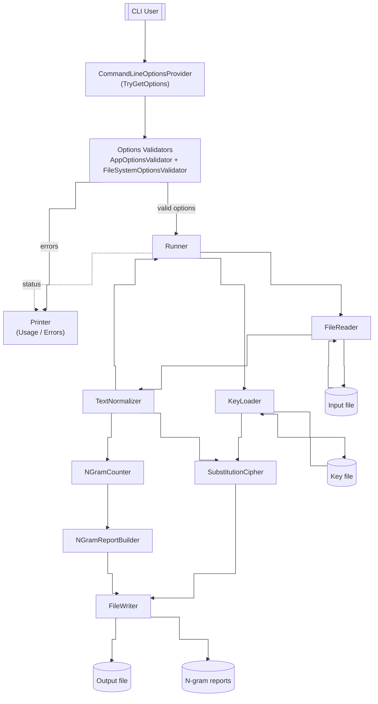
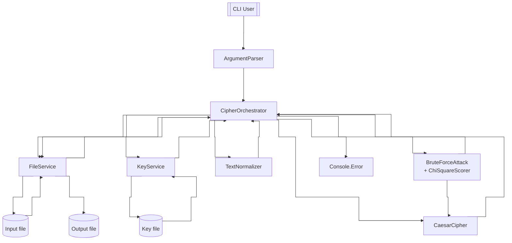
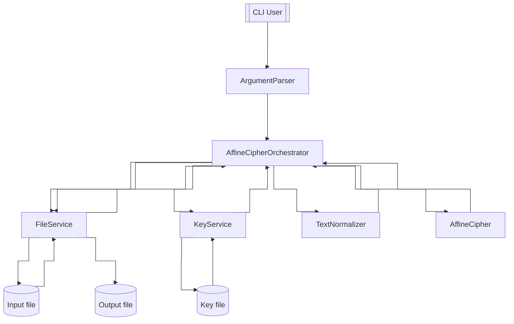
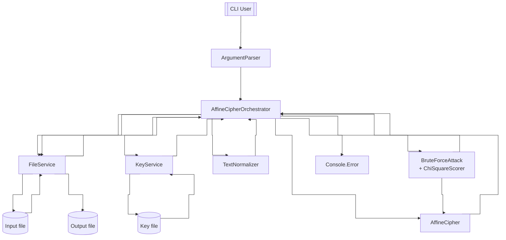

# Kryptografia i kryptoanaliza

## Laboratorium 2

### Grupa 1ID24B

### Autorzy: Kamil Fudala, Andrzej Szczytyński

### Zadanie 1

Napisz program implementujący algorytm szyfru przesuwnego (Szyfr Cezara).

1. Tekst jawny powinien być importowany do programu z pliku tekstowego, którego nazwa określona powinna być po zdefiniowanym argumencie / fladze: -i.
2. Wynik pracy programu powinien być eksportowany do pliku tekstowego, którego nazwa określona powinna być po zdefiniowanym argumencie / fladze: -o.
3. Klucz powinien być określany za pomocą parametru / flagi -k.
4. Tryb pracy programu powinien być określony poprzez flagi: -e dla procesu szyfrowania, -d dla procesu deszyfrowania.

#### Diagram przepływu danych



#### Implementacja

- IArgumentParser.cs

    ```csharp
    using Task01.Application.Services;

    namespace Task01.Application.Abstractions;

    public interface IArgumentParser
    {
        Arguments Parse(string[] args);
    }
    ```

- ICipherOrchestrator.cs
  
    ```csharp
    using Task01.Application.Models;
    using Task01.Application.Services;

    namespace Task01.Application.Abstractions;

    public interface ICipherOrchestrator
    {
        Task<ProcessingResult> RunAsync(Arguments args);
    }
    ```

- IFileService.cs

    ```csharp
    namespace Task01.Application.Abstractions;

    public interface IFileService
    {
        Task<string> ReadAllTextAsync(string path);
        Task WriteAllTextAsync(string path, string content);
    }
    ```

- IKeyService.cs

    ```csharp
    namespace Task01.Application.Abstractions;

    public interface IKeyService
    {
        Task<int> GetKeyAsync(string keyFilePath);
    }
    ```

- ArgumentParser.cs

    ```csharp
    using Task01.Application.Abstractions;
    using Task01.Application.Services;

    namespace Task01.Application.Models;

    public sealed class ArgumentParser : IArgumentParser
    {
        public Arguments Parse(string[] args)
        {
            if (args is null || args.Length == 0)
            {
                throw new ArgumentException("Missing arguments");
            }

            Operation? mode = null;
            string? keyPath = null;
            string? inputPath = null;
            string? outputPath = null;

            for (var i = 0; i < args.Length; i++)
            {
                var token = args[i];

                switch (token)
                {
                    case "-e":
                    case "-d":
                        mode = ResolveMode(token, mode);
                        break;

                    case "-k":
                        keyPath = ReadValue(args, ref i, "-k");
                        break;

                    case "-i":
                        inputPath = ReadValue(args, ref i, "-i");
                        break;

                    case "-o":
                        outputPath = ReadValue(args, ref i, "-o");
                        break;

                    default:
                        throw new ArgumentException("Unknown argument " + token);
                }
            }

            return BuildArguments(mode, keyPath, inputPath, outputPath);
        }

        private static Operation ResolveMode(string flag, Operation? current)
        {
            var next = flag == "-e" ? Operation.Encrypt : Operation.Decrypt;

            if (current is null)
            {
                return next;
            }

            return current == next ? current.Value : throw new ArgumentException("Flags -e and -d cannot be used together");
        }

        private static string ReadValue(string[] args, ref int index, string flag)
        {
            index++;
            if (index >= args.Length || string.IsNullOrWhiteSpace(args[index]))
            {
                throw new ArgumentException("Missing value for " + flag);
            }

            return args[index];
        }

        private static Arguments BuildArguments(Operation? mode, string? keyPath, string? inputPath, string? outputPath)
        {
            if (mode is null)
            {
                throw new ArgumentException("Missing -e or -d");
            }

            if (string.IsNullOrWhiteSpace(keyPath))
            {
                throw new ArgumentException("Missing -k <keyfile>");
            }

            if (string.IsNullOrWhiteSpace(inputPath))
            {
                throw new ArgumentException("Missing -i <inputfile>");
            }

            if (string.IsNullOrWhiteSpace(outputPath))
            {
                throw new ArgumentException("Missing -o <outputfile>");
            }

            return new Arguments(
                mode.Value,
                keyPath,
                inputPath,
                outputPath
            );
        }
    }
    ```

- Operation.cs

    ```csharp
    namespace Task01.Application.Models;

    public enum Operation
    {
        Encrypt,
        Decrypt
    }
    ```

- ProcessingResult.cs

    ```csharp
    namespace Task01.Application.Models;

    public readonly record struct ProcessingResult(
        int ExitCode,
        string? Message
    )
    {
        public bool IsSuccess => ExitCode == 0;
    }
    ```

- Arguments.cs

    ```csharp
    using Task01.Application.Models;

    namespace Task01.Application.Services;

    public sealed record Arguments(
        Operation Operation,
        string KeyFilePath,
        string InputFilePath,
        string OutputFilePath
    );
    ```

- CipherOrchestrator.cs

    ```csharp
    using Task01.Application.Abstractions;
    using Task01.Application.Models;
    using Task01.Domain.Abstractions;

    namespace Task01.Application.Services;

    public sealed class CipherOrchestrator(
        IFileService fileService,
        IKeyService keyService,
        ITextNormalizer textNormalizer,
        ICaesarCipher cipher)
        : ICipherOrchestrator
    {
        private const string Alphabet = "ABCDEFGHIJKLMNOPQRSTUVWXYZ";

        public async Task<ProcessingResult> RunAsync(Arguments args)
        {
            try
            {
                var rawInput = await fileService.ReadAllTextAsync(args.InputFilePath).ConfigureAwait(false);

                var normalized = textNormalizer.Normalize(rawInput);

                var key = await keyService.GetKeyAsync(args.KeyFilePath).ConfigureAwait(false);

                var outputText = args.Operation == Operation.Encrypt
                    ? cipher.Encrypt(normalized, Alphabet, key)
                    : cipher.Decrypt(normalized, Alphabet, key);

                await fileService.WriteAllTextAsync(args.OutputFilePath, outputText).ConfigureAwait(false);

                return new ProcessingResult(0, null);
            }
            catch (FormatException)
            {
                return new ProcessingResult(3, "Invalid key");
            }
            catch (FileNotFoundException)
            {
                return new ProcessingResult(2, "File error");
            }
            catch (DirectoryNotFoundException)
            {
                return new ProcessingResult(2, "File error");
            }
            catch (UnauthorizedAccessException)
            {
                return new ProcessingResult(2, "File error");
            }
            catch (IOException)
            {
                return new ProcessingResult(2, "File error");
            }
            catch (Exception)
            {
                return new ProcessingResult(99, "Unexpected error");
            }
        }
    }
    ```

- ICaesarCipher.cs
  
    ```csharp
    namespace Task01.Domain.Abstractions;

    public interface ICaesarCipher
    {
        string Encrypt(string normalizedText, string alphabet, int key);
        string Decrypt(string normalizedText, string alphabet, int key);
    }
    ```

- ITextNormalizer.cs

    ```csharp
    namespace Task01.Domain.Abstractions;

    public interface ITextNormalizer
    {
        string Normalize(string input);
    }
    ```

- CaesarCipher.cs

    ```csharp
    using Task01.Domain.Abstractions;

    namespace Task01.Domain.Services;

    public sealed class CaesarCipher : ICaesarCipher
    {
        public string Encrypt(string normalizedText, string alphabet, int key)
        {
            return Transform(normalizedText, alphabet, key, true);
        }

        public string Decrypt(string normalizedText, string alphabet, int key)
        {
            return Transform(normalizedText, alphabet, key, false);
        }

        private static string Transform(string text, string alphabet, int key, bool encrypt)
        {
            if (string.IsNullOrEmpty(text))
            {
                return string.Empty;
            }

            var n = alphabet.Length;
            if (n == 0)
            {
                return string.Empty;
            }

            var map = BuildIndexMap(alphabet);

            var src = text.AsSpan();
            var dst = new char[src.Length];

            var kEff = Mod(key, n);

            for (var i = 0; i < src.Length; i++)
            {
                var c = src[i];

                if (!map.TryGetValue(c, out var idx))
                {
                    throw new InvalidOperationException("Character not found in alphabet");
                }

                var newIdx = encrypt
                    ? idx + kEff
                    : idx - kEff;

                newIdx = Mod(newIdx, n);

                dst[i] = alphabet[newIdx];
            }

            return new string(dst);
        }

        private static Dictionary<char, int> BuildIndexMap(string alphabet)
        {
            var dict = new Dictionary<char, int>(alphabet.Length);
            for (var i = 0; i < alphabet.Length; i++)
            {
                dict[alphabet[i]] = i;
            }

            return dict;
        }

        private static int Mod(int value, int m)
        {
            return value % m is var r && r < 0 ? r + m : r;
        }
    }
    ```

- TextNormalizer.cs

    ```csharp
    using Task01.Domain.Abstractions;

    namespace Task01.Domain.Services;

    public sealed class TextNormalizer : ITextNormalizer
    {
        public string Normalize(string input)
        {
            if (string.IsNullOrEmpty(input))
                return string.Empty;

            var span = input.AsSpan();
            var sb = new StringBuilder(span.Length);

            foreach (var c in span)
            {
                if (c is (< 'A' or > 'Z') and (< 'a' or > 'z'))
                {
                    continue;
                }

                var upper = char.ToUpperInvariant(c);
                sb.Append(upper);
            }

            return sb.ToString();
        }
    }
    ```

- FileService.cs

    ```csharp
    using Task01.Application.Abstractions;

    namespace Task01.Infrastructure.Services;

    public sealed class FileService : IFileService
    {
        private static readonly Encoding Utf8NoBom = new UTF8Encoding(false);

        public async Task<string> ReadAllTextAsync(string path)
        {
            const FileOptions fileOptions = FileOptions.Asynchronous | FileOptions.SequentialScan;

            await using var fs = new FileStream(
                path,
                FileMode.Open,
                FileAccess.Read,
                FileShare.Read,
                4096,
                fileOptions
            );

            using var reader = new StreamReader(fs, Encoding.UTF8, true);

            return await reader.ReadToEndAsync().ConfigureAwait(false);
        }

        public async Task WriteAllTextAsync(string path, string content)
        {
            const FileOptions fileOptions = FileOptions.Asynchronous | FileOptions.SequentialScan;

            await using var fs = new FileStream(
                path,
                FileMode.Create,
                FileAccess.Write,
                FileShare.None,
                4096,
                fileOptions
            );

            await using var writer = new StreamWriter(fs, Utf8NoBom);

            await writer.WriteAsync(content.AsMemory()).ConfigureAwait(false);
            await writer.FlushAsync().ConfigureAwait(false);
        }
    }
    ```

- KeyService.cs

    ```csharp
    using Task01.Application.Abstractions;

    namespace Task01.Infrastructure.Services;

    public sealed class KeyService(IFileService fileService) : IKeyService
    {
        public async Task<int> GetKeyAsync(string keyFilePath)
        {
            var raw = await fileService.ReadAllTextAsync(keyFilePath).ConfigureAwait(false);

            if (string.IsNullOrWhiteSpace(raw))
            {
                throw new FormatException("Key file is empty");
            }

            var span = raw.AsSpan();

            var firstLineEnd = span.IndexOfAny('\r', '\n');
            if (firstLineEnd >= 0)
            {
                span = span[..firstLineEnd];
            }

            span = TrimWhite(span);

            if (span.IsEmpty)
            {
                throw new FormatException("Key not found");
            }

            return TryParseInvariantInt(span, out var value)
                ? value
                : throw new FormatException("Key is not a valid integer");
        }

        private static ReadOnlySpan<char> TrimWhite(ReadOnlySpan<char> value)
        {
            var start = 0;
            var end = value.Length - 1;

            while (start <= end && char.IsWhiteSpace(value[start]))
            {
                start++;
            }

            while (end >= start && char.IsWhiteSpace(value[end]))
            {
                end--;
            }

            return start > end ? ReadOnlySpan<char>.Empty : value.Slice(start, end - start + 1);
        }

        private static bool TryParseInvariantInt(ReadOnlySpan<char> span, out int result)
        {
            return int.TryParse(span, NumberStyles.Integer, CultureInfo.InvariantCulture, out result);
        }
    }
    ```

- GlobalUsings.cs

    ```csharp
    global using System;
    global using System.Collections.Generic;
    global using System.Globalization;
    global using System.IO;
    global using System.Text;
    global using System.Threading.Tasks;
    ```

- Program.cs

    ```csharp
    #pragma warning disable CA1859

    using Task01.Application.Abstractions;
    using Task01.Application.Models;
    using Task01.Application.Services;
    using Task01.Domain.Abstractions;
    using Task01.Domain.Services;
    using Task01.Infrastructure.Services;

    CultureInfo.CurrentCulture = CultureInfo.InvariantCulture;
    CultureInfo.CurrentUICulture = CultureInfo.InvariantCulture;

    IFileService fileService = new FileService();
    IKeyService keyService = new KeyService(fileService);

    ITextNormalizer textNormalizer = new TextNormalizer();
    ICaesarCipher cipher = new CaesarCipher();

    ICipherOrchestrator orchestrator = new CipherOrchestrator(
        fileService,
        keyService,
        textNormalizer,
        cipher
    );

    IArgumentParser parser = new ArgumentParser();

    ProcessingResult result;

    try
    {
        var parsed = parser.Parse(args);

        result = await orchestrator.RunAsync(parsed);
    }
    catch (ArgumentException ex)
    {
        result = new ProcessingResult(1, ex.Message);
    }
    catch (Exception)
    {
        result = new ProcessingResult(99, "Unexpected error");
    }

    if (!result.IsSuccess && !string.IsNullOrEmpty(result.Message))
    {
        await Console.Error.WriteLineAsync(result.Message);
    }

    Environment.ExitCode = result.ExitCode;
    ```

#### Wyniki

- Szyfrowanie

    ```
    ➜  Task01 (main) dotnet run -- \                          
    -e \
    -k Samples/key.txt \
    -i Samples/plaintext.txt \
    -o Samples/cipher.txt

    ➜  Task01 (main) diff Samples/plaintext.txt Samples/cipher.txt 
    1,3c1
    < Every morning the small town wakes up in a quiet and gentle way. People leave their homes, make coffee, read a little, and get ready for another day at work, at school, or at home. The air is cool and clear after a calm night, and there is a slow steady rhythm to the early hours. A few cars move along the main street, and a bus stops near the corner to take older people to the center. A baker opens the door of the little store and the warm smell of fresh bread goes into the street. A dog sits near the door and waits with patient eyes.
    < 
    < Later in the day the town becomes more active. Children talk and laugh. Neighbors meet and share short news about daily life, about family, and about small plans for the weekend. Nothing dramatic happens here. There is no rush, no panic, no loud event. It is simple, steady, and human. People help one another in direct and honest ways, and the result is trust. In the evening the lights come on in every home, dinner is made, and the town slows down again. The day ends the same way it began, in calm and in quiet, and everyone feels ready to rest.
    ---
    > HYHUBPRUQLQJWKHVPDOOWRZQZDNHVXSLQDTXLHWDQGJHQWOHZDBSHRSOHOHDYHWKHLUKRPHVPDNHFRIIHHUHDGDOLWWOHDQGJHWUHDGBIRUDQRWKHUGDBDWZRUNDWVFKRRORUDWKRPHWKHDLULVFRRODQGFOHDUDIWHUDFDOPQLJKWDQGWKHUHLVDVORZVWHDGBUKBWKPWRWKHHDUOBKRXUVDIHZFDUVPRYHDORQJWKHPDLQVWUHHWDQGDEXVVWRSVQHDUWKHFRUQHUWRWDNHROGHUSHRSOHWRWKHFHQWHUDEDNHURSHQVWKHGRRURIWKHOLWWOHVWRUHDQGWKHZDUPVPHOORIIUHVKEUHDGJRHVLQWRWKHVWUHHWDGRJVLWVQHDUWKHGRRUDQGZDLWVZLWKSDWLHQWHBHVODWHULQWKHGDBWKHWRZQEHFRPHVPRUHDFWLYHFKLOGUHQWDONDQGODXJKQHLJKERUVPHHWDQGVKDUHVKRUWQHZVDERXWGDLOBOLIHDERXWIDPLOBDQGDERXWVPDOOSODQVIRUWKHZHHNHQGQRWKLQJGUDPDWLFKDSSHQVKHUHWKHUHLVQRUXVKQRSDQLFQRORXGHYHQWLWLVVLPSOHVWHDGBDQGKXPDQSHRSOHKHOSRQHDQRWKHULQGLUHFWDQGKRQHVWZDBVDQGWKHUHVXOWLVWUXVWLQWKHHYHQLQJWKHOLJKWVFRPHRQLQHYHUBKRPHGLQQHULVPDGHDQGWKHWRZQVORZVGRZQDJDLQWKHGDBHQGVWKHVDPHZDBLWEHJDQLQFDOPDQGLQTXLHWDQGHYHUBRQHIHHOVUHDGBWRUHVW
    \ No newline at end of file
    ```

- Deszyfrowanie

    ```
    ➜  Task01 (main) dotnet run -- \                          
    -e \
    -k Samples/key.txt \
    ➜  Task01 (main) dotnet run -- \                              
    -d \                                                                                                     
    -k Samples/key.txt \
    -i Samples/cipher.txt \
    -o Samples/decrypted.txt

    ➜  Task01 (main) diff Samples/plaintext.txt Samples/decrypted.txt 
    1,3c1
    < Every morning the small town wakes up in a quiet and gentle way. People leave their homes, make coffee, read a little, and get ready for another day at work, at school, or at home. The air is cool and clear after a calm night, and there is a slow steady rhythm to the early hours. A few cars move along the main street, and a bus stops near the corner to take older people to the center. A baker opens the door of the little store and the warm smell of fresh bread goes into the street. A dog sits near the door and waits with patient eyes.
    < 
    < Later in the day the town becomes more active. Children talk and laugh. Neighbors meet and share short news about daily life, about family, and about small plans for the weekend. Nothing dramatic happens here. There is no rush, no panic, no loud event. It is simple, steady, and human. People help one another in direct and honest ways, and the result is trust. In the evening the lights come on in every home, dinner is made, and the town slows down again. The day ends the same way it began, in calm and in quiet, and everyone feels ready to rest.
    ---
    > EVERYMORNINGTHESMALLTOWNWAKESUPINAQUIETANDGENTLEWAYPEOPLELEAVETHEIRHOMESMAKECOFFEEREADALITTLEANDGETREADYFORANOTHERDAYATWORKATSCHOOLORATHOMETHEAIRISCOOLANDCLEARAFTERACALMNIGHTANDTHEREISASLOWSTEADYRHYTHMTOTHEEARLYHOURSAFEWCARSMOVEALONGTHEMAINSTREETANDABUSSTOPSNEARTHECORNERTOTAKEOLDERPEOPLETOTHECENTERABAKEROPENSTHEDOOROFTHELITTLESTOREANDTHEWARMSMELLOFFRESHBREADGOESINTOTHESTREETADOGSITSNEARTHEDOORANDWAITSWITHPATIENTEYESLATERINTHEDAYTHETOWNBECOMESMOREACTIVECHILDRENTALKANDLAUGHNEIGHBORSMEETANDSHARESHORTNEWSABOUTDAILYLIFEABOUTFAMILYANDABOUTSMALLPLANSFORTHEWEEKENDNOTHINGDRAMATICHAPPENSHERETHEREISNORUSHNOPANICNOLOUDEVENTITISSIMPLESTEADYANDHUMANPEOPLEHELPONEANOTHERINDIRECTANDHONESTWAYSANDTHERESULTISTRUSTINTHEEVENINGTHELIGHTSCOMEONINEVERYHOMEDINNERISMADEANDTHETOWNSLOWSDOWNAGAINTHEDAYENDSTHESAMEWAYITBEGANINCALMANDINQUIETANDEVERYONEFEELSREADYTOREST
    \ No newline at end of file
    ```

### Zadanie 2

Rozbuduj program z poprzedniego zadania poprzez implementację ataku typu brute-force na szyfrogram wygenerowany przy pomocy algorytmu przesuwnego.

1. Algorytm powinien być wyzwalany po użyciu flagi -a z parametrem bf.

#### Diagram przepływu danych



#### Implementacja

- IArgumentParser.cs

    ```csharp
    using Task02.Application.Services;

    namespace Task02.Application.Abstractions;

    public interface IArgumentParser
    {
        Arguments Parse(string[] args);
    }
    ```

- ICipherOrchestrator.cs

    ```csharp
    using Task02.Application.Models;
    using Task02.Application.Services;

    namespace Task02.Application.Abstractions;

    public interface ICipherOrchestrator
    {
        Task<ProcessingResult> RunAsync(Arguments args);
    }
    ```

- IFileService.cs

    ```csharp
    namespace Task02.Application.Abstractions;

    public interface IFileService
    {
        Task<string> ReadAllTextAsync(string path);
        Task WriteAllTextAsync(string path, string content);
    }
    ```

- IKeyService.cs

    ```csharp
    namespace Task02.Application.Abstractions;

    public interface IKeyService
    {
        Task<int> GetKeyAsync(string keyFilePath);
    }
    ```

- ArgumentParser.cs

    ```csharp
    using Task02.Application.Abstractions;
    using Task02.Application.Services;

    namespace Task02.Application.Models;

    public sealed class ArgumentParser : IArgumentParser
    {
        public Arguments Parse(string[] args)
        {
            if (args is null || args.Length == 0)
            {
                throw new ArgumentException("Missing arguments");
            }

            Operation? op = null;
            string? keyPath = null;
            string? inputPath = null;
            string? outputPath = null;

            var i = 0;
            while (i < args.Length)
            {
                var token = args[i];

                switch (token)
                {
                    case "-e":
                        op = ResolveExclusive(op, Operation.Encrypt);
                        break;

                    case "-d":
                        op = ResolveExclusive(op, Operation.Decrypt);
                        break;

                    case "-a":
                        var attackMode = ReadNext(args, ref i, "-a");
                        if (attackMode != "bf")
                        {
                            throw new ArgumentException("Unsupported attack mode " + attackMode);
                        }

                        op = ResolveExclusive(op, Operation.BruteForce);
                        break;

                    case "-k":
                        keyPath = ReadNext(args, ref i, "-k");
                        break;

                    case "-i":
                        inputPath = ReadNext(args, ref i, "-i");
                        break;

                    case "-o":
                        outputPath = ReadNext(args, ref i, "-o");
                        break;

                    default:
                        throw new ArgumentException("Unknown argument " + token);
                }

                i++;
            }

            return BuildArguments(op, keyPath, inputPath, outputPath);
        }

        private static Operation ResolveExclusive(Operation? current, Operation next)
        {
            if (current is null)
            {
                return next;
            }

            return current == next
                ? current.Value
                : throw new ArgumentException("Conflicting operation flags");
        }

        private static string ReadNext(string[] args, ref int index, string flag)
        {
            index++;
            if (index >= args.Length || string.IsNullOrWhiteSpace(args[index]))
            {
                throw new ArgumentException("Missing value for " + flag);
            }

            return args[index];
        }

        private static Arguments BuildArguments(Operation? op, string? keyPath, string? inputPath, string? outputPath)
        {
            if (op is null)
            {
                throw new ArgumentException("Missing -e or -d or -a bf");
            }

            if (string.IsNullOrWhiteSpace(inputPath))
            {
                throw new ArgumentException("Missing -i <inputfile>");
            }

            if (string.IsNullOrWhiteSpace(outputPath))
            {
                throw new ArgumentException("Missing -o <outputfile>");
            }

            if (op != Operation.BruteForce && string.IsNullOrWhiteSpace(keyPath))
            {
                throw new ArgumentException("Missing -k <keyfile>");
            }

            return new Arguments(
                op.Value,
                keyPath,
                inputPath,
                outputPath
            );
        }
    }
    ```

- Operation.cs

    ```csharp
    namespace Task02.Application.Models;

    public enum Operation
    {
        Encrypt,
        Decrypt,
        BruteForce
    }
    ```

- ProcessingResult.cs

    ```csharp
    namespace Task02.Application.Models;

    public readonly record struct ProcessingResult(
        int ExitCode,
        string? Message
    );
    ```

- Arguments.cs

    ```csharp
    using Task02.Application.Models;

    namespace Task02.Application.Services;

    public sealed record Arguments(
        Operation Operation,
        string? KeyFilePath,
        string InputFilePath,
        string OutputFilePath
    );
    ```

- CipherOrchestrator.cs

    ```csharp
    using Task02.Application.Abstractions;
    using Task02.Application.Models;
    using Task02.Domain.Abstractions;

    namespace Task02.Application.Services;

    public sealed class CipherOrchestrator(
        IFileService fileService,
        IKeyService keyService,
        ITextNormalizer normalizer,
        ICaesarCipher cipher,
        IBruteForceAttack bruteForce)
        : ICipherOrchestrator
    {
        private const string Alphabet = "ABCDEFGHIJKLMNOPQRSTUVWXYZ";

        public async Task<ProcessingResult> RunAsync(Arguments args)
        {
            try
            {
                return args.Operation switch
                {
                    Operation.Encrypt => await RunEncryptAsync(args).ConfigureAwait(false),
                    Operation.Decrypt => await RunDecryptAsync(args).ConfigureAwait(false),
                    Operation.BruteForce => await RunBruteForceAsync(args).ConfigureAwait(false),
                    _ => new ProcessingResult(1, "Unsupported operation")
                };
            }
            catch (FormatException)
            {
                return new ProcessingResult(3, "Invalid key");
            }
            catch (FileNotFoundException)
            {
                return new ProcessingResult(2, "File error");
            }
            catch (DirectoryNotFoundException)
            {
                return new ProcessingResult(2, "File error");
            }
            catch (UnauthorizedAccessException)
            {
                return new ProcessingResult(2, "File error");
            }
            catch (IOException)
            {
                return new ProcessingResult(2, "File error");
            }
            catch (Exception)
            {
                return new ProcessingResult(99, "Unexpected error");
            }
        }

        private async Task<ProcessingResult> RunEncryptAsync(Arguments args)
        {
            var raw = await fileService.ReadAllTextAsync(args.InputFilePath).ConfigureAwait(false);
            var norm = normalizer.Normalize(raw);

            var key = await keyService.GetKeyAsync(args.KeyFilePath!).ConfigureAwait(false);

            var output = cipher.Encrypt(norm, Alphabet, key);

            await fileService.WriteAllTextAsync(args.OutputFilePath, output).ConfigureAwait(false);

            return new ProcessingResult(0, null);
        }

        private async Task<ProcessingResult> RunDecryptAsync(Arguments args)
        {
            var raw = await fileService.ReadAllTextAsync(args.InputFilePath).ConfigureAwait(false);
            var norm = normalizer.Normalize(raw);

            var key = await keyService.GetKeyAsync(args.KeyFilePath!).ConfigureAwait(false);

            var output = cipher.Decrypt(norm, Alphabet, key);

            await fileService.WriteAllTextAsync(args.OutputFilePath, output).ConfigureAwait(false);

            return new ProcessingResult(0, null);
        }

        private async Task<ProcessingResult> RunBruteForceAsync(Arguments args)
        {
            var raw = await fileService.ReadAllTextAsync(args.InputFilePath).ConfigureAwait(false);
            var norm = normalizer.Normalize(raw);

            var result = bruteForce.BreakCipher(norm);

            await fileService.WriteAllTextAsync(args.OutputFilePath, result.Plaintext).ConfigureAwait(false);

            var msg = $"key={result.Key} chi2={result.ChiSquare:F4} english={result.LooksEnglish}";

            return new ProcessingResult(0, msg);
        }
    }
    ```

- BruteForceAttack.cs

    ```csharp
    using MathNet.Numerics.Distributions;
    using Task02.Domain.Models;

    namespace Task02.Domain.Abstractions;

    public sealed class BruteForceAttack(ICaesarCipher cipher, IChiSquareScorer scorer) : IBruteForceAttack
    {
        private const string Alphabet = "ABCDEFGHIJKLMNOPQRSTUVWXYZ";

        public BruteForceResult BreakCipher(string cipherText)
        {
            if (string.IsNullOrEmpty(cipherText))
            {
                return new BruteForceResult(string.Empty, 0, double.PositiveInfinity, false);
            }

            var bestPlain = string.Empty;
            var bestScore = double.PositiveInfinity;
            var bestKey = 0;

            for (var key = 0; key < 26; key++)
            {
                var candidate = cipher.Decrypt(cipherText, Alphabet, key);
                var score = scorer.Score(candidate);

                if (score >= bestScore)
                {
                    continue;
                }

                bestScore = score;
                bestPlain = candidate;
                bestKey = key;
            }

            const double df = 25.0;
            const double p = 0.95;
            var critical = ChiSquared.InvCDF(df, p);

            var looksEnglish = bestScore <= critical;

            return new BruteForceResult(
                bestPlain,
                bestKey,
                bestScore,
                looksEnglish
            );
        }
    }
    ```

- ChiSquareCalculator.cs

    ```csharp
    namespace Task02.Domain.Abstractions;

    public sealed class ChiSquareScorer : IChiSquareScorer
    {
        private static readonly double[] ExpectedFrequencies =
        [
            0.08167, // A
            0.01492, // B
            0.02782, // C
            0.04253, // D
            0.12702, // E
            0.02228, // F
            0.02015, // G
            0.06094, // H
            0.06966, // I
            0.00153, // J
            0.00772, // K
            0.04025, // L
            0.02406, // M
            0.06749, // N
            0.07507, // O
            0.01929, // P
            0.00095, // Q
            0.05987, // R
            0.06327, // S
            0.09056, // T
            0.02758, // U
            0.00978, // V
            0.02360, // W
            0.00150, // X
            0.01974, // Y
            0.00074 // Z
        ];

        public double Score(string text)
        {
            if (string.IsNullOrEmpty(text))
            {
                return double.PositiveInfinity;
            }

            var counts = new int[26];
            var span = text.AsSpan();

            foreach (var c in span)
            {
                var idx = c - 'A';
                if ((uint)idx < 26u)
                {
                    counts[idx]++;
                }
            }

            var n = span.Length;
            if (n == 0)
            {
                return double.PositiveInfinity;
            }

            var chi2 = 0d;

            for (var i = 0; i < 26; i++)
            {
                var expected = ExpectedFrequencies[i] * n;
                var observed = counts[i];
                var diff = observed - expected;
                chi2 += diff * diff / expected;
            }

            return chi2;
        }
    }
    ```

- IBruteForceAttack.cs

    ```csharp
    using Task02.Domain.Models;

    namespace Task02.Domain.Abstractions;

    public interface IBruteForceAttack
    {
        BruteForceResult BreakCipher(string cipherText);
    }
    ```

- ICaesarCipher.cs

    ```csharp
    namespace Task02.Domain.Abstractions;

    public interface ICaesarCipher
    {
        string Encrypt(string normalizedText, string alphabet, int key);
        string Decrypt(string normalizedText, string alphabet, int key);
    }
    ```

- IChiSquareScorer.cs

    ```csharp
    namespace Task02.Domain.Abstractions;

    public interface IChiSquareScorer
    {
        double Score(string text);
    }
    ```

- ITextNormalizer.cs

    ```csharp
    namespace Task02.Domain.Abstractions;

    public interface ITextNormalizer
    {
        string Normalize(string input);
    }
    ```

- BruteForceResult.cs

    ```csharp
    namespace Task02.Domain.Models;

    public readonly record struct BruteForceResult(
        string Plaintext,
        int Key,
        double ChiSquare,
        bool LooksEnglish
    );
    ```

- CaesarCipher.cs

    ```csharp
    using Task02.Domain.Abstractions;

    namespace Task02.Domain.Services;

    public class CaesarCipher : ICaesarCipher
    {
        public string Encrypt(string normalizedText, string alphabet, int key)
        {
            return Transform(normalizedText, alphabet, key, true);
        }

        public string Decrypt(string normalizedText, string alphabet, int key)
        {
            return Transform(normalizedText, alphabet, key, false);
        }

        private static string Transform(string text, string alphabet, int key, bool encrypt)
        {
            if (string.IsNullOrEmpty(text))
            {
                return string.Empty;
            }

            var n = alphabet.Length;
            if (n == 0)
            {
                return string.Empty;
            }

            var map = BuildIndexMap(alphabet);

            var src = text.AsSpan();
            var dst = new char[src.Length];

            var kEff = Mod(key, n);

            for (var i = 0; i < src.Length; i++)
            {
                var c = src[i];

                if (!map.TryGetValue(c, out var idx))
                {
                    throw new InvalidOperationException("Character not found in alphabet");
                }

                var newIdx = encrypt ? idx + kEff : idx - kEff;

                newIdx = Mod(newIdx, n);

                dst[i] = alphabet[newIdx];
            }

            return new string(dst);
        }

        private static Dictionary<char, int> BuildIndexMap(string alphabet)
        {
            var dict = new Dictionary<char, int>(alphabet.Length);
            for (var i = 0; i < alphabet.Length; i++)
            {
                dict[alphabet[i]] = i;
            }

            return dict;
        }

        private static int Mod(int value, int m)
        {
            return value % m is var r && r < 0 ? r + m : r;
        }
    }
    ```

- TextNormalizer.cs

    ```csharp
    using Task02.Domain.Abstractions;

    namespace Task02.Domain.Services;

    public sealed class TextNormalizer : ITextNormalizer
    {
        public string Normalize(string input)
        {
            if (string.IsNullOrEmpty(input))
            {
                return string.Empty;
            }

            var span = input.AsSpan();
            var sb = new StringBuilder(span.Length);

            foreach (var c in span)
            {
                if (c is (< 'A' or > 'Z') and (< 'a' or > 'z'))
                {
                    continue;
                }

                var upper = char.ToUpperInvariant(c);
                sb.Append(upper);
            }

            return sb.ToString();
        }
    }
    ```

- FileService.cs

    ```csharp
    using Task02.Application.Abstractions;

    namespace Task02.Infrastructure.Services;

    public sealed class FileService : IFileService
    {
        private static readonly Encoding Utf8NoBom = new UTF8Encoding(false);

        public async Task<string> ReadAllTextAsync(string path)
        {
            const FileOptions fileOptions = FileOptions.Asynchronous | FileOptions.SequentialScan;

            await using var fs = new FileStream(
                path,
                FileMode.Open,
                FileAccess.Read,
                FileShare.Read,
                4096,
                fileOptions
            );

            using var reader = new StreamReader(fs, Encoding.UTF8, true);

            return await reader.ReadToEndAsync().ConfigureAwait(false);
        }

        public async Task WriteAllTextAsync(string path, string content)
        {
            const FileOptions fileOptions = FileOptions.Asynchronous | FileOptions.SequentialScan;

            await using var fs = new FileStream(
                path,
                FileMode.Create,
                FileAccess.Write,
                FileShare.None,
                4096,
                fileOptions
            );

            await using var writer = new StreamWriter(fs, Utf8NoBom);

            await writer.WriteAsync(content.AsMemory()).ConfigureAwait(false);
            await writer.FlushAsync().ConfigureAwait(false);
        }
    }
    ```

- KeyService.cs

    ```csharp
    using Task02.Application.Abstractions;

    namespace Task02.Infrastructure.Services;

    public sealed class KeyService(IFileService fileService) : IKeyService
    {
        public async Task<int> GetKeyAsync(string keyFilePath)
        {
            var raw = await fileService.ReadAllTextAsync(keyFilePath).ConfigureAwait(false);

            if (string.IsNullOrWhiteSpace(raw))
            {
                throw new FormatException("Key file is empty");
            }

            var span = raw.AsSpan();

            var firstLineEnd = span.IndexOfAny('\r', '\n');
            if (firstLineEnd >= 0)
            {
                span = span[..firstLineEnd];
            }

            span = TrimWhite(span);

            if (span.IsEmpty)
            {
                throw new FormatException("Key not found");
            }

            return TryParseInvariantInt(span, out var value)
                ? value
                : throw new FormatException("Key is not a valid integer");
        }

        private static ReadOnlySpan<char> TrimWhite(ReadOnlySpan<char> value)
        {
            var start = 0;
            var end = value.Length - 1;

            while (start <= end && char.IsWhiteSpace(value[start]))
            {
                start++;
            }

            while (end >= start && char.IsWhiteSpace(value[end]))
            {
                end--;
            }

            return start > end ? ReadOnlySpan<char>.Empty : value.Slice(start, end - start + 1);
        }

        private static bool TryParseInvariantInt(ReadOnlySpan<char> span, out int result)
        {
            return int.TryParse(span, NumberStyles.Integer, CultureInfo.InvariantCulture, out result);
        }
    }
    ```

- GlobalUsings.cs

    ```csharp
    global using System;
    global using System.Collections.Generic;
    global using System.Globalization;
    global using System.IO;
    global using System.Text;
    global using System.Threading.Tasks;
    ```

- Program.cs

    ```csharp
    #pragma warning disable CA1859

    using Task02.Application.Abstractions;
    using Task02.Application.Models;
    using Task02.Application.Services;
    using Task02.Domain.Abstractions;
    using Task02.Domain.Services;
    using Task02.Infrastructure.Services;

    CultureInfo.CurrentCulture = CultureInfo.InvariantCulture;
    CultureInfo.CurrentUICulture = CultureInfo.InvariantCulture;

    IFileService fileService = new FileService();
    IKeyService keyService = new KeyService(fileService);

    ITextNormalizer normalizer = new TextNormalizer();
    ICaesarCipher cipher = new CaesarCipher();
    IChiSquareScorer scorer = new ChiSquareScorer();
    IBruteForceAttack brute = new BruteForceAttack(cipher, scorer);

    ICipherOrchestrator orchestrator = new CipherOrchestrator(
        fileService,
        keyService,
        normalizer,
        cipher,
        brute
    );

    IArgumentParser parser = new ArgumentParser();

    ProcessingResult result;

    try
    {
        var parsed = parser.Parse(args);

        result = await orchestrator.RunAsync(parsed);
    }
    catch (ArgumentException ex)
    {
        result = new ProcessingResult(1, ex.Message);
    }
    catch (Exception)
    {
        result = new ProcessingResult(99, "Unexpected error");
    }

    if (!string.IsNullOrEmpty(result.Message))
    {
        await Console.Error.WriteLineAsync(result.Message);
    }

    Environment.ExitCode = result.ExitCode;
    ```

#### Wyniki

- Atak Brute-force

    ```
    ➜  Task02 (main) dotnet run -- \                                                                        
    -a bf \
    -i Samples/cipher.txt \
    -o Samples/recovered.txt

    key=3 chi2=29.1437 english=True
    ➜  Task02 (main) diff Samples/cipher.txt Samples/recovered.txt                                            
    1c1
    < HYHUBPRUQLQJWKHVPDOOWRZQZDNHVXSLQDTXLHWDQGJHQWOHZDBSHRSOHOHDYHWKHLUKRPHVPDNHFRIIHHUHDGDOLWWOHDQGJHWUHDGBIRUDQRWKHUGDBDWZRUNDWVFKRRORUDWKRPHWKHDLULVFRRODQGFOHDUDIWHUDFDOPQLJKWDQGWKHUHLVDVORZVWHDGBUKBWKPWRWKHHDUOBKRXUVDIHZFDUVPRYHDORQJWKHPDLQVWUHHWDQGDEXVVWRSVQHDUWKHFRUQHUWRWDNHROGHUSHRSOHWRWKHFHQWHUDEDNHURSHQVWKHGRRURIWKHOLWWOHVWRUHDQGWKHZDUPVPHOORIIUHVKEUHDGJRHVLQWRWKHVWUHHWDGRJVLWVQHDUWKHGRRUDQGZDLWVZLWKSDWLHQWHBHVODWHULQWKHGDBWKHWRZQEHFRPHVPRUHDFWLYHFKLOGUHQWDONDQGODXJKQHLJKERUVPHHWDQGVKDUHVKRUWQHZVDERXWGDLOBOLIHDERXWIDPLOBDQGDERXWVPDOOSODQVIRUWKHZHHNHQGQRWKLQJGUDPDWLFKDSSHQVKHUHWKHUHLVQRUXVKQRSDQLFQRORXGHYHQWLWLVVLPSOHVWHDGBDQGKXPDQSHRSOHKHOSRQHDQRWKHULQGLUHFWDQGKRQHVWZDBVDQGWKHUHVXOWLVWUXVWLQWKHHYHQLQJWKHOLJKWVFRPHRQLQHYHUBKRPHGLQQHULVPDGHDQGWKHWRZQVORZVGRZQDJDLQWKHGDBHQGVWKHVDPHZDBLWEHJDQLQFDOPDQGLQTXLHWDQGHYHUBRQHIHHOVUHDGBWRUHVW
    \ No newline at end of file
    ---
    > EVERYMORNINGTHESMALLTOWNWAKESUPINAQUIETANDGENTLEWAYPEOPLELEAVETHEIRHOMESMAKECOFFEEREADALITTLEANDGETREADYFORANOTHERDAYATWORKATSCHOOLORATHOMETHEAIRISCOOLANDCLEARAFTERACALMNIGHTANDTHEREISASLOWSTEADYRHYTHMTOTHEEARLYHOURSAFEWCARSMOVEALONGTHEMAINSTREETANDABUSSTOPSNEARTHECORNERTOTAKEOLDERPEOPLETOTHECENTERABAKEROPENSTHEDOOROFTHELITTLESTOREANDTHEWARMSMELLOFFRESHBREADGOESINTOTHESTREETADOGSITSNEARTHEDOORANDWAITSWITHPATIENTEYESLATERINTHEDAYTHETOWNBECOMESMOREACTIVECHILDRENTALKANDLAUGHNEIGHBORSMEETANDSHARESHORTNEWSABOUTDAILYLIFEABOUTFAMILYANDABOUTSMALLPLANSFORTHEWEEKENDNOTHINGDRAMATICHAPPENSHERETHEREISNORUSHNOPANICNOLOUDEVENTITISSIMPLESTEADYANDHUMANPEOPLEHELPONEANOTHERINDIRECTANDHONESTWAYSANDTHERESULTISTRUSTINTHEEVENINGTHELIGHTSCOMEONINEVERYHOMEDINNERISMADEANDTHETOWNSLOWSDOWNAGAINTHEDAYENDSTHESAMEWAYITBEGANINCALMANDINQUIETANDEVERYONEFEELSREADYTOREST
    \ No newline at end of file
    ```

### Zadanie 3

Napisz program analogiczny do programu z zadania 1, który tym razem implementuje szyfr afiniczny.

#### Diagram przepływu danych



#### Implementacja

- IArgumentParser.cs

    ```csharp
    using Task03.Application.Services;

    namespace Task03.Application.Abstractions;

    public interface IArgumentParser
    {
        Arguments Parse(string[] args);
    }
    ```

- ICipherOrchestrator.cs

    ```csharp
    using Task03.Application.Models;
    using Task03.Application.Services;

    namespace Task03.Application.Abstractions;

    public interface ICipherOrchestrator
    {
        Task<ProcessingResult> RunAsync(Arguments args);
    }
    ```

- IFileService.cs

    ```csharp
    namespace Task03.Application.Abstractions;

    public interface IFileService
    {
        Task<string> ReadAllTextAsync(string path);
        Task WriteAllTextAsync(string path, string content);
    }
    ```

- KeyService.cs

    ```csharp
    namespace Task03.Application.Abstractions;

    public interface IKeyService
    {
        Task<(int A, int B)> GetKeyAsync(string keyFilePath);
    }
    ```

- ArgumentParser.cs

    ```csharp
    using Task03.Application.Abstractions;
    using Task03.Application.Services;

    namespace Task03.Application.Models;

    public sealed class ArgumentParser : IArgumentParser
    {
        public Arguments Parse(string[] args)
        {
            if (args is null || args.Length == 0)
            {
                throw new ArgumentException("Missing arguments");
            }

            Operation? mode = null;
            string? keyPath = null;
            string? inputPath = null;
            string? outputPath = null;

            for (var i = 0; i < args.Length; i++)
            {
                var token = args[i];

                switch (token)
                {
                    case "-e":
                    case "-d":
                        mode = ResolveMode(token, mode);
                        break;

                    case "-k":
                        keyPath = ReadValue(args, ref i, "-k");
                        break;

                    case "-i":
                        inputPath = ReadValue(args, ref i, "-i");
                        break;

                    case "-o":
                        outputPath = ReadValue(args, ref i, "-o");
                        break;

                    default:
                        throw new ArgumentException("Unknown argument " + token);
                }
            }

            return BuildArguments(mode, keyPath, inputPath, outputPath);
        }

        private static Operation ResolveMode(string flag, Operation? current)
        {
            var next = flag == "-e" ? Operation.Encrypt : Operation.Decrypt;

            if (current is null)
            {
                return next;
            }

            return current == next ? current.Value : throw new ArgumentException("Flags -e and -d cannot be used together");
        }

        private static string ReadValue(string[] args, ref int index, string flag)
        {
            index++;
            if (index >= args.Length || string.IsNullOrWhiteSpace(args[index]))
            {
                throw new ArgumentException("Missing value for " + flag);
            }

            return args[index];
        }

        private static Arguments BuildArguments(Operation? mode, string? keyPath, string? inputPath, string? outputPath)
        {
            if (mode is null)
            {
                throw new ArgumentException("Missing -e or -d");
            }

            if (string.IsNullOrWhiteSpace(keyPath))
            {
                throw new ArgumentException("Missing -k <keyfile>");
            }

            if (string.IsNullOrWhiteSpace(inputPath))
            {
                throw new ArgumentException("Missing -i <inputfile>");
            }

            if (string.IsNullOrWhiteSpace(outputPath))
            {
                throw new ArgumentException("Missing -o <outputfile>");
            }

            return new Arguments(
                mode.Value,
                keyPath,
                inputPath,
                outputPath
            );
        }
    }
    ```

- Operation.cs

    ```csharp
    namespace Task03.Application.Models;

    public enum Operation
    {
        Encrypt,
        Decrypt
    }
    ```

- ProcessingResult.cs

    ```csharp
    namespace Task03.Application.Models;

    public readonly record struct ProcessingResult(
        int ExitCode,
        string? Message
    )
    {
        public bool IsSuccess => ExitCode == 0;
    }
    ```

- Arguments.cs

    ```csharp
    using Task03.Application.Models;

    namespace Task03.Application.Services;

    public sealed record Arguments(
        Operation Operation,
        string KeyFilePath,
        string InputFilePath,
        string OutputFilePath
    );
    ```

- CipherOrchestrator.cs

    ```csharp
    using Task03.Application.Abstractions;
    using Task03.Application.Models;
    using Task03.Domain.Abstractions;

    namespace Task03.Application.Services;

    public sealed class CipherOrchestrator(
        IFileService fileService,
        IKeyService keyService,
        ITextNormalizer textNormalizer,
        IAffineCipher cipher)
        : ICipherOrchestrator
    {
        private const string Alphabet = "ABCDEFGHIJKLMNOPQRSTUVWXYZ";

        public async Task<ProcessingResult> RunAsync(Arguments args)
        {
            try
            {
                var rawInput = await fileService.ReadAllTextAsync(args.InputFilePath).ConfigureAwait(false);

                var normalized = textNormalizer.Normalize(rawInput);

                var (a, b) = await keyService.GetKeyAsync(args.KeyFilePath).ConfigureAwait(false);

                var outputText = args.Operation == Operation.Encrypt
                    ? cipher.Encrypt(normalized, Alphabet, a, b)
                    : cipher.Decrypt(normalized, Alphabet, a, b);

                await fileService.WriteAllTextAsync(args.OutputFilePath, outputText).ConfigureAwait(false);

                return new ProcessingResult(0, null);
            }
            catch (FormatException)
            {
                return new ProcessingResult(3, "Invalid key");
            }
            catch (InvalidOperationException)
            {
                return new ProcessingResult(3, "Invalid key");
            }
            catch (FileNotFoundException)
            {
                return new ProcessingResult(2, "File error");
            }
            catch (DirectoryNotFoundException)
            {
                return new ProcessingResult(2, "File error");
            }
            catch (UnauthorizedAccessException)
            {
                return new ProcessingResult(2, "File error");
            }
            catch (IOException)
            {
                return new ProcessingResult(2, "File error");
            }
            catch (Exception)
            {
                return new ProcessingResult(99, "Unexpected error");
            }
        }
    }
    ```

- IAffineCipher.cs

    ```csharp
    namespace Task03.Domain.Abstractions;

    public interface IAffineCipher
    {
        string Encrypt(string normalizedText, string alphabet, int a, int b);
        string Decrypt(string normalizedText, string alphabet, int a, int b);
    }
    ```

- ITextNormalizer.cs

    ```csharp
    namespace Task03.Domain.Abstractions;

    public interface ITextNormalizer
    {
        string Normalize(string input);
    }
    ```

- AffineCipher.cs

    ```csharp
    using Task03.Domain.Abstractions;

    namespace Task03.Domain.Services;

    public sealed class AffineCipher : IAffineCipher
    {
        public string Encrypt(string normalizedText, string alphabet, int a, int b)
        {
            return TransformEncrypt(normalizedText, alphabet, a, b);
        }

        public string Decrypt(string normalizedText, string alphabet, int a, int b)
        {
            return TransformDecrypt(normalizedText, alphabet, a, b);
        }

        private static string TransformEncrypt(string text, string alphabet, int a, int b)
        {
            if (string.IsNullOrEmpty(text))
            {
                return string.Empty;
            }

            var m = alphabet.Length;
            if (m == 0)
            {
                return string.Empty;
            }

            var map = BuildIndexMap(alphabet);

            var src = text.AsSpan();
            var dst = new char[src.Length];

            for (var i = 0; i < src.Length; i++)
            {
                var c = src[i];
                if (!map.TryGetValue(c, out var x))
                {
                    throw new InvalidOperationException("Character not found in alphabet");
                }

                var encIndex = Mod(a * x + b, m);
                dst[i] = alphabet[encIndex];
            }

            return new string(dst);
        }

        private static string TransformDecrypt(string text, string alphabet, int a, int b)
        {
            if (string.IsNullOrEmpty(text))
            {
                return string.Empty;
            }

            var m = alphabet.Length;
            if (m == 0)
            {
                return string.Empty;
            }

            var map = BuildIndexMap(alphabet);

            var aInv = ModInverse(a, m);

            var src = text.AsSpan();
            var dst = new char[src.Length];

            for (var i = 0; i < src.Length; i++)
            {
                var c = src[i];
                if (!map.TryGetValue(c, out var y))
                {
                    throw new InvalidOperationException("Character not found in alphabet");
                }

                var decIndex = Mod(aInv * (y - b), m);
                dst[i] = alphabet[decIndex];
            }

            return new string(dst);
        }

        private static Dictionary<char, int> BuildIndexMap(string alphabet)
        {
            var dict = new Dictionary<char, int>(alphabet.Length);
            for (var i = 0; i < alphabet.Length; i++)
            {
                dict[alphabet[i]] = i;
            }

            return dict;
        }

        private static int Mod(int value, int m)
        {
            return value % m is var r && r < 0 ? r + m : r;
        }

        private static int ModInverse(int a, int m)
        {
            a = Mod(a, m);
            for (var x = 1; x < m; x++)
            {
                if (Mod(a * x, m) == 1)
                {
                    return x;
                }
            }

            throw new InvalidOperationException("Key 'a' is not invertible modulo alphabet length");
        }
    }
    ```

- TextNormalizer.cs

    ```csharp
    using Task03.Domain.Abstractions;

    namespace Task03.Domain.Services;

    public sealed class TextNormalizer : ITextNormalizer
    {
        public string Normalize(string input)
        {
            if (string.IsNullOrEmpty(input))
            {
                return string.Empty;
            }

            var span = input.AsSpan();
            var sb = new StringBuilder(span.Length);

            foreach (var c in span)
            {
                if (c is (< 'A' or > 'Z') and (< 'a' or > 'z'))
                {
                    continue;
                }

                var upper = char.ToUpperInvariant(c);
                sb.Append(upper);
            }

            return sb.ToString();
        }
    }
    ```

- FileService.cs

    ```csharp
    using Task03.Application.Abstractions;

    namespace Task03.Infrastructure.Services;

    public sealed class FileService : IFileService
    {
        private static readonly Encoding Utf8NoBom = new UTF8Encoding(false);

        public async Task<string> ReadAllTextAsync(string path)
        {
            const FileOptions fileOptions = FileOptions.Asynchronous | FileOptions.SequentialScan;

            await using var fs = new FileStream(
                path,
                FileMode.Open,
                FileAccess.Read,
                FileShare.Read,
                4096,
                fileOptions
            );

            using var reader = new StreamReader(fs, Encoding.UTF8, true);

            return await reader.ReadToEndAsync().ConfigureAwait(false);
        }

        public async Task WriteAllTextAsync(string path, string content)
        {
            const FileOptions fileOptions = FileOptions.Asynchronous | FileOptions.SequentialScan;

            await using var fs = new FileStream(
                path,
                FileMode.Create,
                FileAccess.Write,
                FileShare.None,
                4096,
                fileOptions
            );

            await using var writer = new StreamWriter(fs, Utf8NoBom);

            await writer.WriteAsync(content.AsMemory()).ConfigureAwait(false);
            await writer.FlushAsync().ConfigureAwait(false);
        }
    }
    ```

- KeyService.cs

    ```csharp
    using Task03.Application.Abstractions;

    namespace Task03.Infrastructure.Services;

    public sealed class KeyService(IFileService fileService) : IKeyService
    {
        public async Task<(int A, int B)> GetKeyAsync(string keyFilePath)
        {
            var raw = await fileService.ReadAllTextAsync(keyFilePath).ConfigureAwait(false);

            if (string.IsNullOrWhiteSpace(raw))
            {
                throw new FormatException("Key file is empty");
            }

            var span = raw.AsSpan();

            var firstLineEnd = span.IndexOfAny('\r', '\n');
            if (firstLineEnd >= 0)
            {
                span = span[..firstLineEnd];
            }

            span = TrimWhite(span);

            if (span.IsEmpty)
            {
                throw new FormatException("Key not found");
            }

            SplitTwo(span, out var firstPart, out var secondPart);

            if (!TryParseInvariantInt(firstPart, out var a) ||
                !TryParseInvariantInt(secondPart, out var b))
            {
                throw new FormatException("Key is not valid");
            }

            return !IsInvertibleMod26(a) ? throw new FormatException("Key 'a' is not invertible modulo 26") : (a, b);
        }

        private static ReadOnlySpan<char> TrimWhite(ReadOnlySpan<char> value)
        {
            var start = 0;
            var end = value.Length - 1;

            while (start <= end && char.IsWhiteSpace(value[start]))
            {
                start++;
            }

            while (end >= start && char.IsWhiteSpace(value[end]))
            {
                end--;
            }

            return start > end
                ? ReadOnlySpan<char>.Empty
                : value.Slice(start, end - start + 1);
        }

        private static void SplitTwo(ReadOnlySpan<char> span, out ReadOnlySpan<char> first, out ReadOnlySpan<char> second)
        {
            var sep = span.IndexOfAny(' ', '\t');
            if (sep < 0)
            {
                throw new FormatException("Key must contain two integers");
            }

            first = span[..sep];

            var restStart = sep + 1;
            while (restStart < span.Length && char.IsWhiteSpace(span[restStart]))
            {
                restStart++;
            }

            if (restStart >= span.Length)
            {
                throw new FormatException("Key must contain two integers");
            }

            second = span[restStart..];

            first = TrimWhite(first);
            second = TrimWhite(second);
        }

        private static bool TryParseInvariantInt(ReadOnlySpan<char> s, out int value)
        {
            return int.TryParse(
                s,
                NumberStyles.Integer,
                CultureInfo.InvariantCulture,
                out value
            );
        }

        private static bool IsInvertibleMod26(int a)
        {
            a = Mod(a, 26);
            return Gcd(a, 26) == 1;
        }

        private static int Gcd(int x, int y)
        {
            while (y != 0)
            {
                var t = x % y;
                x = y;
                y = t;
            }

            return x < 0 ? -x : x;
        }

        private static int Mod(int v, int m)
        {
            var r = v % m;
            return r < 0 ? r + m : r;
        }
    }
    ```

- GlobalUsings.cs

    ```csharp
    global using System;
    global using System.Collections.Generic;
    global using System.Globalization;
    global using System.IO;
    global using System.Text;
    global using System.Threading.Tasks;
    ```

- Program.cs

    ```csharp
    #pragma warning disable CA1859

    using Task03.Application.Abstractions;
    using Task03.Application.Models;
    using Task03.Application.Services;
    using Task03.Domain.Abstractions;
    using Task03.Domain.Services;
    using Task03.Infrastructure.Services;

    CultureInfo.CurrentCulture = CultureInfo.InvariantCulture;
    CultureInfo.CurrentUICulture = CultureInfo.InvariantCulture;

    IFileService fileService = new FileService();
    IKeyService keyService = new KeyService(fileService);

    ITextNormalizer textNormalizer = new TextNormalizer();
    IAffineCipher cipher = new AffineCipher();

    ICipherOrchestrator orchestrator = new CipherOrchestrator(
        fileService,
        keyService,
        textNormalizer,
        cipher
    );

    IArgumentParser parser = new ArgumentParser();

    ProcessingResult result;

    try
    {
        var parsed = parser.Parse(args);

        result = await orchestrator.RunAsync(parsed);
    }
    catch (ArgumentException ex)
    {
        result = new ProcessingResult(1, ex.Message);
    }
    catch (Exception)
    {
        result = new ProcessingResult(99, "Unexpected error");
    }

    if (!result.IsSuccess && !string.IsNullOrEmpty(result.Message))
    {
        await Console.Error.WriteLineAsync(result.Message);
    }

    Environment.ExitCode = result.ExitCode;
    ```

#### Wyniki

- Szyfrowanie

    ```
    ➜  Task03 (main) dotnet run -- \                                                                          
    -e \
    -k Samples/key.txt \
    -i Samples/plaintext.txt \
    -o Samples/cipher.txt

    ➜  Task03 (main) diff Samples/plaintext.txt Samples/cipher.txt                                            
    1,3c1
    < Every morning the small town wakes up in a quiet and gentle way. People leave their homes, make coffee, read a little, and get ready for another day at work, at school, or at home. The air is cool and clear after a calm night, and there is a slow steady rhythm to the early hours. A few cars move along the main street, and a bus stops near the corner to take older people to the center. A baker opens the door of the little store and the warm smell of fresh bread goes into the street. A dog sits near the door and waits with patient eyes.
    < 
    < Later in the day the town becomes more active. Children talk and laugh. Neighbors meet and share short news about daily life, about family, and about small plans for the weekend. Nothing dramatic happens here. There is no rush, no panic, no loud event. It is simple, steady, and human. People help one another in direct and honest ways, and the result is trust. In the evening the lights come on in every home, dinner is made, and the town slows down again. The day ends the same way it began, in calm and in quiet, and everyone feels ready to rest.
    ---
    > CJCPYQAPVWVMZRCUQILLZAOVOIGCUEFWVIKEWCZIVXMCVZLCOIYFCAFLCLCIJCZRCWPRAQCUQIGCSAHHCCPCIXILWZZLCIVXMCZPCIXYHAPIVAZRCPXIYIZOAPGIZUSRAALAPIZRAQCZRCIWPWUSAALIVXSLCIPIHZCPISILQVWMRZIVXZRCPCWUIULAOUZCIXYPRYZRQZAZRCCIPLYRAEPUIHCOSIPUQAJCILAVMZRCQIWVUZPCCZIVXINEUUZAFUVCIPZRCSAPVCPZAZIGCALXCPFCAFLCZAZRCSCVZCPINIGCPAFCVUZRCXAAPAHZRCLWZZLCUZAPCIVXZRCOIPQUQCLLAHHPCURNPCIXMACUWVZAZRCUZPCCZIXAMUWZUVCIPZRCXAAPIVXOIWZUOWZRFIZWCVZCYCULIZCPWVZRCXIYZRCZAOVNCSAQCUQAPCISZWJCSRWLXPCVZILGIVXLIEMRVCWMRNAPUQCCZIVXURIPCURAPZVCOUINAEZXIWLYLWHCINAEZHIQWLYIVXINAEZUQILLFLIVUHAPZRCOCCGCVXVAZRWVMXPIQIZWSRIFFCVURCPCZRCPCWUVAPEURVAFIVWSVALAEXCJCVZWZWUUWQFLCUZCIXYIVXREQIVFCAFLCRCLFAVCIVAZRCPWVXWPCSZIVXRAVCUZOIYUIVXZRCPCUELZWUZPEUZWVZRCCJCVWVMZRCLWMRZUSAQCAVWVCJCPYRAQCXWVVCPWUQIXCIVXZRCZAOVULAOUXAOVIMIWVZRCXIYCVXUZRCUIQCOIYWZNCMIVWVSILQIVXWVKEWCZIVXCJCPYAVCHCCLUPCIXYZAPCUZ
    \ No newline at end of file
    ```

- Deszyfrowanie

    ```
    ➜  Task03 (main) dotnet run -- \                                                                          
    -d \
    -k Samples/key.txt \
    -i Samples/cipher.txt \
    -o Samples/decrypted.txt

    ➜  Task03 (main) diff Samples/cipher.txt Samples/decrypted.txt                                            
    1c1
    < CJCPYQAPVWVMZRCUQILLZAOVOIGCUEFWVIKEWCZIVXMCVZLCOIYFCAFLCLCIJCZRCWPRAQCUQIGCSAHHCCPCIXILWZZLCIVXMCZPCIXYHAPIVAZRCPXIYIZOAPGIZUSRAALAPIZRAQCZRCIWPWUSAALIVXSLCIPIHZCPISILQVWMRZIVXZRCPCWUIULAOUZCIXYPRYZRQZAZRCCIPLYRAEPUIHCOSIPUQAJCILAVMZRCQIWVUZPCCZIVXINEUUZAFUVCIPZRCSAPVCPZAZIGCALXCPFCAFLCZAZRCSCVZCPINIGCPAFCVUZRCXAAPAHZRCLWZZLCUZAPCIVXZRCOIPQUQCLLAHHPCURNPCIXMACUWVZAZRCUZPCCZIXAMUWZUVCIPZRCXAAPIVXOIWZUOWZRFIZWCVZCYCULIZCPWVZRCXIYZRCZAOVNCSAQCUQAPCISZWJCSRWLXPCVZILGIVXLIEMRVCWMRNAPUQCCZIVXURIPCURAPZVCOUINAEZXIWLYLWHCINAEZHIQWLYIVXINAEZUQILLFLIVUHAPZRCOCCGCVXVAZRWVMXPIQIZWSRIFFCVURCPCZRCPCWUVAPEURVAFIVWSVALAEXCJCVZWZWUUWQFLCUZCIXYIVXREQIVFCAFLCRCLFAVCIVAZRCPWVXWPCSZIVXRAVCUZOIYUIVXZRCPCUELZWUZPEUZWVZRCCJCVWVMZRCLWMRZUSAQCAVWVCJCPYRAQCXWVVCPWUQIXCIVXZRCZAOVULAOUXAOVIMIWVZRCXIYCVXUZRCUIQCOIYWZNCMIVWVSILQIVXWVKEWCZIVXCJCPYAVCHCCLUPCIXYZAPCUZ
    \ No newline at end of file
    ---
    > EVERYMORNINGTHESMALLTOWNWAKESUPINAQUIETANDGENTLEWAYPEOPLELEAVETHEIRHOMESMAKECOFFEEREADALITTLEANDGETREADYFORANOTHERDAYATWORKATSCHOOLORATHOMETHEAIRISCOOLANDCLEARAFTERACALMNIGHTANDTHEREISASLOWSTEADYRHYTHMTOTHEEARLYHOURSAFEWCARSMOVEALONGTHEMAINSTREETANDABUSSTOPSNEARTHECORNERTOTAKEOLDERPEOPLETOTHECENTERABAKEROPENSTHEDOOROFTHELITTLESTOREANDTHEWARMSMELLOFFRESHBREADGOESINTOTHESTREETADOGSITSNEARTHEDOORANDWAITSWITHPATIENTEYESLATERINTHEDAYTHETOWNBECOMESMOREACTIVECHILDRENTALKANDLAUGHNEIGHBORSMEETANDSHARESHORTNEWSABOUTDAILYLIFEABOUTFAMILYANDABOUTSMALLPLANSFORTHEWEEKENDNOTHINGDRAMATICHAPPENSHERETHEREISNORUSHNOPANICNOLOUDEVENTITISSIMPLESTEADYANDHUMANPEOPLEHELPONEANOTHERINDIRECTANDHONESTWAYSANDTHERESULTISTRUSTINTHEEVENINGTHELIGHTSCOMEONINEVERYHOMEDINNERISMADEANDTHETOWNSLOWSDOWNAGAINTHEDAYENDSTHESAMEWAYITBEGANINCALMANDINQUIETANDEVERYONEFEELSREADYTOREST
    \ No newline at end of file
    ```

### Zadanie 4

Rozbuduj program z poprzedniego zadania poprzez implementację ataku typu brute-force na szyfrogram zaimplementowany przy pomocy szyfru afinicznego. Sposób pracy z programem powinien być analogiczny do pracy z programem z zadania 2.

#### Diagram przepływu danych



#### Implementacja

#### Wyniki

- Atak Brute-force

    ```
    ➜  Task04 (main) dotnet run -- \                                                                          
    -a bf \
    -i Samples/cipher.txt \
    -o Samples/recovered.txt

    a=5 b=8 chi2=29.1437 english=True
    ➜  Task04 (main) diff Samples/cipher.txt Samples/recovered.txt                                            
    1c1
    < CJCPYQAPVWVMZRCUQILLZAOVOIGCUEFWVIKEWCZIVXMCVZLCOIYFCAFLCLCIJCZRCWPRAQCUQIGCSAHHCCPCIXILWZZLCIVXMCZPCIXYHAPIVAZRCPXIYIZOAPGIZUSRAALAPIZRAQCZRCIWPWUSAALIVXSLCIPIHZCPISILQVWMRZIVXZRCPCWUIULAOUZCIXYPRYZRQZAZRCCIPLYRAEPUIHCOSIPUQAJCILAVMZRCQIWVUZPCCZIVXINEUUZAFUVCIPZRCSAPVCPZAZIGCALXCPFCAFLCZAZRCSCVZCPINIGCPAFCVUZRCXAAPAHZRCLWZZLCUZAPCIVXZRCOIPQUQCLLAHHPCURNPCIXMACUWVZAZRCUZPCCZIXAMUWZUVCIPZRCXAAPIVXOIWZUOWZRFIZWCVZCYCULIZCPWVZRCXIYZRCZAOVNCSAQCUQAPCISZWJCSRWLXPCVZILGIVXLIEMRVCWMRNAPUQCCZIVXURIPCURAPZVCOUINAEZXIWLYLWHCINAEZHIQWLYIVXINAEZUQILLFLIVUHAPZRCOCCGCVXVAZRWVMXPIQIZWSRIFFCVURCPCZRCPCWUVAPEURVAFIVWSVALAEXCJCVZWZWUUWQFLCUZCIXYIVXREQIVFCAFLCRCLFAVCIVAZRCPWVXWPCSZIVXRAVCUZOIYUIVXZRCPCUELZWUZPEUZWVZRCCJCVWVMZRCLWMRZUSAQCAVWVCJCPYRAQCXWVVCPWUQIXCIVXZRCZAOVULAOUXAOVIMIWVZRCXIYCVXUZRCUIQCOIYWZNCMIVWVSILQIVXWVKEWCZIVXCJCPYAVCHCCLUPCIXYZAPCUZ
    \ No newline at end of file
    ---
    > EVERYMORNINGTHESMALLTOWNWAKESUPINAQUIETANDGENTLEWAYPEOPLELEAVETHEIRHOMESMAKECOFFEEREADALITTLEANDGETREADYFORANOTHERDAYATWORKATSCHOOLORATHOMETHEAIRISCOOLANDCLEARAFTERACALMNIGHTANDTHEREISASLOWSTEADYRHYTHMTOTHEEARLYHOURSAFEWCARSMOVEALONGTHEMAINSTREETANDABUSSTOPSNEARTHECORNERTOTAKEOLDERPEOPLETOTHECENTERABAKEROPENSTHEDOOROFTHELITTLESTOREANDTHEWARMSMELLOFFRESHBREADGOESINTOTHESTREETADOGSITSNEARTHEDOORANDWAITSWITHPATIENTEYESLATERINTHEDAYTHETOWNBECOMESMOREACTIVECHILDRENTALKANDLAUGHNEIGHBORSMEETANDSHARESHORTNEWSABOUTDAILYLIFEABOUTFAMILYANDABOUTSMALLPLANSFORTHEWEEKENDNOTHINGDRAMATICHAPPENSHERETHEREISNORUSHNOPANICNOLOUDEVENTITISSIMPLESTEADYANDHUMANPEOPLEHELPONEANOTHERINDIRECTANDHONESTWAYSANDTHERESULTISTRUSTINTHEEVENINGTHELIGHTSCOMEONINEVERYHOMEDINNERISMADEANDTHETOWNSLOWSDOWNAGAINTHEDAYENDSTHESAMEWAYITBEGANINCALMANDINQUIETANDEVERYONEFEELSREADYTOREST
    \ No newline at end of file
    ```
