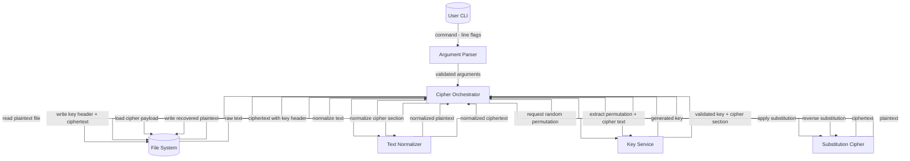
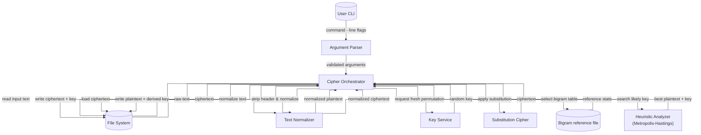
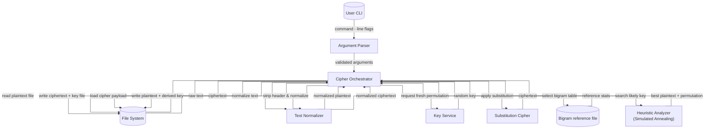

# Kryptografia i kryptoanaliza

## Laboratorium 3

### Grupa 1ID24B

### Autorzy: Kamil Fudala, Andrzej Szczytyński

### Zadanie 1

Zrealizować program implementujący podstawieniowy algorytm szyfrowania.

1. Wybrać dłuższy fragment tekstu w języku angielskim (np. akapit składający się z kilkunastu zdań).
2. Usunąć z niego wszystkie znaki niebędące literami (ograniczenie do 26 liter alfabetu łacińskiego).
3. Zaszyfrować tekst używając wybranego w sposób losowy klucza (tablicy podstawień): permutacji $\hat{\pi}$

#### Diagram przepływu danych



#### Implementacja

- IArgumentParser.cs - Declares the contract for parsing CLI arguments into a strongly typed Arguments object, ensuring
  the application receives validated input options.

```csharp
using Task01.Application.Services;

namespace Task01.Application.Abstractions;

public interface IArgumentParser
{
    Arguments Parse(string[] args);
}
```

- ICipherOrchestrator.cs - Exposes a coordinator interface that orchestrates encryption or decryption workflows based on
  parsed arguments and underlying services.

```csharp
using Task01.Application.Models;
using Task01.Application.Services;

namespace Task01.Application.Abstractions;

public interface ICipherOrchestrator
{
    Task<ProcessingResult> RunAsync(Arguments args);
}
```

- IFileService.cs - Defines abstractions for asynchronous file I/O operations so the application can read plaintexts and
  persist results without coupling to the filesystem.

```csharp
namespace Task01.Application.Abstractions;

public interface IFileService
{
    Task<string> ReadAllTextAsync(string path);
    
    Task WriteAllTextAsync(string path, string content);
}
```

- IKeyService.cs - Specifies methods for generating random substitution keys and extracting embedded permutations from
  cipher payloads.

```csharp
namespace Task01.Application.Abstractions;

public interface IKeyService
{
    string CreatePermutation(string alphabet);
    
    string ExtractPermutation(string rawInput, string alphabet, out string cipherText);
}
```

- ArgumentParser.cs - Implements CLI parsing by validating operation flags and required file paths, producing a
  ready-to-use Arguments record or throwing descriptive errors.

```csharp
using Task01.Application.Abstractions;
using Task01.Application.Services;

namespace Task01.Application.Models;

public sealed class ArgumentParser : IArgumentParser
{
    public Arguments Parse(string[] args)
    {
        if (args is null || args.Length == 0)
        {
            throw new ArgumentException("Missing arguments");
        }

        Operation? mode = null;
        string? inputPath = null;
        string? outputPath = null;

        for (var i = 0; i < args.Length; i++)
        {
            var token = args[i];

            switch (token)
            {
                case "-e":
                case "-d":
                    mode = ResolveMode(token, mode);
                    break;
                case "-i":
                    inputPath = ReadValue(args, ref i, "-i");
                    break;
                case "-o":
                    outputPath = ReadValue(args, ref i, "-o");
                    break;

                default:
                    throw new ArgumentException("Unknown argument " + token);
            }
        }

        return BuildArguments(mode, inputPath, outputPath);
    }
    
    private static Operation ResolveMode(string flag, Operation? current)
    {
        var next = flag == "-e" ? Operation.Encrypt : Operation.Decrypt;

        if (current is null)
        {
            return next;
        }

        return current == next ? current.Value : throw new ArgumentException("Flags -e and -d cannot be used together");
    }
    
    private static string ReadValue(string[] args, ref int index, string flag)
    {
        index++;
        if (index >= args.Length || string.IsNullOrWhiteSpace(args[index]))
        {
            throw new ArgumentException("Missing value for " + flag);
        }

        return args[index];
    }
    
    private static Arguments BuildArguments(Operation? mode, string? inputPath, string? outputPath)
    {
        if (mode is null)
        {
            throw new ArgumentException("Missing -e or -d");
        }

        if (string.IsNullOrWhiteSpace(inputPath))
        {
            throw new ArgumentException("Missing -i <inputfile>");
        }

        if (string.IsNullOrWhiteSpace(outputPath))
        {
            throw new ArgumentException("Missing -o <outputfile>");
        }

        return new Arguments(
            mode.Value,
            inputPath,
            outputPath
        );
    }
}
```

- Operation.cs - Enumerates supported modes (Encrypt/Decrypt) so orchestration code can branch on the requested
  operation in a type-safe way.

```csharp
namespace Task01.Application.Models;

public enum Operation
{
    Encrypt,
    Decrypt
}
```

- ProcessingResult.cs - Represents the exit code and optional message produced by processing, providing a convenience
  property to check for success.

```cshap
namespace Task01.Application.Models;

public readonly record struct ProcessingResult(
    int ExitCode,
    string? Message
)
{
    public bool IsSuccess => ExitCode == 0;
}
```

- Arguments.cs - Immutable record carrying the chosen operation and input/output file paths used by the orchestrator.

```csharp
using Task01.Application.Models;

namespace Task01.Application.Services;

public sealed record Arguments(
    Operation Operation,
    string InputFilePath,
    string OutputFilePath
);
```

- CipherOrchestrator.cs - Coordinates reading input files, normalizing text, generating or extracting keys, delegating
  to the cipher, and writing results while mapping errors to exit codes.

```csharp
using Task01.Application.Abstractions;
using Task01.Application.Models;
using Task01.Domain.Abstractions;

namespace Task01.Application.Services;

public sealed class CipherOrchestrator(
    IFileService fileService,
    IKeyService keyService,
    ITextNormalizer textNormalizer,
    ISubstitutionCipher cipher)
    : ICipherOrchestrator
{
    private const string Alphabet = "ABCDEFGHIJKLMNOPQRSTUVWXYZ";
    
    public async Task<ProcessingResult> RunAsync(Arguments args)
    {
        try
        {
            var rawInput = await fileService.ReadAllTextAsync(args.InputFilePath).ConfigureAwait(false);
            if (args.Operation == Operation.Encrypt)
            {
                var normalized = textNormalizer.Normalize(rawInput);
                var permutation = keyService.CreatePermutation(Alphabet);
                var outputText = cipher.Encrypt(normalized, Alphabet, permutation);
                var builder = new StringBuilder(permutation.Length + Environment.NewLine.Length + outputText.Length);
                builder.AppendLine(permutation);
                builder.Append(outputText);

                await fileService.WriteAllTextAsync(args.OutputFilePath, builder.ToString()).ConfigureAwait(false);
            }
            else
            {
                var permutation = keyService.ExtractPermutation(rawInput, Alphabet, out var cipherSection);

                var normalized = textNormalizer.Normalize(cipherSection);

                var plainText = cipher.Decrypt(normalized, Alphabet, permutation);

                await fileService.WriteAllTextAsync(args.OutputFilePath, plainText).ConfigureAwait(false);
            }

            return new ProcessingResult(0, null);
        }
        catch (FormatException)
        {
            return new ProcessingResult(3, "Invalid key");
        }
        catch (FileNotFoundException)
        {
            return new ProcessingResult(2, "File error");
        }
        catch (DirectoryNotFoundException)
        {
            return new ProcessingResult(2, "File error");
        }
        catch (UnauthorizedAccessException)
        {
            return new ProcessingResult(2, "File error");
        }
        catch (IOException)
        {
            return new ProcessingResult(2, "File error");
        }
        catch (Exception)
        {
            return new ProcessingResult(99, "Unexpected error");
        }
    }
}
```

- ISubstitutionCipher.cs - Describes encrypt/decrypt operations for a substitution cipher implementation.

```csharp
namespace Task01.Domain.Abstractions;

public interface ISubstitutionCipher
{
    string Encrypt(string normalizedText, string alphabet, string permutation);

    string Decrypt(string normalizedText, string alphabet, string permutation);
}
```

- ITextNormalizer.cs - Contract for transforming raw text into normalized uppercase alphabet-only strings.

```csharp
namespace Task01.Domain.Abstractions;

public interface ITextNormalizer
{
    string Normalize(string input);
}
```

- SubstitutionCipher.cs - Implements monoalphabetic substitution by mapping characters via lookup dictionaries and
  validating alphabet consistency.

```csharp
using Task01.Domain.Abstractions;

namespace Task01.Domain.Services;

public sealed class SubstitutionCipher : ISubstitutionCipher
{
    public string Encrypt(string normalizedText, string alphabet, string permutation)
    {
        return Transform(normalizedText, alphabet, permutation, true);
    }


    public string Decrypt(string normalizedText, string alphabet, string permutation)
    {
        return Transform(normalizedText, alphabet, permutation, false);
    }
    
    private static string Transform(string text, string alphabet, string permutation, bool encrypt)
    {
        if (string.IsNullOrEmpty(text) || string.IsNullOrEmpty(alphabet) || string.IsNullOrEmpty(permutation))
        {
            return string.Empty;
        }

        if (alphabet.Length != permutation.Length)
        {
            throw new InvalidOperationException("Alphabet and permutation must be the same length");
        }

        var source = encrypt ? alphabet : permutation;
        var target = encrypt ? permutation : alphabet;

        var lookup = BuildLookup(source, target);

        var span = text.AsSpan();
        var result = new char[span.Length];

        for (var i = 0; i < span.Length; i++)
        {
            var c = span[i];

            if (!lookup.TryGetValue(c, out var mapped))
            {
                throw new InvalidOperationException("Character not found in substitution alphabet");
            }

            result[i] = mapped;
        }

        return new string(result);
    }

    private static Dictionary<char, char> BuildLookup(string source, string target)
    {
        var lookup = new Dictionary<char, char>(source.Length);

        for (var i = 0; i < source.Length; i++)
        {
            lookup[source[i]] = target[i];
        }

        return lookup;
    }
}
```

- TextNormalizer.cs - Filters input down to alphabetic characters and converts them to uppercase to produce clean
  cipher-ready text.

```csharp
using Task01.Domain.Abstractions;

namespace Task01.Domain.Services;

public sealed class TextNormalizer : ITextNormalizer
{
    public string Normalize(string input)
    {
        if (string.IsNullOrEmpty(input))
        {
            return string.Empty;
        }

        var span = input.AsSpan();
        var sb = new StringBuilder(span.Length);

        foreach (var c in span)
        {
            if (c is (< 'A' or > 'Z') and (< 'a' or > 'z'))
            {
                continue;
            }

            var upper = char.ToUpperInvariant(c);
            sb.Append(upper);
        }

        return sb.ToString();
    }
}
```

- FileService.cs - Provides asynchronous UTF-8 file reading and writing with buffered streams for efficient disk access.

```csharp
using Task01.Application.Abstractions;

namespace Task01.Infrastructure.Services;

public sealed class FileService : IFileService
{
    private static readonly Encoding Utf8NoBom = new UTF8Encoding(false);
    
    public async Task<string> ReadAllTextAsync(string path)
    {
        const FileOptions fileOptions = FileOptions.Asynchronous | FileOptions.SequentialScan;

        await using var fs = new FileStream(
            path,
            FileMode.Open,
            FileAccess.Read,
            FileShare.Read,
            4096,
            fileOptions
        );

        using var reader = new StreamReader(fs, Encoding.UTF8, true);

        return await reader.ReadToEndAsync().ConfigureAwait(false);
    }
    
    public async Task WriteAllTextAsync(string path, string content)
    {
        const FileOptions fileOptions = FileOptions.Asynchronous | FileOptions.SequentialScan;

        await using var fs = new FileStream(
            path,
            FileMode.Create,
            FileAccess.Write,
            FileShare.None,
            4096,
            fileOptions
        );

        await using var writer = new StreamWriter(fs, Utf8NoBom);

        await writer.WriteAsync(content.AsMemory()).ConfigureAwait(false);
        await writer.FlushAsync().ConfigureAwait(false);
    }
}
```

- KeyService.cs - Generates random permutations of the alphabet using cryptographically secure RNG and
  extracts/validates permutation headers from cipher text.

```csharp
using System.Security.Cryptography;
using Task01.Application.Abstractions;

namespace Task01.Infrastructure.Services;

public sealed class KeyService : IKeyService
{
    public string CreatePermutation(string alphabet)
    {
        if (string.IsNullOrEmpty(alphabet))
        {
            throw new FormatException("Alphabet is empty");
        }

        var chars = alphabet.ToCharArray();
        for (var i = chars.Length - 1; i > 0; i--)
        {
            var j = RandomNumberGenerator.GetInt32(i + 1);
            (chars[i], chars[j]) = (chars[j], chars[i]);
        }

        return new string(chars);
    }
    
    public string ExtractPermutation(string rawInput, string alphabet, out string cipherText)
    {
        if (string.IsNullOrEmpty(alphabet))
        {
            throw new FormatException("Alphabet is empty");
        }

        if (string.IsNullOrEmpty(rawInput))
        {
            throw new FormatException("Key not found");
        }

        var span = rawInput.AsSpan();
        var keySpan = ReadFirstLine(span, out var remainder);

        keySpan = TrimWhite(keySpan);
        if (keySpan.IsEmpty)
        {
            throw new FormatException("Key not found");
        }

        var permutation = new string(keySpan).ToUpperInvariant();

        if (!IsValidPermutation(permutation, alphabet))
        {
            throw new FormatException("Key is not a valid permutation");
        }

        cipherText = remainder.Length == 0 ? string.Empty : remainder.ToString();

        return permutation;
    }
    
    private static ReadOnlySpan<char> ReadFirstLine(ReadOnlySpan<char> value, out ReadOnlySpan<char> remainder)
    {
        var index = 0;
        while (index < value.Length && value[index] is not ('\r' or '\n'))
        {
            index++;
        }

        if (index == value.Length)
        {
            throw new FormatException("Cipher text not found");
        }

        var line = value[..index];
        var next = index;

        if (next < value.Length && value[next] == '\r')
        {
            next++;
            if (next < value.Length && value[next] == '\n')
            {
                next++;
            }
        }
        else if (next < value.Length && value[next] == '\n')
        {
            next++;
        }

        while (next < value.Length && value[next] is '\r' or '\n')
        {
            next++;
        }

        remainder = next < value.Length ? value[next..] : ReadOnlySpan<char>.Empty;
        return line;
    }

    private static ReadOnlySpan<char> TrimWhite(ReadOnlySpan<char> value)
    {
        var start = 0;
        var end = value.Length - 1;

        while (start <= end && char.IsWhiteSpace(value[start]))
        {
            start++;
        }

        while (end >= start && char.IsWhiteSpace(value[end]))
        {
            end--;
        }

        return start > end ? ReadOnlySpan<char>.Empty : value.Slice(start, end - start + 1);
    }

    private static bool IsValidPermutation(string permutation, string alphabet)
    {
        if (permutation.Length != alphabet.Length)
        {
            return false;
        }

        var expected = new HashSet<char>(alphabet.Length);
        foreach (var ch in alphabet)
        {
            expected.Add(ch);
        }

        var seen = new HashSet<char>(permutation.Length);
        if (permutation.Any(ch => !expected.Contains(ch) || !seen.Add(ch)))
        {
            return false;
        }

        return seen.Count == expected.Count;
    }
}
```

- GlobalUsings.cs - Consolidates common namespace imports for the Task01 project to reduce boilerplate.

```csharp
global using System;
global using System.Collections.Generic;
global using System.Globalization;
global using System.IO;
global using System.Text;
global using System.Threading.Tasks;
```

- Program.cs - Bootstraps Task01 services, parses CLI input, executes the orchestrator, and reports exit codes.

```csharp
#pragma warning disable CA1859

using Task01.Application.Abstractions;
using Task01.Application.Models;
using Task01.Application.Services;
using Task01.Domain.Abstractions;
using Task01.Domain.Services;
using Task01.Infrastructure.Services;

CultureInfo.CurrentCulture = CultureInfo.InvariantCulture;
CultureInfo.CurrentUICulture = CultureInfo.InvariantCulture;

IFileService fileService = new FileService();
IKeyService keyService = new KeyService();

ITextNormalizer textNormalizer = new TextNormalizer();
ISubstitutionCipher cipher = new SubstitutionCipher();

ICipherOrchestrator orchestrator = new CipherOrchestrator(
    fileService,
    keyService,
    textNormalizer,
    cipher
);

IArgumentParser parser = new ArgumentParser();

ProcessingResult result;

try
{
    var parsed = parser.Parse(args);

    result = await orchestrator.RunAsync(parsed);
}
catch (ArgumentException ex)
{
    result = new ProcessingResult(1, ex.Message);
}
catch (Exception)
{
    result = new ProcessingResult(99, "Unexpected error");
}

if (!result.IsSuccess && !string.IsNullOrEmpty(result.Message))
{
    await Console.Error.WriteLineAsync(result.Message);
}

Environment.ExitCode = result.ExitCode;
```

#### Wyniki

Wynik zaszyfrowania stanowi długi ciąg liter A-Z bez znaków niealfabetycznych, ponieważ wejście zostało najpierw
znormalizowane, a następnie każdą literę zastąpiono zgodnie z losową permutacją klucza.

```
➜  Task01 (main) dotnet run -- \                                                                            ✭
  -e \
  -i Samples/plaintext.txt \
  -o Samples/cipher.txt

➜  Task01 (main) diff Samples/plaintext.txt  Samples/cipher.txt                                             ✭
1,53c1,2
< For several years I’ve lived in an old building where three lime trees lean over the façade and dust the steps each June. In the early hours, before the first tram groans awake, the street is as thin as paper. You can hear a newspaper being unfolded in the kiosk, the creak of a bicycle rack, the faint buzz of a sign that was never properly fixed. A bakery opens across the way, and heat rolls out in a small, invisible wave. People arrive with soft voices and exact change, and for a moment we all pretend we know each other better than we do.
< 
< The baker has a habit of talking with his elbows on the counter, as if conversation needed support. He asks about cracked windows and loose tiles, about the plants we try to keep alive on narrow sills. When the sky is the color of wet stone, he switches off the bright strip above the bread and turns on a lamp in the corner. The loaves look warmer that way, and the line moves a little slower, as if we’re all visiting instead of buying. Flour drifts onto sleeves and stays there like a polite remark.
< 
< Across the street the post office clings to the idea of order. The door breathes out a draft when you pull it, and the bell makes a tired sound that must have been cheerful once. The clerk is tall and bony, and she straightens her glasses the way a conductor might raise a baton. People come with parcels tied in string, addresses written in careful block letters. Sometimes you can tell a package carries something that weighs more in memory than on a scale—an old scarf, a family photograph, a jar of jam wrapped in newspaper.
< 
< Behind my building a courtyard makes a shallow bowl of air. In summer the sound collects there: a radio playing a game, a dog who believes the world needs a warning once every hour, a child counting the steps to the basement door. Neighbors move flower boxes, adjust folding chairs, patch a hose with tape that won’t last. One August evening we hung a white sheet between the windows and projected a film. The breeze lifted the fabric now and then, and faces on the screen swelled and thinned, as if the story were breathing on its own.
< 
< I walk to the river from habit, not purpose. The water suffers our reflections for a moment and then forgets them. Anglers stand on the wooden pier and argue about the correct names for silence. Couples take photos in which the background is asked to do most of the work. In winter the river has the stubborn look of a creature that would rather sleep. In summer it’s harder to look at, full of light that loosens the mind.
< 
< My office is a repurposed warehouse where bolts of fabric used to live. The floors remember wheels and grit. During coffee breaks we go outside and invent strange ways to measure time—counting cyclists, watching a cloud clear the edge of a crane, noting the exact second a traffic light hesitates between colors. Ideas seem to appear in the space between the door and the curb. I’ve learned to keep a pen in my pocket for those ten yards that refuse to be ordinary.
< 
< The market is at its best when the sky threatens rain and nobody believes it. Stalls glow with their own logic: apples arranged by shade, cheese cut into patient cubes, herbs bound into dark, fragrant fists. The sellers greet regulars by name and new faces by advice. “These tomatoes for salad, those for cooking,” a woman says, passing a slice over the pile as if knighting it. A used-book table leans under the weight of paperbacks that keep coming back, like old songs you thought you’d forgotten.
< 
< On my floor, neighbors keep the building alive by sustaining small rituals. Mrs. Novak waters her plants at seven and asks whether I need sugar or an opinion. The man across the hall shakes dust from rugs with a seriousness that makes you stand straighter. We meet on the stairs and talk about weather and buses, about a bulb that flickers and a hinge that needs oil. These tiny negotiations are how a place agrees to be shared.
< 
< I have a fondness for the train station most people call ugly. It’s a concrete riddle that has solved itself in the only way it knows. The departure board refuses to hurry. Names of towns appear and vanish as if they were shy. People practice waiting: standing tall with a new coat, resting with caution on a suitcase, pacing in measured loops to keep the body from arguing. In the café on the platform, the owner pours tea that is never hot enough and coffee that is always too strong, and both taste right because they are what travelers expect.
< 
< In the evening I sometimes duck into a small café where no one is in a rush to prove anything. The room is lined with photographs taken on film, which means the light has a history of being trusted. The barista talks about paper straws and compostable cups, not with zealotry but with the steady voice of a person who likes to get details correct. From the window I watch the city draw threads of light behind the trams. When it rains, the glass becomes a gentle drum, and conversations fall into tempo without noticing.
< 
< Once a year the street pretends to be a village. Tables appear where cars usually rest, a pot of soup arrives in a hand that isn’t sure it’s strong enough, a cake inherits a plate from the 1980s. People who have nodded for years learn each other’s first names. A child explains the rules of a game they have just invented, and the rules are better than most. Someone tunes a guitar and produces a song that is almost the same as every other song, which is why it works.
< 
< Autumn doesn’t close the city; it rearranges it. Chairs in front of cafés wear blankets like vests. The parks practice how to be noisy when the leaves break underfoot. Runners slice the cool air and steam like small locomotives at every corner. The sky arrives early and sets down in a heavy way, but windows answer with squares of warmth. It’s the season when you can leave a library with a stack of books and the feeling that you have at last negotiated fair terms with the day.
< 
< I like to leave for a few days when routine starts to show its seams. In smaller towns the clock over the square speaks with authority, and the bakery line is the newspaper you actually read. Strangers look up when you enter a room because they need to take stock of the air. Time there puts on slippers. It speeds up only when the bus sighs at the stop, as if to prove it can. Coming home, I miss the slowness for exactly one evening, then remember that calm is sometimes a decision rather than a landscape.
< 
< At home, order is the smallest luxury I can afford. A mug returned to its shelf, the lamp turned on at the right moment, the shirt hung on a chair to dry—these are victories that never make the news. In winter I only open the radiator when the windows blur with breath. In summer I leave them open long after midnight, letting the courtyard collect laughter that the street refuses to keep. The voices blend into something harmless and oddly kind.
< 
< Every now and then a friend from childhood calls and asks if I still know how to skate. I say yes because the body remembers in a way the mind admires. We meet at a rink that smells like rubber and cold metal. We move in wide circles, dodging beginners who stare at their feet and others who spin without apology. Later my legs burn and the world seems properly attached to its own axis again. Some skills feel like messages from a previous version of yourself who had the good sense to practice.
< 
< In December the city becomes a map of hesitant stars. Not every bulb works, and that’s fine. People argue pleasantly about the arrangement of ornaments, as if tradition were a polite guest who appreciates a little debate. The market smells like cloves and honey. The air nibbles at pockets and noses. You can measure kindness by how often someone steadies a door or lifts a bag up a step. The season makes small helpers of almost everyone.
< 
< I think a lot about how a city is a net of minor stories. The major ones rarely visit. What stays are narrow habits: a woman on the first floor waving at schoolchildren; a radio in the kiosk that insists on the same hour for the same voice; a courtyard cat that chooses a different car for sleep each week. These details teach you the rhythm that outlives headlines. You can hear it with your eyes closed if you walk the same block twice.
< 
< Spring turns the stairwell dust into a floating script. Windows ask politely for cleaning. Lines of laundry appear like flags of practicality. Children draw impossible houses and suns with more rays than the science requires. Adults, pretending not to watch, revise their errands so they can slow down by the chalk. Mornings brighten as if they had been practicing in secret. Even the river looks less certain about its refusal to be pleased.
< 
< I don’t know whether I’ll ever move away. The idea arrives sometimes like a polite stranger and waits in the doorway. For now I’m happy with the sound of the tram, the smell of bread, and the sight of the water that keeps going even when no one is cheering. An older neighbor told me once that staying is a skill, the twin of leaving. It was the kind of sentence that felt larger than the room and didn’t need to be written down.
< 
< At night the city never goes silent; it changes key. Windows grow warmer while the streets cool. A single laugh escapes from an alley; a dog objects to the moon; someone walks home and forgives the day for having too much to say. I stand on the balcony and let my hands rest on cold metal. The world shivers but holds. In the morning I’ll wake under the trees again and find the street as I left it, almost. That “almost” is the reason there’s always more to notice.
< 
< On weekends I visit a museum that is better than its budget. Volunteers smile as if the exhibits were guests they had invited personally. A small room holds a temporary show about maps and the errors that became standard. Labels admit uncertainty with a kind of grace. I love the corner where drafts are pinned beside the final versions, proof that correction can be a kind of kindness to the future.
< 
< There’s a bus route I take when I want the city to narrate itself. It climbs a hill, curls around a park, and sighs past an industrial lot where weeds keep a stubborn schedule. You see into kitchens for a second, enough to know someone is frying onions or reheating soup. You catch the comical dignity of dogs who believe leashes are part of fashion. You witness arguments without words: a shrug, a shake of the head, an apology delivered by the way a hand puts down a bag.
< 
< The library’s reading room is a sheltered sea. Pages turn at a pace that keeps faith with breath. A man in a blue sweater takes notes with a pencil sharpened to ceremony. A student annotates a textbook in tiny letters that look like careful weather. When the clock clicks over to the next minute, the sound is softer than you expect, as if the building wanted time to feel less abrupt.
< 
< If I had to explain why I stay, I’d say it’s because the city answers in complete sentences. It doesn’t always agree, but it listens. It accepts that a morning can be spoiled and still be part of a good week. It remembers people who have gone without turning them into statues. It forgives, up to a point, and then requests improvement, also up to a point. We meet halfway and revise as needed.
< 
< Some evenings I walk without a destination, and the streets assemble themselves as I go. A shopkeeper waters a plant with the seriousness of a ritual. A busker tunes a guitar that refuses to cooperate. A couple laughs too loudly and then notices, and then laughs again, smaller and more honest. A window glows in an upper floor, and a hand moves across a table, and a glass catches the light like a small piece of permission.
< 
< When rain comes hard, the city behaves as though it had been expecting it. Drains swallow and complain. Umbrellas multiply like opinions. Shoes line up on thresholds, and floors accept the temporary indignity of mud. Later the sky loosens, and the wet streets hold a second city made entirely of reflections. Walking home, I sometimes try to step only on the copies of the paving stones, just to check that the evening understands play.
< 
< I’ve learned to carry a pen, a book, and a coin for luck. The pen is for the idea that refuses to wait, the book is for lines that teach patience, the coin is for the jar by the register that promises nothing and keeps that promise. None of these things are necessary in the strict sense, but they help keep the day in one piece. And most days, one piece is exactly the right size.
\ No newline at end of file
---
> QVKAULOCJIDSYWXGRFBHZTMENP
> LXFBUTUFQSNUQFBJTUSJTUAJWQWXSAVZJSAJWOMCUFUHCFUUSJYUHFUUBSUQWXTUFHCULQQAUQWAAZBHHCUBHUGBUQKCIZWUJWHCUUQFSNCXZFBVULXFUHCULJFBHHFQYOFXQWBQMQDUHCUBHFUUHJBQBHCJWQBGQGUFNXZKQWCUQFQWUMBGQGUFVUJWOZWLXSAUAJWHCUDJXBDHCUKFUQDXLQVJKNKSUFQKDHCULQJWHVZPPXLQBJOWHCQHMQBWUTUFGFXGUFSNLJEUAQVQDUFNXGUWBQKFXBBHCUMQNQWACUQHFXSSBXZHJWQBYQSSJWTJBJVSUMQTUGUXGSUQFFJTUMJHCBXLHTXJKUBQWAUEQKHKCQWOUQWALXFQYXYUWHMUQSSGFUHUWAMUDWXMUQKCXHCUFVUHHUFHCQWMUAXHCUVQDUFCQBQCQVJHXLHQSDJWOMJHCCJBUSVXMBXWHCUKXZWHUFQBJLKXWTUFBQHJXWWUUAUABZGGXFHCUQBDBQVXZHKFQKDUAMJWAXMBQWASXXBUHJSUBQVXZHHCUGSQWHBMUHFNHXDUUGQSJTUXWWQFFXMBJSSBMCUWHCUBDNJBHCUKXSXFXLMUHBHXWUCUBMJHKCUBXLLHCUVFJOCHBHFJGQVXTUHCUVFUQAQWAHZFWBXWQSQYGJWHCUKXFWUFHCUSXQTUBSXXDMQFYUFHCQHMQNQWAHCUSJWUYXTUBQSJHHSUBSXMUFQBJLMUFUQSSTJBJHJWOJWBHUQAXLVZNJWOLSXZFAFJLHBXWHXBSUUTUBQWABHQNBHCUFUSJDUQGXSJHUFUYQFDQKFXBBHCUBHFUUHHCUGXBHXLLJKUKSJWOBHXHCUJAUQXLXFAUFHCUAXXFVFUQHCUBXZHQAFQLHMCUWNXZGZSSJHQWAHCUVUSSYQDUBQHJFUABXZWAHCQHYZBHCQTUVUUWKCUUFLZSXWKUHCUKSUFDJBHQSSQWAVXWNQWABCUBHFQJOCHUWBCUFOSQBBUBHCUMQNQKXWAZKHXFYJOCHFQJBUQVQHXWGUXGSUKXYUMJHCGQFKUSBHJUAJWBHFJWOQAAFUBBUBMFJHHUWJWKQFULZSVSXKDSUHHUFBBXYUHJYUBNXZKQWHUSSQGQKDQOUKQFFJUBBXYUHCJWOHCQHMUJOCBYXFUJWYUYXFNHCQWXWQBKQSUQWXSABKQFLQLQYJSNGCXHXOFQGCQIQFXLIQYMFQGGUAJWWUMBGQGUFVUCJWAYNVZJSAJWOQKXZFHNQFAYQDUBQBCQSSXMVXMSXLQJFJWBZYYUFHCUBXZWAKXSSUKHBHCUFUQFQAJXGSQNJWOQOQYUQAXOMCXVUSJUTUBHCUMXFSAWUUABQMQFWJWOXWKUUTUFNCXZFQKCJSAKXZWHJWOHCUBHUGBHXHCUVQBUYUWHAXXFWUJOCVXFBYXTULSXMUFVXEUBQAIZBHLXSAJWOKCQJFBGQHKCQCXBUMJHCHQGUHCQHMXWHSQBHXWUQZOZBHUTUWJWOMUCZWOQMCJHUBCUUHVUHMUUWHCUMJWAXMBQWAGFXIUKHUAQLJSYHCUVFUUPUSJLHUAHCULQVFJKWXMQWAHCUWQWALQKUBXWHCUBKFUUWBMUSSUAQWAHCJWWUAQBJLHCUBHXFNMUFUVFUQHCJWOXWJHBXMWJMQSDHXHCUFJTUFLFXYCQVJHWXHGZFGXBUHCUMQHUFBZLLUFBXZFFULSUKHJXWBLXFQYXYUWHQWAHCUWLXFOUHBHCUYQWOSUFBBHQWAXWHCUMXXAUWGJUFQWAQFOZUQVXZHHCUKXFFUKHWQYUBLXFBJSUWKUKXZGSUBHQDUGCXHXBJWMCJKCHCUVQKDOFXZWAJBQBDUAHXAXYXBHXLHCUMXFDJWMJWHUFHCUFJTUFCQBHCUBHZVVXFWSXXDXLQKFUQHZFUHCQHMXZSAFQHCUFBSUUGJWBZYYUFJHBCQFAUFHXSXXDQHLZSSXLSJOCHHCQHSXXBUWBHCUYJWAYNXLLJKUJBQFUGZFGXBUAMQFUCXZBUMCUFUVXSHBXLLQVFJKZBUAHXSJTUHCULSXXFBFUYUYVUFMCUUSBQWAOFJHAZFJWOKXLLUUVFUQDBMUOXXZHBJAUQWAJWTUWHBHFQWOUMQNBHXYUQBZFUHJYUKXZWHJWOKNKSJBHBMQHKCJWOQKSXZAKSUQFHCUUAOUXLQKFQWUWXHJWOHCUUEQKHBUKXWAQHFQLLJKSJOCHCUBJHQHUBVUHMUUWKXSXFBJAUQBBUUYHXQGGUQFJWHCUBGQKUVUHMUUWHCUAXXFQWAHCUKZFVJTUSUQFWUAHXDUUGQGUWJWYNGXKDUHLXFHCXBUHUWNQFABHCQHFULZBUHXVUXFAJWQFNHCUYQFDUHJBQHJHBVUBHMCUWHCUBDNHCFUQHUWBFQJWQWAWXVXANVUSJUTUBJHBHQSSBOSXMMJHCHCUJFXMWSXOJKQGGSUBQFFQWOUAVNBCQAUKCUUBUKZHJWHXGQHJUWHKZVUBCUFVBVXZWAJWHXAQFDLFQOFQWHLJBHBHCUBUSSUFBOFUUHFUOZSQFBVNWQYUQWAWUMLQKUBVNQATJKUHCUBUHXYQHXUBLXFBQSQAHCXBULXFKXXDJWOQMXYQWBQNBGQBBJWOQBSJKUXTUFHCUGJSUQBJLDWJOCHJWOJHQZBUAVXXDHQVSUSUQWBZWAUFHCUMUJOCHXLGQGUFVQKDBHCQHDUUGKXYJWOVQKDSJDUXSABXWOBNXZHCXZOCHNXZALXFOXHHUWXWYNLSXXFWUJOCVXFBDUUGHCUVZJSAJWOQSJTUVNBZBHQJWJWOBYQSSFJHZQSBYFBWXTQDMQHUFBCUFGSQWHBQHBUTUWQWAQBDBMCUHCUFJWUUABZOQFXFQWXGJWJXWHCUYQWQKFXBBHCUCQSSBCQDUBAZBHLFXYFZOBMJHCQBUFJXZBWUBBHCQHYQDUBNXZBHQWABHFQJOCHUFMUYUUHXWHCUBHQJFBQWAHQSDQVXZHMUQHCUFQWAVZBUBQVXZHQVZSVHCQHLSJKDUFBQWAQCJWOUHCQHWUUABXJSHCUBUHJWNWUOXHJQHJXWBQFUCXMQGSQKUQOFUUBHXVUBCQFUAJCQTUQLXWAWUBBLXFHCUHFQJWBHQHJXWYXBHGUXGSUKQSSZOSNJHBQKXWKFUHUFJAASUHCQHCQBBXSTUAJHBUSLJWHCUXWSNMQNJHDWXMBHCUAUGQFHZFUVXQFAFULZBUBHXCZFFNWQYUBXLHXMWBQGGUQFQWATQWJBCQBJLHCUNMUFUBCNGUXGSUGFQKHJKUMQJHJWOBHQWAJWOHQSSMJHCQWUMKXQHFUBHJWOMJHCKQZHJXWXWQBZJHKQBUGQKJWOJWYUQBZFUASXXGBHXDUUGHCUVXANLFXYQFOZJWOJWHCUKQLXWHCUGSQHLXFYHCUXMWUFGXZFBHUQHCQHJBWUTUFCXHUWXZOCQWAKXLLUUHCQHJBQSMQNBHXXBHFXWOQWAVXHCHQBHUFJOCHVUKQZBUHCUNQFUMCQHHFQTUSUFBUEGUKHJWHCUUTUWJWOJBXYUHJYUBAZKDJWHXQBYQSSKQLMCUFUWXXWUJBJWQFZBCHXGFXTUQWNHCJWOHCUFXXYJBSJWUAMJHCGCXHXOFQGCBHQDUWXWLJSYMCJKCYUQWBHCUSJOCHCQBQCJBHXFNXLVUJWOHFZBHUAHCUVQFJBHQHQSDBQVXZHGQGUFBHFQMBQWAKXYGXBHQVSUKZGBWXHMJHCPUQSXHFNVZHMJHCHCUBHUQANTXJKUXLQGUFBXWMCXSJDUBHXOUHAUHQJSBKXFFUKHLFXYHCUMJWAXMJMQHKCHCUKJHNAFQMHCFUQABXLSJOCHVUCJWAHCUHFQYBMCUWJHFQJWBHCUOSQBBVUKXYUBQOUWHSUAFZYQWAKXWTUFBQHJXWBLQSSJWHXHUYGXMJHCXZHWXHJKJWOXWKUQNUQFHCUBHFUUHGFUHUWABHXVUQTJSSQOUHQVSUBQGGUQFMCUFUKQFBZBZQSSNFUBHQGXHXLBXZGQFFJTUBJWQCQWAHCQHJBWHBZFUJHBBHFXWOUWXZOCQKQDUJWCUFJHBQGSQHULFXYHCUBGUXGSUMCXCQTUWXAAUALXFNUQFBSUQFWUQKCXHCUFBLJFBHWQYUBQKCJSAUEGSQJWBHCUFZSUBXLQOQYUHCUNCQTUIZBHJWTUWHUAQWAHCUFZSUBQFUVUHHUFHCQWYXBHBXYUXWUHZWUBQOZJHQFQWAGFXAZKUBQBXWOHCQHJBQSYXBHHCUBQYUQBUTUFNXHCUFBXWOMCJKCJBMCNJHMXFDBQZHZYWAXUBWHKSXBUHCUKJHNJHFUQFFQWOUBJHKCQJFBJWLFXWHXLKQLBMUQFVSQWDUHBSJDUTUBHBHCUGQFDBGFQKHJKUCXMHXVUWXJBNMCUWHCUSUQTUBVFUQDZWAUFLXXHFZWWUFBBSJKUHCUKXXSQJFQWABHUQYSJDUBYQSSSXKXYXHJTUBQHUTUFNKXFWUFHCUBDNQFFJTUBUQFSNQWABUHBAXMWJWQCUQTNMQNVZHMJWAXMBQWBMUFMJHCBRZQFUBXLMQFYHCJHBHCUBUQBXWMCUWNXZKQWSUQTUQSJVFQFNMJHCQBHQKDXLVXXDBQWAHCULUUSJWOHCQHNXZCQTUQHSQBHWUOXHJQHUALQJFHUFYBMJHCHCUAQNJSJDUHXSUQTULXFQLUMAQNBMCUWFXZHJWUBHQFHBHXBCXMJHBBUQYBJWBYQSSUFHXMWBHCUKSXKDXTUFHCUBRZQFUBGUQDBMJHCQZHCXFJHNQWAHCUVQDUFNSJWUJBHCUWUMBGQGUFNXZQKHZQSSNFUQABHFQWOUFBSXXDZGMCUWNXZUWHUFQFXXYVUKQZBUHCUNWUUAHXHQDUBHXKDXLHCUQJFHJYUHCUFUGZHBXWBSJGGUFBJHBGUUABZGXWSNMCUWHCUVZBBJOCBQHHCUBHXGQBJLHXGFXTUJHKQWKXYJWOCXYUJYJBBHCUBSXMWUBBLXFUEQKHSNXWUUTUWJWOHCUWFUYUYVUFHCQHKQSYJBBXYUHJYUBQAUKJBJXWFQHCUFHCQWQSQWABKQGUQHCXYUXFAUFJBHCUBYQSSUBHSZEZFNJKQWQLLXFAQYZOFUHZFWUAHXJHBBCUSLHCUSQYGHZFWUAXWQHHCUFJOCHYXYUWHHCUBCJFHCZWOXWQKCQJFHXAFNHCUBUQFUTJKHXFJUBHCQHWUTUFYQDUHCUWUMBJWMJWHUFJXWSNXGUWHCUFQAJQHXFMCUWHCUMJWAXMBVSZFMJHCVFUQHCJWBZYYUFJSUQTUHCUYXGUWSXWOQLHUFYJAWJOCHSUHHJWOHCUKXZFHNQFAKXSSUKHSQZOCHUFHCQHHCUBHFUUHFULZBUBHXDUUGHCUTXJKUBVSUWAJWHXBXYUHCJWOCQFYSUBBQWAXAASNDJWAUTUFNWXMQWAHCUWQLFJUWALFXYKCJSACXXAKQSSBQWAQBDBJLJBHJSSDWXMCXMHXBDQHUJBQNNUBVUKQZBUHCUVXANFUYUYVUFBJWQMQNHCUYJWAQAYJFUBMUYUUHQHQFJWDHCQHBYUSSBSJDUFZVVUFQWAKXSAYUHQSMUYXTUJWMJAUKJFKSUBAXAOJWOVUOJWWUFBMCXBHQFUQHHCUJFLUUHQWAXHCUFBMCXBGJWMJHCXZHQGXSXONSQHUFYNSUOBVZFWQWAHCUMXFSABUUYBGFXGUFSNQHHQKCUAHXJHBXMWQEJBQOQJWBXYUBDJSSBLUUSSJDUYUBBQOUBLFXYQGFUTJXZBTUFBJXWXLNXZFBUSLMCXCQAHCUOXXABUWBUHXGFQKHJKUJWAUKUYVUFHCUKJHNVUKXYUBQYQGXLCUBJHQWHBHQFBWXHUTUFNVZSVMXFDBQWAHCQHBLJWUGUXGSUQFOZUGSUQBQWHSNQVXZHHCUQFFQWOUYUWHXLXFWQYUWHBQBJLHFQAJHJXWMUFUQGXSJHUOZUBHMCXQGGFUKJQHUBQSJHHSUAUVQHUHCUYQFDUHBYUSSBSJDUKSXTUBQWACXWUNHCUQJFWJVVSUBQHGXKDUHBQWAWXBUBNXZKQWYUQBZFUDJWAWUBBVNCXMXLHUWBXYUXWUBHUQAJUBQAXXFXFSJLHBQVQOZGQBHUGHCUBUQBXWYQDUBBYQSSCUSGUFBXLQSYXBHUTUFNXWUJHCJWDQSXHQVXZHCXMQKJHNJBQWUHXLYJWXFBHXFJUBHCUYQIXFXWUBFQFUSNTJBJHMCQHBHQNBQFUWQFFXMCQVJHBQMXYQWXWHCULJFBHLSXXFMQTJWOQHBKCXXSKCJSAFUWQFQAJXJWHCUDJXBDHCQHJWBJBHBXWHCUBQYUCXZFLXFHCUBQYUTXJKUQKXZFHNQFAKQHHCQHKCXXBUBQAJLLUFUWHKQFLXFBSUUGUQKCMUUDHCUBUAUHQJSBHUQKCNXZHCUFCNHCYHCQHXZHSJTUBCUQASJWUBNXZKQWCUQFJHMJHCNXZFUNUBKSXBUAJLNXZMQSDHCUBQYUVSXKDHMJKUBGFJWOHZFWBHCUBHQJFMUSSAZBHJWHXQLSXQHJWOBKFJGHMJWAXMBQBDGXSJHUSNLXFKSUQWJWOSJWUBXLSQZWAFNQGGUQFSJDULSQOBXLGFQKHJKQSJHNKCJSAFUWAFQMJYGXBBJVSUCXZBUBQWABZWBMJHCYXFUFQNBHCQWHCUBKJUWKUFURZJFUBQAZSHBGFUHUWAJWOWXHHXMQHKCFUTJBUHCUJFUFFQWABBXHCUNKQWBSXMAXMWVNHCUKCQSDYXFWJWOBVFJOCHUWQBJLHCUNCQAVUUWGFQKHJKJWOJWBUKFUHUTUWHCUFJTUFSXXDBSUBBKUFHQJWQVXZHJHBFULZBQSHXVUGSUQBUAJAXWHDWXMMCUHCUFJSSUTUFYXTUQMQNHCUJAUQQFFJTUBBXYUHJYUBSJDUQGXSJHUBHFQWOUFQWAMQJHBJWHCUAXXFMQNLXFWXMJYCQGGNMJHCHCUBXZWAXLHCUHFQYHCUBYUSSXLVFUQAQWAHCUBJOCHXLHCUMQHUFHCQHDUUGBOXJWOUTUWMCUWWXXWUJBKCUUFJWOQWXSAUFWUJOCVXFHXSAYUXWKUHCQHBHQNJWOJBQBDJSSHCUHMJWXLSUQTJWOJHMQBHCUDJWAXLBUWHUWKUHCQHLUSHSQFOUFHCQWHCUFXXYQWAAJAWHWUUAHXVUMFJHHUWAXMWQHWJOCHHCUKJHNWUTUFOXUBBJSUWHJHKCQWOUBDUNMJWAXMBOFXMMQFYUFMCJSUHCUBHFUUHBKXXSQBJWOSUSQZOCUBKQGUBLFXYQWQSSUNQAXOXVIUKHBHXHCUYXXWBXYUXWUMQSDBCXYUQWALXFOJTUBHCUAQNLXFCQTJWOHXXYZKCHXBQNJBHQWAXWHCUVQSKXWNQWASUHYNCQWABFUBHXWKXSAYUHQSHCUMXFSABCJTUFBVZHCXSABJWHCUYXFWJWOJSSMQDUZWAUFHCUHFUUBQOQJWQWALJWAHCUBHFUUHQBJSULHJHQSYXBHHCQHQSYXBHJBHCUFUQBXWHCUFUBQSMQNBYXFUHXWXHJKUXWMUUDUWABJTJBJHQYZBUZYHCQHJBVUHHUFHCQWJHBVZAOUHTXSZWHUUFBBYJSUQBJLHCUUECJVJHBMUFUOZUBHBHCUNCQAJWTJHUAGUFBXWQSSNQBYQSSFXXYCXSABQHUYGXFQFNBCXMQVXZHYQGBQWAHCUUFFXFBHCQHVUKQYUBHQWAQFASQVUSBQAYJHZWKUFHQJWHNMJHCQDJWAXLOFQKUJSXTUHCUKXFWUFMCUFUAFQLHBQFUGJWWUAVUBJAUHCULJWQSTUFBJXWBGFXXLHCQHKXFFUKHJXWKQWVUQDJWAXLDJWAWUBBHXHCULZHZFUHCUFUBQVZBFXZHUJHQDUMCUWJMQWHHCUKJHNHXWQFFQHUJHBUSLJHKSJYVBQCJSSKZFSBQFXZWAQGQFDQWABJOCBGQBHQWJWAZBHFJQSSXHMCUFUMUUABDUUGQBHZVVXFWBKCUAZSUNXZBUUJWHXDJHKCUWBLXFQBUKXWAUWXZOCHXDWXMBXYUXWUJBLFNJWOXWJXWBXFFUCUQHJWOBXZGNXZKQHKCHCUKXYJKQSAJOWJHNXLAXOBMCXVUSJUTUSUQBCUBQFUGQFHXLLQBCJXWNXZMJHWUBBQFOZYUWHBMJHCXZHMXFABQBCFZOQBCQDUXLHCUCUQAQWQGXSXONAUSJTUFUAVNHCUMQNQCQWAGZHBAXMWQVQOHCUSJVFQFNBFUQAJWOFXXYJBQBCUSHUFUABUQGQOUBHZFWQHQGQKUHCQHDUUGBLQJHCMJHCVFUQHCQYQWJWQVSZUBMUQHUFHQDUBWXHUBMJHCQGUWKJSBCQFGUWUAHXKUFUYXWNQBHZAUWHQWWXHQHUBQHUEHVXXDJWHJWNSUHHUFBHCQHSXXDSJDUKQFULZSMUQHCUFMCUWHCUKSXKDKSJKDBXTUFHXHCUWUEHYJWZHUHCUBXZWAJBBXLHUFHCQWNXZUEGUKHQBJLHCUVZJSAJWOMQWHUAHJYUHXLUUSSUBBQVFZGHJLJCQAHXUEGSQJWMCNJBHQNJABQNJHBVUKQZBUHCUKJHNQWBMUFBJWKXYGSUHUBUWHUWKUBJHAXUBWHQSMQNBQOFUUVZHJHSJBHUWBJHQKKUGHBHCQHQYXFWJWOKQWVUBGXJSUAQWABHJSSVUGQFHXLQOXXAMUUDJHFUYUYVUFBGUXGSUMCXCQTUOXWUMJHCXZHHZFWJWOHCUYJWHXBHQHZUBJHLXFOJTUBZGHXQGXJWHQWAHCUWFURZUBHBJYGFXTUYUWHQSBXZGHXQGXJWHMUYUUHCQSLMQNQWAFUTJBUQBWUUAUABXYUUTUWJWOBJMQSDMJHCXZHQAUBHJWQHJXWQWAHCUBHFUUHBQBBUYVSUHCUYBUSTUBQBJOXQBCXGDUUGUFMQHUFBQGSQWHMJHCHCUBUFJXZBWUBBXLQFJHZQSQVZBDUFHZWUBQOZJHQFHCQHFULZBUBHXKXXGUFQHUQKXZGSUSQZOCBHXXSXZASNQWAHCUWWXHJKUBQWAHCUWSQZOCBQOQJWBYQSSUFQWAYXFUCXWUBHQMJWAXMOSXMBJWQWZGGUFLSXXFQWAQCQWAYXTUBQKFXBBQHQVSUQWAQOSQBBKQHKCUBHCUSJOCHSJDUQBYQSSGJUKUXLGUFYJBBJXWMCUWFQJWKXYUBCQFAHCUKJHNVUCQTUBQBHCXZOCJHCQAVUUWUEGUKHJWOJHAFQJWBBMQSSXMQWAKXYGSQJWZYVFUSSQBYZSHJGSNSJDUXGJWJXWBBCXUBSJWUZGXWHCFUBCXSABQWALSXXFBQKKUGHHCUHUYGXFQFNJWAJOWJHNXLYZASQHUFHCUBDNSXXBUWBQWAHCUMUHBHFUUHBCXSAQBUKXWAKJHNYQAUUWHJFUSNXLFULSUKHJXWBMQSDJWOCXYUJBXYUHJYUBHFNHXBHUGXWSNXWHCUKXGJUBXLHCUGQTJWOBHXWUBIZBHHXKCUKDHCQHHCUUTUWJWOZWAUFBHQWABGSQNJTUSUQFWUAHXKQFFNQGUWQVXXDQWAQKXJWLXFSZKDHCUGUWJBLXFHCUJAUQHCQHFULZBUBHXMQJHHCUVXXDJBLXFSJWUBHCQHHUQKCGQHJUWKUHCUKXJWJBLXFHCUIQFVNHCUFUOJBHUFHCQHGFXYJBUBWXHCJWOQWADUUGBHCQHGFXYJBUWXWUXLHCUBUHCJWOBQFUWUKUBBQFNJWHCUBHFJKHBUWBUVZHHCUNCUSGDUUGHCUAQNJWXWUGJUKUQWAYXBHAQNBXWUGJUKUJBUEQKHSNHCUFJOCHBJPU
\ No newline at end of file
```

### Zadanie 2

Dokonać kryptoanalizy heurystycznej na zaimplementowany w ramach pierwszego zadania monoalfabetyczny kryptosystem
podstawieniowy. Założenia ataku są następujące:

1. Znany jest szyfrogram.
2. Wiadomo jaki kryptosystem użyty został do zaszyfrowania wiadomości.
3. Należy odzyskać klucz i tekst jawny.

#### Diagram przepływu danych



#### Implementacja

- IArgumentParser.cs - Declares the parser interface for translating CLI flags into structured arguments for the
  heuristic analyzer tool.

```csharp
using Task02.Application.Models;

namespace Task02.Application.Abstractions;

public interface IArgumentParser
{
    Arguments Parse(string[] args);
}
```

- ICipherOrchestrator.cs - Interface defining the entry point that coordinates encryption/decryption and heuristic
  analysis based on provided arguments.

```csharp
using Task02.Application.Models;

namespace Task02.Application.Abstractions;

public interface ICipherOrchestrator
{
    ProcessingResult Run(Arguments args);
}
```

- IFileService.cs - Abstraction for synchronous text file reading and writing used by the task runner.

```csharp
namespace Task02.Application.Abstractions;

public interface IFileService
{
    string ReadAllText(string path);
    
    void WriteAllText(string path, string content);
}
```

- IKeyService.cs - Contract for generating random permutations and extracting stored keys from cipher payloads for
  reuse.

```csharp
namespace Task02.Application.Abstractions;

public interface IKeyService
{
    string CreatePermutation(string alphabet);
    
    string ExtractPermutation(string rawInput, string alphabet, out string cipherText);
}
```

- Arguments.cs - Record bundling operation mode, file paths, optional reference corpus, and iteration count parameters
  for execution.

```csharp
namespace Task02.Application.Models;

public sealed record Arguments(
    Operation Operation,
    string InputFilePath,
    string OutputFilePath,
    string? ReferenceFilePath,
    int Iterations
);
```

- Operation.cs - Enum listing encryption and decryption modes to simplify branching logic.

```csharp
namespace Task02.Application.Models;

public enum Operation
{
    Encrypt,
    Decrypt
}
```

- ProcessingResult.cs - Lightweight result struct carrying exit codes and messages, including an IsSuccess helper.

```csharp
namespace Task02.Application.Models;

public readonly record struct ProcessingResult(
    int ExitCode,
    string? Message
)
{
    /// <summary>Indicates whether the process completed successfully by checking if the exit code equals zero.</summary>
    public bool IsSuccess => ExitCode == 0;
}
```

- ArgumentParser.cs - Parses CLI tokens, validates flags/paths, handles optional parameters like reference file and
  iteration count, and returns a populated Arguments record.

```csharp
using Task02.Application.Abstractions;
using Task02.Application.Models;

namespace Task02.Application.Services;

public sealed class ArgumentParser : IArgumentParser
{
    private const int DefaultIterations = 500_000;
    
    public Arguments Parse(string[] args)
    {
        if (args is null || args.Length == 0)
        {
            throw new ArgumentException("Missing arguments");
        }

        Operation? mode = null;
        string? inputPath = null;
        string? outputPath = null;
        string? referencePath = null;
        var iterations = DefaultIterations;

        for (var i = 0; i < args.Length; i++)
        {
            var token = args[i];

            switch (token)
            {
                case "-e":
                case "-d":
                    mode = ResolveMode(token, mode);
                    break;
                case "-i":
                    inputPath = ReadValue(args, ref i, "-i");
                    break;
                case "-o":
                    outputPath = ReadValue(args, ref i, "-o");
                    break;
                case "-r":
                    referencePath = ReadValue(args, ref i, "-r");
                    break;
                case "--iters":
                {
                    var val = ReadValue(args, ref i, "--iters");
                    if (!int.TryParse(val, out iterations) || iterations <= 0)
                    {
                        throw new ArgumentException("Invalid --iters value (must be positive integer)");
                    }

                    break;
                }

                default:
                    throw new ArgumentException("Unknown argument " + token);
            }
        }

        return BuildArguments(mode, inputPath, outputPath, referencePath, iterations);
    }
    
    private static Operation ResolveMode(string flag, Operation? current)
    {
        var next = flag == "-e" ? Operation.Encrypt : Operation.Decrypt;

        if (current is null)
        {
            return next;
        }

        return current == next ? current.Value : throw new ArgumentException("Flags -e and -d cannot be used together");
    }
    
    private static string ReadValue(string[] args, ref int index, string flag)
    {
        index++;
        if (index >= args.Length || string.IsNullOrWhiteSpace(args[index]))
        {
            throw new ArgumentException("Missing value for " + flag);
        }

        return args[index];
    }
    
    private static Arguments BuildArguments(
        Operation? mode,
        string? inputPath,
        string? outputPath,
        string? referencePath,
        int iterations)
    {
        if (mode is null)
        {
            throw new ArgumentException("Missing -e or -d");
        }

        if (string.IsNullOrWhiteSpace(inputPath))
        {
            throw new ArgumentException("Missing -i <inputfile>");
        }

        if (string.IsNullOrWhiteSpace(outputPath))
        {
            throw new ArgumentException("Missing -o <outputfile>");
        }

        return new Arguments(
            mode.Value,
            inputPath,
            outputPath,
            referencePath,
            iterations
        );
    }
}
```

- CipherOrchestrator.cs - Coordinates Task02 encryption/decryption paths, integrates heuristic analysis for decryption,
  and manages file outputs and error handling.

```csharp
using System.Runtime.CompilerServices;
using Task02.Application.Abstractions;
using Task02.Application.Models;
using Task02.Domain.Abstractions;

namespace Task02.Application.Services;

public sealed class CipherOrchestrator(
    IFileService fileService,
    IKeyService keyService,
    ITextNormalizer textNormalizer,
    ISubstitutionCipher cipher,
    IHeuristicAnalyzer heuristicAnalyzer)
    : ICipherOrchestrator
{
    private const string Alphabet = "ABCDEFGHIJKLMNOPQRSTUVWXYZ";
    
    [MethodImpl(MethodImplOptions.AggressiveOptimization)]
    public ProcessingResult Run(Arguments args)
    {
        try
        {
            var rawInput = fileService.ReadAllText(args.InputFilePath);

            if (args.Operation == Operation.Encrypt)
            {
                var normalized = textNormalizer.Normalize(rawInput);
                var permutation = keyService.CreatePermutation(Alphabet);
                var outputText = cipher.Encrypt(normalized, Alphabet, permutation);

                fileService.WriteAllText(args.OutputFilePath, outputText);

                var keyPath = BuildSiblingPath(args.OutputFilePath, "cipher_key.txt");
                fileService.WriteAllText(keyPath, permutation);

                return new ProcessingResult(0, null);
            }

            var cipherPayload = ExtractCipherPayload(rawInput);
            var normalizedCipher = textNormalizer.Normalize(cipherPayload);

            if (normalizedCipher.Length == 0)
            {
                fileService.WriteAllText(args.OutputFilePath, string.Empty);
                return new ProcessingResult(0, null);
            }

            var bigramTableText = ReadReferenceText(args);
            if (heuristicAnalyzer is IConfigurableIterations cfg)
            {
                cfg.SetIterations(args.Iterations);
            }

            var heuristicResult = heuristicAnalyzer.Analyze(normalizedCipher, bigramTableText, Alphabet);

            fileService.WriteAllText(args.OutputFilePath, heuristicResult.PlainText);

            var outKeyPath = BuildSiblingPath(args.OutputFilePath, "output_key.txt");
            fileService.WriteAllText(outKeyPath, heuristicResult.Permutation);

            return new ProcessingResult(0, null);
        }
        catch (FormatException)
        {
            return new ProcessingResult(3, "Invalid key");
        }
        catch (FileNotFoundException)
        {
            return new ProcessingResult(2, "File error");
        }
        catch (DirectoryNotFoundException)
        {
            return new ProcessingResult(2, "File error");
        }
        catch (UnauthorizedAccessException)
        {
            return new ProcessingResult(2, "File error");
        }
        catch (IOException)
        {
            return new ProcessingResult(2, "File error");
        }
        catch (Exception)
        {
            return new ProcessingResult(99, "Unexpected error");
        }
    }

    [MethodImpl(MethodImplOptions.AggressiveInlining)]
    private static string BuildSiblingPath(string basePath, string fileName)
    {
        var dir = Path.GetDirectoryName(basePath);
        return string.IsNullOrEmpty(dir) ? fileName : Path.Combine(dir, fileName);
    }

  
    [MethodImpl(MethodImplOptions.AggressiveInlining)]
    private string ExtractCipherPayload(string rawInput)
    {
        if (string.IsNullOrEmpty(rawInput))
        {
            return string.Empty;
        }

        try
        {
            keyService.ExtractPermutation(rawInput, Alphabet, out var cipherSection);
            return cipherSection;
        }
        catch (FormatException)
        {
            return rawInput;
        }
    }
    
    [MethodImpl(MethodImplOptions.AggressiveOptimization)]
    private string ReadReferenceText(Arguments args)
    {
        if (!string.IsNullOrWhiteSpace(args.ReferenceFilePath))
        {
            return fileService.ReadAllText(args.ReferenceFilePath);
        }

        var defaultPath = Path.Combine(AppContext.BaseDirectory, "Samples", "bigrams.txt");
        return File.Exists(defaultPath)
            ? fileService.ReadAllText(defaultPath)
            : throw new FileNotFoundException("Bigram table not found", defaultPath);
    }
}
```

- IConfigurableIterations.cs - Interface allowing heuristic analyzers to adjust iteration counts for probabilistic
  search.

```csharp
namespace Task02.Domain.Abstractions;

public interface IConfigurableIterations
{
    void SetIterations(int iterations);
}
```

- IHeuresticAnalyzer.cs - Declares the heuristic analysis contract that returns the most likely plaintext and key for a
  cipher.

```csharp
using Task02.Domain.Models;

namespace Task02.Domain.Abstractions;

public interface IHeuristicAnalyzer
{
    HeuristicResult Analyze(string cipherText, string referenceText, string alphabet);
}
```

- ISubstitutionCipher.cs - Interface defining symmetric encrypt/decrypt methods for substitution ciphers used during
  analysis.

```csharp
namespace Task02.Domain.Abstractions;

public interface ISubstitutionCipher
{
    string Encrypt(string normalizedText, string alphabet, string permutation);
    
    string Decrypt(string normalizedText, string alphabet, string permutation);
}
```

- ITextNormalizer.cs - Specifies normalization behavior to strip non-letters and standardize casing before processing.

```csharp
namespace Task02.Domain.Abstractions;

public interface ITextNormalizer
{
    string Normalize(string input);
}
```

- BigramLanguageModel.cs - Builds a bigram probability table from reference text and provides scoring/delta methods for
  evaluating candidate permutations.

```csharp
using System.Runtime.CompilerServices;
using System.Runtime.InteropServices;

namespace Task02.Domain.Models;

public sealed class BigramLanguageModel
{
    private readonly double[] _log;
    private readonly int[] _rowOff;
    
    private BigramLanguageModel(double[] log, int[] rowOff)
    {
        _log = log;
        _rowOff = rowOff;
    }
    
    [MethodImpl(MethodImplOptions.AggressiveOptimization)]
    public static BigramLanguageModel CreateFromBigramsText(string bigramsText, double alpha)
    {
        const int size = 26;
        var counts = new double[size * size];

        if (!string.IsNullOrEmpty(bigramsText))
        {
            var lines = bigramsText.Split(new[] { '\r', '\n' },
                StringSplitOptions.RemoveEmptyEntries | StringSplitOptions.TrimEntries);

            foreach (var line in lines)
            {
                if (line.Length < 4)
                {
                    continue;
                }

                var span = line.AsSpan().Trim();
                if (span.Length < 4)
                {
                    continue;
                }

                var c0 = char.ToUpperInvariant(span[0]);
                var c1 = char.ToUpperInvariant(span[1]);
                if (c0 < 'A' || c0 > 'Z' || c1 < 'A' || c1 > 'Z')
                {
                    continue;
                }

                var spaceIdx = span.IndexOf(' ');
                if (spaceIdx < 0 || spaceIdx + 1 >= span.Length)
                {
                    continue;
                }

                var countSpan = span[(spaceIdx + 1)..].Trim();
                if (!long.TryParse(countSpan, NumberStyles.Integer,
                        CultureInfo.InvariantCulture, out var cnt) || cnt <= 0)
                {
                    continue;
                }

                var row = c0 - 'A';
                var col = c1 - 'A';
                counts[row * size + col] += cnt;
            }
        }

        var total = 0d;
        for (var i = 0; i < counts.Length; i++)
        {
            counts[i] += alpha;
            total += counts[i];
        }

        var log = new double[counts.Length];
        var invTotal = 1d / total;
        for (var i = 0; i < counts.Length; i++)
        {
            log[i] = Math.Log(counts[i] * invTotal);
        }

        var rowOff = new int[size];
        for (var k = 0; k < size; k++)
        {
            rowOff[k] = k * size;
        }

        return new BigramLanguageModel(log, rowOff);
    }
    
    [MethodImpl(MethodImplOptions.AggressiveOptimization)]
    public double ScoreFromCounts(ReadOnlySpan<byte> invPos, int[] counts)
    {
        ref var log0 = ref MemoryMarshal.GetArrayDataReference(_log);
        ref var cnt0 = ref MemoryMarshal.GetArrayDataReference(counts);

        var sum = 0d;
        for (var p = 0; p < 26; p++)
        {
            var row = _rowOff[invPos[p]];
            var cntRowOff = p * 26;
            for (var q = 0; q < 26; q++)
            {
                var c = Unsafe.Add(ref cnt0, cntRowOff + q);
                if (c == 0)
                {
                    continue;
                }

                int col = invPos[q];
                sum += Unsafe.Add(ref log0, row + col) * c;
            }
        }

        return sum;
    }
    
    [MethodImpl(MethodImplOptions.AggressiveOptimization)]
    public double ProposedScoreDelta(
        ReadOnlySpan<byte> invPos,
        ReadOnlySpan<char> perm,
        int[] counts,
        int iPos,
        int jPos,
        double currentScore)
    {
        var x = perm[iPos] - 'A';
        var y = perm[jPos] - 'A';
        if ((uint)x >= 26u || (uint)y >= 26u)
        {
            return currentScore;
        }

        ref var log0 = ref MemoryMarshal.GetArrayDataReference(_log);
        ref var cnt0 = ref MemoryMarshal.GetArrayDataReference(counts);

        var delta = 0d;

        var cntRowX = x * 26;
        var cntRowY = y * 26;
        var rowPx = _rowOff[iPos];
        var rowPy = _rowOff[jPos];

        for (var q = 0; q < 26; q++)
        {
            if (q == x || q == y)
            {
                continue;
            }

            int colMq = invPos[q];

            var cXq = Unsafe.Add(ref cnt0, cntRowX + q);
            if (cXq != 0)
            {
                delta += (Unsafe.Add(ref log0, rowPy + colMq) - Unsafe.Add(ref log0, rowPx + colMq)) * cXq;
            }

            var cYq = Unsafe.Add(ref cnt0, cntRowY + q);
            if (cYq != 0)
            {
                delta += (Unsafe.Add(ref log0, rowPx + colMq) - Unsafe.Add(ref log0, rowPy + colMq)) * cYq;
            }
        }

        for (var p = 0; p < 26; p++)
        {
            if (p == x || p == y)
            {
                continue;
            }

            var rowMp = _rowOff[invPos[p]];

            var cpx = Unsafe.Add(ref cnt0, p * 26 + x);
            if (cpx != 0)
            {
                delta += (Unsafe.Add(ref log0, rowMp + jPos) - Unsafe.Add(ref log0, rowMp + iPos)) * cpx;
            }

            var cpy = Unsafe.Add(ref cnt0, p * 26 + y);
            if (cpy != 0)
            {
                delta += (Unsafe.Add(ref log0, rowMp + iPos) - Unsafe.Add(ref log0, rowMp + jPos)) * cpy;
            }
        }

        var Cxx = Unsafe.Add(ref cnt0, cntRowX + x);
        if (Cxx != 0)
        {
            delta += (Unsafe.Add(ref log0, rowPy + jPos) - Unsafe.Add(ref log0, rowPx + iPos)) * Cxx;
        }

        var Cyy = Unsafe.Add(ref cnt0, cntRowY + y);
        if (Cyy != 0)
        {
            delta += (Unsafe.Add(ref log0, rowPx + iPos) - Unsafe.Add(ref log0, rowPy + jPos)) * Cyy;
        }

        var Cxy = Unsafe.Add(ref cnt0, cntRowX + y);
        if (Cxy != 0)
        {
            delta += (Unsafe.Add(ref log0, rowPy + iPos) - Unsafe.Add(ref log0, rowPx + jPos)) * Cxy;
        }

        var Cyx = Unsafe.Add(ref cnt0, cntRowY + x);
        if (Cyx != 0)
        {
            delta += (Unsafe.Add(ref log0, rowPx + jPos) - Unsafe.Add(ref log0, rowPy + iPos)) * Cyx;
        }

        return currentScore + delta;
    }
}
```

- HeuresticResult.cs - Record containing the permutation, decrypted plaintext, and log-likelihood score produced by the
  Metropolis-Hastings search.

```csharp
namespace Task02.Domain.Models;

public sealed record HeuristicResult(string Permutation, string PlainText, double LogLikelihood);
```

- MetropolisHastingsAnalyzer.cs - Implements a Metropolis-Hastings heuristic to iteratively improve key permutations
  using bigram statistics.

```csharp
using System.Runtime.CompilerServices;
using System.Runtime.InteropServices;
using Task02.Domain.Abstractions;
using Task02.Domain.Models;

namespace Task02.Domain.Services;

public sealed class MetropolisHastingsAnalyzer(
    ITextNormalizer textNormalizer,
    ISubstitutionCipher cipher)
    : IHeuristicAnalyzer, IConfigurableIterations
{
    private const double SmoothingConstant = 0.01d;
    private int _iterationCount = 500_000;

    public void SetIterations(int iterations)
    {
        _iterationCount = iterations > 0 ? iterations : 500_000;
    }
    
    [MethodImpl(MethodImplOptions.AggressiveOptimization)]
    public HeuristicResult Analyze(string cipherText, string referenceText, string alphabet)
    {
        if (string.IsNullOrEmpty(alphabet))
        {
            throw new ArgumentException("Alphabet must be provided", nameof(alphabet));
        }

        if (!alphabet.Equals("ABCDEFGHIJKLMNOPQRSTUVWXYZ", StringComparison.Ordinal))
        {
            throw new ArgumentException("Alphabet must be A–Z for the fast path.", nameof(alphabet));
        }

        var normalizedCipher = textNormalizer.Normalize(cipherText);
        if (normalizedCipher.Length == 0)
        {
            return new HeuristicResult(alphabet, string.Empty, double.NegativeInfinity);
        }

        var model = BigramLanguageModel.CreateFromBigramsText(referenceText, SmoothingConstant);

        var c = normalizedCipher.AsSpan();
        var cipherIdx = new byte[c.Length];
        for (var i = 0; i < c.Length; i++)
        {
            cipherIdx[i] = (byte)(c[i] - 'A');
        }

        var counts = new int[26 * 26];
        if (cipherIdx.Length >= 2)
        {
            ref var baseCnt = ref MemoryMarshal.GetArrayDataReference(counts);
            for (var i = 1; i < cipherIdx.Length; i++)
            {
                int r = cipherIdx[i - 1];
                int col = cipherIdx[i];
                Unsafe.Add(ref baseCnt, r * 26 + col)++;
            }
        }

        var rng = new Xoshiro256(((ulong)c.Length << 32) ^ (ulong)Environment.TickCount64);

        var permArr = alphabet.ToCharArray();
        for (var i = permArr.Length - 1; i > 0; i--)
        {
            var j = rng.NextInt(i + 1);
            (permArr[i], permArr[j]) = (permArr[j], permArr[i]);
        }

        var perm = permArr.AsSpan();

        Span<byte> invPos = stackalloc byte[26];
        for (var i = 0; i < 26; i++)
        {
            invPos[(byte)(perm[i] - 'A')] = (byte)i;
        }

        var bestPerm = alphabet.ToCharArray();

        var currentScore = model.ScoreFromCounts(invPos, counts);
        var bestScore = currentScore;

        for (var it = 0; it < _iterationCount; it++)
        {
            var i = rng.NextInt(26);
            var j = rng.NextInt(25);
            if (j >= i)
            {
                j++;
            }

            var proposalScore = model.ProposedScoreDelta(invPos, perm, counts, i, j, currentScore);
            var delta = proposalScore - currentScore;

            bool accept;
            if (delta >= 0d)
            {
                accept = true;
            }
            else
            {
                var u = (float)rng.NextDouble();
                var logu = MathF.Log(u);
                accept = logu <= delta;
            }

            if (!accept)
            {
                continue;
            }

            (perm[i], perm[j]) = (perm[j], perm[i]);
            invPos[(byte)(perm[i] - 'A')] = (byte)i;
            invPos[(byte)(perm[j] - 'A')] = (byte)j;

            currentScore = proposalScore;

            if (proposalScore > bestScore)
            {
                bestScore = proposalScore;
                perm.CopyTo(bestPerm);
            }
        }

        var bestPermutation = new string(bestPerm);
        var bestPlainText = cipher.Decrypt(normalizedCipher, alphabet, bestPermutation);
        return new HeuristicResult(bestPermutation, bestPlainText, bestScore);
    }
}
```

- SubstitutionCipher.cs - High-performance substitution cipher using dense lookup tables to transform characters safely
  during encryption and decryption.

```csharp
using System.Runtime.CompilerServices;
using System.Runtime.InteropServices;
using Task02.Domain.Abstractions;

namespace Task02.Domain.Services;

public sealed class SubstitutionCipher : ISubstitutionCipher
{
    [MethodImpl(MethodImplOptions.AggressiveOptimization)]
    public string Encrypt(string normalizedText, string alphabet, string permutation)
    {
        return Transform(normalizedText, alphabet, permutation, true);
    }
    
    [MethodImpl(MethodImplOptions.AggressiveOptimization)]
    public string Decrypt(string normalizedText, string alphabet, string permutation)
    {
        return Transform(normalizedText, alphabet, permutation, false);
    }
    
    [MethodImpl(MethodImplOptions.AggressiveOptimization)]
    private static string Transform(string text, string alphabet, string permutation, bool encrypt)
    {
        if (string.IsNullOrEmpty(text) || string.IsNullOrEmpty(alphabet) || string.IsNullOrEmpty(permutation))
        {
            return string.Empty;
        }

        if (alphabet.Length != permutation.Length)
        {
            throw new InvalidOperationException("Alphabet and permutation must be the same length");
        }

        var source = encrypt ? alphabet : permutation;
        var target = encrypt ? permutation : alphabet;

        var lookup = BuildLookup(source, target);

        return string.Create(text.Length, (text, lookup), static (dst, state) =>
        {
            var (srcText, map) = state;
            var src = srcText.AsSpan();

            ref var baseRef = ref MemoryMarshal.GetArrayDataReference(map.Table);
            var max = map.MaxChar;

            for (var i = 0; i < src.Length; i++)
            {
                int ch = src[i];
                if ((uint)ch > (uint)max)
                {
                    throw new InvalidOperationException("Character not found in substitution alphabet");
                }

                var mapped = Unsafe.Add(ref baseRef, ch);
                if (mapped < 0)
                {
                    throw new InvalidOperationException("Character not found in substitution alphabet");
                }

                dst[i] = (char)mapped;
            }
        });
    }
    
    [MethodImpl(MethodImplOptions.AggressiveOptimization)]
    private static DenseLookup BuildLookup(string source, string target)
    {
        var max = 0;
        var s = source.AsSpan();
        foreach (int c in s)
        {
            if (c > max)
            {
                max = c;
            }
        }

        var table = new int[max + 1];
        Array.Fill(table, -1);

        for (var i = 0; i < s.Length; i++)
        {
            table[s[i]] = target[i];
        }

        return new DenseLookup(table, max);
    }

    private readonly struct DenseLookup(int[] table, int maxChar)
    {
        public readonly int[] Table = table;
        public readonly int MaxChar = maxChar;
    }
}
```

- TextNormalizer.cs - Efficiently normalizes input by filtering ASCII letters and converting to uppercase while avoiding
  allocations when possible.

```csharp
using System.Runtime.CompilerServices;
using Task02.Domain.Abstractions;

namespace Task02.Domain.Services;

public sealed class TextNormalizer : ITextNormalizer
{
    [MethodImpl(MethodImplOptions.AggressiveOptimization)]
    public string Normalize(string input)
    {
        if (string.IsNullOrEmpty(input))
        {
            return string.Empty;
        }

        var src = input.AsSpan();

        var hasNonLetter = false;
        var hasLower = false;

        foreach (var c in src)
        {
            if (!IsAsciiLetter(c))
            {
                hasNonLetter = true;
            }
            else if (IsLowerAscii(c))
            {
                hasLower = true;
            }
        }

        switch (hasNonLetter)
        {
            case false when !hasLower:
                return input;
            case false:
                return string.Create(src.Length, src, static (dst, s) =>
                {
                    for (var i = 0; i < s.Length; i++)
                    {
                        var c = s[i];
                        dst[i] = IsLowerAscii(c) ? (char)(c & ~0x20) : c;
                    }
                });
        }

        var count = 0;
        foreach (var t in src)
        {
            if (IsAsciiLetter(t))
            {
                count++;
            }
        }

        if (count == 0)
        {
            return string.Empty;
        }

        return string.Create(count, src, static (dst, s) =>
        {
            var w = 0;
            foreach (var c in s)
            {
                if (!IsAsciiLetter(c))
                {
                    continue;
                }

                dst[w++] = IsLowerAscii(c) ? (char)(c & ~0x20) : c;
            }
        });
    }
    
    [MethodImpl(MethodImplOptions.AggressiveInlining)]
    private static bool IsAsciiLetter(char c)
    {
        var v = (uint)((c | 0x20) - 'a');
        return v <= 'z' - 'a';
    }
    
    [MethodImpl(MethodImplOptions.AggressiveInlining)]
    private static bool IsLowerAscii(char c)
    {
        return (uint)(c - 'a') <= 'z' - 'a';
    }
}
```

- Xoshiro256.cs - Implements the Xoshiro256 pseudo-random number generator used for proposing key swaps in heuristic
  searches.

```csharp
using System.Numerics;
using System.Runtime.CompilerServices;

namespace Task02.Domain.Services;

public struct Xoshiro256
{
    private ulong _s0, _s1, _s2, _s3;
    
    [MethodImpl(MethodImplOptions.AggressiveInlining)]
    private static ulong RotL(ulong x, int k)
    {
        return BitOperations.RotateLeft(x, k);
    }
    
    [MethodImpl(MethodImplOptions.AggressiveInlining)]
    private static ulong SplitMix64(ref ulong x)
    {
        x += 0x9E3779B97F4A7C15ul;
        var z = x;
        z = (z ^ (z >> 30)) * 0xBF58476D1CE4E5B9ul;
        z = (z ^ (z >> 27)) * 0x94D049BB133111EBul;
        return z ^ (z >> 31);
    }
    
    public Xoshiro256(ulong seed)
    {
        _s0 = _s1 = _s2 = _s3 = 0;
        var sm = seed;
        _s0 = SplitMix64(ref sm);
        _s1 = SplitMix64(ref sm);
        _s2 = SplitMix64(ref sm);
        _s3 = SplitMix64(ref sm);
    }
    
    [MethodImpl(MethodImplOptions.AggressiveInlining)]
    private ulong Next64()
    {
        var s0 = _s0;
        var s1 = _s1;
        var s2 = _s2;
        var s3 = _s3;

        var result = RotL(s1 * 5, 7) * 9;

        var t = s1 << 17;

        s2 ^= s0;
        s3 ^= s1;
        s1 ^= s2;
        s0 ^= s3;

        s2 ^= t;
        s3 = RotL(s3, 45);

        _s0 = s0;
        _s1 = s1;
        _s2 = s2;
        _s3 = s3;
        return result;
    }
    
    [MethodImpl(MethodImplOptions.AggressiveInlining)]
    public int NextInt(int exclusiveMax)
    {
        var r = Next64();
        var prod = (UInt128)r * (uint)exclusiveMax;
        return (int)(prod >> 64);
    }

    [MethodImpl(MethodImplOptions.AggressiveInlining)]
    public double NextDouble()
    {
        return (Next64() >> 11) * (1.0 / (1ul << 53));
    }
}
```

- FileService.cs - Provides UTF-8 file reading and writing helpers for Task02 operations.

```csharp
using Task02.Application.Abstractions;

namespace Task02.Infrastructure.Services;

public sealed class FileService : IFileService
{
    private static readonly Encoding Utf8NoBom = new UTF8Encoding(false);

    public string ReadAllText(string path)
    {
        return File.ReadAllText(path, Utf8NoBom);
    }

    public void WriteAllText(string path, string content)
    {
        File.WriteAllText(path, content, Utf8NoBom);
    }
}
```

```csharp
using System.Runtime.CompilerServices;
using System.Security.Cryptography;
using Task02.Application.Abstractions;

namespace Task02.Infrastructure.Services;

public sealed class KeyService : IKeyService
{
    public string CreatePermutation(string alphabet)
    {
        if (string.IsNullOrEmpty(alphabet))
        {
            throw new FormatException("Alphabet is empty");
        }

        var chars = alphabet.ToCharArray();
        for (var i = chars.Length - 1; i > 0; i--)
        {
            var j = RandomNumberGenerator.GetInt32(i + 1);
            (chars[i], chars[j]) = (chars[j], chars[i]);
        }

        return new string(chars);
    }

    public string ExtractPermutation(string rawInput, string alphabet, out string cipherText)
    {
        if (string.IsNullOrEmpty(alphabet))
        {
            throw new FormatException("Alphabet is empty");
        }

        if (string.IsNullOrEmpty(rawInput))
        {
            throw new FormatException("Key not found");
        }

        var span = rawInput.AsSpan();
        var keySpan = ReadFirstLine(span, out var remainder);
        keySpan = TrimWhite(keySpan);
        if (keySpan.IsEmpty)
        {
            throw new FormatException("Key not found");
        }

        var permutation = string.Create(keySpan.Length, keySpan, static (dst, src) =>
        {
            var i = 0;
            var c = src[i];
            for (; i < src.Length; i++)
            {
                dst[i] = (char)((uint)(c - 'a') <= 25u ? c & ~0x20 : c);
            }
        });

        if (!IsValidPermutation(permutation, alphabet))
        {
            throw new FormatException("Key is not a valid permutation");
        }

        cipherText = remainder.Length == 0 ? string.Empty : remainder.ToString();
        return permutation;
    }
    
    private static ReadOnlySpan<char> ReadFirstLine(ReadOnlySpan<char> value, out ReadOnlySpan<char> remainder)
    {
        var index = 0;
        while (index < value.Length && value[index] is not ('\r' or '\n'))
        {
            index++;
        }

        if (index == value.Length)
        {
            throw new FormatException("Cipher text not found");
        }

        var line = value[..index];
        var next = index;

        if (next < value.Length && value[next] == '\r')
        {
            next++;
            if (next < value.Length && value[next] == '\n')
            {
                next++;
            }
        }
        else if (next < value.Length && value[next] == '\n')
        {
            next++;
        }

        while (next < value.Length && value[next] is '\r' or '\n')
        {
            next++;
        }

        remainder = next < value.Length ? value[next..] : ReadOnlySpan<char>.Empty;
        return line;
    }
    
    private static ReadOnlySpan<char> TrimWhite(ReadOnlySpan<char> value)
    {
        int start = 0, end = value.Length - 1;
        while (start <= end && char.IsWhiteSpace(value[start]))
        {
            start++;
        }

        while (end >= start && char.IsWhiteSpace(value[end]))
        {
            end--;
        }

        return start > end ? ReadOnlySpan<char>.Empty : value.Slice(start, end - start + 1);
    }


    [MethodImpl(MethodImplOptions.AggressiveOptimization)]
    private static bool IsValidPermutation(string permutation, string alphabet)
    {
        if (permutation.Length != alphabet.Length)
        {
            return false;
        }

        var aSpan = alphabet.AsSpan();
        var max = 0;
        foreach (int c in aSpan)
        {
            if (c > max)
            {
                max = c;
            }
        }

        var expected = new sbyte[max + 1];
        var seen = new sbyte[max + 1];

        foreach (var t in aSpan)
        {
            expected[t] = 1;
        }

        var pSpan = permutation.AsSpan();
        foreach (int c in pSpan)
        {
            if ((uint)c > (uint)max)
            {
                return false;
            }

            if (expected[c] == 0)
            {
                return false;
            }

            if (seen[c] != 0)
            {
                return false;
            }

            seen[c] = 1;
        }

        return true;
    }
}
```

- GlobalUsings.cs - Centralizes commonly used namespaces to reduce boilerplate across the project files.

```csharp
global using System;
global using System.Collections.Generic;
global using System.Globalization;
global using System.IO;
global using System.Text;
global using System.Threading.Tasks;
```

- Program.cs - Configures services, parses CLI arguments, executes the orchestrator, and sets process exit codes for the
  heuristic attack tool.

```csharp
#pragma warning disable CA1859

using System.Runtime;
using Task02.Application.Abstractions;
using Task02.Application.Models;
using Task02.Application.Services;
using Task02.Domain.Abstractions;
using Task02.Domain.Services;
using Task02.Infrastructure.Services;

GCSettings.LatencyMode = GCLatencyMode.SustainedLowLatency;
CultureInfo.CurrentCulture = CultureInfo.InvariantCulture;
CultureInfo.CurrentUICulture = CultureInfo.InvariantCulture;

IFileService fileService = new FileService();
IKeyService keyService = new KeyService();

ITextNormalizer textNormalizer = new TextNormalizer();
ISubstitutionCipher cipher = new SubstitutionCipher();
IHeuristicAnalyzer heuristicAnalyzer = new MetropolisHastingsAnalyzer(textNormalizer, cipher);

ICipherOrchestrator orchestrator = new CipherOrchestrator(
    fileService, keyService, textNormalizer, cipher, heuristicAnalyzer);

IArgumentParser parser = new ArgumentParser();

ProcessingResult result;
try
{
    var parsed = parser.Parse(args);
    result = orchestrator.Run(parsed);
}
catch (ArgumentException ex)
{
    result = new ProcessingResult(1, ex.Message);
}
catch
{
    result = new ProcessingResult(99, "Unexpected error");
}

if (!result.IsSuccess && !string.IsNullOrEmpty(result.Message))
{
    Console.Error.WriteLine(result.Message);
}

Environment.ExitCode = result.ExitCode;
```

#### Wyniki

Wykonując kryptoanalizę metodą Metropolis-Hastings, uzyskano poprawne odzyskiwanie klucza i czytelny tekst jawny dzięki
maksymalizacji funkcji celu opartej na bigramach oraz losowym akceptacjom pozwalającym wychodzić z lokalnych maksimów.
jakość rekonstrukcji rośnie wraz z długością szyfrogramu i liczbą iteracji. Dla 500 000 iteracji osiągnięto średni czas
wykonania 119 ms dzięki zastosowanym optymalizacjom.

```
➜  publish (main) ./Task02 -d -i Samples/cipher.txt -o Samples/output_key.txt -r Samples/bigrams.txt        ✭

➜  publish (main) diff <(head -c 100 Samples/cipher.txt) <(head -c 100 Samples/lotr.txt)                    ✭
1c1
< LSARNUKJAXVXUZRULNUGRAKNDJXASPQUJXNSUYKPVXGNSUKUQJOUGASPBBJNXPNAXAINDGJKNDMUNSPQUCJQQUGMJNSNSUUXGIPC
\ No newline at end of file
---
> CHAPTERIANUNEXPECTEDPARTYINAHOLEINTHEGROUNDTHERELIVEDAHOBBITNOTANASTYDIRTYWETHOLEFILLEDWITHTHEENDSOF
\ No newline at end of file
➜  publish (main)                                                                                           ✭
```

### Zadanie 3

Dokonać kryptoanalizy heurystycznej na zaimplementowany w ramach pierwszego zadania monoalfabetyczny kryptosystem
podstawieniowy. Założenia ataku są takie jak w zadaniu 2. Do ataku wykorzystać algorytm optymalizacji Symulowanego
Wyżarzania (ang. Simulated Annealing).

#### Diagram przepływu danych



#### Implementacja

- IArgumentParser.cs - Defines parsing contract for converting CLI flags into Arguments for the simulated annealing
  tool.

```csharp
using Task03.Application.Models;

namespace Task03.Application.Abstractions;

public interface IArgumentParser
{
    Arguments Parse(string[] args);
}
```

- ICipherOrchestrator.cs - Outlines orchestrator responsibilities for running encryption or simulated annealing-based
  decryption.

```csharp
using Task03.Application.Models;

namespace Task03.Application.Abstractions;

public interface ICipherOrchestrator
{
    ProcessingResult Run(Arguments args);
}
```

- IFileService.cs - Abstraction for reading and writing text files synchronously in Task03.

```csharp
namespace Task03.Application.Abstractions;

public interface IFileService
{
    string ReadAllText(string path);

    void WriteAllText(string path, string content);
}
```

- IKeyService.cs - Contract for creating random permutations and extracting permutation headers for Task03 processing.

```csharp
namespace Task03.Application.Abstractions;

public interface IKeyService
{
    string CreatePermutation(string alphabet);
    
    string ExtractPermutation(string rawInput, string alphabet, out string cipherText);
}
```

- Arguments.cs - Record holding Task03 operation mode, file paths, optional reference corpus path, and iteration count.

```csharp
namespace Task03.Application.Models;

public sealed record Arguments(
    Operation Operation,
    string InputFilePath,
    string OutputFilePath,
    string? ReferenceFilePath,
    int Iterations
);
```

- Operation.cs - Enum describing encrypt/decrypt modes for Task03 execution.

```csharp
namespace Task03.Application.Models;

public enum Operation
{
    Encrypt,
    Decrypt
}
```

- ProcessingResult.cs - Struct with exit code and message, plus an IsSuccess helper for Task03 runs.

```csharp
namespace Task03.Application.Models;

public readonly record struct ProcessingResult(
    int ExitCode,
    string? Message
)
{
    /// <summary>Gets a value indicating whether the operation completed successfully.</summary>
    public bool IsSuccess => ExitCode == 0;
}
```

- ArgumentParser.cs - Parses Task03 command-line arguments, validates required flags, and returns an Arguments instance.

```csharp
using Task03.Application.Abstractions;
using Task03.Application.Models;

namespace Task03.Application.Services;

public sealed class ArgumentParser : IArgumentParser
{
    private const int DefaultIterations = 500_000;
    
    public Arguments Parse(string[] args)
    {
        if (args is null || args.Length == 0)
        {
            throw new ArgumentException("Missing arguments");
        }

        Operation? mode = null;
        string? inputPath = null;
        string? outputPath = null;
        string? referencePath = null;
        int iterations = DefaultIterations;

        for (var i = 0; i < args.Length; i++)
        {
            var token = args[i];

            switch (token)
            {
                case "-e":
                case "-d":
                    mode = ResolveMode(token, mode);
                    break;
                case "-i":
                    inputPath = ReadValue(args, ref i, "-i");
                    break;
                case "-o":
                    outputPath = ReadValue(args, ref i, "-o");
                    break;
                case "-r":
                    referencePath = ReadValue(args, ref i, "-r");
                    break;
                case "--iters":
                {
                    var val = ReadValue(args, ref i, "--iters");
                    if (!int.TryParse(val, out iterations) || iterations <= 0)
                        throw new ArgumentException("Invalid --iters value (must be positive integer)");
                    break;
                }
                default:
                    throw new ArgumentException("Unknown argument " + token);
            }
        }

        return BuildArguments(mode, inputPath, outputPath, referencePath, iterations);
    }
    
    private static Operation ResolveMode(string flag, Operation? current)
    {
        var next = flag == "-e" ? Operation.Encrypt : Operation.Decrypt;

        if (current is null)
        {
            return next;
        }

        return current == next ? current.Value : throw new ArgumentException("Flags -e and -d cannot be used together");
    }
    
    private static string ReadValue(string[] args, ref int index, string flag)
    {
        index++;
        if (index >= args.Length || string.IsNullOrWhiteSpace(args[index]))
        {
            throw new ArgumentException("Missing value for " + flag);
        }

        return args[index];
    }
    
    private static Arguments BuildArguments(
        Operation? mode,
        string? inputPath,
        string? outputPath,
        string? referencePath,
        int iterations)
    {
        if (mode is null)
        {
            throw new ArgumentException("Missing -e or -d");
        }

        if (string.IsNullOrWhiteSpace(inputPath))
        {
            throw new ArgumentException("Missing -i <inputfile>");
        }

        if (string.IsNullOrWhiteSpace(outputPath))
        {
            throw new ArgumentException("Missing -o <outputfile>");
        }

        return new Arguments(
            mode.Value,
            inputPath,
            outputPath,
            referencePath,
            iterations
        );
    }
}
```

- CipherOrchestrator.cs - Drives file I/O, normalization, cipher operations, heuristic analysis, and writes outputs/keys
  while handling common errors.

```csharp
using System.Runtime.CompilerServices;
using Task03.Application.Abstractions;
using Task03.Application.Models;
using Task03.Domain.Abstractions;

namespace Task03.Application.Services;

public sealed class CipherOrchestrator(
    IFileService fileService,
    IKeyService keyService,
    ITextNormalizer textNormalizer,
    ISubstitutionCipher cipher,
    IHeuristicAnalyzer heuristicAnalyzer)
    : ICipherOrchestrator
{
    private const string Alphabet = "ABCDEFGHIJKLMNOPQRSTUVWXYZ";
    
    [MethodImpl(MethodImplOptions.AggressiveOptimization)]
    public ProcessingResult Run(Arguments args)
    {
        try
        {
            var rawInput = fileService.ReadAllText(args.InputFilePath);

            if (args.Operation == Operation.Encrypt)
            {
                var normalized = textNormalizer.Normalize(rawInput);
                var permutation = keyService.CreatePermutation(Alphabet);
                var outputText = cipher.Encrypt(normalized, Alphabet, permutation);

                fileService.WriteAllText(args.OutputFilePath, outputText);

                var keyPath = BuildSiblingPath(args.OutputFilePath, "cipher_key.txt");
                fileService.WriteAllText(keyPath, permutation);

                return new ProcessingResult(0, null);
            }

            var cipherPayload = ExtractCipherPayload(rawInput);
            var normalizedCipher = textNormalizer.Normalize(cipherPayload);

            if (normalizedCipher.Length == 0)
            {
                fileService.WriteAllText(args.OutputFilePath, string.Empty);
                return new ProcessingResult(0, null);
            }

            var bigramTableText = ReadReferenceText(args);
            if (heuristicAnalyzer is IConfigurableIterations cfg)
                cfg.SetIterations(args.Iterations);

            var heuristicResult = heuristicAnalyzer.Analyze(normalizedCipher, bigramTableText, Alphabet);

            fileService.WriteAllText(args.OutputFilePath, heuristicResult.PlainText);

            var outKeyPath = BuildSiblingPath(args.OutputFilePath, "output_key.txt");
            fileService.WriteAllText(outKeyPath, heuristicResult.Permutation);

            return new ProcessingResult(0, null);
        }
        catch (FormatException)
        {
            return new ProcessingResult(3, "Invalid key");
        }
        catch (FileNotFoundException)
        {
            return new ProcessingResult(2, "File error");
        }
        catch (DirectoryNotFoundException)
        {
            return new ProcessingResult(2, "File error");
        }
        catch (UnauthorizedAccessException)
        {
            return new ProcessingResult(2, "File error");
        }
        catch (IOException)
        {
            return new ProcessingResult(2, "File error");
        }
        catch (Exception)
        {
            return new ProcessingResult(99, "Unexpected error");
        }
    }
    
    [MethodImpl(MethodImplOptions.AggressiveInlining)]
    private static string BuildSiblingPath(string basePath, string fileName)
    {
        var dir = Path.GetDirectoryName(basePath);
        return string.IsNullOrEmpty(dir) ? fileName : Path.Combine(dir, fileName);
    }

    [MethodImpl(MethodImplOptions.AggressiveInlining)]
    private string ExtractCipherPayload(string rawInput)
    {
        if (string.IsNullOrEmpty(rawInput))
        {
            return string.Empty;
        }

        try
        {
            keyService.ExtractPermutation(rawInput, Alphabet, out var cipherSection);
            return cipherSection;
        }
        catch (FormatException)
        {
            return rawInput;
        }
    }
    
    [MethodImpl(MethodImplOptions.AggressiveOptimization)]
    private string ReadReferenceText(Arguments args)
    {
        if (!string.IsNullOrWhiteSpace(args.ReferenceFilePath))
        {
            return fileService.ReadAllText(args.ReferenceFilePath);
        }

        var defaultPath = Path.Combine(AppContext.BaseDirectory, "Samples", "bigrams.txt");
        return File.Exists(defaultPath)
            ? fileService.ReadAllText(defaultPath)
            : throw new FileNotFoundException("Bigram table not found", defaultPath);
    }
}
```

- IConfigurableIterations.cs - Allows heuristic analyzers to receive a runtime-configured iteration count.

```csharp
namespace Task03.Domain.Abstractions;

public interface IConfigurableIterations
{
    void SetIterations(int iterations);
}
```

- IHeuresticAnalyzer.cs - Interface for analyzers that derive plaintext and permutation using simulated annealing
  heuristics.

```csharp
using Task03.Domain.Models;

namespace Task03.Domain.Abstractions;

public interface IHeuristicAnalyzer
{
    HeuristicResult Analyze(string cipherText, string referenceText, string alphabet);
}
```

- ISubstitutionCipher.cs - Declares encryption and decryption methods for substitution ciphers reused in the analyzer.

```csharp
namespace Task03.Domain.Abstractions;

public interface ISubstitutionCipher
{
    string Encrypt(string normalizedText, string alphabet, string permutation);
    
    string Decrypt(string normalizedText, string alphabet, string permutation);
}
```

- ITextNormalizer.cs - Specifies normalization of input to uppercase alphabetic text for consistent scoring.

```csharp
namespace Task03.Domain.Abstractions;

public interface ITextNormalizer
{
    string Normalize(string input);
}
```

- BigramLanguageModel.cs - Creates and stores log-likelihood weights for bigrams and computes score deltas for
  permutation swaps.

```csharp
using System.Runtime.CompilerServices;
using System.Runtime.InteropServices;

namespace Task03.Domain.Models;

public sealed class BigramLanguageModel
{
    private readonly float[] _w;
    
    private BigramLanguageModel(float[] w)
    {
        _w = w;
    }
    
    [MethodImpl(MethodImplOptions.AggressiveOptimization)]
    public static BigramLanguageModel CreateFromBigramsText(string bigramsText, double alpha)
    {
        const int size = 26;
        var phi = new double[size * size];

        if (!string.IsNullOrEmpty(bigramsText))
        {
            var lines = bigramsText.Split(new[] { '\r', '\n' },
                StringSplitOptions.RemoveEmptyEntries | StringSplitOptions.TrimEntries);

            foreach (var line in lines)
            {
                if (line.Length < 4)
                {
                    continue;
                }

                var span = line.AsSpan().Trim();
                if (span.Length < 4)
                {
                    continue;
                }

                var r = char.ToUpperInvariant(span[0]) - 'A';
                var c = char.ToUpperInvariant(span[1]) - 'A';
                if ((uint)r >= 26u || (uint)c >= 26u)
                {
                    continue;
                }

                var sp = span.IndexOf(' ');
                if (sp < 0 || sp + 1 >= span.Length)
                {
                    continue;
                }

                var countSpan = span[(sp + 1)..].Trim();
                if (!long.TryParse(countSpan, NumberStyles.Integer, CultureInfo.InvariantCulture, out var cnt) ||
                    cnt <= 0)
                {
                    continue;
                }

                phi[r * size + c] += cnt;
            }
        }

        var maxPhi = 0d;
        for (var i = 0; i < phi.Length; i++)
        {
            phi[i] += alpha;
            if (phi[i] > maxPhi)
            {
                maxPhi = phi[i];
            }
        }

        if (maxPhi == 0d)
        {
            maxPhi = 1d;
        }

        var w = new float[phi.Length];
        var invMax = (float)(1d / maxPhi);
        for (var i = 0; i < phi.Length; i++)
        {
            w[i] = (float)phi[i] * invMax;
        }

        return new BigramLanguageModel(w);
    }
    
    [MethodImpl(MethodImplOptions.AggressiveOptimization)]
    public double ScoreFromCounts(ReadOnlySpan<byte> invPos, int[] counts)
    {
        ref var wBase = ref MemoryMarshal.GetArrayDataReference(_w);
        ref var cntBase = ref MemoryMarshal.GetArrayDataReference(counts);

        var sum = 0d;

        for (var p = 0; p < 26; p++)
        {
            var row = invPos[p] * 26;
            var cntRow = p * 26;

            for (var q = 0; q < 26; q++)
            {
                var c = Unsafe.Add(ref cntBase, cntRow + q);
                if (c == 0)
                {
                    continue;
                }

                int col = invPos[q];
                sum += (double)Unsafe.Add(ref wBase, row + col) * c;
            }
        }

        return sum;
    }
    
    [MethodImpl(MethodImplOptions.AggressiveOptimization)]
    public double ProposedScoreDelta(
        ReadOnlySpan<byte> invPos,
        ReadOnlySpan<char> perm,
        int[] counts,
        int iPos,
        int jPos,
        double currentScore)
    {
        var x = perm[iPos] - 'A';
        var y = perm[jPos] - 'A';
        if ((uint)x >= 26u || (uint)y >= 26u)
        {
            return currentScore;
        }

        ref var wBase = ref MemoryMarshal.GetArrayDataReference(_w);
        ref var cntBase = ref MemoryMarshal.GetArrayDataReference(counts);

        var rowPx = iPos * 26;
        var rowPy = jPos * 26;
        var cntRowX = x * 26;
        var cntRowY = y * 26;

        var delta = 0d;

        for (var q = 0; q < 26; q++)
        {
            if (q == x || q == y)
            {
                continue;
            }

            int colMq = invPos[q];

            var cXq = Unsafe.Add(ref cntBase, cntRowX + q);
            if (cXq != 0)
            {
                var wPy = Unsafe.Add(ref wBase, rowPy + colMq);
                var wPx = Unsafe.Add(ref wBase, rowPx + colMq);
                delta += (double)(wPy - wPx) * cXq;
            }

            var cYq = Unsafe.Add(ref cntBase, cntRowY + q);
            if (cYq != 0)
            {
                var wPx2 = Unsafe.Add(ref wBase, rowPx + colMq);
                var wPy2 = Unsafe.Add(ref wBase, rowPy + colMq);
                delta += (double)(wPx2 - wPy2) * cYq;
            }
        }

        for (var p = 0; p < 26; p++)
        {
            if (p == x || p == y)
            {
                continue;
            }

            var rowMp = invPos[p] * 26;
            var cntRowP = p * 26;

            var cpx = Unsafe.Add(ref cntBase, cntRowP + x);
            if (cpx != 0)
            {
                var wMj = Unsafe.Add(ref wBase, rowMp + jPos);
                var wMi = Unsafe.Add(ref wBase, rowMp + iPos);
                delta += (double)(wMj - wMi) * cpx;
            }

            var cpy = Unsafe.Add(ref cntBase, cntRowP + y);
            if (cpy != 0)
            {
                var wMi2 = Unsafe.Add(ref wBase, rowMp + iPos);
                var wMj2 = Unsafe.Add(ref wBase, rowMp + jPos);
                delta += (double)(wMi2 - wMj2) * cpy;
            }
        }

        var Cxx = Unsafe.Add(ref cntBase, cntRowX + x);
        if (Cxx != 0)
        {
            var wPyj = Unsafe.Add(ref wBase, rowPy + jPos);
            var wPxi = Unsafe.Add(ref wBase, rowPx + iPos);
            delta += (double)(wPyj - wPxi) * Cxx;
        }

        var Cyy = Unsafe.Add(ref cntBase, cntRowY + y);
        if (Cyy != 0)
        {
            var wPxi2 = Unsafe.Add(ref wBase, rowPx + iPos);
            var wPyj2 = Unsafe.Add(ref wBase, rowPy + jPos);
            delta += (double)(wPxi2 - wPyj2) * Cyy;
        }

        var Cxy = Unsafe.Add(ref cntBase, cntRowX + y);
        if (Cxy != 0)
        {
            var wPyi = Unsafe.Add(ref wBase, rowPy + iPos);
            var wPxj = Unsafe.Add(ref wBase, rowPx + jPos);
            delta += (double)(wPyi - wPxj) * Cxy;
        }

        var Cyx = Unsafe.Add(ref cntBase, cntRowY + x);
        if (Cyx != 0)
        {
            var wPxj2 = Unsafe.Add(ref wBase, rowPx + jPos);
            var wPyi2 = Unsafe.Add(ref wBase, rowPy + iPos);
            delta += (double)(wPxj2 - wPyi2) * Cyx;
        }

        return currentScore + delta;
    }
}
```

- HeuresticResult.cs - Record encapsulating the best-found permutation, recovered plaintext, and associated likelihood
  score.

```csharp
namespace Task03.Domain.Models;

public sealed record HeuristicResult(string Permutation, string PlainText, double LogLikelihood);
```

- SimulatedAnnealingAnalyzer.cs - Implements simulated annealing search with restarts to explore permutation space and
  maximize bigram likelihoods.

```csharp
using System.Runtime.CompilerServices;
using System.Runtime.InteropServices;
using Task03.Domain.Abstractions;
using Task03.Domain.Models;

namespace Task03.Domain.Services;

public sealed class SimulatedAnnealingAnalyzer(
    ITextNormalizer textNormalizer,
    ISubstitutionCipher cipher)
    : IHeuristicAnalyzer, IConfigurableIterations
{
    private const int RestartCount = 8;
    private const double T0 = 5.0;
    private const double Alpha = 0.9995;
    private const double Smoothing = 0.01;

    private int _iterationCount = 500_000;

    public void SetIterations(int iterations)
    {
        _iterationCount = iterations > 0 ? iterations : 500_000;
    }
    
    [MethodImpl(MethodImplOptions.AggressiveOptimization)]
    public HeuristicResult Analyze(string cipherText, string referenceText, string alphabet)
    {
        if (string.IsNullOrEmpty(alphabet))
            throw new ArgumentException("Alphabet must be provided", nameof(alphabet));
        if (!alphabet.Equals("ABCDEFGHIJKLMNOPQRSTUVWXYZ", StringComparison.Ordinal))
            throw new ArgumentException("Alphabet must be A–Z for the fast path.", nameof(alphabet));

        var normalizedCipher = textNormalizer.Normalize(cipherText);
        if (normalizedCipher.Length == 0)
            return new HeuristicResult(alphabet, string.Empty, double.NegativeInfinity);

        var model = BigramLanguageModel.CreateFromBigramsText(referenceText, Smoothing);

        var s = normalizedCipher.AsSpan();
        var cipherIdx = new byte[s.Length];
        for (int i = 0; i < s.Length; i++)
            cipherIdx[i] = (byte)(s[i] - 'A');

        var counts = new int[26 * 26];
        if (cipherIdx.Length >= 2)
        {
            ref int cntBase = ref MemoryMarshal.GetArrayDataReference(counts);
            for (int i = 1; i < cipherIdx.Length; i++)
            {
                int r = cipherIdx[i - 1];
                int c = cipherIdx[i];
                Unsafe.Add(ref cntBase, r * 26 + c)++;
            }
        }

        var bestGlobalPerm = new char[26];
        double bestGlobalScore = double.NegativeInfinity;

        var rng = new Xoshiro256(((ulong)s.Length << 32) ^ (ulong)Environment.TickCount64);

        Span<byte> invPos = stackalloc byte[26];

        for (int restart = 0; restart < RestartCount; restart++)
        {
            var permArr = "ABCDEFGHIJKLMNOPQRSTUVWXYZ".ToCharArray();
            for (int i = permArr.Length - 1; i > 0; i--)
            {
                int j = rng.NextInt(i + 1);
                (permArr[i], permArr[j]) = (permArr[j], permArr[i]);
            }
            Span<char> perm = permArr.AsSpan();

            for (int i = 0; i < 26; i++)
                invPos[(byte)(perm[i] - 'A')] = (byte)i;

            double scurr = model.ScoreFromCounts(invPos, counts);
            double sbest = scurr;

            var bestLocalPerm = new char[26];
            perm.CopyTo(bestLocalPerm);

            double T = T0;

            for (int it = 0; it < _iterationCount; it++)
            {
                int i = rng.NextInt(26);
                int j = rng.NextInt(25);
                if (j >= i) j++;

                double snew = model.ProposedScoreDelta(invPos, perm, counts, i, j, scurr);
                double dS = snew - scurr;

                bool accept;
                if (dS >= 0d)
                {
                    accept = true;
                }
                else
                {
                    float u = (float)rng.NextDouble();
                    accept = MathF.Log(u) < (float)(dS / T);
                }

                if (accept)
                {
                    (perm[i], perm[j]) = (perm[j], perm[i]);
                    invPos[(byte)(perm[i] - 'A')] = (byte)i;
                    invPos[(byte)(perm[j] - 'A')] = (byte)j;
                    scurr = snew;

                    if (scurr > sbest)
                    {
                        sbest = scurr;
                        perm.CopyTo(bestLocalPerm);
                    }
                }

                T *= Alpha;
            }

            if (!(sbest > bestGlobalScore))
            {
                continue;
            }

            bestGlobalScore = sbest;
            bestLocalPerm.CopyTo(bestGlobalPerm, 0);
        }

        var bestPermutation = new string(bestGlobalPerm);
        var bestPlainText = cipher.Decrypt(normalizedCipher, alphabet, bestPermutation);
        return new HeuristicResult(bestPermutation, bestPlainText, bestGlobalScore);
    }
}
```

- SubstitutionCipher.cs - Implements Task03 substitution cipher with dense lookup tables to efficiently map characters
  during encryption and decryption.

```csharp
using System.Runtime.CompilerServices;
using System.Runtime.InteropServices;
using Task03.Domain.Abstractions;

namespace Task03.Domain.Services;

public sealed class SubstitutionCipher : ISubstitutionCipher
{
    [MethodImpl(MethodImplOptions.AggressiveOptimization)]
    public string Encrypt(string normalizedText, string alphabet, string permutation)
    {
        return Transform(normalizedText, alphabet, permutation, true);
    }

    [MethodImpl(MethodImplOptions.AggressiveOptimization)]
    public string Decrypt(string normalizedText, string alphabet, string permutation)
    {
        return Transform(normalizedText, alphabet, permutation, false);
    }
    
    [MethodImpl(MethodImplOptions.AggressiveOptimization)]
    private static string Transform(string text, string alphabet, string permutation, bool encrypt)
    {
        if (string.IsNullOrEmpty(text) || string.IsNullOrEmpty(alphabet) || string.IsNullOrEmpty(permutation))
        {
            return string.Empty;
        }

        if (alphabet.Length != permutation.Length)
        {
            throw new InvalidOperationException("Alphabet and permutation must be the same length");
        }

        var source = encrypt ? alphabet : permutation;
        var target = encrypt ? permutation : alphabet;

        var lookup = BuildLookup(source, target);

        return string.Create(text.Length, (text, lookup), static (dst, state) =>
        {
            var (srcText, map) = state;
            var src = srcText.AsSpan();

            ref var baseRef = ref MemoryMarshal.GetArrayDataReference(map.Table);
            var max = map.MaxChar;

            for (var i = 0; i < src.Length; i++)
            {
                int ch = src[i];
                if ((uint)ch > (uint)max)
                {
                    throw new InvalidOperationException("Character not found in substitution alphabet");
                }

                var mapped = Unsafe.Add(ref baseRef, ch);
                if (mapped < 0)
                {
                    throw new InvalidOperationException("Character not found in substitution alphabet");
                }

                dst[i] = (char)mapped;
            }
        });
    }
    
    [MethodImpl(MethodImplOptions.AggressiveOptimization)]
    private static DenseLookup BuildLookup(string source, string target)
    {
        var max = 0;
        var s = source.AsSpan();
        foreach (int c in s)
        {
            if (c > max)
            {
                max = c;
            }
        }

        var table = new int[max + 1];
        Array.Fill(table, -1);

        for (var i = 0; i < s.Length; i++)
        {
            table[s[i]] = target[i];
        }

        return new DenseLookup(table, max);
    }
    
    private readonly struct DenseLookup(int[] table, int maxChar)
    {
        public readonly int[] Table = table;
        public readonly int MaxChar = maxChar;
    }
}
```

- TextNormalizer.cs - Normalizes input by filtering to ASCII letters and uppercasing while minimizing allocations.

```csharp
using System.Runtime.CompilerServices;
using Task03.Domain.Abstractions;

namespace Task03.Domain.Services;

public sealed class TextNormalizer : ITextNormalizer
{
    [MethodImpl(MethodImplOptions.AggressiveOptimization)]
    public string Normalize(string input)
    {
        if (string.IsNullOrEmpty(input))
        {
            return string.Empty;
        }

        var src = input.AsSpan();

        var hasNonLetter = false;
        var hasLower = false;

        foreach (var c in src)
        {
            if (!IsAsciiLetter(c))
            {
                hasNonLetter = true;
            }
            else if (IsLowerAscii(c))
            {
                hasLower = true;
            }
        }

        switch (hasNonLetter)
        {
            case false when !hasLower:
                return input;
            case false:
                return string.Create(src.Length, src, static (dst, s) =>
                {
                    for (var i = 0; i < s.Length; i++)
                    {
                        var c = s[i];
                        dst[i] = IsLowerAscii(c) ? (char)(c & ~0x20) : c;
                    }
                });
        }

        var count = 0;
        foreach (var t in src)
        {
            if (IsAsciiLetter(t))
            {
                count++;
            }
        }

        if (count == 0)
        {
            return string.Empty;
        }

        return string.Create(count, src, static (dst, s) =>
        {
            var w = 0;
            foreach (var c in s)
            {
                if (!IsAsciiLetter(c))
                {
                    continue;
                }

                dst[w++] = IsLowerAscii(c) ? (char)(c & ~0x20) : c;
            }
        });
    }

    [MethodImpl(MethodImplOptions.AggressiveInlining)]
    private static bool IsAsciiLetter(char c)
    {
        var v = (uint)((c | 0x20) - 'a');
        return v <= 'z' - 'a';
    }
    
    [MethodImpl(MethodImplOptions.AggressiveInlining)]
    private static bool IsLowerAscii(char c)
    {
        return (uint)(c - 'a') <= 'z' - 'a';
    }
}
```

- Xoshiro256.cs - Provides the Xoshiro256 pseudo-random generator used to drive stochastic search steps.

```csharp
using System.Numerics;
using System.Runtime.CompilerServices;

namespace Task03.Domain.Services;

public struct Xoshiro256
{
    private ulong _s0, _s1, _s2, _s3;

    [MethodImpl(MethodImplOptions.AggressiveInlining)]
    private static ulong RotL(ulong x, int k)
    {
        return BitOperations.RotateLeft(x, k);
    }

    [MethodImpl(MethodImplOptions.AggressiveInlining)]
    private static ulong SplitMix64(ref ulong x)
    {
        x += 0x9E3779B97F4A7C15ul;
        var z = x;
        z = (z ^ (z >> 30)) * 0xBF58476D1CE4E5B9ul;
        z = (z ^ (z >> 27)) * 0x94D049BB133111EBul;
        return z ^ (z >> 31);
    }

    public Xoshiro256(ulong seed)
    {
        _s0 = _s1 = _s2 = _s3 = 0;
        var sm = seed;
        _s0 = SplitMix64(ref sm);
        _s1 = SplitMix64(ref sm);
        _s2 = SplitMix64(ref sm);
        _s3 = SplitMix64(ref sm);
    }

    [MethodImpl(MethodImplOptions.AggressiveInlining)]
    private ulong Next64()
    {
        var s0 = _s0;
        var s1 = _s1;
        var s2 = _s2;
        var s3 = _s3;

        var result = RotL(s1 * 5, 7) * 9;

        var t = s1 << 17;

        s2 ^= s0;
        s3 ^= s1;
        s1 ^= s2;
        s0 ^= s3;

        s2 ^= t;
        s3 = RotL(s3, 45);

        _s0 = s0;
        _s1 = s1;
        _s2 = s2;
        _s3 = s3;
        return result;
    }

    [MethodImpl(MethodImplOptions.AggressiveInlining)]
    public int NextInt(int exclusiveMax)
    {
        var r = Next64();
        var prod = (UInt128)r * (uint)exclusiveMax;
        return (int)(prod >> 64);
    }

    [MethodImpl(MethodImplOptions.AggressiveInlining)]
    public double NextDouble()
    {
        return (Next64() >> 11) * (1.0 / (1ul << 53));
    }
}
```

- FileService.cs - Handles UTF-8 file reading and writing for Task03 command execution.

```csharp
using Task03.Application.Abstractions;

namespace Task03.Infrastructure.Services;

public sealed class FileService : IFileService
{
    private static readonly Encoding Utf8NoBom = new UTF8Encoding(false);

    public string ReadAllText(string path)
    {
        return File.ReadAllText(path, Utf8NoBom);
    }

    public void WriteAllText(string path, string content)
    {
        File.WriteAllText(path, content, Utf8NoBom);
    }
}
```

- KeyService.cs - Creates secure random permutations for Task03 and extracts validated key headers from cipher payloads.

```csharp
using System.Runtime.CompilerServices;
using System.Security.Cryptography;
using Task03.Application.Abstractions;

namespace Task03.Infrastructure.Services;

public sealed class KeyService : IKeyService
{
    public string CreatePermutation(string alphabet)
    {
        if (string.IsNullOrEmpty(alphabet))
        {
            throw new FormatException("Alphabet is empty");
        }

        var chars = alphabet.ToCharArray();
        for (var i = chars.Length - 1; i > 0; i--)
        {
            var j = RandomNumberGenerator.GetInt32(i + 1);
            (chars[i], chars[j]) = (chars[j], chars[i]);
        }

        return new string(chars);
    }

    public string ExtractPermutation(string rawInput, string alphabet, out string cipherText)
    {
        if (string.IsNullOrEmpty(alphabet))
        {
            throw new FormatException("Alphabet is empty");
        }

        if (string.IsNullOrEmpty(rawInput))
        {
            throw new FormatException("Key not found");
        }

        var span = rawInput.AsSpan();
        var keySpan = ReadFirstLine(span, out var remainder);
        keySpan = TrimWhite(keySpan);
        if (keySpan.IsEmpty)
        {
            throw new FormatException("Key not found");
        }

        var permutation = string.Create(keySpan.Length, keySpan, static (dst, src) =>
        {
            var i = 0;
            var c = src[i];
            for (; i < src.Length; i++)
            {
                dst[i] = (char)((uint)(c - 'a') <= 25u ? c & ~0x20 : c);
            }
        });

        if (!IsValidPermutation(permutation, alphabet))
        {
            throw new FormatException("Key is not a valid permutation");
        }

        cipherText = remainder.Length == 0 ? string.Empty : remainder.ToString();
        return permutation;
    }
    
    private static ReadOnlySpan<char> ReadFirstLine(ReadOnlySpan<char> value, out ReadOnlySpan<char> remainder)
    {
        var index = 0;
        while (index < value.Length && value[index] is not ('\r' or '\n'))
        {
            index++;
        }

        if (index == value.Length)
        {
            throw new FormatException("Cipher text not found");
        }

        var line = value[..index];
        var next = index;

        if (next < value.Length && value[next] == '\r')
        {
            next++;
            if (next < value.Length && value[next] == '\n')
            {
                next++;
            }
        }
        else if (next < value.Length && value[next] == '\n')
        {
            next++;
        }

        while (next < value.Length && value[next] is '\r' or '\n')
        {
            next++;
        }

        remainder = next < value.Length ? value[next..] : ReadOnlySpan<char>.Empty;
        return line;
    }
    
    private static ReadOnlySpan<char> TrimWhite(ReadOnlySpan<char> value)
    {
        int start = 0, end = value.Length - 1;
        while (start <= end && char.IsWhiteSpace(value[start]))
        {
            start++;
        }

        while (end >= start && char.IsWhiteSpace(value[end]))
        {
            end--;
        }

        return start > end ? ReadOnlySpan<char>.Empty : value.Slice(start, end - start + 1);
    }
    
    [MethodImpl(MethodImplOptions.AggressiveOptimization)]
    private static bool IsValidPermutation(string permutation, string alphabet)
    {
        if (permutation.Length != alphabet.Length)
        {
            return false;
        }

        var aSpan = alphabet.AsSpan();
        var max = 0;
        foreach (int c in aSpan)
        {
            if (c > max)
            {
                max = c;
            }
        }

        var expected = new sbyte[max + 1];
        var seen = new sbyte[max + 1];

        foreach (var t in aSpan)
        {
            expected[t] = 1;
        }

        var pSpan = permutation.AsSpan();
        foreach (int c in pSpan)
        {
            if ((uint)c > (uint)max)
            {
                return false;
            }

            if (expected[c] == 0)
            {
                return false;
            }

            if (seen[c] != 0)
            {
                return false;
            }

            seen[c] = 1;
        }

        return true;
    }
}
```

- GlobalUsings.cs - Collects frequently used namespaces for Task03 to simplify file headers.

```csharp
global using System;
global using System.Collections.Generic;
global using System.Globalization;
global using System.IO;
global using System.Text;
global using System.Threading.Tasks;
```

- Program.cs - Initializes Task03 services, parses CLI arguments, runs the orchestrator, and sets exit codes.

```csharp
#pragma warning disable CA1859

using System.Runtime;
using Task03.Application.Abstractions;
using Task03.Application.Models;
using Task03.Application.Services;
using Task03.Domain.Abstractions;
using Task03.Domain.Services;
using Task03.Infrastructure.Services;

GCSettings.LatencyMode = GCLatencyMode.SustainedLowLatency;
CultureInfo.CurrentCulture = CultureInfo.InvariantCulture;
CultureInfo.CurrentUICulture = CultureInfo.InvariantCulture;

IFileService fileService = new FileService();
IKeyService keyService = new KeyService();

ITextNormalizer textNormalizer = new TextNormalizer();
ISubstitutionCipher cipher = new SubstitutionCipher();
IHeuristicAnalyzer heuristicAnalyzer = new SimulatedAnnealingAnalyzer(textNormalizer, cipher);

ICipherOrchestrator orchestrator = new CipherOrchestrator(
    fileService, keyService, textNormalizer, cipher, heuristicAnalyzer);

IArgumentParser parser = new ArgumentParser();

ProcessingResult result;
try
{
    var parsed = parser.Parse(args);
    result = orchestrator.Run(parsed);
}
catch (ArgumentException ex)
{
    result = new ProcessingResult(1, ex.Message);
}
catch
{
    result = new ProcessingResult(99, "Unexpected error");
}

if (!result.IsSuccess && !string.IsNullOrEmpty(result.Message))
{
    Console.Error.WriteLine(result.Message);
}

Environment.ExitCode = result.ExitCode;
```

#### Wyniki

W kryptoanalizie z użyciem Symulowanego Wyżarzania uzyskano poprawne odzyskiwanie klucza i czytelny tekst jawny dzięki
probabilistycznej akceptacji gorszych ruchów przy wyższej temperaturze oraz stopniowemu chłodzeniu, które stabilizuje
rozwiązanie w obszarze wysokich wartości funkcji celu opartej na bigramach. Jakość rekonstrukcji rośnie wraz z liczbą
iteracji oraz właściwym doborem $T_0$ oraz $\alpha$, Dla 8 uruchomień przy 500 000 iteracji średni czas wykonania
wynosi 720 ms dzięki zastosowanym optymalizacjom.

```
➜  publish (main) ./Task03 -d -i Samples/cipher.txt -o Samples/output_key.txt -r Samples/bigrams.txt        ✭

➜  publish (main) diff <(head -c 100 Samples/cipher.txt) <(head -c 100 Samples/lotr.txt)                    ✭
1c1
< LSARNUKJAXVXUZRULNUGRAKNDJXASPQUJXNSUYKPVXGNSUKUQJOUGASPBBJNXPNAXAINDGJKNDMUNSPQUCJQQUGMJNSNSUUXGIPC
\ No newline at end of file
---
> CHAPTERIANUNEXPECTEDPARTYINAHOLEINTHEGROUNDTHERELIVEDAHOBBITNOTANASTYDIRTYWETHOLEFILLEDWITHTHEENDSOF
\ No newline at end of file
➜  publish (main)            
```

### Zadanie 4

Dokonać analizy pracy zaimplementowanych algorytmów, porównując ich wydajność w ataku na analizowany
kryptosystem.

#### Wyniki

W badanych warunkach oba algorytmy odtwarzają klucz w 100%, co wynika z dojrzałości funkcji celu opartej na bigramach i skutecznego przeszukiwania przestrzeni permutacji. Różnice między metodami nie ujawniły się na tym poziomie trudności, ponieważ oba podejścia osiągają globalne optimum.
Obydwa algorytmy uzyskują w),  pełni czytelny tekst (100%co jest konsekwencją poprawnego klucza i normalizacji A-Z. W praktyce SA częściej dochodzi do pełnej czytelności przy mniejszej liczbie kroków, podczas gdy MH potrzebuje zwykle dłuższej eksploracji.
Metropolis-Hastings jest szybszy na iterację i w pomiarach średnich wykazuje krótszy czas uruchomienia, co wynika z prostszej reguły akceptacji i braku harmonogramu temperatury. Symulowane wyżarzanie jest wolniejsze, ponieważ aktualizuje temperaturę i częściej akceptuje gorsze ruchy, co zwiększa koszt obliczeń na iterację.
SA osiąga próg 85% po mniejszej liczbie iteracji (np. ~1249 vs ~4388 dla MH), co wynika z większej zdolności wychodzenia z maksimów lokalnych na wczesnym etapie. MH wymaga większej liczby kroków, ale przy stałym budżecie iteracji bywa korzystniejszy czasowo ze względu na mniejszy koszt pojedynczej iteracji.
Obie metody szybko zwiększają wartość funkcji celu, jednak SA wcześniej osiąga wyższy poziom docelowy dzięki kontrolowanemu przyjmowaniu gorszych ruchów przy wysokiej temperaturze. MH wykazuje bardziej "schodkowy" przebieg z lokalnymi wahaniami, gdyż rzadziej akceptuje pogorszenia.
SA charakteryzuje się mniejszą wariancją wyników między uruchomieniami i szybciej stabilizuje się w okolicy optimum. MH jest bardziej wrażliwy na losową inicjalizację i częściej wykazuje rozrzut jakości dla krótszych budżetów iteracji.
Zwiększanie T systematycznie poprawia jakość rozwiązania, lecz z malejącymi przyrostami po osiągnięciu kilku tysięcy iteracji (efekt malejących korzyści). Zbyt małe T skutkuje utknięciem w maksimach lokalnych, a zbyt duże T przynosi niewielkie zyski względem dodatkowego czasu.
Wyższe $\alpha$ oraz wolniejsze chłodzenie ($\alpha$ bliżej 1) zwiększają szanse ucieczki z maksimów lokalnych i poprawiają stabilność, kosztem dłuższego czasu. Zbyt niskie $T_0$ lub zbyt agresywne chłodzenie ogranicza eksplorację i może zatrzymać algorytm w suboptymalnych rozwiązaniach.

```
➜  Task04 (main) ./bin/Release/net9.0/linux-x64/publish/Task04 \                                                                                                                                                                          ✗
  --task02 /home/kamil/Repos/Cryptography-And-Cryptanalysis/Lab03/Task02/bin/Release/net9.0/linux-x64/publish/Task02 \
  --task03 /home/kamil/Repos/Cryptography-And-Cryptanalysis/Lab03/Task03/bin/Release/net9.0/linux-x64/publish/Task03 \
  -i Samples/cipher.txt \
  -r Samples/bigrams.txt \
  -p Samples/lotr.txt \
  -o ./.work \
  -k Samples/cipher_key.txt

Quality comparison
╭─────────────┬───────────────┬──────────────╮                                                                                                                                                                                              
│ Algorithm   │ Text accuracy │ Key accuracy │                                                                                                                                                                                              
├─────────────┼───────────────┼──────────────┤                                                                                                                                                                                              
│ MH (Task02) │ 100.00 %      │ 100.00 %     │                                                                                                                                                                                              
│ SA (Task03) │ 100.00 %      │ 100.00 %     │                                                                                                                                                                                              
╰─────────────┴───────────────┴──────────────╯                                                                                                                                                                                              
Performance comparison
╭─────────────┬───────────────────┬──────────────────────────┬───────────────────╮                                                                                                                                                          
│ Algorithm   │ Min iters for 85% │ Mean time (ms) - 10 runs │ Mean text acc (%) │                                                                                                                                                          
├─────────────┼───────────────────┼──────────────────────────┼───────────────────┤                                                                                                                                                          
│ MH (Task02) │ 4388              │ 0.550                    │ 87.45             │                                                                                                                                                          
│ SA (Task03) │ 1249              │ 1.121                    │ 92.37             │                                                                                                                                                          
╰─────────────┴───────────────────┴──────────────────────────┴───────────────────╯                                                                                                                                                          
Convergence analysis
╭─────────────────────────────────────╮                                                                                ╭─────────────────────────────────────╮                                                                              
│ Convergence – objective — MH (mean) │                                                                                │ Convergence – objective — SA (mean) │                                                                              
│  100114.54 ┤            ╭──╮  ╭     │                                                                                │  105898.94 ┤          ╭────────     │                                                                              
│   93772.86 ┤          ╭─╯  ╰──╯     │                                                                                │   99681.76 ┤         ╭╯             │                                                                              
│   87431.17 ┤         ╭╯             │                                                                                │   93464.57 ┤        ╭╯              │                                                                              
│   81089.49 ┤         │              │                                                                                │   87247.38 ┤        │               │                                                                              
│   74747.81 ┤        ╭╯              │                                                                                │   81030.19 ┤       ╭╯               │                                                                              
│   68406.13 ┤        │               │                                                                                │   74813.00 ┤       │                │                                                                              
│   62064.45 ┤       ╭╯               │                                                                                │   68595.81 ┤      ╭╯                │                                                                              
│   55722.77 ┤      ╭╯                │                                                                                │   62378.62 ┤      │                 │                                                                              
│   49381.09 ┤      │                 │                                                                                │   56161.43 ┤     ╭╯                 │                                                                              
│   43039.40 ┤    ╭─╯                 │                                                                                │   49944.25 ┤    ╭╯                  │                                                                              
│   36697.72 ┤    │                   │                                                                                │   43727.06 ┤   ╭╯                   │                                                                              
│   30356.04 ┤  ╭─╯                   │                                                                                │   37509.87 ┤ ╭─╯                    │                                                                              
│   24014.36 ┼──╯                     │                                                                                │   31292.68 ┼─╯                      │                                                                              
│ iters: 1         1000     500000    │                                                                                │ iters: 1         1000     500000    │                                                                              
╰─────────────────────────────────────╯                                                                                ╰─────────────────────────────────────╯                                                                              
╭─────────────────────────────────────────────╮                                                                        ╭─────────────────────────────────────────────╮                                                                      
│ Convergence – text accuracy (%) — MH (mean) │                                                                        │ Convergence – text accuracy (%) — SA (mean) │                                                                      
│  89.49 ┤              ╭╮                    │                                                                        │  100.00 ┤          ╭────╮╭──                │                                                                      
│  82.39 ┤           ╭──╯╰───                 │                                                                        │   91.91 ┤         ╭╯    ╰╯                  │                                                                      
│  75.28 ┤          ╭╯                        │                                                                        │   83.82 ┤         │                         │                                                                      
│  68.18 ┤         ╭╯                         │                                                                        │   75.73 ┤         │                         │                                                                      
│  61.07 ┤         │                          │                                                                        │   67.64 ┤        ╭╯                         │                                                                      
│  53.97 ┤         │                          │                                                                        │   59.55 ┤        │                          │                                                                      
│  46.86 ┤         │                          │                                                                        │   51.46 ┤        │                          │                                                                      
│  39.76 ┤        ╭╯                          │                                                                        │   43.37 ┤       ╭╯                          │                                                                      
│  32.65 ┤        │                           │                                                                        │   35.28 ┤       │                           │                                                                      
│  25.55 ┤        │                           │                                                                        │   27.19 ┤      ╭╯                           │                                                                      
│  18.44 ┤      ╭─╯                           │                                                                        │   19.10 ┤    ╭╮│                            │                                                                      
│  11.34 ┤      │                             │                                                                        │   11.01 ┤ ╭──╯╰╯                            │                                                                      
│   4.23 ┼──────╯                             │                                                                        │    2.92 ┼─╯                                 │                                                                      
│ iters: 1        1000   500000               │                                                                        │ iters: 1        1000   500000               │                                                                      
╰─────────────────────────────────────────────╯                                                                        ╰─────────────────────────────────────────────╯                                                                      
```