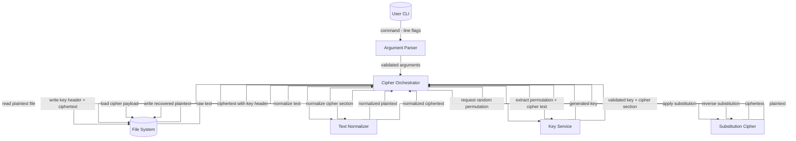
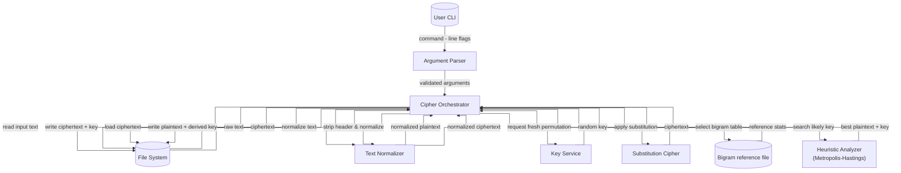
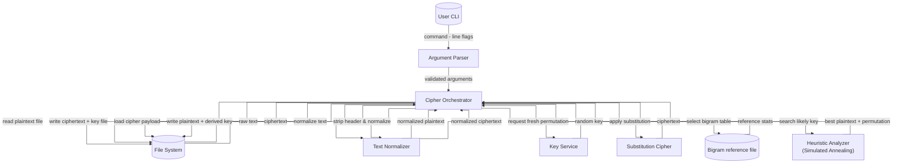

# Kryptografia i kryptoanaliza

## Laboratorium 3

### Grupa 1ID24B

### Autorzy: Kamil Fudala, Andrzej Szczytyński

### Zadanie 1

Zrealizować program implementujący podstawieniowy algorytm szyfrowania.

1. Wybrać dłuższy fragment tekstu w języku angielskim (np. akapit składający się z kilkunastu zdań).
2. Usunąć z niego wszystkie znaki niebędące literami (ograniczenie do 26 liter alfabetu łacińskiego).
3. Zaszyfrować tekst używając wybranego w sposób losowy klucza (tablicy podstawień): permutacji $\hat{\pi}$

#### Diagram przepływu danych



#### Implementacja

- IArgumentParser.cs

```csharp
using Task01.Application.Services;

namespace Task01.Application.Abstractions;

public interface IArgumentParser
{
    Arguments Parse(string[] args);
}
```

- ICipherOrchestrator.cs

```csharp
using Task01.Application.Models;
using Task01.Application.Services;

namespace Task01.Application.Abstractions;

public interface ICipherOrchestrator
{
    Task<ProcessingResult> RunAsync(Arguments args);
}
```

- IFileService.cs

```csharp
namespace Task01.Application.Abstractions;

public interface IFileService
{
    Task<string> ReadAllTextAsync(string path);
    
    Task WriteAllTextAsync(string path, string content);
}
```

- IKeyService.cs

```csharp
namespace Task01.Application.Abstractions;

public interface IKeyService
{
    string CreatePermutation(string alphabet);
    
    string ExtractPermutation(string rawInput, string alphabet, out string cipherText);
}
```

- ArgumentParser.cs

```csharp
using Task01.Application.Abstractions;
using Task01.Application.Services;

namespace Task01.Application.Models;

public sealed class ArgumentParser : IArgumentParser
{
    public Arguments Parse(string[] args)
    {
        if (args is null || args.Length == 0)
        {
            throw new ArgumentException("Missing arguments");
        }

        Operation? mode = null;
        string? inputPath = null;
        string? outputPath = null;

        for (var i = 0; i < args.Length; i++)
        {
            var token = args[i];

            switch (token)
            {
                case "-e":
                case "-d":
                    mode = ResolveMode(token, mode);
                    break;
                case "-i":
                    inputPath = ReadValue(args, ref i, "-i");
                    break;
                case "-o":
                    outputPath = ReadValue(args, ref i, "-o");
                    break;

                default:
                    throw new ArgumentException("Unknown argument " + token);
            }
        }

        return BuildArguments(mode, inputPath, outputPath);
    }
    
    private static Operation ResolveMode(string flag, Operation? current)
    {
        var next = flag == "-e" ? Operation.Encrypt : Operation.Decrypt;

        if (current is null)
        {
            return next;
        }

        return current == next ? current.Value : throw new ArgumentException("Flags -e and -d cannot be used together");
    }
    
    private static string ReadValue(string[] args, ref int index, string flag)
    {
        index++;
        if (index >= args.Length || string.IsNullOrWhiteSpace(args[index]))
        {
            throw new ArgumentException("Missing value for " + flag);
        }

        return args[index];
    }
    
    private static Arguments BuildArguments(Operation? mode, string? inputPath, string? outputPath)
    {
        if (mode is null)
        {
            throw new ArgumentException("Missing -e or -d");
        }

        if (string.IsNullOrWhiteSpace(inputPath))
        {
            throw new ArgumentException("Missing -i <inputfile>");
        }

        if (string.IsNullOrWhiteSpace(outputPath))
        {
            throw new ArgumentException("Missing -o <outputfile>");
        }

        return new Arguments(
            mode.Value,
            inputPath,
            outputPath
        );
    }
}
```

- Operation.cs

```csharp
namespace Task01.Application.Models;

public enum Operation
{
    Encrypt,
    Decrypt
}
```

- ProcessingResult.cs

```cshap
namespace Task01.Application.Models;

public readonly record struct ProcessingResult(
    int ExitCode,
    string? Message
)
{
    public bool IsSuccess => ExitCode == 0;
}
```

- Arguments.cs

```csharp
using Task01.Application.Models;

namespace Task01.Application.Services;

public sealed record Arguments(
    Operation Operation,
    string InputFilePath,
    string OutputFilePath
);
```

- CipherOrchestrator.cs

```csharp
using Task01.Application.Abstractions;
using Task01.Application.Models;
using Task01.Domain.Abstractions;

namespace Task01.Application.Services;

public sealed class CipherOrchestrator(
    IFileService fileService,
    IKeyService keyService,
    ITextNormalizer textNormalizer,
    ISubstitutionCipher cipher)
    : ICipherOrchestrator
{
    private const string Alphabet = "ABCDEFGHIJKLMNOPQRSTUVWXYZ";
    
    public async Task<ProcessingResult> RunAsync(Arguments args)
    {
        try
        {
            var rawInput = await fileService.ReadAllTextAsync(args.InputFilePath).ConfigureAwait(false);
            if (args.Operation == Operation.Encrypt)
            {
                var normalized = textNormalizer.Normalize(rawInput);
                var permutation = keyService.CreatePermutation(Alphabet);
                var outputText = cipher.Encrypt(normalized, Alphabet, permutation);
                var builder = new StringBuilder(permutation.Length + Environment.NewLine.Length + outputText.Length);
                builder.AppendLine(permutation);
                builder.Append(outputText);

                await fileService.WriteAllTextAsync(args.OutputFilePath, builder.ToString()).ConfigureAwait(false);
            }
            else
            {
                var permutation = keyService.ExtractPermutation(rawInput, Alphabet, out var cipherSection);

                var normalized = textNormalizer.Normalize(cipherSection);

                var plainText = cipher.Decrypt(normalized, Alphabet, permutation);

                await fileService.WriteAllTextAsync(args.OutputFilePath, plainText).ConfigureAwait(false);
            }

            return new ProcessingResult(0, null);
        }
        catch (FormatException)
        {
            return new ProcessingResult(3, "Invalid key");
        }
        catch (FileNotFoundException)
        {
            return new ProcessingResult(2, "File error");
        }
        catch (DirectoryNotFoundException)
        {
            return new ProcessingResult(2, "File error");
        }
        catch (UnauthorizedAccessException)
        {
            return new ProcessingResult(2, "File error");
        }
        catch (IOException)
        {
            return new ProcessingResult(2, "File error");
        }
        catch (Exception)
        {
            return new ProcessingResult(99, "Unexpected error");
        }
    }
}
```

- ISubstitutionCipher.cs

```csharp
namespace Task01.Domain.Abstractions;

public interface ISubstitutionCipher
{
    string Encrypt(string normalizedText, string alphabet, string permutation);

    string Decrypt(string normalizedText, string alphabet, string permutation);
}
```

- ITextNormalizer.cs

```csharp
namespace Task01.Domain.Abstractions;

public interface ITextNormalizer
{
    string Normalize(string input);
}
```

- SubstitutionCipher.cs

```csharp
using Task01.Domain.Abstractions;

namespace Task01.Domain.Services;

public sealed class SubstitutionCipher : ISubstitutionCipher
{
    public string Encrypt(string normalizedText, string alphabet, string permutation)
    {
        return Transform(normalizedText, alphabet, permutation, true);
    }


    public string Decrypt(string normalizedText, string alphabet, string permutation)
    {
        return Transform(normalizedText, alphabet, permutation, false);
    }
    
    private static string Transform(string text, string alphabet, string permutation, bool encrypt)
    {
        if (string.IsNullOrEmpty(text) || string.IsNullOrEmpty(alphabet) || string.IsNullOrEmpty(permutation))
        {
            return string.Empty;
        }

        if (alphabet.Length != permutation.Length)
        {
            throw new InvalidOperationException("Alphabet and permutation must be the same length");
        }

        var source = encrypt ? alphabet : permutation;
        var target = encrypt ? permutation : alphabet;

        var lookup = BuildLookup(source, target);

        var span = text.AsSpan();
        var result = new char[span.Length];

        for (var i = 0; i < span.Length; i++)
        {
            var c = span[i];

            if (!lookup.TryGetValue(c, out var mapped))
            {
                throw new InvalidOperationException("Character not found in substitution alphabet");
            }

            result[i] = mapped;
        }

        return new string(result);
    }

    private static Dictionary<char, char> BuildLookup(string source, string target)
    {
        var lookup = new Dictionary<char, char>(source.Length);

        for (var i = 0; i < source.Length; i++)
        {
            lookup[source[i]] = target[i];
        }

        return lookup;
    }
}
```

- TextNormalizer.cs

```csharp
using Task01.Domain.Abstractions;

namespace Task01.Domain.Services;

public sealed class TextNormalizer : ITextNormalizer
{
    public string Normalize(string input)
    {
        if (string.IsNullOrEmpty(input))
        {
            return string.Empty;
        }

        var span = input.AsSpan();
        var sb = new StringBuilder(span.Length);

        foreach (var c in span)
        {
            if (c is (< 'A' or > 'Z') and (< 'a' or > 'z'))
            {
                continue;
            }

            var upper = char.ToUpperInvariant(c);
            sb.Append(upper);
        }

        return sb.ToString();
    }
}
```

- FileService.cs

```csharp
using Task01.Application.Abstractions;

namespace Task01.Infrastructure.Services;

public sealed class FileService : IFileService
{
    private static readonly Encoding Utf8NoBom = new UTF8Encoding(false);
    
    public async Task<string> ReadAllTextAsync(string path)
    {
        const FileOptions fileOptions = FileOptions.Asynchronous | FileOptions.SequentialScan;

        await using var fs = new FileStream(
            path,
            FileMode.Open,
            FileAccess.Read,
            FileShare.Read,
            4096,
            fileOptions
        );

        using var reader = new StreamReader(fs, Encoding.UTF8, true);

        return await reader.ReadToEndAsync().ConfigureAwait(false);
    }
    
    public async Task WriteAllTextAsync(string path, string content)
    {
        const FileOptions fileOptions = FileOptions.Asynchronous | FileOptions.SequentialScan;

        await using var fs = new FileStream(
            path,
            FileMode.Create,
            FileAccess.Write,
            FileShare.None,
            4096,
            fileOptions
        );

        await using var writer = new StreamWriter(fs, Utf8NoBom);

        await writer.WriteAsync(content.AsMemory()).ConfigureAwait(false);
        await writer.FlushAsync().ConfigureAwait(false);
    }
}
```

- KeyService.cs

```csharp
using System.Security.Cryptography;
using Task01.Application.Abstractions;

namespace Task01.Infrastructure.Services;

public sealed class KeyService : IKeyService
{
    public string CreatePermutation(string alphabet)
    {
        if (string.IsNullOrEmpty(alphabet))
        {
            throw new FormatException("Alphabet is empty");
        }

        var chars = alphabet.ToCharArray();
        for (var i = chars.Length - 1; i > 0; i--)
        {
            var j = RandomNumberGenerator.GetInt32(i + 1);
            (chars[i], chars[j]) = (chars[j], chars[i]);
        }

        return new string(chars);
    }
    
    public string ExtractPermutation(string rawInput, string alphabet, out string cipherText)
    {
        if (string.IsNullOrEmpty(alphabet))
        {
            throw new FormatException("Alphabet is empty");
        }

        if (string.IsNullOrEmpty(rawInput))
        {
            throw new FormatException("Key not found");
        }

        var span = rawInput.AsSpan();
        var keySpan = ReadFirstLine(span, out var remainder);

        keySpan = TrimWhite(keySpan);
        if (keySpan.IsEmpty)
        {
            throw new FormatException("Key not found");
        }

        var permutation = new string(keySpan).ToUpperInvariant();

        if (!IsValidPermutation(permutation, alphabet))
        {
            throw new FormatException("Key is not a valid permutation");
        }

        cipherText = remainder.Length == 0 ? string.Empty : remainder.ToString();

        return permutation;
    }
    
    private static ReadOnlySpan<char> ReadFirstLine(ReadOnlySpan<char> value, out ReadOnlySpan<char> remainder)
    {
        var index = 0;
        while (index < value.Length && value[index] is not ('\r' or '\n'))
        {
            index++;
        }

        if (index == value.Length)
        {
            throw new FormatException("Cipher text not found");
        }

        var line = value[..index];
        var next = index;

        if (next < value.Length && value[next] == '\r')
        {
            next++;
            if (next < value.Length && value[next] == '\n')
            {
                next++;
            }
        }
        else if (next < value.Length && value[next] == '\n')
        {
            next++;
        }

        while (next < value.Length && value[next] is '\r' or '\n')
        {
            next++;
        }

        remainder = next < value.Length ? value[next..] : ReadOnlySpan<char>.Empty;
        return line;
    }

    private static ReadOnlySpan<char> TrimWhite(ReadOnlySpan<char> value)
    {
        var start = 0;
        var end = value.Length - 1;

        while (start <= end && char.IsWhiteSpace(value[start]))
        {
            start++;
        }

        while (end >= start && char.IsWhiteSpace(value[end]))
        {
            end--;
        }

        return start > end ? ReadOnlySpan<char>.Empty : value.Slice(start, end - start + 1);
    }

    private static bool IsValidPermutation(string permutation, string alphabet)
    {
        if (permutation.Length != alphabet.Length)
        {
            return false;
        }

        var expected = new HashSet<char>(alphabet.Length);
        foreach (var ch in alphabet)
        {
            expected.Add(ch);
        }

        var seen = new HashSet<char>(permutation.Length);
        if (permutation.Any(ch => !expected.Contains(ch) || !seen.Add(ch)))
        {
            return false;
        }

        return seen.Count == expected.Count;
    }
}
```

- GlobalUsings.cs

```csharp
global using System;
global using System.Collections.Generic;
global using System.Globalization;
global using System.IO;
global using System.Text;
global using System.Threading.Tasks;
```

- Program.cs

```csharp
#pragma warning disable CA1859

using Task01.Application.Abstractions;
using Task01.Application.Models;
using Task01.Application.Services;
using Task01.Domain.Abstractions;
using Task01.Domain.Services;
using Task01.Infrastructure.Services;

CultureInfo.CurrentCulture = CultureInfo.InvariantCulture;
CultureInfo.CurrentUICulture = CultureInfo.InvariantCulture;

IFileService fileService = new FileService();
IKeyService keyService = new KeyService();

ITextNormalizer textNormalizer = new TextNormalizer();
ISubstitutionCipher cipher = new SubstitutionCipher();

ICipherOrchestrator orchestrator = new CipherOrchestrator(
    fileService,
    keyService,
    textNormalizer,
    cipher
);

IArgumentParser parser = new ArgumentParser();

ProcessingResult result;

try
{
    var parsed = parser.Parse(args);

    result = await orchestrator.RunAsync(parsed);
}
catch (ArgumentException ex)
{
    result = new ProcessingResult(1, ex.Message);
}
catch (Exception)
{
    result = new ProcessingResult(99, "Unexpected error");
}

if (!result.IsSuccess && !string.IsNullOrEmpty(result.Message))
{
    await Console.Error.WriteLineAsync(result.Message);
}

Environment.ExitCode = result.ExitCode;
```

#### Wyniki

### Zadanie 2

Dokonać kryptoanalizy heurystycznej na zaimplementowany w ramach pierwszego zadania monoalfabetyczny kryptosystem
podstawieniowy. Założenia ataku są następujące:

1. Znany jest szyfrogram.
2. Wiadomo jaki kryptosystem użyty został do zaszyfrowania wiadomości.
3. Należy odzyskać klucz i tekst jawny.

#### Diagram przepływu danych



#### Implementacja

- IArgumentParser.cs

```csharp
using Task02.Application.Models;

namespace Task02.Application.Abstractions;

public interface IArgumentParser
{
    Arguments Parse(string[] args);
}
```

- ICipherOrchestrator.cs

```csharp
using Task02.Application.Models;

namespace Task02.Application.Abstractions;

public interface ICipherOrchestrator
{
    ProcessingResult Run(Arguments args);
}
```

- IFileService.cs

```csharp
namespace Task02.Application.Abstractions;

public interface IFileService
{
    string ReadAllText(string path);
    
    void WriteAllText(string path, string content);
}
```

- IKeyService.cs

```csharp
namespace Task02.Application.Abstractions;

public interface IKeyService
{
    string CreatePermutation(string alphabet);
    
    string ExtractPermutation(string rawInput, string alphabet, out string cipherText);
}
```

- Arguments.cs

```csharp
namespace Task02.Application.Models;

public sealed record Arguments(
    Operation Operation,
    string InputFilePath,
    string OutputFilePath,
    string? ReferenceFilePath,
    int Iterations
);
```

- Operation.cs

```csharp
namespace Task02.Application.Models;

public enum Operation
{
    Encrypt,
    Decrypt
}
```

- ProcessingResult.cs

```csharp
namespace Task02.Application.Models;

public readonly record struct ProcessingResult(
    int ExitCode,
    string? Message
)
{
    /// <summary>Indicates whether the process completed successfully by checking if the exit code equals zero.</summary>
    public bool IsSuccess => ExitCode == 0;
}
```

- ArgumentParser.cs

```csharp
using Task02.Application.Abstractions;
using Task02.Application.Models;

namespace Task02.Application.Services;

public sealed class ArgumentParser : IArgumentParser
{
    private const int DefaultIterations = 500_000;
    
    public Arguments Parse(string[] args)
    {
        if (args is null || args.Length == 0)
        {
            throw new ArgumentException("Missing arguments");
        }

        Operation? mode = null;
        string? inputPath = null;
        string? outputPath = null;
        string? referencePath = null;
        var iterations = DefaultIterations;

        for (var i = 0; i < args.Length; i++)
        {
            var token = args[i];

            switch (token)
            {
                case "-e":
                case "-d":
                    mode = ResolveMode(token, mode);
                    break;
                case "-i":
                    inputPath = ReadValue(args, ref i, "-i");
                    break;
                case "-o":
                    outputPath = ReadValue(args, ref i, "-o");
                    break;
                case "-r":
                    referencePath = ReadValue(args, ref i, "-r");
                    break;
                case "--iters":
                {
                    var val = ReadValue(args, ref i, "--iters");
                    if (!int.TryParse(val, out iterations) || iterations <= 0)
                    {
                        throw new ArgumentException("Invalid --iters value (must be positive integer)");
                    }

                    break;
                }

                default:
                    throw new ArgumentException("Unknown argument " + token);
            }
        }

        return BuildArguments(mode, inputPath, outputPath, referencePath, iterations);
    }
    
    private static Operation ResolveMode(string flag, Operation? current)
    {
        var next = flag == "-e" ? Operation.Encrypt : Operation.Decrypt;

        if (current is null)
        {
            return next;
        }

        return current == next ? current.Value : throw new ArgumentException("Flags -e and -d cannot be used together");
    }
    
    private static string ReadValue(string[] args, ref int index, string flag)
    {
        index++;
        if (index >= args.Length || string.IsNullOrWhiteSpace(args[index]))
        {
            throw new ArgumentException("Missing value for " + flag);
        }

        return args[index];
    }
    
    private static Arguments BuildArguments(
        Operation? mode,
        string? inputPath,
        string? outputPath,
        string? referencePath,
        int iterations)
    {
        if (mode is null)
        {
            throw new ArgumentException("Missing -e or -d");
        }

        if (string.IsNullOrWhiteSpace(inputPath))
        {
            throw new ArgumentException("Missing -i <inputfile>");
        }

        if (string.IsNullOrWhiteSpace(outputPath))
        {
            throw new ArgumentException("Missing -o <outputfile>");
        }

        return new Arguments(
            mode.Value,
            inputPath,
            outputPath,
            referencePath,
            iterations
        );
    }
}
```

- CipherOrchestrator.cs

```csharp
using System.Runtime.CompilerServices;
using Task02.Application.Abstractions;
using Task02.Application.Models;
using Task02.Domain.Abstractions;

namespace Task02.Application.Services;

public sealed class CipherOrchestrator(
    IFileService fileService,
    IKeyService keyService,
    ITextNormalizer textNormalizer,
    ISubstitutionCipher cipher,
    IHeuristicAnalyzer heuristicAnalyzer)
    : ICipherOrchestrator
{
    private const string Alphabet = "ABCDEFGHIJKLMNOPQRSTUVWXYZ";
    
    [MethodImpl(MethodImplOptions.AggressiveOptimization)]
    public ProcessingResult Run(Arguments args)
    {
        try
        {
            var rawInput = fileService.ReadAllText(args.InputFilePath);

            if (args.Operation == Operation.Encrypt)
            {
                var normalized = textNormalizer.Normalize(rawInput);
                var permutation = keyService.CreatePermutation(Alphabet);
                var outputText = cipher.Encrypt(normalized, Alphabet, permutation);

                fileService.WriteAllText(args.OutputFilePath, outputText);

                var keyPath = BuildSiblingPath(args.OutputFilePath, "cipher_key.txt");
                fileService.WriteAllText(keyPath, permutation);

                return new ProcessingResult(0, null);
            }

            var cipherPayload = ExtractCipherPayload(rawInput);
            var normalizedCipher = textNormalizer.Normalize(cipherPayload);

            if (normalizedCipher.Length == 0)
            {
                fileService.WriteAllText(args.OutputFilePath, string.Empty);
                return new ProcessingResult(0, null);
            }

            var bigramTableText = ReadReferenceText(args);
            if (heuristicAnalyzer is IConfigurableIterations cfg)
            {
                cfg.SetIterations(args.Iterations);
            }

            var heuristicResult = heuristicAnalyzer.Analyze(normalizedCipher, bigramTableText, Alphabet);

            fileService.WriteAllText(args.OutputFilePath, heuristicResult.PlainText);

            var outKeyPath = BuildSiblingPath(args.OutputFilePath, "output_key.txt");
            fileService.WriteAllText(outKeyPath, heuristicResult.Permutation);

            return new ProcessingResult(0, null);
        }
        catch (FormatException)
        {
            return new ProcessingResult(3, "Invalid key");
        }
        catch (FileNotFoundException)
        {
            return new ProcessingResult(2, "File error");
        }
        catch (DirectoryNotFoundException)
        {
            return new ProcessingResult(2, "File error");
        }
        catch (UnauthorizedAccessException)
        {
            return new ProcessingResult(2, "File error");
        }
        catch (IOException)
        {
            return new ProcessingResult(2, "File error");
        }
        catch (Exception)
        {
            return new ProcessingResult(99, "Unexpected error");
        }
    }

    [MethodImpl(MethodImplOptions.AggressiveInlining)]
    private static string BuildSiblingPath(string basePath, string fileName)
    {
        var dir = Path.GetDirectoryName(basePath);
        return string.IsNullOrEmpty(dir) ? fileName : Path.Combine(dir, fileName);
    }

  
    [MethodImpl(MethodImplOptions.AggressiveInlining)]
    private string ExtractCipherPayload(string rawInput)
    {
        if (string.IsNullOrEmpty(rawInput))
        {
            return string.Empty;
        }

        try
        {
            keyService.ExtractPermutation(rawInput, Alphabet, out var cipherSection);
            return cipherSection;
        }
        catch (FormatException)
        {
            return rawInput;
        }
    }
    
    [MethodImpl(MethodImplOptions.AggressiveOptimization)]
    private string ReadReferenceText(Arguments args)
    {
        if (!string.IsNullOrWhiteSpace(args.ReferenceFilePath))
        {
            return fileService.ReadAllText(args.ReferenceFilePath);
        }

        var defaultPath = Path.Combine(AppContext.BaseDirectory, "Samples", "bigrams.txt");
        return File.Exists(defaultPath)
            ? fileService.ReadAllText(defaultPath)
            : throw new FileNotFoundException("Bigram table not found", defaultPath);
    }
}
```

- IConfigurableIterations.cs

```csharp
namespace Task02.Domain.Abstractions;

public interface IConfigurableIterations
{
    void SetIterations(int iterations);
}
```

- IHeuresticAnalyzer.cs

```csharp
using Task02.Domain.Models;

namespace Task02.Domain.Abstractions;

public interface IHeuristicAnalyzer
{
    HeuristicResult Analyze(string cipherText, string referenceText, string alphabet);
}
```

- ISubstitutionCipher.cs

```csharp
namespace Task02.Domain.Abstractions;

public interface ISubstitutionCipher
{
    string Encrypt(string normalizedText, string alphabet, string permutation);
    
    string Decrypt(string normalizedText, string alphabet, string permutation);
}
```

- ITextNormalizer.cs

```csharp
namespace Task02.Domain.Abstractions;

public interface ITextNormalizer
{
    string Normalize(string input);
}
```

- BigramLanguageModel.cs

```csharp
using System.Runtime.CompilerServices;
using System.Runtime.InteropServices;

namespace Task02.Domain.Models;

public sealed class BigramLanguageModel
{
    private readonly double[] _log;
    private readonly int[] _rowOff;
    
    private BigramLanguageModel(double[] log, int[] rowOff)
    {
        _log = log;
        _rowOff = rowOff;
    }
    
    [MethodImpl(MethodImplOptions.AggressiveOptimization)]
    public static BigramLanguageModel CreateFromBigramsText(string bigramsText, double alpha)
    {
        const int size = 26;
        var counts = new double[size * size];

        if (!string.IsNullOrEmpty(bigramsText))
        {
            var lines = bigramsText.Split(new[] { '\r', '\n' },
                StringSplitOptions.RemoveEmptyEntries | StringSplitOptions.TrimEntries);

            foreach (var line in lines)
            {
                if (line.Length < 4)
                {
                    continue;
                }

                var span = line.AsSpan().Trim();
                if (span.Length < 4)
                {
                    continue;
                }

                var c0 = char.ToUpperInvariant(span[0]);
                var c1 = char.ToUpperInvariant(span[1]);
                if (c0 < 'A' || c0 > 'Z' || c1 < 'A' || c1 > 'Z')
                {
                    continue;
                }

                var spaceIdx = span.IndexOf(' ');
                if (spaceIdx < 0 || spaceIdx + 1 >= span.Length)
                {
                    continue;
                }

                var countSpan = span[(spaceIdx + 1)..].Trim();
                if (!long.TryParse(countSpan, NumberStyles.Integer,
                        CultureInfo.InvariantCulture, out var cnt) || cnt <= 0)
                {
                    continue;
                }

                var row = c0 - 'A';
                var col = c1 - 'A';
                counts[row * size + col] += cnt;
            }
        }

        var total = 0d;
        for (var i = 0; i < counts.Length; i++)
        {
            counts[i] += alpha;
            total += counts[i];
        }

        var log = new double[counts.Length];
        var invTotal = 1d / total;
        for (var i = 0; i < counts.Length; i++)
        {
            log[i] = Math.Log(counts[i] * invTotal);
        }

        var rowOff = new int[size];
        for (var k = 0; k < size; k++)
        {
            rowOff[k] = k * size;
        }

        return new BigramLanguageModel(log, rowOff);
    }
    
    [MethodImpl(MethodImplOptions.AggressiveOptimization)]
    public double ScoreFromCounts(ReadOnlySpan<byte> invPos, int[] counts)
    {
        ref var log0 = ref MemoryMarshal.GetArrayDataReference(_log);
        ref var cnt0 = ref MemoryMarshal.GetArrayDataReference(counts);

        var sum = 0d;
        for (var p = 0; p < 26; p++)
        {
            var row = _rowOff[invPos[p]];
            var cntRowOff = p * 26;
            for (var q = 0; q < 26; q++)
            {
                var c = Unsafe.Add(ref cnt0, cntRowOff + q);
                if (c == 0)
                {
                    continue;
                }

                int col = invPos[q];
                sum += Unsafe.Add(ref log0, row + col) * c;
            }
        }

        return sum;
    }
    
    [MethodImpl(MethodImplOptions.AggressiveOptimization)]
    public double ProposedScoreDelta(
        ReadOnlySpan<byte> invPos,
        ReadOnlySpan<char> perm,
        int[] counts,
        int iPos,
        int jPos,
        double currentScore)
    {
        var x = perm[iPos] - 'A';
        var y = perm[jPos] - 'A';
        if ((uint)x >= 26u || (uint)y >= 26u)
        {
            return currentScore;
        }

        ref var log0 = ref MemoryMarshal.GetArrayDataReference(_log);
        ref var cnt0 = ref MemoryMarshal.GetArrayDataReference(counts);

        var delta = 0d;

        var cntRowX = x * 26;
        var cntRowY = y * 26;
        var rowPx = _rowOff[iPos];
        var rowPy = _rowOff[jPos];

        for (var q = 0; q < 26; q++)
        {
            if (q == x || q == y)
            {
                continue;
            }

            int colMq = invPos[q];

            var cXq = Unsafe.Add(ref cnt0, cntRowX + q);
            if (cXq != 0)
            {
                delta += (Unsafe.Add(ref log0, rowPy + colMq) - Unsafe.Add(ref log0, rowPx + colMq)) * cXq;
            }

            var cYq = Unsafe.Add(ref cnt0, cntRowY + q);
            if (cYq != 0)
            {
                delta += (Unsafe.Add(ref log0, rowPx + colMq) - Unsafe.Add(ref log0, rowPy + colMq)) * cYq;
            }
        }

        for (var p = 0; p < 26; p++)
        {
            if (p == x || p == y)
            {
                continue;
            }

            var rowMp = _rowOff[invPos[p]];

            var cpx = Unsafe.Add(ref cnt0, p * 26 + x);
            if (cpx != 0)
            {
                delta += (Unsafe.Add(ref log0, rowMp + jPos) - Unsafe.Add(ref log0, rowMp + iPos)) * cpx;
            }

            var cpy = Unsafe.Add(ref cnt0, p * 26 + y);
            if (cpy != 0)
            {
                delta += (Unsafe.Add(ref log0, rowMp + iPos) - Unsafe.Add(ref log0, rowMp + jPos)) * cpy;
            }
        }

        var Cxx = Unsafe.Add(ref cnt0, cntRowX + x);
        if (Cxx != 0)
        {
            delta += (Unsafe.Add(ref log0, rowPy + jPos) - Unsafe.Add(ref log0, rowPx + iPos)) * Cxx;
        }

        var Cyy = Unsafe.Add(ref cnt0, cntRowY + y);
        if (Cyy != 0)
        {
            delta += (Unsafe.Add(ref log0, rowPx + iPos) - Unsafe.Add(ref log0, rowPy + jPos)) * Cyy;
        }

        var Cxy = Unsafe.Add(ref cnt0, cntRowX + y);
        if (Cxy != 0)
        {
            delta += (Unsafe.Add(ref log0, rowPy + iPos) - Unsafe.Add(ref log0, rowPx + jPos)) * Cxy;
        }

        var Cyx = Unsafe.Add(ref cnt0, cntRowY + x);
        if (Cyx != 0)
        {
            delta += (Unsafe.Add(ref log0, rowPx + jPos) - Unsafe.Add(ref log0, rowPy + iPos)) * Cyx;
        }

        return currentScore + delta;
    }
}
```

- HeuresticResult.cs

```csharp
namespace Task02.Domain.Models;

public sealed record HeuristicResult(string Permutation, string PlainText, double LogLikelihood);
```

- MetropolisHastingsAnalyzer.cs

```csharp
using System.Runtime.CompilerServices;
using System.Runtime.InteropServices;
using Task02.Domain.Abstractions;
using Task02.Domain.Models;

namespace Task02.Domain.Services;

public sealed class MetropolisHastingsAnalyzer(
    ITextNormalizer textNormalizer,
    ISubstitutionCipher cipher)
    : IHeuristicAnalyzer, IConfigurableIterations
{
    private const double SmoothingConstant = 0.01d;
    private int _iterationCount = 500_000;

    public void SetIterations(int iterations)
    {
        _iterationCount = iterations > 0 ? iterations : 500_000;
    }
    
    [MethodImpl(MethodImplOptions.AggressiveOptimization)]
    public HeuristicResult Analyze(string cipherText, string referenceText, string alphabet)
    {
        if (string.IsNullOrEmpty(alphabet))
        {
            throw new ArgumentException("Alphabet must be provided", nameof(alphabet));
        }

        if (!alphabet.Equals("ABCDEFGHIJKLMNOPQRSTUVWXYZ", StringComparison.Ordinal))
        {
            throw new ArgumentException("Alphabet must be A–Z for the fast path.", nameof(alphabet));
        }

        var normalizedCipher = textNormalizer.Normalize(cipherText);
        if (normalizedCipher.Length == 0)
        {
            return new HeuristicResult(alphabet, string.Empty, double.NegativeInfinity);
        }

        var model = BigramLanguageModel.CreateFromBigramsText(referenceText, SmoothingConstant);

        var c = normalizedCipher.AsSpan();
        var cipherIdx = new byte[c.Length];
        for (var i = 0; i < c.Length; i++)
        {
            cipherIdx[i] = (byte)(c[i] - 'A');
        }

        var counts = new int[26 * 26];
        if (cipherIdx.Length >= 2)
        {
            ref var baseCnt = ref MemoryMarshal.GetArrayDataReference(counts);
            for (var i = 1; i < cipherIdx.Length; i++)
            {
                int r = cipherIdx[i - 1];
                int col = cipherIdx[i];
                Unsafe.Add(ref baseCnt, r * 26 + col)++;
            }
        }

        var rng = new Xoshiro256(((ulong)c.Length << 32) ^ (ulong)Environment.TickCount64);

        var permArr = alphabet.ToCharArray();
        for (var i = permArr.Length - 1; i > 0; i--)
        {
            var j = rng.NextInt(i + 1);
            (permArr[i], permArr[j]) = (permArr[j], permArr[i]);
        }

        var perm = permArr.AsSpan();

        Span<byte> invPos = stackalloc byte[26];
        for (var i = 0; i < 26; i++)
        {
            invPos[(byte)(perm[i] - 'A')] = (byte)i;
        }

        var bestPerm = alphabet.ToCharArray();

        var currentScore = model.ScoreFromCounts(invPos, counts);
        var bestScore = currentScore;

        for (var it = 0; it < _iterationCount; it++)
        {
            var i = rng.NextInt(26);
            var j = rng.NextInt(25);
            if (j >= i)
            {
                j++;
            }

            var proposalScore = model.ProposedScoreDelta(invPos, perm, counts, i, j, currentScore);
            var delta = proposalScore - currentScore;

            bool accept;
            if (delta >= 0d)
            {
                accept = true;
            }
            else
            {
                var u = (float)rng.NextDouble();
                var logu = MathF.Log(u);
                accept = logu <= delta;
            }

            if (!accept)
            {
                continue;
            }

            (perm[i], perm[j]) = (perm[j], perm[i]);
            invPos[(byte)(perm[i] - 'A')] = (byte)i;
            invPos[(byte)(perm[j] - 'A')] = (byte)j;

            currentScore = proposalScore;

            if (proposalScore > bestScore)
            {
                bestScore = proposalScore;
                perm.CopyTo(bestPerm);
            }
        }

        var bestPermutation = new string(bestPerm);
        var bestPlainText = cipher.Decrypt(normalizedCipher, alphabet, bestPermutation);
        return new HeuristicResult(bestPermutation, bestPlainText, bestScore);
    }
}
```

- SubstitutionCipher.cs

```csharp
using System.Runtime.CompilerServices;
using System.Runtime.InteropServices;
using Task02.Domain.Abstractions;

namespace Task02.Domain.Services;

public sealed class SubstitutionCipher : ISubstitutionCipher
{
    [MethodImpl(MethodImplOptions.AggressiveOptimization)]
    public string Encrypt(string normalizedText, string alphabet, string permutation)
    {
        return Transform(normalizedText, alphabet, permutation, true);
    }
    
    [MethodImpl(MethodImplOptions.AggressiveOptimization)]
    public string Decrypt(string normalizedText, string alphabet, string permutation)
    {
        return Transform(normalizedText, alphabet, permutation, false);
    }
    
    [MethodImpl(MethodImplOptions.AggressiveOptimization)]
    private static string Transform(string text, string alphabet, string permutation, bool encrypt)
    {
        if (string.IsNullOrEmpty(text) || string.IsNullOrEmpty(alphabet) || string.IsNullOrEmpty(permutation))
        {
            return string.Empty;
        }

        if (alphabet.Length != permutation.Length)
        {
            throw new InvalidOperationException("Alphabet and permutation must be the same length");
        }

        var source = encrypt ? alphabet : permutation;
        var target = encrypt ? permutation : alphabet;

        var lookup = BuildLookup(source, target);

        return string.Create(text.Length, (text, lookup), static (dst, state) =>
        {
            var (srcText, map) = state;
            var src = srcText.AsSpan();

            ref var baseRef = ref MemoryMarshal.GetArrayDataReference(map.Table);
            var max = map.MaxChar;

            for (var i = 0; i < src.Length; i++)
            {
                int ch = src[i];
                if ((uint)ch > (uint)max)
                {
                    throw new InvalidOperationException("Character not found in substitution alphabet");
                }

                var mapped = Unsafe.Add(ref baseRef, ch);
                if (mapped < 0)
                {
                    throw new InvalidOperationException("Character not found in substitution alphabet");
                }

                dst[i] = (char)mapped;
            }
        });
    }
    
    [MethodImpl(MethodImplOptions.AggressiveOptimization)]
    private static DenseLookup BuildLookup(string source, string target)
    {
        var max = 0;
        var s = source.AsSpan();
        foreach (int c in s)
        {
            if (c > max)
            {
                max = c;
            }
        }

        var table = new int[max + 1];
        Array.Fill(table, -1);

        for (var i = 0; i < s.Length; i++)
        {
            table[s[i]] = target[i];
        }

        return new DenseLookup(table, max);
    }

    private readonly struct DenseLookup(int[] table, int maxChar)
    {
        public readonly int[] Table = table;
        public readonly int MaxChar = maxChar;
    }
}
```

- TextNormalizer.cs

```csharp
using System.Runtime.CompilerServices;
using Task02.Domain.Abstractions;

namespace Task02.Domain.Services;

public sealed class TextNormalizer : ITextNormalizer
{
    [MethodImpl(MethodImplOptions.AggressiveOptimization)]
    public string Normalize(string input)
    {
        if (string.IsNullOrEmpty(input))
        {
            return string.Empty;
        }

        var src = input.AsSpan();

        var hasNonLetter = false;
        var hasLower = false;

        foreach (var c in src)
        {
            if (!IsAsciiLetter(c))
            {
                hasNonLetter = true;
            }
            else if (IsLowerAscii(c))
            {
                hasLower = true;
            }
        }

        switch (hasNonLetter)
        {
            case false when !hasLower:
                return input;
            case false:
                return string.Create(src.Length, src, static (dst, s) =>
                {
                    for (var i = 0; i < s.Length; i++)
                    {
                        var c = s[i];
                        dst[i] = IsLowerAscii(c) ? (char)(c & ~0x20) : c;
                    }
                });
        }

        var count = 0;
        foreach (var t in src)
        {
            if (IsAsciiLetter(t))
            {
                count++;
            }
        }

        if (count == 0)
        {
            return string.Empty;
        }

        return string.Create(count, src, static (dst, s) =>
        {
            var w = 0;
            foreach (var c in s)
            {
                if (!IsAsciiLetter(c))
                {
                    continue;
                }

                dst[w++] = IsLowerAscii(c) ? (char)(c & ~0x20) : c;
            }
        });
    }
    
    [MethodImpl(MethodImplOptions.AggressiveInlining)]
    private static bool IsAsciiLetter(char c)
    {
        var v = (uint)((c | 0x20) - 'a');
        return v <= 'z' - 'a';
    }
    
    [MethodImpl(MethodImplOptions.AggressiveInlining)]
    private static bool IsLowerAscii(char c)
    {
        return (uint)(c - 'a') <= 'z' - 'a';
    }
}
```

- Xoshiro256.cs

```csharp
using System.Numerics;
using System.Runtime.CompilerServices;

namespace Task02.Domain.Services;

public struct Xoshiro256
{
    private ulong _s0, _s1, _s2, _s3;
    
    [MethodImpl(MethodImplOptions.AggressiveInlining)]
    private static ulong RotL(ulong x, int k)
    {
        return BitOperations.RotateLeft(x, k);
    }
    
    [MethodImpl(MethodImplOptions.AggressiveInlining)]
    private static ulong SplitMix64(ref ulong x)
    {
        x += 0x9E3779B97F4A7C15ul;
        var z = x;
        z = (z ^ (z >> 30)) * 0xBF58476D1CE4E5B9ul;
        z = (z ^ (z >> 27)) * 0x94D049BB133111EBul;
        return z ^ (z >> 31);
    }
    
    public Xoshiro256(ulong seed)
    {
        _s0 = _s1 = _s2 = _s3 = 0;
        var sm = seed;
        _s0 = SplitMix64(ref sm);
        _s1 = SplitMix64(ref sm);
        _s2 = SplitMix64(ref sm);
        _s3 = SplitMix64(ref sm);
    }
    
    [MethodImpl(MethodImplOptions.AggressiveInlining)]
    private ulong Next64()
    {
        var s0 = _s0;
        var s1 = _s1;
        var s2 = _s2;
        var s3 = _s3;

        var result = RotL(s1 * 5, 7) * 9;

        var t = s1 << 17;

        s2 ^= s0;
        s3 ^= s1;
        s1 ^= s2;
        s0 ^= s3;

        s2 ^= t;
        s3 = RotL(s3, 45);

        _s0 = s0;
        _s1 = s1;
        _s2 = s2;
        _s3 = s3;
        return result;
    }
    
    [MethodImpl(MethodImplOptions.AggressiveInlining)]
    public int NextInt(int exclusiveMax)
    {
        var r = Next64();
        var prod = (UInt128)r * (uint)exclusiveMax;
        return (int)(prod >> 64);
    }

    [MethodImpl(MethodImplOptions.AggressiveInlining)]
    public double NextDouble()
    {
        return (Next64() >> 11) * (1.0 / (1ul << 53));
    }
}
```

- FileService.cs

```csharp
using Task02.Application.Abstractions;

namespace Task02.Infrastructure.Services;

public sealed class FileService : IFileService
{
    private static readonly Encoding Utf8NoBom = new UTF8Encoding(false);

    public string ReadAllText(string path)
    {
        return File.ReadAllText(path, Utf8NoBom);
    }

    public void WriteAllText(string path, string content)
    {
        File.WriteAllText(path, content, Utf8NoBom);
    }
}
```

```csharp
using System.Runtime.CompilerServices;
using System.Security.Cryptography;
using Task02.Application.Abstractions;

namespace Task02.Infrastructure.Services;

public sealed class KeyService : IKeyService
{
    public string CreatePermutation(string alphabet)
    {
        if (string.IsNullOrEmpty(alphabet))
        {
            throw new FormatException("Alphabet is empty");
        }

        var chars = alphabet.ToCharArray();
        for (var i = chars.Length - 1; i > 0; i--)
        {
            var j = RandomNumberGenerator.GetInt32(i + 1);
            (chars[i], chars[j]) = (chars[j], chars[i]);
        }

        return new string(chars);
    }

    public string ExtractPermutation(string rawInput, string alphabet, out string cipherText)
    {
        if (string.IsNullOrEmpty(alphabet))
        {
            throw new FormatException("Alphabet is empty");
        }

        if (string.IsNullOrEmpty(rawInput))
        {
            throw new FormatException("Key not found");
        }

        var span = rawInput.AsSpan();
        var keySpan = ReadFirstLine(span, out var remainder);
        keySpan = TrimWhite(keySpan);
        if (keySpan.IsEmpty)
        {
            throw new FormatException("Key not found");
        }

        var permutation = string.Create(keySpan.Length, keySpan, static (dst, src) =>
        {
            var i = 0;
            var c = src[i];
            for (; i < src.Length; i++)
            {
                dst[i] = (char)((uint)(c - 'a') <= 25u ? c & ~0x20 : c);
            }
        });

        if (!IsValidPermutation(permutation, alphabet))
        {
            throw new FormatException("Key is not a valid permutation");
        }

        cipherText = remainder.Length == 0 ? string.Empty : remainder.ToString();
        return permutation;
    }
    
    private static ReadOnlySpan<char> ReadFirstLine(ReadOnlySpan<char> value, out ReadOnlySpan<char> remainder)
    {
        var index = 0;
        while (index < value.Length && value[index] is not ('\r' or '\n'))
        {
            index++;
        }

        if (index == value.Length)
        {
            throw new FormatException("Cipher text not found");
        }

        var line = value[..index];
        var next = index;

        if (next < value.Length && value[next] == '\r')
        {
            next++;
            if (next < value.Length && value[next] == '\n')
            {
                next++;
            }
        }
        else if (next < value.Length && value[next] == '\n')
        {
            next++;
        }

        while (next < value.Length && value[next] is '\r' or '\n')
        {
            next++;
        }

        remainder = next < value.Length ? value[next..] : ReadOnlySpan<char>.Empty;
        return line;
    }
    
    private static ReadOnlySpan<char> TrimWhite(ReadOnlySpan<char> value)
    {
        int start = 0, end = value.Length - 1;
        while (start <= end && char.IsWhiteSpace(value[start]))
        {
            start++;
        }

        while (end >= start && char.IsWhiteSpace(value[end]))
        {
            end--;
        }

        return start > end ? ReadOnlySpan<char>.Empty : value.Slice(start, end - start + 1);
    }


    [MethodImpl(MethodImplOptions.AggressiveOptimization)]
    private static bool IsValidPermutation(string permutation, string alphabet)
    {
        if (permutation.Length != alphabet.Length)
        {
            return false;
        }

        var aSpan = alphabet.AsSpan();
        var max = 0;
        foreach (int c in aSpan)
        {
            if (c > max)
            {
                max = c;
            }
        }

        var expected = new sbyte[max + 1];
        var seen = new sbyte[max + 1];

        foreach (var t in aSpan)
        {
            expected[t] = 1;
        }

        var pSpan = permutation.AsSpan();
        foreach (int c in pSpan)
        {
            if ((uint)c > (uint)max)
            {
                return false;
            }

            if (expected[c] == 0)
            {
                return false;
            }

            if (seen[c] != 0)
            {
                return false;
            }

            seen[c] = 1;
        }

        return true;
    }
}
```

- GlobalUsings.cs

```csharp
global using System;
global using System.Collections.Generic;
global using System.Globalization;
global using System.IO;
global using System.Text;
global using System.Threading.Tasks;
```

- Program.cs

```csharp
#pragma warning disable CA1859

using System.Runtime;
using Task02.Application.Abstractions;
using Task02.Application.Models;
using Task02.Application.Services;
using Task02.Domain.Abstractions;
using Task02.Domain.Services;
using Task02.Infrastructure.Services;

GCSettings.LatencyMode = GCLatencyMode.SustainedLowLatency;
CultureInfo.CurrentCulture = CultureInfo.InvariantCulture;
CultureInfo.CurrentUICulture = CultureInfo.InvariantCulture;

IFileService fileService = new FileService();
IKeyService keyService = new KeyService();

ITextNormalizer textNormalizer = new TextNormalizer();
ISubstitutionCipher cipher = new SubstitutionCipher();
IHeuristicAnalyzer heuristicAnalyzer = new MetropolisHastingsAnalyzer(textNormalizer, cipher);

ICipherOrchestrator orchestrator = new CipherOrchestrator(
    fileService, keyService, textNormalizer, cipher, heuristicAnalyzer);

IArgumentParser parser = new ArgumentParser();

ProcessingResult result;
try
{
    var parsed = parser.Parse(args);
    result = orchestrator.Run(parsed);
}
catch (ArgumentException ex)
{
    result = new ProcessingResult(1, ex.Message);
}
catch
{
    result = new ProcessingResult(99, "Unexpected error");
}

if (!result.IsSuccess && !string.IsNullOrEmpty(result.Message))
{
    Console.Error.WriteLine(result.Message);
}

Environment.ExitCode = result.ExitCode;
```

#### Wyniki

### Zadanie 3

Dokonać kryptoanalizy heurystycznej na zaimplementowany w ramach pierwszego zadania monoalfabetyczny kryptosystem
podstawieniowy. Założenia ataku są takie jak w zadaniu 2. Do ataku wykorzystać algorytm optymalizacji Symulowanego
Wyżarzania (ang. Simulated Annealing).

#### Diagram przepływu danych



#### Implementacja

#### Wyniki

### Zadanie 4

Dokonać analizy pracy zaimplementowanych algorytmów, porównując ich wydajność w ataku na analizowany
kryptosystem.

#### Wyniki