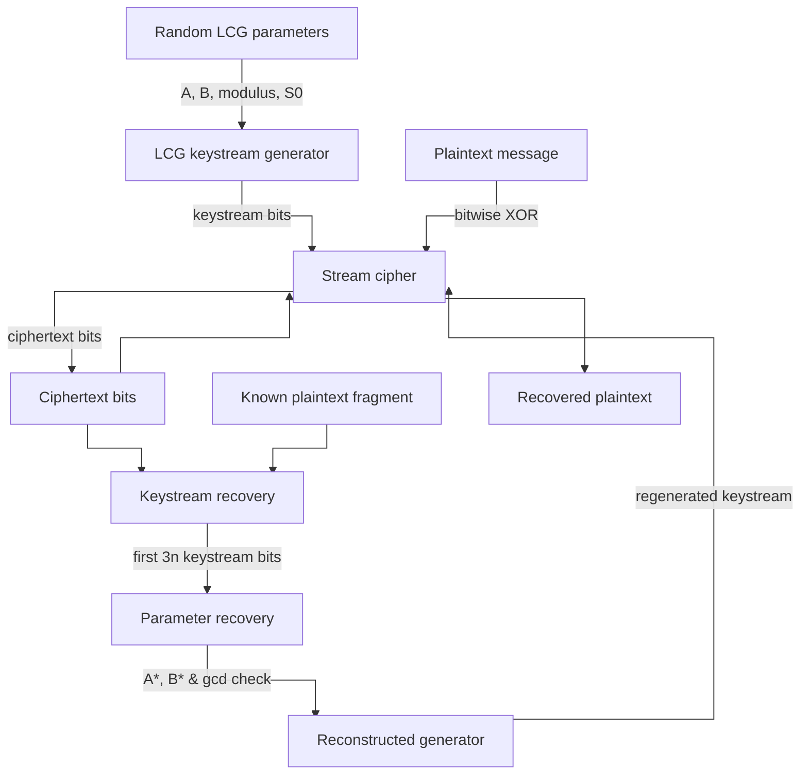

# Kryptografia i kryptoanaliza

## Laboratorium 4

### Grupa 1ID24B

### Autorzy: Kamil Fudala, Andrzej Szczytyński

## Wprowadzenie

Kryptosystemy strumieniowe stanowią klasę szyfrów symetrycznych, w których tekst jawny jest przetwarzany na poziomie
pojedynczych bitów lub bajtów, a operacja szyfrowania realizowana jest poprzez łączenie strumienia klucza z danymi,
zazwyczaj za pomocą operacji XOR. Dla pojedynczego bitu przyjmuje się postać

$$
C_i = P_i \oplus K_i
$$

gdzie $P_i$ oznacza bit tekstu jawnego, $K_i$ bit strumienia klucza, a $C_i$ bit szyfrogramu. Bezpieczeństwo takiego
systemu zależy bezpośrednio od własności generatora strumienia klucza, który powinien dostarczać sekwencję bitów
nieodróżnialną od losowej oraz nieprzewidywalną dla potencjalnego przeciwnika.

Jednym z najprostszych generatorów pseudolosowych liczb całkowitych jest generator liniowy kongruencyjny (LCG), opisany
rekurencją

$$
S_{i+1} \equiv (A \cdot S_i + B) \pmod m
$$

gdzie $A$, $B$ oraz $m$ są stałymi parametrami, a $S_i$ oznacza stan wewnętrzny w kroku $i$. Po zmapowaniu stanu na ciąg
bitów można wprost wykorzystać go jako źródło strumienia klucza w szyfrze strumieniowym. Liniowa struktura generatora
LCG powoduje jednak, że przy znajomości wystarczająco długiego fragmentu strumienia klucza lub tekstu jawnego możliwe
jest skonstruowanie układu równań modularnych, z którego odzyskuje się parametry generatora oraz stan początkowy, co
prowadzi do pełnego kompromitowania szyfru.

Celem laboratorium jest empiryczne zbadanie bezpieczeństwa kryptosystemu strumieniowego opartego na generatorze LCG w
kontekście ataku ze znanym tekstem jawnym (known-plaintext attack). W ramach prac implementuje się generator LCG,
kryptosystem strumieniowy, niezbędne funkcje arytmetyki modularnej (m.in. rozszerzony algorytm Euklidesa, odwrotność
modularna, test pierwszości Millera–Rabina) oraz kompletną procedurę ataku pozwalającą odzyskać parametry $A$, $B$ i
stan początkowy $S_0$. Dodatkowo wykonywane są eksperymenty numeryczne analizujące wpływ długości znanego tekstu jawnego
oraz długości modułu $m$ na skuteczność i koszty obliczeniowe ataku.

Sprawozdanie składa się z kilku głównych części. W rozdziale „Opis implementacji” przedstawiona jest architektura
rozwiązania oraz sposób realizacji poszczególnych komponentów kryptosystemu i ataku. W rozdziale „Wyniki eksperymentów”
prezentowane są dane pomiarowe z przeprowadzonych testów, natomiast w rozdziale „Analiza wyników” omawiane są obserwacje
i wnioski w kontekście bezpieczeństwa generatora LCG. Kolejny rozdział zawiera odpowiedzi na pytania kontrolne, a
dokument kończy podsumowanie wraz z wnioskami końcowymi.

## Opis implementacji

W rozdziale przedstawiona zostanie architektura rozwiązania obejmująca warstwy Domain oraz Application wraz z podziałem
na moduły odpowiedzialne za generację strumienia klucza, operacje kryptograficzne i procedurę ataku. Omówione zostaną
kluczowe komponenty: generator LCG, kryptosystem strumieniowy, moduł arytmetyki modularnej oraz mechanizm ataku
known-plaintext, z wyszczególnieniem ich odpowiedzialności i interfejsów. Dodatkowo opisany zostanie program
demonstracyjny oraz moduł eksperymentów, które integrują poszczególne elementy w spójny scenariusz badawczy.

### Architektura rozwiązania

Implementacja została zrealizowana w języku C# w oparciu o warstwową strukturę, w której logika kryptograficzna i
numeryczna znajduje się w warstwie domenowej, a scenariusze demonstracyjne i eksperymentalne w warstwie aplikacyjnej. Na
wysokim poziomie przepływ danych rozpoczyna się od losowego generowania parametrów kryptosystemu (modułu pierwszego oraz
parametrów $A$, $B$ i stanu początkowego $S_0$), następnie przechodzi przez generator LCG odpowiedzialny za produkcję
strumienia klucza, a dalej przez moduł szyfrujący, który łączy strumień klucza z tekstem jawnym do postaci szyfrogramu.

W części kryptoanalitycznej wykorzystywany jest fragment znanego tekstu jawnego wraz z odpowiadającym mu szyfrogramem, z
których odzyskiwany jest strumień klucza, a następnie kolejne stany generatora. Na tej podstawie moduł atakujący
rekonstruuje parametry $A$ i $B$ oraz, w dalszym etapie, stan początkowy $S_0$, co umożliwia zbudowanie odtworzonego
generatora i przeprowadzenie pełnego deszyfrowania szyfrogramu. Całość przepływu danych ilustruje poniższy schemat:



### Generator liniowy kongruencyjny

Generator liniowy kongruencyjny został zaimplementowany jako komponent odpowiedzialny za produkcję kolejnych
stanów $S_i$ zgodnie z rekurencją

$$
S_{i+1} \equiv (A \cdot S_i + B) \pmod m,
$$

gdzie $A$, $B$ oraz $m$ są ustalonymi parametrami, a $S_0$ jest stanem początkowym (seedem). W implementacji stan
przechowywany jest jako liczba całkowita wielkiej precyzji typu `BigInteger`, co pozwala operować na modułach
rzędu $2^{100}$ oraz większych bez utraty dokładności. Każdy stan $S_i$ jest następnie odwzorowywany na wewnętrzny
bufor $n$-bitowy, z którego sukcesywnie pobierane są bity strumienia klucza.

Na poziomie logiki generatora przyjęto następującą procedurę:

```pseudo
Dane: parametry A, B, m, długość stanu n, stan początkowy S0
Stan wewnętrzny:
  S ← S0
  buffer ← pusty
  index ← n  // wymusza wygenerowanie pierwszego bloku

funkcja NextBit():
  jeżeli index ≥ n:
    S ← (A * S + B) mod m
    buffer ← n-bitowe binarne przedstawienie S (big-endian)
    index ← 0
  bit ← buffer[index]
  index ← index + 1
  zwróć bit
```

Takie rozwiązanie powoduje, że każdy stan generatora jest wykorzystywany w całości jako blok $n$ bitów, co upraszcza
odwzorowanie między liczbą całkowitą a ciągiem bitów oraz ułatwia analizę ataku (stany $S_1, S_2, S_3$ odpowiadają
kolejnym blokom o długości $n$). Zastosowanie osobnego bufora bitów i indeksu pozwala uniknąć kosztownych operacji na
`BigInteger` dla każdego pojedynczego bitu i ograniczyć je do momentu przejścia do nowego stanu.

### Model kryptosystemu strumieniowego

Kryptosystem strumieniowy został zrealizowany w oparciu o klasyczny model XOR-owy, w którym tekst jawny jest najpierw
zamieniany na ciąg bitów w kodowaniu UTF-8, a następnie łączony ze strumieniem klucza produkowanym przez generator LCG.
Proces szyfrowania przebiega według zależności

$$
C_i = P_i \oplus K_i,
$$

gdzie $\{P_i\}$ oznacza bity tekstu jawnego, $\{K_i\}$ bity strumienia klucza, a $\{C_i\}$ bity szyfrogramu.
Deszyfrowanie wykorzystuje tę samą operację XOR, gdyż zachodzi równość $P_i = C_i \oplus K_i$, co spełnia wymóg prostoty
i symetrii algorytmu.

Pseudokod operacji szyfrowania/deszyfrowania można przedstawić w postaci:

```pseudo
funkcja Encrypt(plaintext):
  bits ← ToBits(plaintext)        // konwersja string → bity (UTF-8)
  wynik ← nowa tablica bool
  dla i od 0 do |bits| - 1:
    keyBit ← generator.NextBit()
    wynik[i] ← bits[i] XOR keyBit
  zwróć wynik

funkcja Decrypt(ciphertextBits, seed):
  generator.Reset(seed)
  wynikBits ← nowa tablica bool
  dla i od 0 do |ciphertextBits| - 1:
    keyBit ← generator.NextBit()
    wynikBits[i] ← ciphertextBits[i] XOR keyBit
  plaintext ← ToString(wynikBits) // bity → string (UTF-8)
  zwróć plaintext
```

W ten sposób kryptosystem jest w pełni określony przez parametry $A$, $B$, $m$, stan początkowy $S_0$ oraz długość
stanu $n$. Z punktu widzenia kryptoanalizy przyjęty model jest celowo uproszczony, co pozwala skupić się na
algebraicznej słabości generatora LCG, a nie na dodatkowych mechanizmach bezpieczeństwa.

### Kryptosystem strumieniowy (szyfrowanie i deszyfrowanie)

Kryptosystem strumieniowy został zaimplementowany jako warstwa abstrahująca operacje szyfrowania i deszyfrowania ponad
dowolnym generatorem strumienia klucza spełniającym interfejs `IKeyStreamGenerator`. Tekst jawny reprezentowany jest
jako ciąg znaków w kodowaniu UTF-8, który następnie przekształcany jest do postaci ciągu bitów, a operacja szyfrowania
realizowana jest przez bitowe XOR z kolejnymi bitami strumienia klucza. Formalnie przyjmuje się zależność

$$
C_i = P_i \oplus K_i,
$$

gdzie $\{P_i\}$ oznacza bity tekstu jawnego, $\{K_i\}$ bity strumienia klucza, a $\{C_i\}$ bity szyfrogramu, przy czym
ta sama operacja pozwala odzyskać tekst jawny na etapie deszyfrowania dzięki równości $P_i = C_i \oplus K_i$.

W warstwie domenowej funkcjonalność ta została odwzorowana przez interfejs `IStreamCipher` oraz klasę implementującą
`StreamCipher`, które operują na typach `string` (tekst jawny) oraz `bool[]` (szyfrogram). Konwersja znaków do bitów i z
powrotem realizowana jest przez wyspecjalizowany moduł `BitConversion`, co pozwala odseparować logikę kryptograficzną od
szczegółów kodowania znaków. Pseudokod odpowiedzialny za szyfrowanie i deszyfrowanie przyjmuje następującą postać:

```pseudo
funkcja Encrypt(plaintext, generator):
  bits ← StringToBits(plaintext)      // UTF-8 → bity
  wynik ← nowa tablica bool
  dla i od 0 do |bits| - 1:
    keyBit ← generator.NextBit()
    wynik[i] ← bits[i] XOR keyBit
  zwróć wynik

funkcja Decrypt(ciphertextBits, seed, generator):
  generator.Reset(seed)
  wynikBits ← nowa tablica bool
  dla i od 0 do |ciphertextBits| - 1:
    keyBit ← generator.NextBit()
    wynikBits[i] ← ciphertextBits[i] XOR keyBit
  plaintext ← BitsToString(wynikBits) // bity → UTF-8
  zwróć plaintext
```

Takie ujęcie pozwala traktować generator strumienia klucza jako wymienialny komponent (np. LCG lub inny PRNG/CSPRNG), a
sam kryptosystem pozostaje prosty, czytelny i zgodny z teoretycznym modelem szyfru strumieniowego. Zastosowanie
oddzielnego modułu konwersji bitów upraszcza testowanie poprawności i minimalizuje ryzyko błędów wynikających z
niejednoznacznego traktowania kolejności bitów lub kodowania znaków.

### Funkcje matematyczne (arytmetyka modularna, extGCD, modInv, test Millera–Rabina)

Warstwa funkcji matematycznych obejmuje podstawowe operacje arytmetyki modularnej oraz procedury niezbędne do budowy i
analizy generatora LCG. Zaimplementowano funkcję normalizacji reszty $\operatorname{NormalizeMod}(x, m)$, która dla
dowolnej liczby całkowitej $x$ zwraca reprezentanta z przedziału $\{0, 1, \dots, m-1\}$. Pozwala to w jednolity sposób
traktować wyniki operacji dodawania, odejmowania i mnożenia w pierścieniu $\mathbb{Z}_m$, a także eliminuje problemy
związane z ujemnymi resztami, co ma znaczenie zarówno przy obliczaniu stanów LCG, jak i różnic wykorzystywanych w
kryptoanalizie.

Do wyznaczania odwrotności modularnej wykorzystano rozszerzony algorytm Euklidesa, który dla liczb całkowitych $a$
oraz $b$ oblicza największy wspólny dzielnik $\gcd(a, b)$ oraz współczynnik $x$ spełniający równanie
$$
\gcd(a, b) = a \cdot x + b \cdot y.
$$
Na tej podstawie funkcja $\operatorname{modInv}(a, m)$ wyznacza element odwrotny $a^{-1} \bmod m$, jeśli
tylko $\gcd(a, m) = 1$, tzn. $\operatorname{NormalizeMod}(x, m)$ stanowi rozwiązanie równania
$$
a \cdot a^{-1} \equiv 1 \pmod m.
$$
W przypadku gdy $\gcd(a, m) \neq 1$, moduł nie jest odwracalny i procedura zwraca wartość sygnalizującą brak
jednoznacznego rozwiązania, co jest kluczowe przy obsłudze przypadków szczególnych w ataku.

Test pierwszości Millera–Rabina został wprowadzony jako probabilistyczny algorytm służący do generowania dużych liczb
pierwszych na potrzeby modułu $m$. Dla nieparzystej liczby $n > 2$ wykonywana jest dekompozycja
$$
n - 1 = 2^r \cdot d,
$$
gdzie $d$ jest nieparzyste, a następnie dla losowo dobranych podstaw $a$ (w zakresie $2 \le a \le n-2$) sprawdzane są
warunki świadczące o złożoności lub „przejściu” testu. Implementacja opiera się na typie `BigInteger` z biblioteki
`System.Numerics` oraz kryptograficznym generatorze liczb losowych do wyboru podstaw, co zapewnia zarówno poprawność
algorytmiczną, jak i wystarczającą wydajność przy rozmiarach liczb stosowanych w ćwiczeniu. Funkcje matematyczne zostały
odseparowane w dedykowanym module, co zwiększa czytelność kodu i umożliwia ponowne wykorzystanie tych samych procedur
zarówno w procesie generowania parametrów, jak i w analizie kryptograficznej.

### Procedura ataku known-plaintext

Procedura ataku ze znanym tekstem jawnym opiera się na założeniu, że przeciwnik zna pewien fragment tekstu jawnego oraz
odpowiadający mu szyfrogram, co umożliwia odzyskanie fragmentu strumienia klucza. Dla pary $(P_i, C_i)$ zachodzi
zależność
$$
K_i = P_i \oplus C_i,
$$
więc po stronie atakującego możliwe jest obliczenie ciągu bitów $\{K_i\}$ bez znajomości parametrów generatora LCG. W
implementacji operację tę realizuje moduł `KeyStreamRecovery`, który wykonuje bitową operację XOR pomiędzy bitową
reprezentacją znanego tekstu jawnego a szyfrogramem dla odpowiadającego mu zakresu pozycji.

Uzyskany strumień klucza jest następnie dzielony na bloki długości $n$ bitów, które interpretowane są jako kolejne stany
generatora $S_1, S_2, S_3$ w przestrzeni $\mathbb{Z}_m$. Na ich podstawie konstruuje się układ równań
$$
\begin{aligned}
S_2 &\equiv A \cdot S_1 + B \pmod m, \\
S_3 &\equiv A \cdot S_2 + B \pmod m,
\end{aligned}
$$
który po odjęciu stronami prowadzi do relacji
$$
\lambda = S_2 - S_3, \quad \mu = S_1 - S_2, \quad \lambda \equiv A \cdot \mu \pmod m.
$$
Dla typowego przypadku, gdy $\gcd(\mu, m) = 1$, element $\mu$ jest odwracalny w $\mathbb{Z}_m$ i można obliczyć
$$
A \equiv \lambda \cdot \mu^{-1} \pmod m, \quad
B \equiv S_2 - A \cdot S_1 \pmod m,
$$
co jednoznacznie wyznacza parametry generatora. W warstwie implementacyjnej procedurę tę realizuje klasa
`LcgKnownPlaintextAttacker`, która korzysta z modułu arytmetyki modularnej do obliczeń $\gcd$, odwrotności modularnej
oraz normalizacji reszt.

Na potrzeby obsługi przypadków szczególnych w ataku weryfikowana jest wartość $\gcd(\mu, m)$ za pomocą rozszerzonego
algorytmu Euklidesa. W sytuacji, gdy $\gcd(\mu, m) \neq 1$, układ równań może mieć wiele rozwiązań lub być sprzeczny, co
w praktyce oznacza wieloznaczność wyznaczonych parametrów i konieczność pozyskania dodatkowego stanu $S_4$.
Implementacja rozróżnia te przypadki poprzez odpowiednie kody wynikowe w obiekcie `AttackResult`, sygnalizując sytuacje:
niewystarczającej długości znanego strumienia (mniej niż $3n$ bitów), wieloznaczności rozwiązań oraz niezgodności
weryfikacyjnej (odtworzony stan $S_3$ nie pokrywa się ze stanem wyprowadzonym ze strumienia klucza). Dzięki temu
procedura ataku jest nie tylko zgodna z modelem teoretycznym, ale również odporna na skutki praktycznych odchyleń od
założeń idealnych.

Przebieg ataku można przedstawić w postaci pseudokodu wysokiego poziomu:

```pseudo
procedura KnownPlaintextAttack(knownPlaintext, ciphertextBits, modulus m, stateBitLength n):
  keystreamBits ← RecoverKeystream(knownPlaintext, ciphertextBits)
  jeśli |keystreamBits| < 3 * n:
    zwróć wynik: "insufficient keystream"

  S1bits ← pierwsze n bitów z keystreamBits
  S2bits ← kolejne n bitów
  S3bits ← kolejne n bitów

  S1 ← BitsToBigInteger(S1bits) w Z_m
  S2 ← BitsToBigInteger(S2bits) w Z_m
  S3 ← BitsToBigInteger(S3bits) w Z_m

  λ ← NormalizeMod(S2 - S3, m)
  μ ← NormalizeMod(S1 - S2, m)

  (δ, _) ← ExtendedGcd(μ, m)
  jeśli δ ≠ 1:
    zwróć wynik: "ambiguous solutions", gcd = δ

  μ⁻¹ ← ModInverse(μ, m)
  jeśli μ⁻¹ = ⊥:
    zwróć wynik: "no modular inverse"

  A ← NormalizeMod(λ * μ⁻¹, m)
  B ← NormalizeMod(S2 - A * S1, m)

  S3check ← NormalizeMod(A * S2 + B, m)
  jeśli S3check ≠ S3:
    zwróć wynik: "verification failed"

  zwróć wynik: "success", A, B, gcd = δ
```

Odzyskiwanie strumienia klucza z pary (znany tekst jawny, szyfrogram) realizowane jest prostą procedurą bitowego XOR:

```pseudo
procedura RecoverKeystream(knownPlaintext, ciphertextBits):
  plaintextBits ← StringToBits(knownPlaintext)
  jeśli |ciphertextBits| < |plaintextBits|:
    zgłosić błąd "ciphertext too short"

  keystreamBits ← nowa tablica bool długości |plaintextBits|
  dla i od 0 do |plaintextBits| - 1:
    keystreamBits[i] ← plaintextBits[i] XOR ciphertextBits[i]

  zwróć keystreamBits
```

Tak zdefiniowana procedura stanowi bezpośrednie odwzorowanie rozumowania algebraicznego na kody wykonywalne i
jednocześnie pozwala w przejrzysty sposób odseparować poszczególne etapy ataku: odzyskanie strumienia klucza,
wyznaczenie stanów $S_i$, rozwiązanie układu równań modularnych oraz weryfikację poprawności odzyskanych parametrów.

### Demonstracja pełnego ataku

W demonstracji pełnego ataku pokazano, że przy znajomości 304 pierwszych bitów strumienia klucza (38 znaków tekstu
jawnego, więcej niż wymagane $3n = 300$ bitów) możliwe było jednoznaczne odtworzenie parametrów generatora LCG:
odzyskane wartości $A^*$ i $B^*$ pokryły się z parametrami użytymi przy szyfrowaniu, a obliczona
wartość $\gcd(\mu, m) = 1$ potwierdziła jednoznaczność rozwiązania. Następnie, na podstawie stanu $S_1$ oraz odzyskanych
parametrów, poprawnie odtworzono stan początkowy $S_0$, co pozwoliło zrekonstruować pełny strumień klucza i
przeprowadzić deszyfrowanie szyfrogramu. Ostatecznie uzyskano tekst jawny identyczny z oryginalnym ($X^* = X$), co
potwierdza, że kryptosystem strumieniowy oparty na LCG zostaje całkowicie złamany w scenariuszu ataku ze znanym tekstem
jawnym.

```shell
➜  Lab01 (main) dotnet run                                                                                  ✱
Phase I: Cipher parameter generation
State bit length n: 100
Modulus m: 1267650600228229401496703205361
Parameter A: 507137210131719328049569126076
Parameter B: 209237662642201117423903484764
Seed S0: 1121370110926348445843314945442

Phase II: Message encryption
Plaintext length in characters: 180
Ciphertext first 100 bits: 0011100010001101101010100000110100111110001111011001111110000010000000001011010011000111010110101100

Phase III: Cryptanalytic known-plaintext attack
Known plaintext length in characters: 38
Known plaintext length in bits: 304
Required bits for three states (3n): 300
Assumption: the attacker knows the first 304 bits of the keystream.
Known plaintext X_k: Linear congruential generators are not

Phase III result: parameters recovered successfully.
Recovered A*: 507137210131719328049569126076
Recovered B*: 209237662642201117423903484764
gcd(mu, m): 1
The solution is unique because gcd(mu, m) = 1.

Phase IV: Verification of recovered parameters
A matches original: True
B matches original: True

Phase V: Recovery of initial state
Recovered S0*: 1121370110926348445843314945442
Seed matches original: True

Phase VI: Decryption of full message
Decrypted plaintext:
Linear congruential generators are not secure for cryptographic purposes. This demonstration shows how a known-plaintext attack fully recovers the key stream and breaks the cipher.

Decryption successful (X* = X): True
```

## Wyniki eksperymentów

W niniejszym rozdziale zaprezentowane zostaną wyniki trzech serii eksperymentów wykonanych na zaimplementowanym
kryptosystemie strumieniowym opartym na generatorze LCG. Dla każdego eksperymentu przedstawione zostaną dane pomiarowe w
formie tabelowej, obejmujące m.in. długość znanego tekstu jawnego, rozmiar modułu, czasy wykonania kluczowych operacji
oraz status powodzenia ataku. Rozdział pełni rolę bazy empirycznej, do której odwołuje się późniejsza analiza wyników.

### Eksperyment 1 – wpływ długości znanego tekstu jawnego

```shell
➜  Lab01 (main) dotnet run                                                                                  ✱
========== Experiment 1: Known plaintext length ==========
TargetBits  ActualBits  Success  gcd(mu,m)     FailureType
       200         200       no          - insufficient-keystream
       250         256       no          - insufficient-keystream
       300         304      yes          1
       350         352      yes          1
```

### Eksperyment 2 – wpływ długości modułu m na skuteczność ataku i złożoność obliczeniową

```shell
========== Experiment 2: Modulus size and complexity ==========
Modulus bit length n = 50
Trial  KnownBits  Success    SetupUs  EncryptUs   AttackUs
    1        152      yes   1970.101    390.068     44.490
    2        152      yes   2058.032    478.766     53.569
    3        152      yes   2215.107    513.338     53.289
Average setup time [us]: 2081.080
Average encryption time [us]: 460.724
Average attack time [us]: 50.449
Successful attacks: 3 / 3

Modulus bit length n = 100
Trial  KnownBits  Success    SetupUs  EncryptUs   AttackUs
    1        304      yes   1173.554    551.193    125.436
    2        304      yes   1045.395    553.986    123.830
    3        304      yes   1117.401    597.847    140.242
Average setup time [us]: 1112.117
Average encryption time [us]: 567.675
Average attack time [us]: 129.836
Successful attacks: 3 / 3

Modulus bit length n = 128
Trial  KnownBits  Success    SetupUs  EncryptUs   AttackUs
    1        384      yes   4192.122    606.088    152.185
    2        384      yes   4349.477    616.635    171.183
    3        384      yes   4427.420    627.810    187.247
Average setup time [us]: 4323.006
Average encryption time [us]: 616.844
Average attack time [us]: 170.205
Successful attacks: 3 / 3
```

### Eksperyment 3 – częstość przypadków szczególnych (gcd(S₁ − S₂, m) ≠ 1)

```shell

========== Experiment 3: Frequency of gcd(mu,m) ≠ 1 ==========
Trial  Success    gcd(mu,m)  Ambiguous
    1      yes            1         no
    2      yes            1         no
    3      yes            1         no
    4      yes            1         no
    5      yes            1         no
    6      yes            1         no
    7      yes            1         no
    8      yes            1         no
    9      yes            1         no
   10      yes            1         no
   11      yes            1         no
   12      yes            1         no
   13      yes            1         no
   14      yes            1         no
   15      yes            1         no
   16      yes            1         no
   17      yes            1         no
   18      yes            1         no
   19      yes            1         no
   20      yes            1         no

Trials: 20
Cases with gcd(mu, m) ≠ 1: 0
Relative frequency: 0.000
Ambiguous cases reported by the attacker: 0
In ambiguous cases an additional state S4 would be required to uniquely determine the parameters.
```

## Analiza wyników

W niniejszym rozdziale dokonana zostanie interpretacja uzyskanych wyników eksperymentalnych w kontekście teoretycznego
modelu generatora LCG oraz ataku ze znanym tekstem jawnym. Analiza obejmuje zarówno zależność skuteczności ataku od
długości znanego fragmentu tekstu, jak i wpływ rozmiaru modułu na koszty obliczeniowe oraz częstość występowania
przypadków szczególnych. Na końcu przedstawione zostaną wnioski dotyczące bezpieczeństwa kryptosystemów strumieniowych
opartych na liniowych generatorach kongruencyjnych.

### Analiza wyników eksperymentu 1

W eksperymencie 1 zaobserwowano, że dla 200 i 250 bitów znanego tekstu jawnego (odpowiednio 200 i 256 bitów
rzeczywistego strumienia klucza) atak kończył się niepowodzeniem z powodu niewystarczającej liczby bitów, podczas gdy
dla 300 i 350 bitów (304 i 352 bity) parametry generatora zostały odzyskane poprawnie. Wynik ten jest zgodny z
założeniem teoretycznym, że do jednoznacznego wyznaczenia parametrów $A$ i $B$ potrzebne są trzy pełne stany generatora,
czyli co najmniej $3n = 300$ bitów strumienia klucza przy $n = 100$; krótsze fragmenty nie pozwalają wydzielić trzech
kolejnych bloków długości $n$. Dodatkowe bity powyżej progu $3n$ nie są w tym wariancie ataku bezpośrednio
wykorzystywane, ale stanowią margines bezpieczeństwa na wypadek ewentualnych nieścisłości w wyrównaniu bloków.

### Analiza wyników eksperymentu 2

W eksperymencie 2 we wszystkich konfiguracjach (moduły o długości 50, 100 i 128 bitów) odnotowano 100% skuteczność
ataku, co potwierdza, że sama zmiana rozmiaru modułu nie eliminuje podatności generatora LCG. Zaobserwowano
jednocześnie, że średni czas generowania parametrów (część „setup”) oraz czas ataku rosną wraz z długością modułu, przy
czym wzrost dotyczy głównie procedury wyszukiwania liczby pierwszej (test Millera–Rabina) oraz kosztów arytmetyki na
typie `BigInteger`. Czasy szyfrowania i samego ataku pozostają jednak w skali mikrosekund, co pokazuje, że wzrost
rozmiaru modułu wpływa jedynie na koszt obliczeń w sposób wielomianowy i nie zmienia faktu, że atak jest praktycznie
wykonalny dla rozmiarów stosowanych w ćwiczeniu.

### Analiza wyników eksperymentu 3

W eksperymencie 3, obejmującym 20 niezależnych prób, nie odnotowano ani jednego przypadku, w
którym $\gcd(\mu, m) \neq 1$, co oznacza, że dla każdej próby wyznaczona została jednoznaczna para parametrów $A$, $B$
bez konieczności korzystania z dodatkowego stanu $S_4$. Wynik ten jest zgodny z intuicją probabilistyczną: moduł $m$
jest liczbą pierwszą, a różnica $\mu = S_1 - S_2$ zachowuje się jak losowy element $\mathbb{Z}_m$, więc
prawdopodobieństwo zdarzenia $\mu \equiv 0 \pmod m$ (czyli zbieżności dwóch kolejnych stanów) jest rzędu $1/m$ i
praktycznie zanika dla rozmiarów rzędu $2^{100}$. W efekcie przypadki szczególne, w których atak wymagałby wykorzystania
dodatkowego stanu, występują z pomijalnie małą częstością i nie mają znaczenia praktycznego w typowych warunkach
działania systemu.

### Implikacje dla bezpieczeństwa kryptograficznego i projektowania systemów strumieniowych

Zestawione wyniki wskazują, że kryptosystem strumieniowy oparty na generatorze LCG jest całkowicie podatny na atak ze
znanym tekstem jawnym po ujawnieniu stosunkowo krótkiego fragmentu strumienia (równo $3n$ bitów przy liniowym układzie
równań dla $A$ i $B$). Zwiększanie rozmiaru modułu poprawia jedynie parametry statystyczne generatora oraz podnosi
koszty obliczeń, ale nie zmienia faktu, że struktura matematyczna pozostaje liniowa i łatwa do odtworzenia na podstawie
kilku kolejnych stanów. Wnioski te prowadzą do konkluzji, że LCG nie może być traktowany jako bezpieczne źródło
strumienia klucza i w praktycznych systemach kryptograficznych powinien być zastępowany generatorami kryptograficznie
bezpiecznymi (CSPRNG) lub dedykowanymi szyframi strumieniowymi, projektowanymi z myślą o odporności na kryptoanalizę.

## Odpowiedzi na pytania kontrolne

W niniejszym rozdziale zebrane zostały odpowiedzi na pytania kontrolne związane z bezpieczeństwem generatora LCG oraz
kryptosystemów strumieniowych. Odpowiedzi odwołują się zarówno do wyników uzyskanych w części eksperymentalnej, jak i do
modelu teoretycznego przedstawionego we wprowadzeniu i opisie implementacji.

### 1. Paradoks „300-bitowego klucza” a brak bezpieczeństwa

Długość klucza 300 bitów sugeruje złożoność ataku siłowego rzędu $2^{300}$, lecz w analizowanym systemie nie zachodzi
potrzeba przeszukiwania całej przestrzeni kluczy, ponieważ LCG jest opisany przez liniowy układ równań modularnych.
Znajomość trzech kolejnych stanów $S_1, S_2, S_3$ pozwala zapisać dwie niezależne kongruencje na parametry $A$ i $B$,
które rozwiązuje się w czasie wielomianowym przy użyciu rozszerzonego algorytmu Euklidesa i odwrotności modularnej.
Stopień trudności ataku jest więc determinowany liniową strukturą generatora, a nie samą długością wektora parametrów
traktowanego jako „klucz”.

### 2. Minimalna ilość znanego tekstu jawnego

Do jednoznacznego wyznaczenia dwóch niewiadomych $A$ i $B$ potrzebne są dwie niezależne kongruencje, co wymaga
znajomości trzech kolejnych stanów $S_1, S_2, S_3$, a więc co najmniej $3n$ bitów strumienia klucza (300 bitów
przy $n = 100$). W typowym przypadku, gdy $\gcd(S_1 - S_2, m) = 1$, trzy stany są wystarczające do wyznaczenia
parametrów, natomiast w przypadkach osobliwych ($\gcd \ne 1$) układ ma wiele rozwiązań. W takiej sytuacji konieczne jest
pozyskanie dodatkowego stanu $S_4$, czyli więcej niż $3n$ bitów znanego materiału, aby rozstrzygnąć wieloznaczność i
zidentyfikować poprawną parę $(A, B)$.

### 3. Wpływ zwiększenia długości modułu $m$ (np. do 256 lub 512 bitów)

Zwiększenie długości modułu $m$ powoduje wzrost rozmiaru liczb oraz czasu pojedynczych operacji arytmetyki modularnej,
ale nie zmienia faktu, że generator LCG pozostaje liniowy i opisany tym samym układem równań. Struktura ataku
algebraicznego (wyznaczanie $A, B$ z trzech stanów) nie zależy jakościowo od długości modułu, więc podatność nie zostaje
usunięta. W praktyce zwiększenie $m$ jedynie „spowalnia” obliczenia o czynnik wielomianowy związany z większymi
liczbami, co nie stanowi realnej bariery dla współczesnych środków obliczeniowych w rozmiarach rozważanych w
laboratorium.

### 4. Różnice między zwykłym PRNG a CSPRNG (co najmniej trzy cechy)

Generator kryptograficznie bezpieczny (CSPRNG) musi spełniać własność nieprzewidywalności: na podstawie dowolnie
długiego prefiksu wyjścia nie da się obliczyć kolejnego bitu z przewagą większą niż losowe zgadywanie. Stan wewnętrzny
CSPRNG nie powinien być praktycznie rekonstruowalny z obserwowanego wyjścia, w przeciwieństwie do LCG, gdzie kilka
kolejnych stanów umożliwia odzyskanie parametrów i seeda. Dodatkowo CSPRNG powinien być odporny na testy statystyczne
wyższego rzędu, nie wykazywać wyraźnych korelacji oraz opierać się na nieliniowych przekształceniach lub funkcjach
jednokierunkowych, co znacząco utrudnia konstrukcję analitycznego ataku.

### 5. Przykłady realistycznych scenariuszy znanego tekstu jawnego (co najmniej trzy)

W praktyce fragment znanego tekstu jawnego często pochodzi z nagłówków protokołów sieciowych (np. stałe pola w ramkach,
przewidywalne sekwencje w protokołach warstwy aplikacji), których format jest z góry zdefiniowany przez standard. Drugim
typowym źródłem są nagłówki plików o znanych formatach (PDF, PNG, ZIP), zawierające charakterystyczne „magiczne” bajty i
metadane, których zawartość jest częściowo stała. Trzecia grupa scenariuszy obejmuje szablonowe komunikaty, takie jak
automatycznie generowane wiadomości systemowe, formularze lub raporty, w których znaczna część treści ma przewidywalną
strukturę i łatwo odgadnialne fragmenty.

### 6. Wariant ataku, gdy znany tekst jest w środku lub na końcu wiadomości

Atak może zostać przeprowadzony również wtedy, gdy znany tekst nie zaczyna się od pierwszego bitu wiadomości: wystarczy
odzyskany strumień klucza „przyciąć” i wyrównać tak, aby z fragmentu wydzielić trzy kolejne
stany $S_k, S_{k+1}, S_{k+2}$ i zastosować tę samą procedurę algebraiczną, uwzględniając przesunięcie o $k$ bitów przy
dzieleniu na bloki długości $n$. Jeżeli dokładna pozycja znanego fragmentu nie jest znana, konieczne staje się
przetestowanie możliwych wyrównań (do $n$ różnych przesunięć) lub wykorzystanie dodatkowych informacji o strukturze
wiadomości. W praktyce wykorzystanie wiedzy o formacie danych, nagłówkach i separatorach pozwala znacząco zawęzić
przestrzeń możliwych wyrównań i ułatwia rekonstrukcję właściwych stanów generatora.

## Podsumowanie i wnioski końcowe

W ramach laboratorium zrealizowano kompletną implementację kryptosystemu strumieniowego opartego na generatorze liniowym
kongruencyjnym (LCG) oraz przeprowadzono szczegółową analizę jego podatności na atak ze znanym tekstem jawnym.
Zaimplementowano wszystkie niezbędne komponenty: generator LCG, szyfr strumieniowy, moduł arytmetyki modularnej (w tym
rozszerzony algorytm Euklidesa, funkcję odwrotności modularnej oraz test Millera–Rabina), a także procedurę ataku
known-plaintext z obsługą przypadków szczególnych. Przyjęta architektura warstwowa umożliwiła przejrzyste wydzielenie
logiki domenowej od warstwy aplikacyjnej, w której zaimplementowano demonstrację pełnego ataku oraz moduł eksperymentów.

Przeprowadzone eksperymenty potwierdziły w praktyce wnioski wynikające z analizy teoretycznej. W eksperymencie 1
wykazano, że graniczną wartością długości znanego tekstu jawnego jest $3n$ bitów strumienia klucza, przy której możliwe
staje się jednoznaczne odzyskanie parametrów $A$ i $B$. Eksperyment 2 pokazał, że zwiększenie długości modułu $m$ (np. z
50 do 128 bitów) nie eliminuje podatności, a jedynie zwiększa koszty obliczeń w sposób umiarkowany, pozostawiając atak
praktycznie wykonalnym. Eksperyment 3 potwierdził, że przypadki szczególne związane z $\gcd(\mu, m) \ne 1$ występują z
pomijalnie małą częstością, co oznacza, że w typowych warunkach atak prowadzi do jednoznacznego wyznaczenia parametrów
generatora.

Na podstawie uzyskanych wyników sformułowano następujące wnioski końcowe:

- kryptosystem strumieniowy oparty bezpośrednio na generatorze LCG nie zapewnia bezpieczeństwa kryptograficznego w
  obecności znanego tekstu jawnego, ponieważ parametry generatora mogą zostać odzyskane w czasie wielomianowym na
  podstawie niewielkiego fragmentu strumienia klucza;
- zwiększenie długości modułu oraz parametrów nie stanowi skutecznej metody wzmacniania bezpieczeństwa, ponieważ nie
  usuwa liniowej struktury generatora, a jedynie zwiększa koszty arytmetyki na dużych liczbach;
- przypadki szczególne, w których konieczne byłoby użycie dodatkowych stanów (np. $S_4$), są w praktyce bardzo rzadkie
  przy losowym wyborze parametrów i nie ograniczają skuteczności ataku w realnych scenariuszach;
- w zastosowaniach praktycznych generatory LCG mogą być wykorzystywane wyłącznie do celów symulacyjnych lub
  numerycznych, natomiast w kryptografii powinny być zastępowane kryptograficznie bezpiecznymi generatorami liczb
  pseudolosowych (CSPRNG) lub dedykowanymi szyframi strumieniowymi.

Zrealizowane laboratorium ilustruje, że pozornie „duży” klucz lub parametry o znacznej długości nie gwarantują
bezpieczeństwa, jeżeli podstawowy model matematyczny systemu jest zbyt prosty (liniowy) i umożliwia sformułowanie
wydajnego ataku algebraicznego. Przedstawiony przykład stanowi praktyczną motywację do stosowania silniejszych
konstrukcji kryptograficznych oraz uzasadnia wymagania stawiane współczesnym generatorom strumienia klucza i
kryptosystemom strumieniowym.
