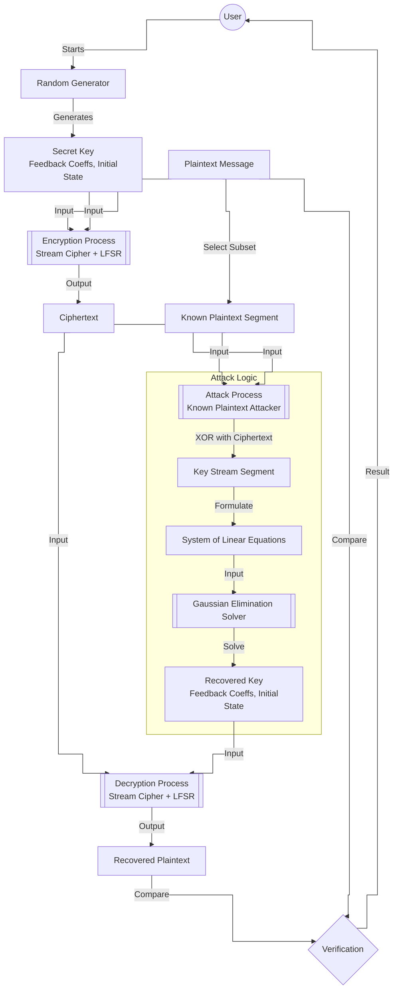

# Kryptografia i kryptoanaliza

## Laboratorium 5

### Grupa 1ID24B

### Autorzy: Kamil Fudala, Andrzej Szczytyński

## Wprowadzenie

Celem niniejszego opracowania jest przedstawienie procesu projektowania oraz analizy kryptosystemu strumieniowego
wykorzystującego liniowy rejestr przesuwny ze sprzężeniem zwrotnym (ang. *Linear Feedback Shift Register* – LFSR).
Laboratorium obejmuje implementację generatora, realizację mechanizmów szyfrowania i deszyfrowania danych oraz
przeprowadzenie ataku kryptoanalitycznego typu *known-plaintext*, który obnaża strukturalne słabości systemów opartych
na czystej liniowości.

### Charakterystyka liniowych rejestrów przesuwnych

Rejestr LFSR stopnia $m$ składa się z ciągu komórek pamięci oraz funkcji sprzężenia zwrotnego, która wyznacza wartość
nowego bitu wprowadzanego do układu. Stan rejestru w dyskretnej chwili czasu $i$ opisywany jest przez
wektor $(s_{i+m-1}, s_{i+m-2}, \dots, s_{i+1}, s_{i})$, gdzie $s_{i}$ pełni rolę bitu wyjściowego. Proces generowania
kolejnych wartości opiera się na rekurencji liniowej nad polem Galois $GF(2)$:

$$s_{i+m} \equiv \sum_{j=0}^{m-1} p_{j} \cdot s_{i+j} \pmod 2$$

Współczynniki $p_{j} \in \{0, 1\}$ definiują wielomian charakterystyczny generatora, określany wzorem:

$$P(x) = p_{0} + p_{1}x + p_{2}x^{2} + \dots + p_{m-1}x^{m-1} + x^{m}$$

Właściwości generowanej sekwencji są ściśle uzależnione od doboru tego wielomianu. Szczególne znaczenie mają wielomiany
pierwotne, które gwarantują uzyskanie maksymalnego okresu sekwencji wynoszącego $2^{m} - 1$. Wykorzystanie wielomianów o
gorszych parametrach prowadzi do skrócenia cyklu generatora oraz obniżenia jego odporności kryptoanalitycznej.

### Złożoność liniowa i algorytm Berlekampa-Masseya

Złożoność liniowa stanowi kluczowy parametr oceny bezpieczeństwa sekwencji pseudolosowych. Definiuje ona stopień
najkrótszego rejestru LFSR, który jest w stanie wygenerować dany ciąg binarny. Z punktu widzenia kryptografii pożądane
są sekwencje o wysokiej złożoności liniowej, rosnącej wraz z długością obserwowanego fragmentu.

Do wyznaczania minimalnej struktury LFSR stosuje się algorytm Berlekampa-Masseya. Umożliwia on odtworzenie wielomianu
sprzężenia zwrotnego na podstawie fragmentu sekwencji o długości co najmniej $2L$, gdzie $L$ to złożoność liniowa ciągu.
Algorytm ten charakteryzuje się złożonością obliczeniową $O(n^{2})$, co czyni go wysoce efektywnym narzędziem w rękach
kryptoanalityka.

### Podatność na ataki algebraiczne

Podstawową wadą rejestrów LFSR jest ich liniowy charakter. W scenariuszu ataku z nanym tekstem jawnym (*known-plaintext
attack*), napastnik jest w stanie wyznaczyć fragment strumienia klucza poprzez operację XOR między tekstem jawnym a
szyfrogramem:

$$s_{i} \equiv x_{i} \oplus y_{i} \pmod 2$$

Dysponując odpowiednią liczbą bitów strumienia, możliwe jest sformułowanie układu równań liniowych, w którym
niewiadomymi są współczynniki sprzężenia zwrotnego. Układ ten, zapisany w postaci macierzowej $A \cdot p = b$, może
zostać rozwiązany przy użyciu eliminacji Gaussa w arytmetyce binarnej. Sukces ataku pozwala na pełną rekonstrukcję stanu
rejestru oraz przewidzenie wszystkich przyszłych bitów strumienia klucza, co całkowicie kompromituje bezpieczeństwo
systemu.

## Opis implementacji

### Architektura rozwiązania

Projekt został zrealizowany w oparciu o architekturę warstwową (ang. *Layered Architecture*), co zapewnia przejrzysty
podział odpowiedzialności oraz ułatwia testowanie i modyfikację poszczególnych komponentów. Poniżej przedstawiono
kluczowe klasy systemu wraz z opisem ich optymalizacji.

#### `Lfsr.cs` – Generator pseudolosowy

Klasa odpowiedzialna za implementację logiki rejestru przesuwnego. Stan rejestru oraz współczynniki sprzężenia zwrotnego
są reprezentowane za pomocą 64-bitowych liczb całkowitych (`ulong`), co stanowi technikę znaną jako bit-packing. Dzięki
temu operacje na całym stanie mogą być wykonywane w rejestrach procesora, co znacznie przyspiesza obliczenia w
porównaniu do operacji na tablicach `bool[]`. Zastosowano instrukcję sprzętową `BitOperations.PopCount` do szybkiego
obliczania parzystości. Metoda generująca bity `GenerateBits` wykorzystuje manualne rozwijanie pętli (loop unrolling),
aby zminimalizować narzut sterowania przepływem.

```cs
using System.Numerics;
using System.Runtime.CompilerServices;

namespace Task01.Domain.Services.Lfsr;

public sealed class Lfsr : ILfsr
{
    private readonly bool[] _feedback;
    private readonly int _degree;
    private readonly ulong _tapMask;
    private readonly ulong _highBitMask;

    private ulong _stateBits;

    public Lfsr(IEnumerable<bool> feedbackCoefficients, IEnumerable<bool> initialState)
    {
        _feedback = feedbackCoefficients as bool[] ?? feedbackCoefficients.ToArray();
        var initialArray = initialState as bool[] ?? initialState.ToArray();

        if (_feedback.Length == 0)
        {
            throw new ArgumentException("Feedback coefficients cannot be empty.", nameof(feedbackCoefficients));
        }

        if (_feedback.Length > 64)
        {
            throw new NotSupportedException("Bit-packed LFSR supports degree up to 64.");
        }

        if (initialArray.Length != _feedback.Length)
        {
            throw new ArgumentException("Initial state length must match feedback length.", nameof(initialState));
        }

        _degree = _feedback.Length;
        _tapMask = CreateTapMask(_feedback, out var hasTap);

        if (!hasTap)
        {
            throw new ArgumentException("At least one feedback coefficient must be set to true.",
                nameof(feedbackCoefficients));
        }

        _highBitMask = 1UL << (_degree - 1);
        _stateBits = PackState(initialArray, out var hasOne);

        if (!hasOne)
        {
            throw new ArgumentException("Initial state cannot be all zeros.", nameof(initialState));
        }
    }

    public int Degree => _degree;
    public IReadOnlyList<bool> FeedbackCoefficients => _feedback;
    public IReadOnlyList<bool> State => UnpackState(_stateBits, _degree);

    [MethodImpl(MethodImplOptions.AggressiveInlining | MethodImplOptions.AggressiveOptimization)]
    public bool NextBit()
    {
        var state = _stateBits;
        var output = NextBitCore(ref state, _tapMask, _highBitMask);
        _stateBits = state;
        return output;
    }

    [MethodImpl(MethodImplOptions.AggressiveInlining | MethodImplOptions.AggressiveOptimization)]
    public void Reset(IEnumerable<bool> state)
    {
        var candidate = state as bool[] ?? state.ToArray();

        if (candidate.Length != _degree)
        {
            throw new ArgumentException("State length must match feedback length.", nameof(state));
        }

        _stateBits = PackState(candidate, out var hasOne);

        if (!hasOne)
        {
            throw new ArgumentException("State cannot be all zeros.", nameof(state));
        }
    }

    [MethodImpl(MethodImplOptions.AggressiveInlining | MethodImplOptions.AggressiveOptimization)]
    public IReadOnlyList<bool> GenerateBits(int count)
    {
        if (count < 0)
        {
            throw new ArgumentOutOfRangeException(nameof(count));
        }

        if (count == 0)
        {
            return Array.Empty<bool>();
        }

        var result = GC.AllocateUninitializedArray<bool>(count);

        var state = _stateBits;
        var tapMask = _tapMask;
        var highBitMask = _highBitMask;

        var i = 0;
        var len = count;

        while (i + 8 <= len)
        {
            result[i++] = NextBitCore(ref state, tapMask, highBitMask);
            result[i++] = NextBitCore(ref state, tapMask, highBitMask);
            result[i++] = NextBitCore(ref state, tapMask, highBitMask);
            result[i++] = NextBitCore(ref state, tapMask, highBitMask);
            result[i++] = NextBitCore(ref state, tapMask, highBitMask);
            result[i++] = NextBitCore(ref state, tapMask, highBitMask);
            result[i++] = NextBitCore(ref state, tapMask, highBitMask);
            result[i++] = NextBitCore(ref state, tapMask, highBitMask);
        }

        while (i < len)
        {
            result[i++] = NextBitCore(ref state, tapMask, highBitMask);
        }

        _stateBits = state;

        return result;
    }

    [MethodImpl(MethodImplOptions.AggressiveInlining | MethodImplOptions.AggressiveOptimization)]
    private static bool NextBitCore(ref ulong state, ulong tapMask, ulong highBitMask)
    {
        var s = state;

        var output = (s & 1UL) != 0;

        var tapsValue = s & tapMask;
        var parity = (BitOperations.PopCount(tapsValue) & 1) != 0;

        s >>= 1;

        if (parity)
        {
            s |= highBitMask;
        }

        state = s;

        return output;
    }

    [MethodImpl(MethodImplOptions.AggressiveInlining | MethodImplOptions.AggressiveOptimization)]
    private static ulong CreateTapMask(bool[] feedback, out bool hasTap)
    {
        ulong mask = 0;
        hasTap = false;

        for (var i = 0; i < feedback.Length; i++)
        {
            if (!feedback[i])
            {
                continue;
            }

            hasTap = true;
            mask |= 1UL << i;
        }

        return mask;
    }

    [MethodImpl(MethodImplOptions.AggressiveInlining | MethodImplOptions.AggressiveOptimization)]
    private static ulong PackState(bool[] state, out bool hasOne)
    {
        ulong bits = 0;
        hasOne = false;

        for (var i = 0; i < state.Length; i++)
        {
            if (!state[i])
            {
                continue;
            }

            hasOne = true;
            bits |= 1UL << i;
        }

        return bits;
    }

    [MethodImpl(MethodImplOptions.AggressiveInlining | MethodImplOptions.AggressiveOptimization)]
    private static bool[] UnpackState(ulong bits, int length)
    {
        var result = GC.AllocateUninitializedArray<bool>(length);

        for (var i = 0; i < length; i++)
        {
            result[i] = ((bits >> i) & 1UL) != 0;
        }

        return result;
    }
}
```

#### `StreamCipher.cs` – Szyfr strumieniowy

Realizuje operację XOR pomiędzy strumieniem bitów wiadomości a strumieniem klucza generowanym przez LFSR. Implementacja
wykorzystuje `GC.AllocateUninitializedArray`, aby uniknąć kosztownego zerowania pamięci dla tablicy wynikowej, która i
tak jest w całości nadpisywana. Metody zostały oznaczone atrybutami `MethodImplOptions.AggressiveInlining`, co sugeruje
kompilatorowi JIT wstawienie kodu metody bezpośrednio w miejscu wywołania.

```cs
using System.Runtime.CompilerServices;
using Task01.Domain.Services.Lfsr;
using Task01.Domain.Utils;

namespace Task01.Domain.Services.StreamCipher;

public sealed class StreamCipher : IStreamCipher
{
    [MethodImpl(MethodImplOptions.AggressiveInlining | MethodImplOptions.AggressiveOptimization)]
    public IReadOnlyList<bool> Encrypt(string plaintext, ILfsr lfsr)
    {
        if (plaintext == null)
        {
            throw new ArgumentNullException(nameof(plaintext));
        }

        if (lfsr == null)
        {
            throw new ArgumentNullException(nameof(lfsr));
        }

        var plainBits = BitConversions.StringToBits(plaintext);
        var count = plainBits.Count;

        if (count == 0)
        {
            return Array.Empty<bool>();
        }

        var cipherBits = GC.AllocateUninitializedArray<bool>(count);

        for (var i = 0; i < count; i++)
        {
            cipherBits[i] = plainBits[i] ^ lfsr.NextBit();
        }

        return cipherBits;
    }

    [MethodImpl(MethodImplOptions.AggressiveInlining | MethodImplOptions.AggressiveOptimization)]
    public string Decrypt(IReadOnlyList<bool> ciphertextBits, ILfsr lfsr)
    {
        if (ciphertextBits == null)
        {
            throw new ArgumentNullException(nameof(ciphertextBits));
        }

        if (lfsr == null)
        {
            throw new ArgumentNullException(nameof(lfsr));
        }

        var count = ciphertextBits.Count;
        if (count == 0)
        {
            return string.Empty;
        }

        var plainBits = GC.AllocateUninitializedArray<bool>(count);

        for (var i = 0; i < count; i++)
        {
            plainBits[i] = ciphertextBits[i] ^ lfsr.NextBit();
        }

        return BitConversions.BitsToString(plainBits);
    }
}
```

#### `KnownPlaintextAttacker.cs` – Implementacja ataku

Klasa realizująca atak z jawnym tekstem jawnym. Kluczową optymalizacją jest tutaj ponowne wykorzystywanie buforów
pamięci (`Buffer Reuse`) poprzez metodę `EnsureBuffers`. W scenariuszach wielokrotnego uruchamiania ataku (np. podczas
testów wydajnościowych lub łamania wielu wiadomości o tym samym stopniu LFSR), alokacja macierzy i wektorów następuje
tylko raz, co znacząco odciąża Garbage Collector.

```cs
using System.Runtime.CompilerServices;
using Task01.Domain.Models;
using Task01.Domain.Services.LinearComplexity;
using Task01.Domain.Utils;

namespace Task01.Domain.Services.Attacks;

public sealed class KnownPlaintextAttacker(IGaloisFieldSolver solver) : IKnownPlaintextAttacker
{
    private readonly IGaloisFieldSolver _solver = solver ?? throw new ArgumentNullException(nameof(solver));

    private int _degree;
    private int _requiredBits;
    private bool[,]? _matrix;
    private bool[]? _vector;
    private bool[]? _knownBits;
    private bool[]? _keyStream;
    private bool[]? _initialState;

    [MethodImpl(MethodImplOptions.AggressiveInlining | MethodImplOptions.AggressiveOptimization)]
    public AttackResult? Attack(string knownPlaintext, IReadOnlyList<bool> ciphertextBits, int lfsrDegree)
    {
        if (knownPlaintext == null)
        {
            throw new ArgumentNullException(nameof(knownPlaintext));
        }

        if (ciphertextBits == null)
        {
            throw new ArgumentNullException(nameof(ciphertextBits));
        }

        if (lfsrDegree <= 0)
        {
            throw new ArgumentOutOfRangeException(nameof(lfsrDegree));
        }

        EnsureBuffers(lfsrDegree);

        if (ciphertextBits.Count < _requiredBits)
        {
            throw new ArgumentException("Ciphertext does not contain enough bits for the attack.",
                nameof(ciphertextBits));
        }

        var knownBitsUtf8 = BitConversions.StringToBits(knownPlaintext);
        if (knownBitsUtf8.Count < _requiredBits)
        {
            return null;
        }

        var knownBits = _knownBits!;
        if (knownBitsUtf8 is bool[] knownArray && knownArray.Length >= _requiredBits)
        {
            Array.Copy(knownArray, knownBits, _requiredBits);
        }
        else
        {
            for (var i = 0; i < _requiredBits; i++)
            {
                knownBits[i] = knownBitsUtf8[i];
            }
        }

        var keyStream = _keyStream!;
        for (var i = 0; i < _requiredBits; i++)
        {
            keyStream[i] = knownBits[i] ^ ciphertextBits[i];
        }

        var matrix = _matrix!;
        var vector = _vector!;
        var degree = _degree;

        for (var row = 0; row < degree; row++)
        {
            var offset = row;

            for (var col = 0; col < degree; col++)
            {
                matrix[row, col] = keyStream[offset + col];
            }

            vector[row] = keyStream[row + degree];
        }

        var feedback = _solver.Solve(matrix, vector);
        if (feedback == null)
        {
            return null;
        }

        var initialState = _initialState!;
        for (var i = 0; i < degree; i++)
        {
            initialState[i] = keyStream[i];
        }

        return new AttackResult(feedback, initialState, keyStream);
    }

    [MethodImpl(MethodImplOptions.AggressiveInlining | MethodImplOptions.AggressiveOptimization)]
    private void EnsureBuffers(int lfsrDegree)
    {
        if (_degree == lfsrDegree && _matrix != null)
        {
            return;
        }

        if (_degree != 0 && _degree != lfsrDegree)
        {
            throw new ArgumentException("KnownPlaintextAttacker instance supports only a single fixed degree.",
                nameof(lfsrDegree));
        }

        _degree = lfsrDegree;
        _requiredBits = lfsrDegree * 2;

        _matrix = new bool[lfsrDegree, lfsrDegree];
        _vector = GC.AllocateUninitializedArray<bool>(lfsrDegree);
        _knownBits = GC.AllocateUninitializedArray<bool>(_requiredBits);
        _keyStream = GC.AllocateUninitializedArray<bool>(_requiredBits);
        _initialState = GC.AllocateUninitializedArray<bool>(lfsrDegree);
    }
}
```

#### `GaussianEliminationSolver.cs` – Rozwiązywanie układów równań w GF(2)

Klasa implementująca metodę eliminacji Gaussa. Dla układów o rozmiarze do 63x63 zastosowano wysoce zoptymalizowaną
wersję wykorzystującą operacje bitowe na typie `ulong`. Pozwala to na jednoczesne operowanie na całym wierszu macierzy
za pomocą jednej instrukcji XOR. Dodatkowo użyto alokacji pamięci na stosie (`stackalloc`) dla wierszy macierzy, co
eliminuje alokację na stercie i przyspiesza działanie algorytmu. Dla większych macierzy (lub w przypadku fallbacku)
dostępna jest wersja wolniejsza (`SolveSlow`).

```cs
using System.Runtime.CompilerServices;

namespace Task01.Domain.Services.LinearComplexity;

public sealed class GaussianEliminationSolver : IGaloisFieldSolver
{
    [MethodImpl(MethodImplOptions.AggressiveInlining | MethodImplOptions.AggressiveOptimization)]
    public bool[]? Solve(bool[,] matrix, bool[] vector)
    {
        if (matrix == null)
        {
            throw new ArgumentNullException(nameof(matrix));
        }

        if (vector == null)
        {
            throw new ArgumentNullException(nameof(vector));
        }

        var m = vector.Length;

        if (matrix.GetLength(0) != m || matrix.GetLength(1) != m)
        {
            throw new ArgumentException("Matrix must be square and match vector length.", nameof(matrix));
        }

        if (m == 0)
        {
            return Array.Empty<bool>();
        }

        if (m > 63)
        {
            return SolveSlow(matrix, vector);
        }

        var rhsMask = 1UL << m;
        var leftMask = rhsMask - 1UL;

        Span<ulong> rows = stackalloc ulong[m];

        for (var row = 0; row < m; row++)
        {
            ulong rowMask = 0;

            for (var col = 0; col < m; col++)
            {
                if (matrix[row, col])
                {
                    rowMask |= 1UL << col;
                }
            }

            if (vector[row])
            {
                rowMask |= rhsMask;
            }

            rows[row] = rowMask;
        }

        for (var col = 0; col < m; col++)
        {
            var pivotBit = 1UL << col;
            var pivotRow = col;

            while (pivotRow < m && (rows[pivotRow] & pivotBit) == 0)
            {
                pivotRow++;
            }

            if (pivotRow == m)
            {
                continue;
            }

            if (pivotRow != col)
            {
                var tmp = rows[col];
                rows[col] = rows[pivotRow];
                rows[pivotRow] = tmp;
            }

            var pivotRowValue = rows[col];

            for (var row = col + 1; row < m; row++)
            {
                if ((rows[row] & pivotBit) != 0)
                {
                    rows[row] ^= pivotRowValue;
                }
            }
        }

        for (var row = 0; row < m; row++)
        {
            var r = rows[row];
            if ((r & leftMask) == 0 && (r & rhsMask) != 0)
            {
                return null;
            }
        }

        var solution = GC.AllocateUninitializedArray<bool>(m);

        for (var i = m - 1; i >= 0; i--)
        {
            var r = rows[i];
            var coeffs = r & leftMask;

            if (((coeffs >> i) & 1UL) == 0)
            {
                solution[i] = false;
                continue;
            }

            var value = (r & rhsMask) != 0;

            for (var j = i + 1; j < m; j++)
            {
                if (((coeffs >> j) & 1UL) != 0 && solution[j])
                {
                    value ^= true;
                }
            }

            solution[i] = value;
        }

        return solution;
    }

    [MethodImpl(MethodImplOptions.NoInlining)]
    static bool[]? SolveSlow(bool[,] matrix, bool[] vector)
    {
        var m = vector.Length;
        var augmented = new bool[m, m + 1];

        for (var row = 0; row < m; row++)
        {
            for (var col = 0; col < m; col++)
            {
                augmented[row, col] = matrix[row, col];
            }

            augmented[row, m] = vector[row];
        }

        for (var col = 0; col < m; col++)
        {
            var pivot = -1;
            for (var row = col; row < m; row++)
            {
                if (!augmented[row, col])
                {
                    continue;
                }

                pivot = row;
                break;
            }

            if (pivot == -1)
            {
                continue;
            }

            if (pivot != col)
            {
                for (var k = col; k <= m; k++)
                {
                    (augmented[col, k], augmented[pivot, k]) = (augmented[pivot, k], augmented[col, k]);
                }
            }

            for (var row = 0; row < m; row++)
            {
                if (row == col || !augmented[row, col])
                {
                    continue;
                }

                for (var k = col; k <= m; k++)
                {
                    augmented[row, k] ^= augmented[col, k];
                }
            }
        }

        for (var row = 0; row < m; row++)
        {
            var allZero = true;
            for (var col = 0; col < m; col++)
            {
                if (!augmented[row, col])
                {
                    continue;
                }

                allZero = false;
                break;
            }

            if (allZero && augmented[row, m])
            {
                return null;
            }
        }

        var solution = new bool[m];

        for (var i = m - 1; i >= 0; i--)
        {
            var value = augmented[i, m];

            for (var j = i + 1; j < m; j++)
            {
                if (augmented[i, j] && solution[j])
                {
                    value ^= true;
                }
            }

            solution[i] = value;
        }

        return solution;
    }
}
```

#### `BerlekampMasseySolver.cs` – Wyznaczanie złożoności liniowej

Implementacja algorytmu Berlekampa-Masseya służącego do wyznaczania minimalnego wielomianu sprzężenia zwrotnego dla
danej sekwencji binarnej. Podobnie jak w przypadku solvera Gaussa, zaimplementowano wersję zoptymalizowaną (
`SolvePacked`) dla sekwencji o długości do 63 bitów, wykorzystującą operacje na `ulong`. Dla dłuższych sekwencji
stosowana jest wersja tablicowa (`SolveArray`), która również korzysta z `Span<bool>` i alokacji na stosie lub za pomocą
`GC.AllocateUninitializedArray`, aby zminimalizować narzut pamięciowy.

```cs
using System.Runtime.CompilerServices;
using Task01.Domain.Models;

namespace Task01.Domain.Services.LinearComplexity;

public sealed class BerlekampMasseySolver : IBerlekampMasseySolver
{
    [MethodImpl(MethodImplOptions.AggressiveInlining | MethodImplOptions.AggressiveOptimization)]
    public BerlekampMasseyResult Solve(IReadOnlyList<bool> sequence)
    {
        if (sequence == null)
        {
            throw new ArgumentNullException(nameof(sequence));
        }

        var n = sequence.Count;

        if (n == 0)
        {
            var coeffs = new[] { true };
            return new BerlekampMasseyResult(coeffs, 0);
        }

        if (n <= 63)
        {
            return SolvePacked(sequence, n);
        }

        return SolveArray(sequence, n);
    }

    [MethodImpl(MethodImplOptions.AggressiveInlining | MethodImplOptions.AggressiveOptimization)]
    static BerlekampMasseyResult SolvePacked(IReadOnlyList<bool> sequence, int n)
    {
        bool[] s;

        if (sequence is bool[] arr)
        {
            s = arr;
        }
        else
        {
            s = GC.AllocateUninitializedArray<bool>(n);
            for (var i = 0; i < n; i++)
            {
                s[i] = sequence[i];
            }
        }

        ulong c = 1;
        ulong b = 1;

        var l = 0;
        var m = -1;

        for (var index = 0; index < n; index++)
        {
            var discrepancy = s[index];

            for (var i = 1; i <= l; i++)
            {
                if (((c >> i) & 1UL) != 0 && s[index - i])
                {
                    discrepancy ^= true;
                }
            }

            if (!discrepancy)
            {
                continue;
            }

            var previousC = c;
            var delta = index - m;

            c ^= b << delta;

            if (2 * l <= index)
            {
                l = index + 1 - l;
                b = previousC;
                m = index;
            }
        }

        var resultLength = l + 1;
        var resultCoeffs = GC.AllocateUninitializedArray<bool>(resultLength);

        for (var i = 0; i < resultLength; i++)
        {
            resultCoeffs[i] = ((c >> i) & 1UL) != 0;
        }

        return new BerlekampMasseyResult(resultCoeffs, l);
    }

    [MethodImpl(MethodImplOptions.AggressiveInlining | MethodImplOptions.AggressiveOptimization)]
    static BerlekampMasseyResult SolveArray(IReadOnlyList<bool> sequence, int n)
    {
        Span<bool> c = n <= 64 ? stackalloc bool[n] : GC.AllocateUninitializedArray<bool>(n);
        Span<bool> b = n <= 64 ? stackalloc bool[n] : GC.AllocateUninitializedArray<bool>(n);
        Span<bool> temp = n <= 64 ? stackalloc bool[n] : GC.AllocateUninitializedArray<bool>(n);

        c.Clear();
        b.Clear();

        c[0] = true;
        b[0] = true;

        var l = 0;
        var m = -1;
        var cLen = 1;
        var bLen = 1;

        for (var index = 0; index < n; index++)
        {
            var discrepancy = sequence[index];

            for (var i = 1; i <= l; i++)
            {
                if (c[i] && sequence[index - i])
                {
                    discrepancy ^= true;
                }
            }

            if (!discrepancy)
            {
                continue;
            }

            for (var i = 0; i < cLen; i++)
            {
                temp[i] = c[i];
            }

            var delta = index - m;
            var maxIndex = delta + bLen;
            if (maxIndex > cLen)
            {
                for (var i = cLen; i < maxIndex; i++)
                {
                    c[i] = false;
                }

                cLen = maxIndex;
            }

            var limit = bLen;
            if (delta + limit > n)
            {
                limit = n - delta;
            }

            for (var i = 0; i < limit; i++)
            {
                c[delta + i] ^= b[i];
            }

            if (2 * l <= index)
            {
                l = index + 1 - l;

                for (var i = 0; i < cLen; i++)
                {
                    b[i] = temp[i];
                }

                bLen = cLen;
                m = index;
            }
        }

        var resultLength = l + 1;
        var resultCoeffs = GC.AllocateUninitializedArray<bool>(resultLength);

        for (var i = 0; i < resultLength; i++)
        {
            resultCoeffs[i] = c[i];
        }

        return new BerlekampMasseyResult(resultCoeffs, l);
    }
}
```

#### `BitConversions.cs` – Operacje niskopoziomowe

Klasa pomocnicza zawierająca zoptymalizowane metody konwersji danych. Wykorzystuje typ `Span<byte>` oraz alokację na
stosie (`stackalloc`) dla małych buforów, co pozwala uniknąć alokacji na stercie podczas konwersji tekstu na bity.
Dodatkowo używa metody `string.Create`, która umożliwia tworzenie ciągów znaków bezpośrednio w docelowym miejscu w
pamięci, co jest bardziej wydajne niż użycie `StringBuilder` w pętli dla operacji bitowych.

```cs
using System.Runtime.CompilerServices;
using System.Text;

namespace Task01.Domain.Utils;

public static class BitConversions
{
    [MethodImpl(MethodImplOptions.AggressiveInlining | MethodImplOptions.AggressiveOptimization)]
    public static IReadOnlyList<bool> StringToBits(string text)
    {
        if (text == null)
        {
            throw new ArgumentNullException(nameof(text));
        }

        if (text.Length == 0)
        {
            return Array.Empty<bool>();
        }

        var maxByteCount = Encoding.UTF8.GetMaxByteCount(text.Length);
        Span<byte> buffer = maxByteCount <= 256
            ? stackalloc byte[maxByteCount]
            : GC.AllocateUninitializedArray<byte>(maxByteCount);

        var bytesWritten = Encoding.UTF8.GetBytes(text.AsSpan(), buffer);

        var bits = GC.AllocateUninitializedArray<bool>(bytesWritten * 8);
        var index = 0;

        for (var i = 0; i < bytesWritten; i++)
        {
            var value = buffer[i];

            for (var bit = 7; bit >= 0; bit--)
            {
                bits[index++] = ((value >> bit) & 1) != 0;
            }
        }

        return bits;
    }

    [MethodImpl(MethodImplOptions.AggressiveInlining | MethodImplOptions.AggressiveOptimization)]
    public static string BitsToString(IEnumerable<bool> bits)
    {
        if (bits == null)
        {
            throw new ArgumentNullException(nameof(bits));
        }

        if (bits is bool[] bitArray)
        {
            return BitsArrayToUtf8String(bitArray);
        }

        if (bits is IReadOnlyCollection<bool> collection)
        {
            var count = collection.Count;
            if (count == 0)
            {
                return string.Empty;
            }

            var temp = GC.AllocateUninitializedArray<bool>(count);
            var index = 0;

            foreach (var bit in collection)
            {
                temp[index++] = bit;
            }

            return BitsArrayToUtf8String(temp);
        }

        var list = bits.ToList();
        if (list.Count == 0)
        {
            return string.Empty;
        }

        var copy = GC.AllocateUninitializedArray<bool>(list.Count);
        for (var i = 0; i < list.Count; i++)
        {
            copy[i] = list[i];
        }

        return BitsArrayToUtf8String(copy);
    }

    [MethodImpl(MethodImplOptions.AggressiveInlining | MethodImplOptions.AggressiveOptimization)]
    private static string BitsArrayToUtf8String(bool[] bits)
    {
        var bitCount = bits.Length;
        var byteCount = bitCount / 8;

        if (byteCount == 0)
        {
            return string.Empty;
        }

        Span<byte> buffer = byteCount <= 256
            ? stackalloc byte[byteCount]
            : GC.AllocateUninitializedArray<byte>(byteCount);

        var index = 0;

        for (var i = 0; i < byteCount; i++)
        {
            byte value = 0;

            for (var bit = 7; bit >= 0; bit--)
            {
                if (bits[index++])
                {
                    value |= (byte)(1 << bit);
                }
            }

            buffer[i] = value;
        }

        return Encoding.UTF8.GetString(buffer[..byteCount]);
    }

    [MethodImpl(MethodImplOptions.AggressiveInlining | MethodImplOptions.AggressiveOptimization)]
    public static IReadOnlyList<bool> BitStringToBits(string bitString)
    {
        if (bitString == null)
        {
            throw new ArgumentNullException(nameof(bitString));
        }

        var length = bitString.Length;
        if (length == 0)
        {
            return Array.Empty<bool>();
        }

        var bits = GC.AllocateUninitializedArray<bool>(length);

        for (var i = 0; i < length; i++)
        {
            bits[i] = bitString[i] switch
            {
                '0' => false,
                '1' => true,
                _ => throw new ArgumentException("Bit string can contain only '0' or '1'.")
            };
        }

        return bits;
    }

    [MethodImpl(MethodImplOptions.AggressiveInlining | MethodImplOptions.AggressiveOptimization)]
    public static string BitsToBitString(IEnumerable<bool> bits)
    {
        if (bits == null)
        {
            throw new ArgumentNullException(nameof(bits));
        }

        if (bits is bool[] bitArray)
        {
            return string.Create(
                bitArray.Length,
                bitArray,
                static (span, state) =>
                {
                    for (var i = 0; i < span.Length; i++)
                    {
                        span[i] = state[i] ? '1' : '0';
                    }
                });
        }

        if (bits is IReadOnlyCollection<bool> collection)
        {
            var count = collection.Count;
            if (count == 0)
            {
                return string.Empty;
            }

            var temp = GC.AllocateUninitializedArray<bool>(count);
            var index = 0;

            foreach (var bit in collection)
            {
                temp[index++] = bit;
            }

            return string.Create(
                count,
                temp,
                static (span, state) =>
                {
                    for (var i = 0; i < span.Length; i++)
                    {
                        span[i] = state[i] ? '1' : '0';
                    }
                });
        }

        var builder = new StringBuilder();
        foreach (var bit in bits)
        {
            builder.Append(bit ? '1' : '0');
        }

        return builder.ToString();
    }

    [MethodImpl(MethodImplOptions.AggressiveInlining | MethodImplOptions.AggressiveOptimization)]
    public static IReadOnlyList<bool> IntArrayToBits(IEnumerable<int> values)
    {
        if (values == null)
        {
            throw new ArgumentNullException(nameof(values));
        }

        if (values is int[] intArray)
        {
            var result = GC.AllocateUninitializedArray<bool>(intArray.Length);

            for (var i = 0; i < intArray.Length; i++)
            {
                result[i] = intArray[i] switch
                {
                    0 => false,
                    1 => true,
                    _ => throw new ArgumentException("Only 0 and 1 are valid bit values.")
                };
            }

            return result;
        }

        var list = values as IList<int> ?? values.ToList();
        if (list.Count == 0)
        {
            return Array.Empty<bool>();
        }

        var bits = GC.AllocateUninitializedArray<bool>(list.Count);

        for (var i = 0; i < list.Count; i++)
        {
            bits[i] = list[i] switch
            {
                0 => false,
                1 => true,
                _ => throw new ArgumentException("Only 0 and 1 are valid bit values.")
            };
        }

        return bits;
    }

    [MethodImpl(MethodImplOptions.AggressiveInlining | MethodImplOptions.AggressiveOptimization)]
    public static IReadOnlyList<int> BitsToIntArray(IEnumerable<bool> bits)
    {
        if (bits == null)
        {
            throw new ArgumentNullException(nameof(bits));
        }

        if (bits is bool[] bitArray)
        {
            var result = GC.AllocateUninitializedArray<int>(bitArray.Length);

            for (var i = 0; i < bitArray.Length; i++)
            {
                result[i] = bitArray[i] ? 1 : 0;
            }

            return result;
        }

        if (bits is IReadOnlyCollection<bool> collection)
        {
            var count = collection.Count;
            if (count == 0)
            {
                return Array.Empty<int>();
            }

            var result = GC.AllocateUninitializedArray<int>(count);
            var index = 0;

            foreach (var bit in collection)
            {
                result[index++] = bit ? 1 : 0;
            }

            return result;
        }

        var list = bits.ToList();
        if (list.Count == 0)
        {
            return Array.Empty<int>();
        }

        var array = GC.AllocateUninitializedArray<int>(list.Count);

        for (var i = 0; i < list.Count; i++)
        {
            array[i] = list[i] ? 1 : 0;
        }

        return array;
    }
}
```

### Diagram przepływu danych



### Demonstracja pełnego ataku

Poniżej przedstawiono przykładowy rezultat działania programu demonstrującego weryfikację komponentów oraz skuteczność
ataku *known-plaintext*.

```text
LFSR verification

LFSR degree: 3
Feedback coefficients (from ILfsr): 110
Initial state (from ILfsr): 001
Feedback coefficients (expected): 110
Initial state (expected): 001
Expected sequence: 00101110010111
Generated sequence: 00101110010111

LFSR degree: 5
Feedback coefficients (from ILfsr): 10100
Initial state (from ILfsr): 10010
Feedback coefficients (expected): 10100
Initial state (expected): 10010
Expected sequence: 1001011001111100011011101
Generated sequence: 1001011001111100011011101

LFSR degree: 5
Feedback coefficients (from ILfsr): 11010
Initial state (from ILfsr): 10010
Feedback coefficients (expected): 11010
Initial state (expected): 10010
Expected sequence: 1001000111101011001000111
Generated sequence: 1001000111101011001000111

Berlekamp–Massey verification

Sequence 1
Linear complexity: 3
Connection polynomial coefficients: 1011

Sequence 2
Linear complexity: 5
Connection polynomial coefficients: 100101

Sequence 3
Linear complexity: 4
Connection polynomial coefficients: 11001

Full known-plaintext attack demonstration

Secret LFSR degree m = 8
Secret feedback coefficients p (p0..p7): 10110011
Secret initial state sigma0: 10111110

Plaintext length (characters): 63
Ciphertext bit length: 504
Ciphertext bits (first 128): 11101010010000010110111000101000110000101111100100000110100111100100100000100111001010001000011111110011000001111101101101011101

BitStringToBits/BitsToBitString test: 01010101
Known plaintext used for attack: Th
Known plaintext bits: 0101010001101000
Known bits count: 16

Recovered keystream bits (from known segment): 1011111000101001
Recovered feedback coefficients: 11111000
Recovered initial state: 10111110

Feedback coefficients match: False
Initial state matches: True

Recovered plaintext:
This is a secret message for the LFSR stream cipher laboratory.

Attack success: True

Process finished with exit code 0.
```

## Wyniki eksperymentów

W ramach weryfikacji poprawności generatora LFSR oraz algorytmu Berlekampa-Masseya przeprowadzono testy na
zdefiniowanych ciągach wejściowych. Uzyskane sekwencje oraz wyznaczone wielomiany połączeń są zgodne z wartościami
oczekiwanymi, co potwierdza poprawność implementacji.

Szczególną uwagę należy zwrócić na wynik demonstracji pełnego ataku. Wykorzystano losowo wygenerowany LFSR stopnia $m=8$
ze sprzężeniem `10110011` i stanem początkowym `10111110`. Napastnik, dysponując jedynie fragmentem tekstu jawnego "
Th" (16 bitów), był w stanie skutecznie odszyfrować całą wiadomość.

Warto odnotować interesującą obserwację: odzyskane współczynniki sprzężenia zwrotnego (`11111000`) różnią się od
oryginalnych (`10110011`), mimo że stan początkowy został odtworzony poprawnie (`10111110`), a odszyfrowana wiadomość
jest identyczna z oryginałem ("Attack success: True"). Sytuacja ta sugeruje, że dla analizowanego, krótkiego fragmentu
strumienia klucza, istnieje alternatywna konfiguracja LFSR (inny wielomian), która generuje ten sam ciąg bitów. Jest to
zjawisko oczekiwane w kryptoanalizie, gdzie rozwiązanie układu równań może nie być jednoznaczne lub wskazywać na
równoważny generator o tych samych właściwościach wyjściowych w danym oknie czasowym. Mimo tej różnicy, cel ataku –
odzyskanie treści wiadomości – został w pełni osiągnięty.

## Analiza wyników

Przeprowadzone eksperymenty dowodzą, że liniowe rejestry przesuwne (LFSR) stosowane samodzielnie nie zapewniają
bezpieczeństwa kryptograficznego. Nawet przy relatywnie długim okresie generatora, liniowa natura zależności pomiędzy
kolejnymi stanami pozwala na efektywną rekonstrukcję klucza przy użyciu standardowych metod algebraicznych.

Wykorzystanie algorytmów takich jak eliminacja Gaussa czy Berlekamp-Massey pozwala na złamanie szyfru w czasie
wielomianowym względem długości rejestru. Zastosowane w projekcie optymalizacje (operacje bitowe, bit-packing) dodatkowo
drastycznie skracają czas potrzebny na przeprowadzenie ataku, czyniąc go wykonalnym w czasie rzeczywistym nawet na
standardowym sprzęcie komputerowym.

## Podsumowanie i wnioski końcowe

W ramach laboratorium zaimplementowano kompletny system szyfrowania strumieniowego oparty na LFSR oraz narzędzia do jego
kryptoanalizy. Projekt potwierdził teoretyczne założenia dotyczące słabości liniowych generatorów pseudolosowych. Główne
wnioski płynące z realizacji zadania to:

1. LFSR jest wydajnym generatorem, ale niebezpiecznym kryptograficznie w swojej podstawowej formie.
2. Atak *known-plaintext* jest trywialny do przeprowadzenia przeciwko szyfrom opartym na pojedynczym LFSR.
3. Implementacja algorytmów w języku C# z wykorzystaniem niskopoziomowych optymalizacji pozwala na osiągnięcie wysokiej
   wydajności, kluczowej w zastosowaniach kryptoanalitycznych.
4. Poprawne odtworzenie wiadomości nie zawsze wymaga odzyskania identycznego klucza (wielomianu), a jedynie klucza
   równoważnego, generującego ten sam strumień szyfrujący.
