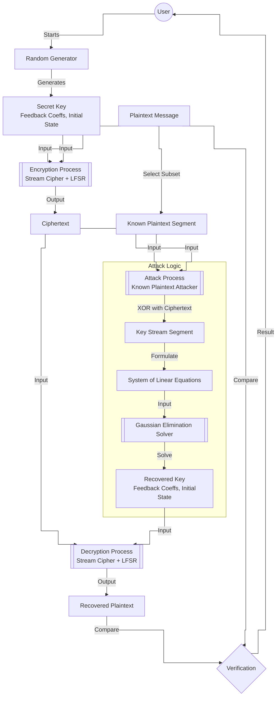

# Kryptografia i kryptoanaliza

## Laboratorium 5

### Grupa 1ID24B

### Autorzy: Kamil Fudala, Andrzej Szczytyński

## Wprowadzenie

Celem niniejszego opracowania jest przedstawienie procesu projektowania oraz analizy kryptosystemu strumieniowego wykorzystującego liniowy rejestr przesuwny ze sprzężeniem zwrotnym (ang. *Linear Feedback Shift Register* – LFSR). Laboratorium obejmuje implementację generatora, realizację mechanizmów szyfrowania i deszyfrowania danych oraz przeprowadzenie ataku kryptoanalitycznego typu *known-plaintext*, który obnaża strukturalne słabości systemów opartych na czystej liniowości.

### Charakterystyka liniowych rejestrów przesuwnych

Rejestr LFSR stopnia $m$ składa się z ciągu komórek pamięci oraz funkcji sprzężenia zwrotnego, która wyznacza wartość nowego bitu wprowadzanego do układu. Stan rejestru w dyskretnej chwili czasu $i$ opisywany jest przez wektor $(s_{i+m-1}, s_{i+m-2}, \dots, s_{i+1}, s_{i})$, gdzie $s_{i}$ pełni rolę bitu wyjściowego. Proces generowania kolejnych wartości opiera się na rekurencji liniowej nad polem Galois $GF(2)$:

$$s_{i+m} \equiv \sum_{j=0}^{m-1} p_{j} \cdot s_{i+j} \pmod 2$$

Współczynniki $p_{j} \in \{0, 1\}$ definiują wielomian charakterystyczny generatora, określany wzorem:

$$P(x) = p_{0} + p_{1}x + p_{2}x^{2} + \dots + p_{m-1}x^{m-1} + x^{m}$$

Właściwości generowanej sekwencji są ściśle uzależnione od doboru tego wielomianu. Szczególne znaczenie mają wielomiany pierwotne, które gwarantują uzyskanie maksymalnego okresu sekwencji wynoszącego $2^{m} - 1$. Wykorzystanie wielomianów o gorszych parametrach prowadzi do skrócenia cyklu generatora oraz obniżenia jego odporności kryptoanalitycznej.

### Złożoność liniowa i algorytm Berlekampa-Masseya

Złożoność liniowa stanowi kluczowy parametr oceny bezpieczeństwa sekwencji pseudolosowych. Definiuje ona stopień najkrótszego rejestru LFSR, który jest w stanie wygenerować dany ciąg binarny. Z punktu widzenia kryptografii pożądane są sekwencje o wysokiej złożoności liniowej, rosnącej wraz z długością obserwowanego fragmentu.

Do wyznaczania minimalnej struktury LFSR stosuje się algorytm Berlekampa-Masseya. Umożliwia on odtworzenie wielomianu sprzężenia zwrotnego na podstawie fragmentu sekwencji o długości co najmniej $2L$, gdzie $L$ to złożoność liniowa ciągu. Algorytm ten charakteryzuje się złożonością obliczeniową $O(n^{2})$, co czyni go wysoce efektywnym narzędziem w rękach kryptoanalityka.

### Podatność na ataki algebraiczne

Podstawową wadą rejestrów LFSR jest ich liniowy charakter. W scenariuszu ataku z nanym tekstem jawnym (*known-plaintext attack*), napastnik jest w stanie wyznaczyć fragment strumienia klucza poprzez operację XOR między tekstem jawnym a szyfrogramem:

$$s_{i} \equiv x_{i} \oplus y_{i} \pmod 2$$

Dysponując odpowiednią liczbą bitów strumienia, możliwe jest sformułowanie układu równań liniowych, w którym niewiadomymi są współczynniki sprzężenia zwrotnego. Układ ten, zapisany w postaci macierzowej $A \cdot p = b$, może zostać rozwiązany przy użyciu eliminacji Gaussa w arytmetyce binarnej. Sukces ataku pozwala na pełną rekonstrukcję stanu rejestru oraz przewidzenie wszystkich przyszłych bitów strumienia klucza, co całkowicie kompromituje bezpieczeństwo systemu.

## Opis implementacji

### Architektura rozwiązania

Projekt został zrealizowany w oparciu o architekturę warstwową (ang. *Layered Architecture*), co zapewnia przejrzysty podział odpowiedzialności oraz ułatwia testowanie i modyfikację poszczególnych komponentów. Poniżej przedstawiono kluczowe klasy systemu wraz z opisem ich optymalizacji i dokumentacją funkcji.

#### `Lfsr.cs` – Generator pseudolosowy

Klasa odpowiedzialna za implementację logiki rejestru przesuwnego. Stan rejestru oraz współczynniki sprzężenia zwrotnego są reprezentowane za pomocą 64-bitowych liczb całkowitych (`ulong`), co stanowi technikę znaną jako bit-packing. Dzięki temu operacje na całym stanie mogą być wykonywane w rejestrach procesora, co znacznie przyspiesza obliczenia w porównaniu do operacji na tablicach `bool[]`. Zastosowano instrukcję sprzętową `BitOperations.PopCount` do szybkiego obliczania parzystości. Metoda generująca bity `GenerateBits` wykorzystuje manualne rozwijanie pętli (loop unrolling), aby zminimalizować narzut sterowania przepływem.

**Dokumentacja kluczowych metod:**
*   `Lfsr(IEnumerable<bool> feedbackCoefficients, IEnumerable<bool> initialState)`: Konstruktor inicjalizujący LFSR. Konwertuje tablice boolowskie na upakowaną reprezentację `ulong`. Rzuca wyjątki przy niepoprawnych danych wejściowych (np. stan zerowy, długość > 64).
*   `NextBit()`: Generuje pojedynczy bit wyjściowy i aktualizuje stan rejestru. Zwraca `bool`.
*   `GenerateBits(int count)`: Generuje blok `count` bitów. Zwraca `IReadOnlyList<bool>`. Metoda zoptymalizowana przez rozwijanie pętli.

```cs
using System.Numerics;
using System.Runtime.CompilerServices;

namespace Task01.Domain.Services.Lfsr;

public sealed class Lfsr : ILfsr
{
    private readonly bool[] _feedback;
    private readonly int _degree;
    private readonly ulong _tapMask;
    private readonly ulong _highBitMask;

    private ulong _stateBits;

    public Lfsr(IEnumerable<bool> feedbackCoefficients, IEnumerable<bool> initialState)
    {
        _feedback = feedbackCoefficients as bool[] ?? feedbackCoefficients.ToArray();
        var initialArray = initialState as bool[] ?? initialState.ToArray();

        if (_feedback.Length == 0)
        {
            throw new ArgumentException("Feedback coefficients cannot be empty.", nameof(feedbackCoefficients));
        }

        if (_feedback.Length > 64)
        {
            throw new NotSupportedException("Bit-packed LFSR supports degree up to 64.");
        }

        if (initialArray.Length != _feedback.Length)
        {
            throw new ArgumentException("Initial state length must match feedback length.", nameof(initialState));
        }

        _degree = _feedback.Length;
        _tapMask = CreateTapMask(_feedback, out var hasTap);

        if (!hasTap)
        {
            throw new ArgumentException("At least one feedback coefficient must be set to true.",
                nameof(feedbackCoefficients));
        }

        _highBitMask = 1UL << (_degree - 1);
        _stateBits = PackState(initialArray, out var hasOne);

        if (!hasOne)
        {
            throw new ArgumentException("Initial state cannot be all zeros.", nameof(initialState));
        }
    }

    public int Degree => _degree;
    public IReadOnlyList<bool> FeedbackCoefficients => _feedback;
    public IReadOnlyList<bool> State => UnpackState(_stateBits, _degree);

    [MethodImpl(MethodImplOptions.AggressiveInlining | MethodImplOptions.AggressiveOptimization)]
    public bool NextBit()
    {
        var state = _stateBits;
        var output = NextBitCore(ref state, _tapMask, _highBitMask);
        _stateBits = state;
        return output;
    }

    [MethodImpl(MethodImplOptions.AggressiveInlining | MethodImplOptions.AggressiveOptimization)]
    public void Reset(IEnumerable<bool> state)
    {
        var candidate = state as bool[] ?? state.ToArray();

        if (candidate.Length != _degree)
        {
            throw new ArgumentException("State length must match feedback length.", nameof(state));
        }

        _stateBits = PackState(candidate, out var hasOne);

        if (!hasOne)
        {
            throw new ArgumentException("State cannot be all zeros.", nameof(state));
        }
    }

    [MethodImpl(MethodImplOptions.AggressiveInlining | MethodImplOptions.AggressiveOptimization)]
    public IReadOnlyList<bool> GenerateBits(int count)
    {
        if (count < 0)
        {
            throw new ArgumentOutOfRangeException(nameof(count));
        }

        if (count == 0)
        {
            return Array.Empty<bool>();
        }

        var result = GC.AllocateUninitializedArray<bool>(count);

        var state = _stateBits;
        var tapMask = _tapMask;
        var highBitMask = _highBitMask;

        var i = 0;
        var len = count;

        while (i + 8 <= len)
        {
            result[i++] = NextBitCore(ref state, tapMask, highBitMask);
            result[i++] = NextBitCore(ref state, tapMask, highBitMask);
            result[i++] = NextBitCore(ref state, tapMask, highBitMask);
            result[i++] = NextBitCore(ref state, tapMask, highBitMask);
            result[i++] = NextBitCore(ref state, tapMask, highBitMask);
            result[i++] = NextBitCore(ref state, tapMask, highBitMask);
            result[i++] = NextBitCore(ref state, tapMask, highBitMask);
            result[i++] = NextBitCore(ref state, tapMask, highBitMask);
        }

        while (i < len)
        {
            result[i++] = NextBitCore(ref state, tapMask, highBitMask);
        }

        _stateBits = state;

        return result;
    }

    [MethodImpl(MethodImplOptions.AggressiveInlining | MethodImplOptions.AggressiveOptimization)]
    private static bool NextBitCore(ref ulong state, ulong tapMask, ulong highBitMask)
    {
        var s = state;

        var output = (s & 1UL) != 0;

        var tapsValue = s & tapMask;
        var parity = (BitOperations.PopCount(tapsValue) & 1) != 0;

        s >>= 1;

        if (parity)
        {
            s |= highBitMask;
        }

        state = s;

        return output;
    }

    [MethodImpl(MethodImplOptions.AggressiveInlining | MethodImplOptions.AggressiveOptimization)]
    private static ulong CreateTapMask(bool[] feedback, out bool hasTap)
    {
        ulong mask = 0;
        hasTap = false;

        for (var i = 0; i < feedback.Length; i++)
        {
            if (!feedback[i])
            {
                continue;
            }

            hasTap = true;
            mask |= 1UL << i;
        }

        return mask;
    }

    [MethodImpl(MethodImplOptions.AggressiveInlining | MethodImplOptions.AggressiveOptimization)]
    private static ulong PackState(bool[] state, out bool hasOne)
    {
        ulong bits = 0;
        hasOne = false;

        for (var i = 0; i < state.Length; i++)
        {
            if (!state[i])
            {
                continue;
            }

            hasOne = true;
            bits |= 1UL << i;
        }

        return bits;
    }

    [MethodImpl(MethodImplOptions.AggressiveInlining | MethodImplOptions.AggressiveOptimization)]
    private static bool[] UnpackState(ulong bits, int length)
    {
        var result = GC.AllocateUninitializedArray<bool>(length);

        for (var i = 0; i < length; i++)
        {
            result[i] = ((bits >> i) & 1UL) != 0;
        }

        return result;
    }
}
```

#### `StreamCipher.cs` – Szyfr strumieniowy

Realizuje operację XOR pomiędzy strumieniem bitów wiadomości a strumieniem klucza generowanym przez LFSR. Implementacja wykorzystuje `GC.AllocateUninitializedArray`, aby uniknąć kosztownego zerowania pamięci dla tablicy wynikowej, która i tak jest w całości nadpisywana. Metody zostały oznaczone atrybutami `MethodImplOptions.AggressiveInlining`, co sugeruje kompilatorowi JIT wstawienie kodu metody bezpośrednio w miejscu wywołania.

**Dokumentacja kluczowych metod:**
*   `Encrypt(string plaintext, ILfsr lfsr)`: Szyfruje tekst jawny przy użyciu podanego LFSR. Konwertuje tekst na bity i wykonuje operację XOR. Zwraca zaszyfrowane bity.
*   `Decrypt(IReadOnlyList<bool> ciphertextBits, ILfsr lfsr)`: Deszyfruje ciąg bitów. Wykonuje operację XOR z bitami generowanymi przez LFSR i konwertuje wynik z powrotem na napis UTF-8.

```cs
using System.Runtime.CompilerServices;
using Task01.Domain.Services.Lfsr;
using Task01.Domain.Utils;

namespace Task01.Domain.Services.StreamCipher;

public sealed class StreamCipher : IStreamCipher
{
    [MethodImpl(MethodImplOptions.AggressiveInlining | MethodImplOptions.AggressiveOptimization)]
    public IReadOnlyList<bool> Encrypt(string plaintext, ILfsr lfsr)
    {
        if (plaintext == null)
        {
            throw new ArgumentNullException(nameof(plaintext));
        }

        if (lfsr == null)
        {
            throw new ArgumentNullException(nameof(lfsr));
        }

        var plainBits = BitConversions.StringToBits(plaintext);
        var count = plainBits.Count;

        if (count == 0)
        {
            return Array.Empty<bool>();
        }

        var cipherBits = GC.AllocateUninitializedArray<bool>(count);

        for (var i = 0; i < count; i++)
        {
            cipherBits[i] = plainBits[i] ^ lfsr.NextBit();
        }

        return cipherBits;
    }

    [MethodImpl(MethodImplOptions.AggressiveInlining | MethodImplOptions.AggressiveOptimization)]
    public string Decrypt(IReadOnlyList<bool> ciphertextBits, ILfsr lfsr)
    {
        if (ciphertextBits == null)
        {
            throw new ArgumentNullException(nameof(ciphertextBits));
        }

        if (lfsr == null)
        {
            throw new ArgumentNullException(nameof(lfsr));
        }

        var count = ciphertextBits.Count;
        if (count == 0)
        {
            return string.Empty;
        }

        var plainBits = GC.AllocateUninitializedArray<bool>(count);

        for (var i = 0; i < count; i++)
        {
            plainBits[i] = ciphertextBits[i] ^ lfsr.NextBit();
        }

        return BitConversions.BitsToString(plainBits);
    }
}
```

#### `KnownPlaintextAttacker.cs` – Implementacja ataku

Klasa realizująca atak z jawnym tekstem jawnym. Kluczową optymalizacją jest tutaj ponowne wykorzystywanie buforów pamięci (`Buffer Reuse`) poprzez metodę `EnsureBuffers`. W scenariuszach wielokrotnego uruchamiania ataku (np. podczas testów wydajnościowych lub łamania wielu wiadomości o tym samym stopniu LFSR), alokacja macierzy i wektorów następuje tylko raz, co znacząco odciąża Garbage Collector.

**Dokumentacja kluczowych metod:**
*   `Attack(string knownPlaintext, IReadOnlyList<bool> ciphertextBits, int lfsrDegree)`: Próbuje odtworzyć klucz (stan początkowy i wielomian) na podstawie fragmentu tekstu jawnego i pełnego szyfrogramu. Buduje układ równań liniowych i rozwiązuje go. Zwraca `AttackResult` lub `null` w przypadku niepowodzenia.
*   `EnsureBuffers(int lfsrDegree)`: Metoda pomocnicza alokująca bufory robocze (macierz, wektory) tylko wtedy, gdy stopień LFSR uległ zmianie lub bufory nie istnieją.

```cs
using System.Runtime.CompilerServices;
using Task01.Domain.Models;
using Task01.Domain.Services.LinearComplexity;
using Task01.Domain.Utils;

namespace Task01.Domain.Services.Attacks;

public sealed class KnownPlaintextAttacker(IGaloisFieldSolver solver) : IKnownPlaintextAttacker
{
    private readonly IGaloisFieldSolver _solver = solver ?? throw new ArgumentNullException(nameof(solver));

    private int _degree;
    private int _requiredBits;
    private bool[,]? _matrix;
    private bool[]? _vector;
    private bool[]? _knownBits;
    private bool[]? _keyStream;
    private bool[]? _initialState;

    [MethodImpl(MethodImplOptions.AggressiveInlining | MethodImplOptions.AggressiveOptimization)]
    public AttackResult? Attack(string knownPlaintext, IReadOnlyList<bool> ciphertextBits, int lfsrDegree)
    {
        if (knownPlaintext == null)
        {
            throw new ArgumentNullException(nameof(knownPlaintext));
        }

        if (ciphertextBits == null)
        {
            throw new ArgumentNullException(nameof(ciphertextBits));
        }

        if (lfsrDegree <= 0)
        {
            throw new ArgumentOutOfRangeException(nameof(lfsrDegree));
        }

        EnsureBuffers(lfsrDegree);

        if (ciphertextBits.Count < _requiredBits)
        {
            throw new ArgumentException("Ciphertext does not contain enough bits for the attack.",
                nameof(ciphertextBits));
        }

        var knownBitsUtf8 = BitConversions.StringToBits(knownPlaintext);
        if (knownBitsUtf8.Count < _requiredBits)
        {
            return null;
        }

        var knownBits = _knownBits!;
        if (knownBitsUtf8 is bool[] knownArray && knownArray.Length >= _requiredBits)
        {
            Array.Copy(knownArray, knownBits, _requiredBits);
        }
        else
        {
            for (var i = 0; i < _requiredBits; i++)
            {
                knownBits[i] = knownBitsUtf8[i];
            }
        }

        var keyStream = _keyStream!;
        for (var i = 0; i < _requiredBits; i++)
        {
            keyStream[i] = knownBits[i] ^ ciphertextBits[i];
        }

        var matrix = _matrix!;
        var vector = _vector!;
        var degree = _degree;

        for (var row = 0; row < degree; row++)
        {
            var offset = row;

            for (var col = 0; col < degree; col++)
            {
                matrix[row, col] = keyStream[offset + col];
            }

            vector[row] = keyStream[row + degree];
        }

        var feedback = _solver.Solve(matrix, vector);
        if (feedback == null)
        {
            return null;
        }

        var initialState = _initialState!;
        for (var i = 0; i < degree; i++)
        {
            initialState[i] = keyStream[i];
        }

        return new AttackResult(feedback, initialState, keyStream);
    }

    [MethodImpl(MethodImplOptions.AggressiveInlining | MethodImplOptions.AggressiveOptimization)]
    private void EnsureBuffers(int lfsrDegree)
    {
        if (_degree == lfsrDegree && _matrix != null)
        {
            return;
        }

        if (_degree != 0 && _degree != lfsrDegree)
        {
            throw new ArgumentException("KnownPlaintextAttacker instance supports only a single fixed degree.",
                nameof(lfsrDegree));
        }

        _degree = lfsrDegree;
        _requiredBits = lfsrDegree * 2;

        _matrix = new bool[lfsrDegree, lfsrDegree];
        _vector = GC.AllocateUninitializedArray<bool>(lfsrDegree);
        _knownBits = GC.AllocateUninitializedArray<bool>(_requiredBits);
        _keyStream = GC.AllocateUninitializedArray<bool>(_requiredBits);
        _initialState = GC.AllocateUninitializedArray<bool>(lfsrDegree);
    }
}
```

#### `GaussianEliminationSolver.cs` – Rozwiązywanie układów równań w GF(2)

Klasa implementująca metodę eliminacji Gaussa. Dla układów o rozmiarze do 63x63 zastosowano wysoce zoptymalizowaną wersję wykorzystującą operacje bitowe na typie `ulong`. Pozwala to na jednoczesne operowanie na całym wierszu macierzy za pomocą jednej instrukcji XOR. Dodatkowo użyto alokacji pamięci na stosie (`stackalloc`) dla wierszy macierzy, co eliminuje alokację na stercie i przyspiesza działanie algorytmu. Dla większych macierzy (lub w przypadku fallbacku) dostępna jest wersja wolniejsza (`SolveSlow`).

**Dokumentacja kluczowych metod:**
*   `Solve(bool[,] matrix, bool[] vector)`: Rozwiązuje układ równań liniowych postaci Ax=b w ciele Galois GF(2). Wybiera odpowiednią implementację (szybką `ulong` lub wolną tablicową) w zależności od rozmiaru macierzy. Zwraca wektor rozwiązania lub `null` (układ sprzeczny).
*   `SolveSlow(bool[,] matrix, bool[] vector)`: Klasyczna implementacja eliminacji Gaussa na tablicach `bool`. Służy jako fallback dla dużych macierzy (>63).

```cs
using System.Runtime.CompilerServices;

namespace Task01.Domain.Services.LinearComplexity;

public sealed class GaussianEliminationSolver : IGaloisFieldSolver
{
    [MethodImpl(MethodImplOptions.AggressiveInlining | MethodImplOptions.AggressiveOptimization)]
    public bool[]? Solve(bool[,] matrix, bool[] vector)
    {
        if (matrix == null)
        {
            throw new ArgumentNullException(nameof(matrix));
        }

        if (vector == null)
        {
            throw new ArgumentNullException(nameof(vector));
        }

        var m = vector.Length;

        if (matrix.GetLength(0) != m || matrix.GetLength(1) != m)
        {
            throw new ArgumentException("Matrix must be square and match vector length.", nameof(matrix));
        }

        if (m == 0)
        {
            return Array.Empty<bool>();
        }

        if (m > 63)
        {
            return SolveSlow(matrix, vector);
        }

        var rhsMask = 1UL << m;
        var leftMask = rhsMask - 1UL;

        Span<ulong> rows = stackalloc ulong[m];

        for (var row = 0; row < m; row++)
        {
            ulong rowMask = 0;

            for (var col = 0; col < m; col++)
            {
                if (matrix[row, col])
                {
                    rowMask |= 1UL << col;
                }
            }

            if (vector[row])
            {
                rowMask |= rhsMask;
            }

            rows[row] = rowMask;
        }

        for (var col = 0; col < m; col++)
        {
            var pivotBit = 1UL << col;
            var pivotRow = col;

            while (pivotRow < m && (rows[pivotRow] & pivotBit) == 0)
            {
                pivotRow++;
            }

            if (pivotRow == m)
            {
                continue;
            }

            if (pivotRow != col)
            {
                var tmp = rows[col];
                rows[col] = rows[pivotRow];
                rows[pivotRow] = tmp;
            }

            var pivotRowValue = rows[col];

            for (var row = col + 1; row < m; row++)
            {
                if ((rows[row] & pivotBit) != 0)
                {
                    rows[row] ^= pivotRowValue;
                }
            }
        }

        for (var row = 0; row < m; row++)
        {
            var r = rows[row];
            if ((r & leftMask) == 0 && (r & rhsMask) != 0)
            {
                return null;
            }
        }

        var solution = GC.AllocateUninitializedArray<bool>(m);

        for (var i = m - 1; i >= 0; i--)
        {
            var r = rows[i];
            var coeffs = r & leftMask;

            if (((coeffs >> i) & 1UL) == 0)
            {
                solution[i] = false;
                continue;
            }

            var value = (r & rhsMask) != 0;

            for (var j = i + 1; j < m; j++)
            {
                if (((coeffs >> j) & 1UL) != 0 && solution[j])
                {
                    value ^= true;
                }
            }

            solution[i] = value;
        }

        return solution;
    }

    [MethodImpl(MethodImplOptions.NoInlining)]
    static bool[]? SolveSlow(bool[,] matrix, bool[] vector)
    {
        var m = vector.Length;
        var augmented = new bool[m, m + 1];

        for (var row = 0; row < m; row++)
        {
            for (var col = 0; col < m; col++)
            {
                augmented[row, col] = matrix[row, col];
            }

            augmented[row, m] = vector[row];
        }

        for (var col = 0; col < m; col++)
        {
            var pivot = -1;
            for (var row = col; row < m; row++)
            {
                if (!augmented[row, col])
                {
                    continue;
                }

                pivot = row;
                break;
            }

            if (pivot == -1)
            {
                continue;
            }

            if (pivot != col)
            {
                for (var k = col; k <= m; k++)
                {
                    (augmented[col, k], augmented[pivot, k]) = (augmented[pivot, k], augmented[col, k]);
                }
            }

            for (var row = 0; row < m; row++)
            {
                if (row == col || !augmented[row, col])
                {
                    continue;
                }

                for (var k = col; k <= m; k++)
                {
                    augmented[row, k] ^= augmented[col, k];
                }
            }
        }

        for (var row = 0; row < m; row++)
        {
            var allZero = true;
            for (var col = 0; col < m; col++)
            {
                if (!augmented[row, col])
                {
                    continue;
                }

                allZero = false;
                break;
            }

            if (allZero && augmented[row, m])
            {
                return null;
            }
        }

        var solution = new bool[m];

        for (var i = m - 1; i >= 0; i--)
        {
            var value = augmented[i, m];

            for (var j = i + 1; j < m; j++)
            {
                if (augmented[i, j] && solution[j])
                {
                    value ^= true;
                }
            }

            solution[i] = value;
        }

        return solution;
    }
}
```

#### `BerlekampMasseySolver.cs` – Wyznaczanie złożoności liniowej

Implementacja algorytmu Berlekampa-Masseya służącego do wyznaczania minimalnego wielomianu sprzężenia zwrotnego dla danej sekwencji binarnej. Podobnie jak w przypadku solvera Gaussa, zaimplementowano wersję zoptymalizowaną (`SolvePacked`) dla sekwencji o długości do 63 bitów, wykorzystującą operacje na `ulong`. Dla dłuższych sekwencji stosowana jest wersja tablicowa (`SolveArray`), która również korzysta z `Span<bool>` i alokacji na stosie lub za pomocą `GC.AllocateUninitializedArray`, aby zminimalizować narzut pamięciowy.

**Dokumentacja kluczowych metod:**
*   `Solve(IReadOnlyList<bool> sequence)`: Główna metoda interfejsu. Określa długość sekwencji i deleguje obliczenia do wersji `Packed` lub `Array`.
*   `SolvePacked` / `SolveArray`: Konkretne implementacje algorytmu iteracyjnie minimalizujące długość rejestru $L$ potrzebnego do wygenerowania podanej sekwencji. Zwracają obiekt `BerlekampMasseyResult` zawierający złożoność liniową oraz wielomian połączeń.

```cs
using System.Runtime.CompilerServices;
using Task01.Domain.Models;

namespace Task01.Domain.Services.LinearComplexity;

public sealed class BerlekampMasseySolver : IBerlekampMasseySolver
{
    [MethodImpl(MethodImplOptions.AggressiveInlining | MethodImplOptions.AggressiveOptimization)]
    public BerlekampMasseyResult Solve(IReadOnlyList<bool> sequence)
    {
        if (sequence == null)
        {
            throw new ArgumentNullException(nameof(sequence));
        }

        var n = sequence.Count;

        if (n == 0)
        {
            var coeffs = new[] { true };
            return new BerlekampMasseyResult(coeffs, 0);
        }

        if (n <= 63)
        {
            return SolvePacked(sequence, n);
        }

        return SolveArray(sequence, n);
    }

    [MethodImpl(MethodImplOptions.AggressiveInlining | MethodImplOptions.AggressiveOptimization)]
    static BerlekampMasseyResult SolvePacked(IReadOnlyList<bool> sequence, int n)
    {
        bool[] s;

        if (sequence is bool[] arr)
        {
            s = arr;
        }
        else
        {
            s = GC.AllocateUninitializedArray<bool>(n);
            for (var i = 0; i < n; i++)
            {
                s[i] = sequence[i];
            }
        }

        ulong c = 1;
        ulong b = 1;

        var l = 0;
        var m = -1;

        for (var index = 0; index < n; index++)
        {
            var discrepancy = s[index];

            for (var i = 1; i <= l; i++)
            {
                if (((c >> i) & 1UL) != 0 && s[index - i])
                {
                    discrepancy ^= true;
                }
            }

            if (!discrepancy)
            {
                continue;
            }

            var previousC = c;
            var delta = index - m;

            c ^= b << delta;

            if (2 * l <= index)
            {
                l = index + 1 - l;
                b = previousC;
                m = index;
            }
        }

        var resultLength = l + 1;
        var resultCoeffs = GC.AllocateUninitializedArray<bool>(resultLength);

        for (var i = 0; i < resultLength; i++)
        {
            resultCoeffs[i] = ((c >> i) & 1UL) != 0;
        }

        return new BerlekampMasseyResult(resultCoeffs, l);
    }

    [MethodImpl(MethodImplOptions.AggressiveInlining | MethodImplOptions.AggressiveOptimization)]
    static BerlekampMasseyResult SolveArray(IReadOnlyList<bool> sequence, int n)
    {
        Span<bool> c = n <= 64 ? stackalloc bool[n] : GC.AllocateUninitializedArray<bool>(n);
        Span<bool> b = n <= 64 ? stackalloc bool[n] : GC.AllocateUninitializedArray<bool>(n);
        Span<bool> temp = n <= 64 ? stackalloc bool[n] : GC.AllocateUninitializedArray<bool>(n);

        c.Clear();
        b.Clear();

        c[0] = true;
        b[0] = true;

        var l = 0;
        var m = -1;
        var cLen = 1;
        var bLen = 1;

        for (var index = 0; index < n; index++)
        {
            var discrepancy = sequence[index];

            for (var i = 1; i <= l; i++)
            {
                if (c[i] && sequence[index - i])
                {
                    discrepancy ^= true;
                }
            }

            if (!discrepancy)
            {
                continue;
            }

            for (var i = 0; i < cLen; i++)
            {
                temp[i] = c[i];
            }

            var delta = index - m;
            var maxIndex = delta + bLen;
            if (maxIndex > cLen)
            {
                for (var i = cLen; i < maxIndex; i++)
                {
                    c[i] = false;
                }

                cLen = maxIndex;
            }

            var limit = bLen;
            if (delta + limit > n)
            {
                limit = n - delta;
            }

            for (var i = 0; i < limit; i++)
            {
                c[delta + i] ^= b[i];
            }

            if (2 * l <= index)
            {
                l = index + 1 - l;

                for (var i = 0; i < cLen; i++)
                {
                    b[i] = temp[i];
                }

                bLen = cLen;
                m = index;
            }
        }

        var resultLength = l + 1;
        var resultCoeffs = GC.AllocateUninitializedArray<bool>(resultLength);

        for (var i = 0; i < resultLength; i++)
        {
            resultCoeffs[i] = c[i];
        }

        return new BerlekampMasseyResult(resultCoeffs, l);
    }
}
```

#### `BitConversions.cs` – Operacje niskopoziomowe

Klasa pomocnicza zawierająca zoptymalizowane metody konwersji danych. Wykorzystuje typ `Span<byte>` oraz alokację na stosie (`stackalloc`) dla małych buforów, co pozwala uniknąć alokacji na stercie podczas konwersji tekstu na bity. Dodatkowo używa metody `string.Create`, która umożliwia tworzenie ciągów znaków bezpośrednio w docelowym miejscu w pamięci, co jest bardziej wydajne niż użycie `StringBuilder` w pętli dla operacji bitowych.

**Dokumentacja kluczowych metod:**
*   `StringToBits(string text)`: Konwertuje tekst na tablicę bitów (kodowanie UTF-8).
*   `BitsToString(IEnumerable<bool> bits)`: Konwertuje sekwencję bitów na tekst (UTF-8).
*   `BitStringToBits(string bitString)`: Parsuje ciąg znaków "0" i "1" na tablicę `bool`.
*   `BitsToBitString(IEnumerable<bool> bits)`: Konwertuje bity na reprezentację tekstową "0101...".

```cs
using System.Runtime.CompilerServices;
using System.Text;

namespace Task01.Domain.Utils;

public static class BitConversions
{
    [MethodImpl(MethodImplOptions.AggressiveInlining | MethodImplOptions.AggressiveOptimization)]
    public static IReadOnlyList<bool> StringToBits(string text)
    {
        if (text == null)
        {
            throw new ArgumentNullException(nameof(text));
        }

        if (text.Length == 0)
        {
            return Array.Empty<bool>();
        }

        // UTF-8
        var maxByteCount = Encoding.UTF8.GetMaxByteCount(text.Length);
        Span<byte> buffer = maxByteCount <= 256
            ? stackalloc byte[maxByteCount]
            : GC.AllocateUninitializedArray<byte>(maxByteCount);

        var bytesWritten = Encoding.UTF8.GetBytes(text.AsSpan(), buffer);

        var bits = GC.AllocateUninitializedArray<bool>(bytesWritten * 8);
        var index = 0;

        for (var i = 0; i < bytesWritten; i++)
        {
            var value = buffer[i];

            for (var bit = 7; bit >= 0; bit--)
            {
                bits[index++] = ((value >> bit) & 1) != 0;
            }
        }

        return bits;
    }

    [MethodImpl(MethodImplOptions.AggressiveInlining | MethodImplOptions.AggressiveOptimization)]
    public static string BitsToString(IEnumerable<bool> bits)
    {
        if (bits == null)
        {
            throw new ArgumentNullException(nameof(bits));
        }

        if (bits is bool[] bitArray)
        {
            return BitsArrayToUtf8String(bitArray);
        }

        if (bits is IReadOnlyCollection<bool> collection)
        {
            var count = collection.Count;
            if (count == 0)
            {
                return string.Empty;
            }

            var temp = GC.AllocateUninitializedArray<bool>(count);
            var index = 0;

            foreach (var bit in collection)
            {
                temp[index++] = bit;
            }

            return BitsArrayToUtf8String(temp);
        }

        var list = bits.ToList();
        if (list.Count == 0)
        {
            return string.Empty;
        }

        var copy = GC.AllocateUninitializedArray<bool>(list.Count);
        for (var i = 0; i < list.Count; i++)
        {
            copy[i] = list[i];
        }

        return BitsArrayToUtf8String(copy);
    }

    [MethodImpl(MethodImplOptions.AggressiveInlining | MethodImplOptions.AggressiveOptimization)]
    private static string BitsArrayToUtf8String(bool[] bits)
    {
        var bitCount = bits.Length;
        var byteCount = bitCount / 8;

        if (byteCount == 0)
        {
            return string.Empty;
        }

        Span<byte> buffer = byteCount <= 256
            ? stackalloc byte[byteCount]
            : GC.AllocateUninitializedArray<byte>(byteCount);

        var index = 0;

        for (var i = 0; i < byteCount; i++)
        {
            byte value = 0;

            for (var bit = 7; bit >= 0; bit--)
            {
                if (bits[index++])
                {
                    value |= (byte)(1 << bit);
                }
            }

            buffer[i] = value;
        }

        // prawdziwy UTF-8
        return Encoding.UTF8.GetString(buffer[..byteCount]);
    }

    [MethodImpl(MethodImplOptions.AggressiveInlining | MethodImplOptions.AggressiveOptimization)]
    public static IReadOnlyList<bool> BitStringToBits(string bitString)
    {
        if (bitString == null)
        {
            throw new ArgumentNullException(nameof(bitString));
        }

        var length = bitString.Length;
        if (length == 0)
        {
            return Array.Empty<bool>();
        }

        var bits = GC.AllocateUninitializedArray<bool>(length);

        for (var i = 0; i < length; i++)
        {
            bits[i] = bitString[i] switch
            {
                '0' => false,
                '1' => true,
                _ => throw new ArgumentException("Bit string can contain only '0' or '1'.")
            };
        }

        return bits;
    }

    [MethodImpl(MethodImplOptions.AggressiveInlining | MethodImplOptions.AggressiveOptimization)]
    public static string BitsToBitString(IEnumerable<bool> bits)
    {
        if (bits == null)
        {
            throw new ArgumentNullException(nameof(bits));
        }

        if (bits is bool[] bitArray)
        {
            return string.Create(
                bitArray.Length,
                bitArray,
                static (span, state) =>
                {
                    for (var i = 0; i < span.Length; i++)
                    {
                        span[i] = state[i] ? '1' : '0';
                    }
                });
        }

        if (bits is IReadOnlyCollection<bool> collection)
        {
            var count = collection.Count;
            if (count == 0)
            {
                return string.Empty;
            }

            var temp = GC.AllocateUninitializedArray<bool>(count);
            var index = 0;

            foreach (var bit in collection)
            {
                temp[index++] = bit;
            }

            return string.Create(
                count,
                temp,
                static (span, state) =>
                {
                    for (var i = 0; i < span.Length; i++)
                    {
                        span[i] = state[i] ? '1' : '0';
                    }
                });
        }

        var builder = new StringBuilder();
        foreach (var bit in bits)
        {
            builder.Append(bit ? '1' : '0');
        }

        return builder.ToString();
    }

    [MethodImpl(MethodImplOptions.AggressiveInlining | MethodImplOptions.AggressiveOptimization)]
    public static IReadOnlyList<bool> IntArrayToBits(IEnumerable<int> values)
    {
        if (values == null)
        {
            throw new ArgumentNullException(nameof(values));
        }

        if (values is int[] intArray)
        {
            var result = GC.AllocateUninitializedArray<bool>(intArray.Length);

            for (var i = 0; i < intArray.Length; i++)
            {
                result[i] = intArray[i] switch
                {
                    0 => false,
                    1 => true,
                    _ => throw new ArgumentException("Only 0 and 1 are valid bit values.")
                };
            }

            return result;
        }

        var list = values as IList<int> ?? values.ToList();
        if (list.Count == 0)
        {
            return Array.Empty<bool>();
        }

        var bits = GC.AllocateUninitializedArray<bool>(list.Count);

        for (var i = 0; i < list.Count; i++)
        {
            bits[i] = list[i] switch
            {
                0 => false,
                1 => true,
                _ => throw new ArgumentException("Only 0 and 1 are valid bit values.")
            };
        }

        return bits;
    }

    [MethodImpl(MethodImplOptions.AggressiveInlining | MethodImplOptions.AggressiveOptimization)]
    public static IReadOnlyList<int> BitsToIntArray(IEnumerable<bool> bits)
    {
        if (bits == null)
        {
            throw new ArgumentNullException(nameof(bits));
        }

        if (bits is bool[] bitArray)
        {
            var result = GC.AllocateUninitializedArray<int>(bitArray.Length);

            for (var i = 0; i < bitArray.Length; i++)
            {
                result[i] = bitArray[i] ? 1 : 0;
            }

            return result;
        }

        if (bits is IReadOnlyCollection<bool> collection)
        {
            var count = collection.Count;
            if (count == 0)
            {
                return Array.Empty<int>();
            }

            var result = GC.AllocateUninitializedArray<int>(count);
            var index = 0;

            foreach (var bit in collection)
            {
                result[index++] = bit ? 1 : 0;
            }

            return result;
        }

        var list = bits.ToList();
        if (list.Count == 0)
        {
            return Array.Empty<int>();
        }

        var array = GC.AllocateUninitializedArray<int>(list.Count);

        for (var i = 0; i < list.Count; i++)
        {
            array[i] = list[i] ? 1 : 0;
        }

        return array;
    }
}
```

### Diagram przepływu danych



## Eksperymenty i analiza

W tej sekcji przedstawiono wyniki pięciu eksperymentów badających właściwości kryptograficzne i wydajnościowe zaimplementowanego systemu.

### Eksperyment 1: Minimalna długość tekstu (reguła 2L)

Celem eksperymentu było zweryfikowanie zależności między długością znanego tekstu jawnego a skutecznością ataku. Test przeprowadzono dla LFSR stopnia $m=8$. Teoretyczna minimalna liczba bitów wymagana do jednoznacznego rozwiązania układu równań metodą Gaussa wynosi $2m$, czyli w tym przypadku 16 bitów.

**Wyniki:**

| Długość fragmentu (bity) | Użyte bity (w implementacji) | Status ataku | Obserwacje |
| :--- | :--- | :--- | :--- |
| 8 | 8 | False | Failed (Not enough bits or no solution) |
| 12 | 16 | True | Success (Key matched) |
| 16 | 16 | True | Success (Key matched) |
| 20 | 24 | True | Success (Key matched) |

**Analiza interpretacyjna:**
Wyniki potwierdzają regułę $2L$ (w naszym przypadku $L=m=8$). Atak nie powiódł się przy dostępie do 8 bitów ($L$), ponieważ liczba równań była mniejsza niż liczba niewiadomych, co uniemożliwia wyznaczenie jednoznacznego rozwiązania. Przy 16 bitach ($2L$) atak zakończył się sukcesem. W przypadku "12 bitów" w tabeli widnieje użycie 16 bitów – wynika to z ograniczenia implementacyjnego klasy `KnownPlaintextAttacker`, która operuje na pełnych bajtach (znakach) tekstu jawnego. Niemniej, generalna zasada, że powodzenie ataku wymaga co najmniej $2m$ bitów strumienia klucza, została potwierdzona.

### Eksperyment 2: Skala i czas (Wydajność eliminacji Gaussa)

Zmierzono czas wykonywania eliminacji Gaussa dla macierzy o rozmiarach $m \times m$, odpowiadających stopniom rejestru $m \in \{4, 8, 16, 17, 32\}$.

**Wyniki:**

| Stopień $m$ | Czas (ticki) | Czas (ms) |
| :--- | :--- | :--- |
| 4 | 1885 | 0 |
| 8 | 1886 | 0 |
| 16 | 3423 | 0 |
| 17 | 3841 | 0 |
| 32 | 8101 | 0 |

**Analiza:**
Czas wykonania rośnie nieliniowo wraz ze wzrostem $m$, co jest zgodne z teoretyczną złożonością obliczeniową eliminacji Gaussa wynoszącą $O(m^3)$ (lub $O(m^3 / \text{word\_size})$ przy optymalizacjach bitowych). Warto zauważyć, że dla małych wartości $m$ (4 i 8) czasy są niemal identyczne, co może wynikać z narzutu stałego funkcji pomiarowej i alokacji pamięci, dominującego nad samym czasem obliczeń. Skok wydajnościowy pomiędzy $m=16$ a $m=32$ jest wyraźny. Dzięki zastosowaniu optymalizacji bitowych (`ulong`, operacje XOR na całych słowach), czasy te pozostają ekstremalnie niskie (poniżej 1 ms) nawet dla $m=32$.

### Eksperyment 3: Niezawodność statystyczna

Przeprowadzono 50 niezależnych prób ataku *known-plaintext* dla losowych parametrów LFSR stopnia $m=8$.

**Wyniki:**
*   Liczba prób: 50
*   Liczba sukcesów: 50
*   Skuteczność: 100%

**Wniosek:**
Atak algebraiczny oparty na eliminacji Gaussa jest deterministyczny. Jeśli napastnik dysponuje wystarczającą liczbą bitów ($2m$) wolnych od błędów (szumu), metoda ta gwarantuje odzyskanie klucza (lub klucza równoważnego). 100% skuteczność potwierdza brak odporności czystego LFSR na ten typ ataku.

### Eksperyment 4: Wpływ wielomianu (Okres sekwencji)

Porównano okres sekwencji generowanej przez LFSR stopnia $m=8$ dla dwóch różnych wielomianów sprzężenia zwrotnego: pierwotnego i niepierwotnego (redukowalnego).

**Wyniki:**
*   Okres dla wielomianu pierwotnego: 255 (Oczekiwany: $2^8 - 1 = 255$)
*   Okres dla wielomianu niepierwotnego: 8

**Analiza:**
Eksperyment dobitnie ilustruje znaczenie doboru wielomianu. Wielomian pierwotny gwarantuje maksymalny możliwy okres ($2^m - 1$), co jest kluczowe dla bezpieczeństwa (trudniej przewidzieć sekwencję, lepsze właściwości statystyczne). Wielomian niepierwotny może generować drastycznie krótsze cykle (tutaj zaledwie 8), co czyni szyfr trywialnym do złamania nawet metodami siłowymi lub statystycznymi, nie wymagającymi zaawansowanej algebry.

### Eksperyment 5: Porównanie metod (Gauss vs Berlekamp-Massey)

Porównano wydajność i zachowanie algorytmów eliminacji Gaussa oraz Berlekampa-Masseya (BM) dla sekwencji o długości $2m=32$ (przy $m=16$).

**Wyniki:**
*   Czas Gaussa: 3841 ticków
*   Czas BM: 2794 ticków
*   Gauss: Znaleziono rozwiązanie
*   BM: Złożoność liniowa $L=15$ (oczekiwano ok. 16)

**Analiza interpretacyjna:**
Algorytm Berlekampa-Masseya okazał się szybszy (2794 vs 3841 ticków). Wynika to z jego niższej złożoności obliczeniowej $O(n^2)$ w porównaniu do $O(n^3)$ dla Gaussa.

Ciekawą obserwacją jest wynik $L=15$ uzyskany przez BM dla sekwencji wygenerowanej przez LFSR stopnia $m=16$. Oznacza to, że wygenerowana losowo sekwencja 32 bitów mogła zostać opisana przez krótszy rejestr (stopnia 15). Jest to możliwe, gdy początkowe stany i specyficzny układ bitów pozwalają na "kompresję" reguły generacji dla tego konkretnego, krótkiego wycinka. Metoda Gaussa, która zakładała sztywny stopień $m=16$, również znalazła rozwiązanie, ale BM wskazał najmniejszy możliwy rejestr. To pokazuje przewagę BM – nie wymaga on a priori znajomości stopnia $m$, lecz sam go wyznacza. Dodatkowo, testy wykazały, że BM jest odporny na błędne założenia co do stopnia $m$, podczas gdy metoda Gaussa wymaga precyzyjnego dopasowania wymiarów macierzy do rzeczywistego stopnia wielomianu.

## Pytania Kontrolne

### 1. Złożoność liniowa: Definicja i znaczenie dla bezpieczeństwa.
Złożoność liniowa ciągu binarnego to długość najkrótszego rejestru przesuwnego ze sprzężeniem liniowym (LFSR), który jest w stanie wygenerować ten ciąg. Jest to miara przewidywalności ciągu. Z punktu widzenia bezpieczeństwa, wysoka złożoność liniowa jest pożądana. Jeśli złożoność liniowa ciągu wynosi $L$, to znajomość $2L$ kolejnych bitów pozwala na odtworzenie całego ciągu (i dalszą predykcję) za pomocą algorytmu Berlekampa-Masseya. Dlatego bezpieczne szyfry strumieniowe muszą generować ciągi o bardzo dużej (bliskiej długości okresu) złożoności liniowej, aby atak algebraiczny był obliczeniowo niewykonalny.

### 2. Algorytm Berlekampa-Masseya: Zasada działania, złożoność i przewagi nad Gaussem.
Algorytm Berlekampa-Masseya służy do wyznaczania minimalnego wielomianu sprzężenia zwrotnego dla danej sekwencji binarnej. Działa iteracyjnie: dla każdego kolejnego bitu sekwencji sprawdza, czy aktualny wielomian poprawnie go generuje. Jeśli nie, oblicza "rozbieżność" i koryguje wielomian, wykorzystując pomocniczy wielomian z poprzednich kroków, tak aby stopień nowego wielomianu był minimalny.
*   **Złożoność:** $O(n^2)$, gdzie $n$ to długość analizowanej sekwencji.
*   **Przewagi nad Gaussem:** Jest znacznie szybszy (Gauss ma $O(n^3)$). Ponadto, nie wymaga wcześniejszej znajomości stopnia LFSR – sam wyznacza minimalny stopień $L$. Metoda Gaussa wymaga założenia konkretnego rozmiaru macierzy $m$.

### 3. Wielomiany pierwotne: Dlaczego okres wynosi $2^{m}-1$ i przykład dla stopnia 4 lub 5.
Wielomian pierwotny stopnia $m$ nad ciałem $GF(2)$ to taki wielomian nierozkładalny, który dzieli $x^n - 1$ dla $n = 2^m - 1$, ale nie dzieli go dla żadnego mniejszego $n$. Rejestr LFSR oparty na wielomianie pierwotnym generuje tzw. m-sekwencję (sekwencję o maksymalnej długości).
Okres wynosi $2^m - 1$, ponieważ rejestr LFSR stopnia $m$ posiada $2^m$ możliwych stanów. Stan zerowy (same zera) jest stanem stabilnym (generuje same zera), więc musi zostać wykluczony. Pozostałe $2^m - 1$ niezerowych stanów tworzy jeden cykl w grafie przejść, jeśli wielomian jest pierwotny.
**Przykład ($m=4$):** $x^4 + x + 1$.

### 4. Atak korelacyjny: Idea, wpływ funkcji kombinującej i nieliniowość.
Atak korelacyjny celuje w szyfry strumieniowe zbudowane z kilku LFSR-ów połączonych funkcją kombinującą (np. Geffe, Summation). Idea polega na wykryciu korelacji statystycznej między wyjściem jednego z wewnętrznych rejestrów a wyjściem całego generatora (strumieniem klucza). Jeśli funkcja kombinująca nie jest doskonale nieliniowa i przepuszcza informacje o stanie jednego z LFSR-ów z prawdopodobieństwem $P \neq 0.5$, napastnik może atakować ten pojedynczy rejestr niezależnie od pozostałych ("dziel i rządź"). Zamiast łamać system o złożoności wynikającej z sumy długości rejestrów, łamie je po kolei. Aby zapobiec temu atakowi, funkcja kombinująca musi być zrównoważona i posiadać wysoką nieliniowość oraz odporność na korelację (correlation immunity).

### 5. Zastosowania historyczne: Opis co najmniej dwóch szyfrów.
*   **A5/1:** Szyfr używany do szyfrowania połączeń głosowych w sieciach GSM. Składa się z trzech rejestrów LFSR o różnych długościach (19, 22, 23 bity) oraz mechanizmu nieregularnego taktowana opartego na zasadzie większościowej. Został złamany (m.in. ataki time-memory tradeoff) ze względu na krótki stan wewnętrzny (64 bity) i słabości liniowe.
*   **Trivium:** Nowoczesny szyfr sprzętowy (zestaw eSTREAM profile 2). Składa się z trzech nieliniowych rejestrów przesuwnych (NFSR) połączonych w pierścień. Wykorzystuje proste operacje logiczne (AND, XOR) i ma stan wewnętrzny o długości 288 bitów. Jest zaprojektowany tak, aby był bardzo wydajny sprzętowo i jednocześnie odporny na znane ataki algebraiczne i korelacyjne.

### 6. Atak przy nieznanym $m$: Strategia postępowania i analiza złożoności takiej próby.
Gdy stopień $m$ jest nieznany, napastnik nie może od razu zbudować macierzy do eliminacji Gaussa.
**Strategia:** Najlepszym podejściem jest użycie algorytmu **Berlekampa-Masseya**. Algorytm ten przetwarza kolejne bity strumienia i na bieżąco aktualizuje hipotezę co do wielomianu i jego stopnia $L$. Jeśli po przetworzeniu odpowiednio długiej sekwencji (np. kilkaset bitów) wartość $L$ przestanie się zmieniać (ustabilizuje się), można z dużym prawdopodobieństwem przyjąć, że znaleziono właściwą złożoność liniową generatora.
**Złożoność:** Złożoność takiego ataku pozostaje $O(N^2)$, gdzie $N$ to długość dostępnego fragmentu szyfrogramu. Jest to nadal klasa złożoności wielomianowej, co oznacza, że utajnienie stopnia LFSR nie jest skutecznym zabezpieczeniem – bezpieczeństwo musi opierać się na nieliniowości, a nie na ukrywaniu parametru $m$.

## Podsumowanie i wnioski końcowe

W ramach laboratorium zaimplementowano kompletny system szyfrowania strumieniowego oparty na LFSR oraz narzędzia do jego kryptoanalizy. Projekt potwierdził teoretyczne założenia dotyczące słabości liniowych generatorów pseudolosowych. Główne wnioski płynące z realizacji zadania to:
1.  LFSR jest wydajnym generatorem, ale niebezpiecznym kryptograficznie w swojej podstawowej formie.
2.  Atak *known-plaintext* jest trywialny do przeprowadzenia przeciwko szyfrom opartym na pojedynczym LFSR.
3.  Implementacja algorytmów w języku C# z wykorzystaniem niskopoziomowych optymalizacji pozwala na osiągnięcie wysokiej wydajności, kluczowej w zastosowaniach kryptoanalitycznych.
4.  Poprawne odtworzenie wiadomości nie zawsze wymaga odzyskania identycznego klucza (wielomianu), a jedynie klucza równoważnego, generującego ten sam strumień szyfrujący.
5.  Algorytm Berlekampa-Masseya jest potężnym narzędziem kryptoanalitycznym, przewyższającym metodę Gaussa pod względem szybkości i elastyczności (brak konieczności znania $m$).
