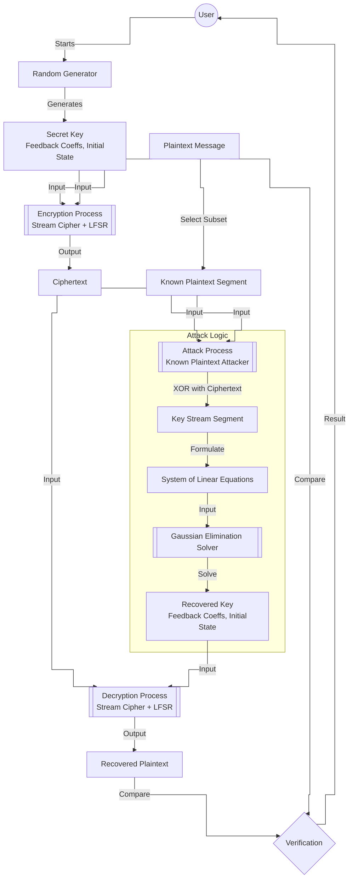

# Kryptografia i kryptoanaliza

## Laboratorium 5

### Grupa 1ID24B

### Autorzy: Kamil Fudala, Andrzej Szczytyński

## Wprowadzenie

Celem niniejszego opracowania jest przedstawienie procesu projektowania oraz analizy kryptosystemu strumieniowego wykorzystującego liniowy rejestr przesuwny ze sprzężeniem zwrotnym (ang. *Linear Feedback Shift Register* – LFSR). Laboratorium obejmuje implementację generatora, realizację mechanizmów szyfrowania i deszyfrowania danych oraz przeprowadzenie ataku kryptoanalitycznego typu *known-plaintext*, który obnaża strukturalne słabości systemów opartych na czystej liniowości.

### Charakterystyka liniowych rejestrów przesuwnych

Rejestr LFSR stopnia $m$ składa się z ciągu komórek pamięci oraz funkcji sprzężenia zwrotnego, która wyznacza wartość nowego bitu wprowadzanego do układu. Stan rejestru w dyskretnej chwili czasu $i$ opisywany jest przez wektor $(s_{i+m-1}, s_{i+m-2}, \dots, s_{i+1}, s_{i})$, gdzie $s_{i}$ pełni rolę bitu wyjściowego. Proces generowania kolejnych wartości opiera się na rekurencji liniowej nad polem Galois $GF(2)$:

$$s_{i+m} \equiv \sum_{j=0}^{m-1} p_{j} \cdot s_{i+j} \pmod 2$$

Współczynniki $p_{j} \in \{0, 1\}$ definiują wielomian charakterystyczny generatora, określany wzorem:

$$P(x) = p_{0} + p_{1}x + p_{2}x^{2} + \dots + p_{m-1}x^{m-1} + x^{m}$$

Właściwości generowanej sekwencji są ściśle uzależnione od doboru tego wielomianu. Szczególne znaczenie mają wielomiany pierwotne, które gwarantują uzyskanie maksymalnego okresu sekwencji wynoszącego $2^{m} - 1$. Wykorzystanie wielomianów o gorszych parametrach prowadzi do skrócenia cyklu generatora oraz obniżenia jego odporności kryptoanalitycznej.

### Złożoność liniowa i algorytm Berlekampa-Masseya

Złożoność liniowa stanowi kluczowy parametr oceny bezpieczeństwa sekwencji pseudolosowych. Definiuje ona stopień najkrótszego rejestru LFSR, który jest w stanie wygenerować dany ciąg binarny. Z punktu widzenia kryptografii pożądane są sekwencje o wysokiej złożoności liniowej, rosnącej wraz z długością obserwowanego fragmentu.

Do wyznaczania minimalnej struktury LFSR stosuje się algorytm Berlekampa-Masseya. Umożliwia on odtworzenie wielomianu sprzężenia zwrotnego na podstawie fragmentu sekwencji o długości co najmniej $2L$, gdzie $L$ to złożoność liniowa ciągu. Algorytm ten charakteryzuje się złożonością obliczeniową $O(n^{2})$, co czyni go wysoce efektywnym narzędziem w rękach kryptoanalityka.

### Podatność na ataki algebraiczne

Podstawową wadą rejestrów LFSR jest ich liniowy charakter. W scenariuszu ataku z nanym tekstem jawnym (*known-plaintext attack*), napastnik jest w stanie wyznaczyć fragment strumienia klucza poprzez operację XOR między tekstem jawnym a szyfrogramem:

$$s_{i} \equiv x_{i} \oplus y_{i} \pmod 2$$

Dysponując odpowiednią liczbą bitów strumienia, możliwe jest sformułowanie układu równań liniowych, w którym niewiadomymi są współczynniki sprzężenia zwrotnego. Układ ten, zapisany w postaci macierzowej $A \cdot p = b$, może zostać rozwiązany przy użyciu eliminacji Gaussa w arytmetyce binarnej. Sukces ataku pozwala na pełną rekonstrukcję stanu rejestru oraz przewidzenie wszystkich przyszłych bitów strumienia klucza, co całkowicie kompromituje bezpieczeństwo systemu.

## Opis implementacji

### Architektura rozwiązania

Projekt został zrealizowany w oparciu o architekturę warstwową (ang. *Layered Architecture*), co zapewnia przejrzysty podział odpowiedzialności oraz ułatwia testowanie i modyfikację poszczególnych komponentów. Struktura rozwiązania obejmuje trzy główne warstwy:

1.  **Domain (Domena)**: Stanowi serce systemu, zawierając logikę biznesową oraz kluczowe algorytmy kryptograficzne. W jej skład wchodzą:
    *   **Modele i Interfejsy**: Definicje kontraktów takich jak `ILfsr`, `IStreamCipher` czy `IKnownPlaintextAttacker`.
    *   **Usługi (Services)**: Konkretne implementacje mechanizmów, w tym generatora LFSR (`Lfsr`), szyfru strumieniowego (`StreamCipher`) oraz narzędzi kryptoanalitycznych (`BerlekampMasseySolver`, `GaussianEliminationSolver`).
    *   **Narzędzia (Utils)**: Klasy pomocnicze, np. `BitConversions`, służące do efektywnej manipulacji danymi bitowymi.

2.  **Application (Aplikacja)**: Warstwa koordynująca działanie systemu. Klasa `Runner` pełni rolę orkiestratora, który wykorzystuje komponenty domeny do realizacji konkretnych scenariuszy użycia, takich jak weryfikacja poprawności generatora czy przeprowadzenie ataku kryptoanalitycznego.

3.  **Infrastructure (Infrastruktura)**: Warstwa wejściowa aplikacji, reprezentowana przez plik `Program.cs`. Odpowiada za konfigurację środowiska, parsowanie argumentów wiersza poleceń oraz uruchomienie głównego procesu przetwarzania.

### Demonstracja pełnego ataku

W ramach implementacji przygotowano scenariusz `RunFullAttack`, który symuluje atak ze znanym tekstem jawnym:
1.  Generowane są losowe parametry sekretnego LFSR (współczynniki i stan początkowy).
2.  Wiadomość tekstowa jest szyfrowana przy użyciu tego LFSR.
3.  Napastnik otrzymuje dostęp do fragmentu tekstu jawnego oraz pełnego szyfrogramu.
4.  Wykorzystując algorytm eliminacji Gaussa, napastnik odtwarza konfigurację LFSR.
5.  Następuje próba odszyfrowania całej wiadomości przy użyciu odzyskanego klucza i weryfikacja poprawności.

### Optymalizacja kodu

W celu zapewnienia wysokiej wydajności przetwarzania danych strumieniowych oraz efektywności ataków kryptoanalitycznych, w implementacji zastosowano szereg zaawansowanych technik optymalizacyjnych.

#### 1. Generator LFSR (`Lfsr.cs`)

Generator pseudolosowy jest krytycznym elementem wydajnościowym. Jego implementacja została zoptymalizowana w następujący sposób:

*   **Reprezentacja bitowa (Bit-packing)**: Zamiast tablic wartości logicznych (`bool[]`), stan rejestru oraz współczynniki sprzężenia zwrotnego przechowywane są w zmiennych typu `ulong` (64-bitowych). Pozwala to na przetwarzanie do 64 bitów stanu jednocześnie w rejestrach procesora.
*   **Instrukcje sprzętowe (Intrinsics)**: Do obliczania parzystości bitów sprzężenia zwrotnego wykorzystano metodę `BitOperations.PopCount`. Jest ona mapowana bezpośrednio na instrukcję procesora (np. `POPCNT` w architekturze x86), co jest znacznie szybsze niż programowe zliczanie ustawionych bitów.
*   **Rozwijanie pętli (Loop Unrolling)**: W metodzie `GenerateBits` pętla generująca kolejne bity została ręcznie rozwinięta (krok po 8 iteracji). Zmniejsza to narzut związany ze sprawdzaniem warunków pętli i skokami warunkowymi.
*   **Minimalizacja kopiowania**: Wewnętrzna metoda `NextBitCore` operuje na referencji do stanu (`ref ulong state`), co pozwala na modyfikację lokalnej kopii stanu bez konieczności kosztownego zapisu do pamięci sterty w każdej iteracji.

#### 2. Konwersje i operacje na pamięci (`BitConversions.cs`, `StreamCipher.cs`)

Efektywne zarządzanie pamięcią jest kluczowe przy przetwarzaniu dużych bloków danych:

*   **Unikanie zerowania pamięci**: Do alokacji tablic wynikowych wykorzystano metodę `GC.AllocateUninitializedArray<T>`. Pomija ona domyślne zerowanie pamięci, co jest bezpieczną i wydajną optymalizacją w sytuacjach, gdy tablica jest natychmiast wypełniana nowymi danymi.
*   **Wykorzystanie `Span<T>` i `stackalloc`**: W operacjach konwersji ciągów znaków (UTF-8) na bity wykorzystano typ `Span<T>` oraz alokację na stosie (`stackalloc`) dla mniejszych buforów. Pozwala to uniknąć obciążania Garbage Collectora (GC) krótkotrwałymi obiektami.
*   **String.Create**: Metoda `BitConversions.BitsToBitString` wykorzystuje `string.Create`, co umożliwia utworzenie ciągu znaków bezpośrednio w docelowym buforze pamięci, eliminując pośrednie alokacje.

#### 3. Atak ze znanym tekstem jawnym (`KnownPlaintextAttacker.cs`)

W kontekście kryptoanalizy, gdzie algorytmy mogą być uruchamiane wielokrotnie:

*   **Ponowne wykorzystanie buforów (Buffer Reuse)**: Klasa atakującego alokuje bufory robocze (macierz układu równań, wektory) tylko raz lub w momencie zmiany stopnia LFSR. Metoda `EnsureBuffers` zapobiega zbędnym realokacjom przy wielokrotnym przeprowadzaniu ataków dla tych samych parametrów, co znacząco odciąża zarządcę pamięci.

#### 4. Wskazówki dla kompilatora JIT

*   **Aggressive Inlining**: Kluczowe, krótkie metody (np. generujące pojedynczy bit, dokonujące konwersji) zostały opatrzone atrybutem `[MethodImpl(MethodImplOptions.AggressiveInlining | MethodImplOptions.AggressiveOptimization)]`. Sugeruje to kompilatorowi Just-In-Time wstawienie kodu metody w miejscu wywołania, eliminując narzut związany z obsługą stosu wywołań.

## Wyniki eksperymentów

## Analiza wyników

## Podsumowanie i wnioski końcowe
