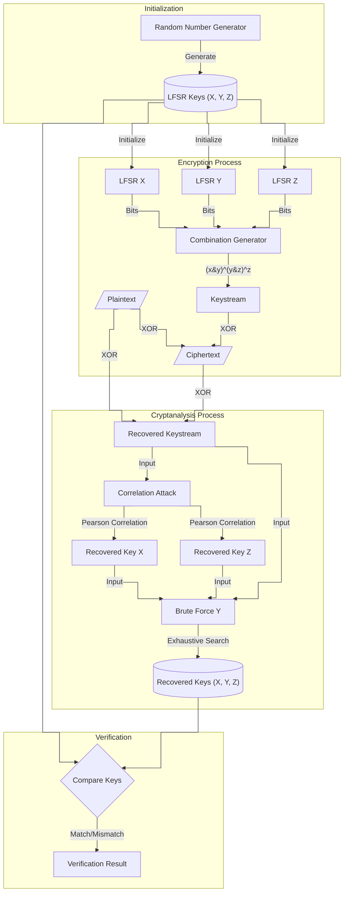

# Kryptografia i kryptoanaliza

## Laboratorium 6

### Grupa 1ID24B

### Autorzy: Kamil Fudala, Andrzej Szczytyński

## Wprowadzenie

Współczesna kryptografia strumieniowa często wykorzystuje konstrukcje oparte na rejestrach przesuwnych ze sprzężeniem
zwrotnym (LFSR). Pojedyncze rejestry LFSR, mimo dobrych właściwości statystycznych generowanych ciągów, są podatne na
ataki algebraiczne, wymagające jedynie $2L$ bitów znanego tekstu jawnego (gdzie $L$ to długość rejestru). Aby
wyeliminować tę podatność, stosuje się generatory złożone, w których wyjścia wielu rejestrów LFSR są łączone za pomocą
nieliniowej funkcji kombinującej (funkcji boolowskiej). Celem niniejszego laboratorium była implementacja oraz
kryptoanaliza takiego generatora, ze szczególnym uwzględnieniem ataku korelacyjnego.

Analizowany układ składa się z trzech rejestrów LFSR oznaczonych jako $X, Y, Z$ o długościach
odpowiednio $L_1=3, L_2=4, L_3=5$ oraz wielomianach charakterystycznych dobranych tak, aby ich okresy były względnie
pierwsze. Bit strumienia klucza $k_i$ w chwili $i$ jest wyznaczany przez funkcję łączącą $f: GF(2)^3 \rightarrow GF(2)$
postaci:

$$k_i = f(x_i, y_i, z_i) = x_i y_i \oplus y_i z_i \oplus z_i$$

Bezpieczeństwo generatorów złożonych zależy od właściwości funkcji łączącej, w tym jej rzędu odporności korelacyjnej.
Atak korelacyjny wykorzystuje fakt, że funkcja $f$ może nie być statystycznie niezależna od poszczególnych zmiennych
wejściowych. Jeżeli prawdopodobieństwo zgodności wyjścia generatora z wyjściem $j$-tego
rejestru $P(k_i = x_j^{(i)}) \neq 0.5$, istnieje "przeciek" informacji, który pozwala na odzyskanie stanu początkowego
tego rejestru niezależnie od pozostałych.

Dla badanej funkcji $f(x, y, z)$ analiza tabeli prawdy wykazuje, że:

* $P(f = x) = 0.75$ (bias $\epsilon = 0.25$),
* $P(f = z) = 0.75$ (bias $\epsilon = 0.25$),
* $P(f = y) = 0.5$ (brak korelacji)

Powyższe właściwości umożliwiają zastosowanie ataku korelacyjnego typu "dziel i rządź". Metoda ta pozwala na niezależne
odzyskanie wypełnień rejestrów $X$ i $Z$ poprzez maksymalizację współczynnika korelacji Pearsona między odzyskanym
strumieniem klucza a sekwencjami generowanymi przez hipotezy wypełnień. Rejestr $Y$, nieskorelowany z wyjściem, musi
zostać odzyskany metodą przeszukiwania wyczerpującego po ustaleniu stanów $X$ i $Z$.

W ramach sprawozdania przedstawiono implementację generatora i ataku, a także przeprowadzono eksperymenty porównujące
złożoność obliczeniową ataku korelacyjnego ($O(\sum 2^{L_i})$) ze standardowym atakiem siłowym ($O(\prod 2^{L_i})$).

## Opis implementacji

### Architektura rozwiązania

System został zaimplementowany w języku C# z zachowaniem podziału na warstwy (Application, Domain, Infrastructure). Kluczowe komponenty systemu obejmują:

1. **Lfsr**: Implementacja pojedynczego rejestru przesuwnego ze sprzężeniem zwrotnym. Klasa przechowuje stan rejestru oraz definiuje wielomian sprzężenia zwrotnego (taps). Metoda `NextBit` realizuje przesunięcie i obliczenie nowego bitu.

```csharp
namespace Lab06.Domain.Generators;

public class Lfsr(int degree, int[] taps, int[] initialState) : ILfsr
{
    private int[] _currentState = [..initialState];

    public int Degree { get; } = degree;

    public int NextBit()
    {
        var outputBit = _currentState[0];
        var feedbackBit = taps.Aggregate(0, (current, tapIndex) => current ^ _currentState[tapIndex]);

        for (var i = 0; i < Degree - 1; i++)
        {
            _currentState[i] = _currentState[i + 1];
        }

        _currentState[Degree - 1] = feedbackBit;

        return outputBit;
    }

    public void Reset(int[] startState)
    {
        if (startState.Length != Degree)
        {
            throw new ArgumentException("Invalid state length");
        }

        _currentState = startState.ToArray();
    }
}
```

2. **CombinationGenerator**: Klasa realizująca generator złożony. Agreguje trzy instancje `ILfsr` i łączy ich wyjścia za pomocą nieliniowej funkcji $f(x, y, z) = xy \oplus yz \oplus z$.

```csharp
namespace Lab06.Domain.Generators;

public class CombinationGenerator(ILfsr x, ILfsr y, ILfsr z) : IStreamGenerator
{
    public int NextBit()
    {
        var x1 = x.NextBit();
        var y1 = y.NextBit();
        var z1 = z.NextBit();

        return (x1 & y1) ^ (y1 & z1) ^ z1;
    }

    public void Reset(int[] stateX, int[] stateY, int[] stateZ)
    {
        x.Reset(stateX);
        y.Reset(stateY);
        z.Reset(stateZ);
    }
}
```

3. **CryptoSystem**: Serwis aplikacyjny odpowiedzialny za operacje szyfrowania i deszyfrowania (XOR strumieniowy) oraz odzyskiwanie strumienia klucza na podstawie pary tekst jawny - szyfrogram.

```csharp
using Lab06.Domain.Generators;
using Lab06.Infrastructure.Utils;

namespace Lab06.Application.Services;

public class CryptoSystem(IStreamGenerator generator)
{
    public int[] Encrypt(string plainText)
    {
        var messageBits = BitUtils.StringToBits(plainText);
        return ProcessBits(messageBits);
    }

    public string Decrypt(int[] cipherBits)
    {
        var plainBits = ProcessBits(cipherBits);
        return BitUtils.BitsToString(plainBits);
    }

    // ... (metody operujące na plikach - EncryptFile/DecryptFile)

    private int[] ProcessBits(int[] inputBits)
    {
        var outputBits = new int[inputBits.Length];
        for (var i = 0; i < inputBits.Length; i++)
        {
            var keyBit = generator.NextBit();
            outputBits[i] = inputBits[i] ^ keyBit;
        }

        return outputBits;
    }

    public static int[] RecoverKeystream(string knownPlaintext, int[] cipherBits)
    {
        var plainBits = BitUtils.StringToBits(knownPlaintext);
        if (plainBits.Length != cipherBits.Length)
        {
            throw new ArgumentException("Length mismatch");
        }

        var keystream = new int[plainBits.Length];
        for (var i = 0; i < plainBits.Length; i++)
        {
            keystream[i] = plainBits[i] ^ cipherBits[i];
        }

        return keystream;
    }
}
```

4. **AttackService**: Moduł implementujący logikę kryptoanalizy. Zawiera metody `CorrelationAttack` (atak "dziel i rządź") oraz `BruteForceAttack`. Wykorzystuje statystyki do oceny hipotez wypełnień rejestrów.

```csharp
using Lab06.Domain.Generators;
using Lab06.Infrastructure.Utils;

namespace Lab06.Domain.Cryptanalysis;

public class AttackService
{
    private const int LenX = 3;
    private const int LenY = 4;
    private const int LenZ = 5;

    // ... (definicje wielomianów taps)

    public AttackResult CorrelationAttack(int[] keystream)
    {
        Console.WriteLine("--- Starting Correlation Attack ---");

        var bestX = FindBestCorrelation(keystream, LenX, _tapsX, "X");
        var bestZ = FindBestCorrelation(keystream, LenZ, _tapsZ, "Z");

        var bestY = RecoverY(keystream, bestX, bestZ);

        return new AttackResult(bestX, bestY, bestZ);
    }

    private static int[] FindBestCorrelation(int[] keystream, int degree, int[] taps, string label)
    {
        var maxRho = -2.0;
        var bestState = Array.Empty<int>();
        var limit = 1 << degree;

        Console.WriteLine($"Analyzing Register {label}...");

        for (var i = 1; i < limit; i++)
        {
            var candidateState = BitUtils.IntToBinaryArray(i, degree);
            var generatedSequence = BitUtils.GenerateLfsrSequence(keystream.Length, candidateState, taps);

            var rho = Statistics.PearsonCorrelation(keystream, generatedSequence);

            if (!(rho > maxRho))
            {
                continue;
            }

            maxRho = rho;
            bestState = candidateState;
        }

        Console.WriteLine($"Selected {label}: {string.Join("", bestState)} with Rho={maxRho:F4}");
        return bestState;
    }

    private int[] RecoverY(int[] keystream, int[] stateX, int[] stateZ)
    {
        Console.WriteLine("Recovering Register Y (Exhaustive search)...");
        // ... (iteracja po wszystkich stanach Y i weryfikacja poprawności klucza)
    }

    // ... (implementacja BruteForceAttack)
}
```

5. **Statistics**: Klasa narzędziowa obliczająca współczynnik korelacji Pearsona, niezbędny do oceny zbieżności generowanego ciągu z odzyskanym strumieniem klucza.

```csharp
namespace Lab06.Infrastructure.Utils;

public static class Statistics
{
    public static double PearsonCorrelation(int[] x, int[] y)
    {
        if (x.Length != y.Length) throw new ArgumentException("Arrays must have same length");

        var n = x.Length;
        double sumX = x.Sum();
        double sumY = y.Sum();

        var meanX = sumX / n;
        var meanY = sumY / n;

        double numerator = 0;
        double sumSqDiffX = 0;
        double sumSqDiffY = 0;

        for (var i = 0; i < n; i++)
        {
            var diffX = x[i] - meanX;
            var diffY = y[i] - meanY;
            numerator += diffX * diffY;
            sumSqDiffX += diffX * diffX;
            sumSqDiffY += diffY * diffY;
        }

        var denominator = Math.Sqrt(sumSqDiffX) * Math.Sqrt(sumSqDiffY);
        if (Math.Abs(denominator) < 1e-9) return 0;

        return numerator / denominator;
    }
}
```

### Diagram przepływu danych

Poniżej znajduje się diagram przedstawiający przepływ danych w systemie podczas procesu szyfrowania oraz ataku kryptoanalitycznego:



### Kluczowe algorytmy

**1. Algorytm ataku korelacyjnego (dla rejestrów X i Z):**

Algorytm opiera się na strategii "dziel i rządź". Zamiast testować wszystkie możliwe kombinacje klucza $(x, y, z)$, atakuje się poszczególne rejestry $X$ i $Z$ niezależnie, wykorzystując ich korelację z wyjściem funkcji.

Dla każdego rejestru ($R \in \{X, Z\}$) o długości $L$:
1. Iteruj przez wszystkie możliwe stany początkowe $S \in \{1, \dots, 2^L - 1\}$.
2. Dla każdego stanu $S$, wygeneruj sekwencję bitów z rejestru $R$ o długości równej dostępnemu strumieniowi klucza.
3. Oblicz współczynnik korelacji Pearsona $\rho$ między wygenerowaną sekwencją a odzyskanym strumieniem klucza.
4. Wybierz stan $S$, dla którego wartość $\rho$ jest maksymalna.
5. Po ustaleniu $X$ i $Z$, brakujący stan $Y$ (nieskorelowany) znajduje się metodą przeglądu zupełnego (sprawdzając poprawność deszyfracji dla $2^{L_2}$ możliwości).

**2. Algorytm wyznaczania współczynnika Pearsona:**

Współczynnik korelacji Pearsona służy do miary liniowej zależności między dwiema sekwencjami bitów. W kontekście binarnym bity traktowane są jako wartości liczbowe (0 lub 1).
Dla dwóch ciągów $A$ i $B$ o długości $N$:
1. Obliczane są średnie arytmetyczne $\bar{A}$ i $\bar{B}$.
2. Obliczana jest kowariancja (licznik): $Cov(A,B) = \sum_{i=1}^N (A_i - \bar{A})(B_i - \bar{B})$.
3. Obliczane są odchylenia standardowe (mianownik): $\sigma_A \sigma_B = \sqrt{\sum (A_i - \bar{A})^2} \cdot \sqrt{\sum (B_i - \bar{B})^2}$.
4. Wynik $\rho = \frac{Cov(A,B)}{\sigma_A \sigma_B}$. Wartość bliska 1 lub -1 sugeruje silną zależność, co pozwala zidentyfikować właściwy stan początkowy rejestru.

## Demonstracja pełnego ataku

W tej sekcji przedstawiono wyniki działania programu ("Algorytm 7: Demonstracja pełnego ataku"). Dane pochodzą z rzeczywistego uruchomienia aplikacji i obrazują proces od generacji kluczy, przez szyfrowanie, aż po skuteczną kryptoanalizę.

```text
=== PHASE I: Key Generation ===
Original X: 100
Original Y: 1011
Original Z: 01000

=== PHASE II: Encryption ===
Plaintext: Coś tam coś tam kryptografia hehe.
Ciphertext (bits): 288 bits generated.

=== PHASE III: Keystream Recovery ===
Keystream recovered successfully.

=== PHASE IV: Correlation Attack ===
--- Starting Correlation Attack ---
Analyzing Register X...
Selected X: 100 with Rho=0.5415
Analyzing Register Z...
Selected Z: 01000 with Rho=0.4457
Recovering Register Y (Exhaustive search)...
Found Y: 1011

=== PHASE V: Verification ===
X: Orig=100 Rec=100 [OK]
Y: Orig=1011 Rec=1011 [OK]
Z: Orig=01000 Rec=01000 [OK]
Decrypted Text: Coś tam coś tam kryptografia hehe.
SUCCESS: Attack successful.
```

Weryfikacja poprawności operacji na plikach (porównanie binarne `diff`) potwierdza, że plik zaszyfrowany jest całkowicie zmieniony względem oryginału, a proces deszyfracji przywraca pierwotną treść:

```text
➜  publish (main) diff secret_message.txt secret_message.enc                                                ✱
1c1
< Top secret data for files or something.
\ No newline at end of file
---
> 7OFzR5Z2L/[
\ No newline at end of file
➜  publish (main) diff secret_message.enc secret_message_dec.txt                                            ✱
1c1
< 7OFzR5Z2L/[
\ No newline at end of file
---
> Top secret data for files or something.
\ No newline at end of file
➜  publish (main) diff secret_message_dec.txt secret_message.txt
```

## Wyniki eksperymentów

### Eksperyment 1: Minimalna długość tekstu jawnego

Przeprowadzono serię prób (20 per długość) w celu wyznaczenia minimalnej długości tekstu jawnego (a tym samym strumienia klucza) wymaganej do skutecznego ataku.

| Długość sekwencji [bity] | Skuteczność (Success Rate) | Średni czas [ms] |
|--------------------------|----------------------------|------------------|
| 8                        | 5% (1/20)                  | 0.0104           |
| 16                       | 25% (5/20)                 | 0.0077           |
| 24                       | 90% (18/20)                | 0.0292           |
| 31                       | 80% (16/20)                | 0.0342           |
| 62                       | 100% (20/20)               | 0.0636           |
| 93                       | 100% (20/20)               | 0.0925           |

### Eksperyment 2: Pewność ataku a długość sekwencji

Analiza wyników Eksperymentu 1 prowadzi do następujących wniosków:

* Dla długości sekwencji poniżej okresu najdłuższego rejestru ($L_{max}=31$ dla rejestru $Z$ o długości 5 bitów), skuteczność ataku jest niezadowalająca (5-25%).
* Gwałtowny wzrost skuteczności obserwuje się w okolicach długości 24-31 bitów.
* Pełną stabilność i 100% skuteczność osiągnięto przy długości 62 bitów, co odpowiada około $2 \times L_{max}$.
* Zjawisko to wynika z natury statystycznej ataku korelacyjnego. Aby korelacja wynikająca z "przecieku" informacji wybiła się ponad szum losowy (korelację przypadkową), wymagana jest próbka statystyczna o odpowiedniej liczności. Zbyt krótka sekwencja powoduje, że fałszywe klucze mogą wykazywać przypadkowo wysoką korelację, myląc algorytm.

### Eksperyment 4: Porównanie wydajności (Atak Korelacyjny vs Brute-force)

Porównano czasy wykonania ataku korelacyjnego oraz standardowego ataku siłowego (Brute-force) dla ustalonej, bezpiecznej długości sekwencji.

* **Czas ataku korelacyjnego:** 0.2701 ms
* **Czas ataku Brute-force:** 0.8637 ms

Obliczone przyspieszenie (Speedup):
$$ Speedup = \frac{0.8637}{0.2701} \approx 3.2 $$

Mimo niewielkich rozmiarów badanych rejestrów (3, 4, 5 bitów), atak korelacyjny jest już ponad 3-krotnie szybszy. Różnica ta wynika ze złożoności obliczeniowej:
* Atak siłowy: $O(2^{L_1 + L_2 + L_3}) = O(2^{12}) = 4096$ operacji.
* Atak korelacyjny: $O(2^{L_1} + 2^{L_3}) + O(2^{L_2}) \approx 8 + 32 + 16$ operacji (w uproszczeniu).

Dla rzeczywistych systemów o dużych $L$ różnica ta rośnie wykładniczo, czyniąc atak siłowy niewykonalnym, podczas gdy atak korelacyjny pozostaje realnym zagrożeniem.

## Analiza wyników

1. **Przyczyna podatności:** Funkcja łącząca $f(x, y, z) = xy \oplus yz \oplus z$ wykazuje silne niezbalansowanie. Prawdopodobieństwo $P(f=x) = 0.75$ oraz $P(f=z) = 0.75$ oznacza, że wyjście generatora jest w 75% przypadków zgodne z bitami rejestrów $X$ i $Z$. Potwierdzają to logi z ataku, gdzie wyliczone $\rho$ dla poprawnych kluczy wynosiło ok. $0.54$ (X) i $0.44$ (Z), co jest wartością statystycznie znaczącą.
2. **Konieczność ataku siłowego na Y:** Zmienna $Y$ występuje w funkcji w sposób bardziej "wymieszany" (jako $y(x \oplus z)$). Analiza tabeli prawdy pokazuje $P(f=y) = 0.5$, co oznacza brak korelacji liniowej. Dlatego po odzyskaniu $X$ i $Z$ atakiem korelacyjnym, $Y$ musiał zostać znaleziony metodą przeszukiwania.
3. **Kontekst teoretyczny:** Zastosowana funkcja nie spełnia kryteriów odporności korelacyjnej (Correlation Immunity) rzędu pierwszego dla zmiennych $X$ i $Z$. Zgodnie z Twierdzeniem Siegenthalera istnieje kompromis między rzędem odporności korelacyjnej ($m$) a stopniem algebraicznym funkcji ($d$): $m + d \le n$. Tutaj wysoki stopień nieliniowości (iloczyny) został okupiony niską odpornością na korelacje.
4. **Wpływ długości próbki:** Stabilność współczynnika Pearsona rośnie wraz z $\sqrt{N}$. Przy małym $N$, wariancja estymatora jest duża, co prowadzi do błędów.

## Pytania Kontrolne

1. **Dlaczego funkcja $f$ jest podatna na atak?**
   Funkcja $f$ jest podatna, ponieważ jej wyjście jest skorelowane z wejściami $x$ i $z$ ($P(f=x) \neq 0.5$). Istnieje statystyczna zależność, która pozwala na odróżnienie poprawnej sekwencji rejestru od sekwencji losowej.

2. **Dowód asymetrii:**
   Analizując tabelę prawdy dla $f(x,y,z) = xy \oplus yz \oplus z$:
   * Dla $x$: Zgodność występuje w 6 na 8 przypadków (000, 001, 010, 011, 101, 110 dają $f=x$), co daje $P=0.75$.
   * Dla $y$: Zgodność występuje w 4 na 8 przypadków, co daje $P=0.5$.
   Oznacza to, że $x$ "przecieka" do wyjścia, a $y$ jest maskowane.

3. **Twierdzenie Siegenthalera:**
   Twierdzenie to opisuje fundamentalne ograniczenie funkcji boolowskich w kryptografii. Mówi, że dla funkcji $n$-zmiennych, rząd odporności korelacyjnej $m$ oraz stopień algebraiczny $d$ muszą spełniać nierówność $m + d \le n$ (lub $m+d \le n-1$ dla funkcji zbalansowanych). Oznacza to, że nie można jednocześnie zmaksymalizować odporności na ataki korelacyjne i ataki algebraiczne (wymagające wysokiego stopnia $d$).

4. **Wzór na minimalną długość sekwencji:**
   Wymagana długość $N$ do odzyskania rejestru z prawdopodobieństwem błędu bliskim zeru jest proporcjonalna do odwrotności kwadratu biasu $\epsilon = P(f=x) - 0.5$:
   $$ N \approx \frac{1}{4\epsilon^2} \ln(2^L) $$
   Im mniejsza korelacja, tym dłuższa sekwencja jest potrzebna.

5. **Porównanie złożoności:**
   Złożoność ataku siłowego wynosi $O(\prod_{i=1}^k 2^{L_i}) = O(2^{\sum L_i})$.
   Złożoność ataku korelacyjnego wynosi $O(\sum_{i=1}^k 2^{L_i})$.
   Redukcja złożoności polega na zamianie iloczynu (wykładniczy wzrost sumy długości) na sumę (wykładniczy wzrost pojedynczych długości).

6. **Przykłady historyczne:**
   Ataki korelacyjne były skuteczne przeciwko szyfrom takim jak A5/1 (używany w GSM) oraz E0 (używany w protokole Bluetooth).

7. **Propozycja modyfikacji:**
   Aby zwiększyć odporność, należy dobrać funkcję łączącą o wyższym rzędzie odporności korelacyjnej (np. $m \ge 1$), tak aby $P(f=x_i) = 0.5$ dla wszystkich wejść. Przykładem może być funkcja $x \oplus y \oplus z$, jednak jest ona liniowa ($d=1$), co naraża ją na ataki algebraiczne (Berklekamp-Massey). W praktyce stosuje się funkcje z pamięcią lub bardziej złożone struktury nieliniowe zbalansowane.

## Podsumowanie i wnioski końcowe

W ramach laboratorium zaimplementowano generator złożony oraz przeprowadzono skuteczny atak korelacyjny. Kluczowe wnioski:

1.  **Skuteczność ataku:** Potwierdzono, że przy dostępie do wystarczająco długiego fragmentu strumienia klucza (ok. 62 bity), możliwe jest całkowite złamanie generatora metodą "dziel i rządź".
2.  **Przewaga nad Brute-force:** Eksperymenty wykazały znaczną przewagę wydajnościową ataku korelacyjnego nad siłowym. Wraz ze wzrostem długości rejestrów, atak siłowy staje się obliczeniowo niewykonalny, podczas gdy atak korelacyjny pozostaje efektywny, o ile funkcja łącząca nie jest odporna na korelacje.
3.  **Projektowanie bezpiecznych systemów:** Bezpieczeństwo generatorów strumieniowych nie zależy tylko od długości rejestrów, ale kluczową rolę odgrywa funkcja łącząca. Musi ona być dobrana tak, aby balansować między odpornością korelacyjną a wysokim stopniem algebraicznym, zgodnie z ograniczeniami Siegenthalera.
