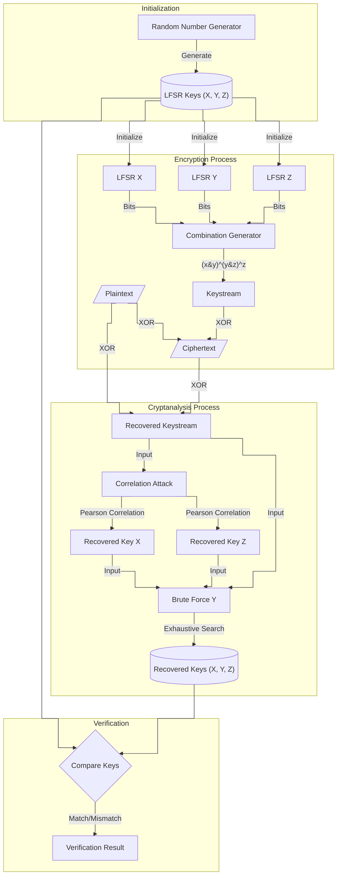

# Kryptografia i kryptoanaliza

## Laboratorium 6

### Grupa 1ID24B

### Autorzy: Kamil Fudala, Andrzej Szczytyński

## Wprowadzenie

Współczesna kryptografia strumieniowa często wykorzystuje konstrukcje oparte na rejestrach przesuwnych ze sprzężeniem
zwrotnym (LFSR). Pojedyncze rejestry LFSR, mimo dobrych właściwości statystycznych generowanych ciągów, są podatne na
ataki algebraiczne, wymagające jedynie $2L$ bitów znanego tekstu jawnego (gdzie $L$ to długość rejestru). Aby
wyeliminować tę podatność, stosuje się generatory złożone, w których wyjścia wielu rejestrów LFSR są łączone za pomocą
nieliniowej funkcji kombinującej (funkcji boolowskiej). Celem niniejszego laboratorium była implementacja oraz
kryptoanaliza takiego generatora, ze szczególnym uwzględnieniem ataku korelacyjnego.

Analizowany układ składa się z trzech rejestrów LFSR oznaczonych jako $X, Y, Z$ o długościach
odpowiednio $L_1=3, L_2=4, L_3=5$ oraz wielomianach charakterystycznych dobranych tak, aby ich okresy były względnie
pierwsze. Bit strumienia klucza $k_i$ w chwili $i$ jest wyznaczany przez funkcję łączącą $f: GF(2)^3 \rightarrow GF(2)$
postaci:

$$k_i = f(x_i, y_i, z_i) = x_i y_i \oplus y_i z_i \oplus z_i$$

Bezpieczeństwo generatorów złożonych zależy od właściwości funkcji łączącej, w tym jej rzędu odporności korelacyjnej.
Atak korelacyjny wykorzystuje fakt, że funkcja $f$ może nie być statystycznie niezależna od poszczególnych zmiennych
wejściowych. Jeżeli prawdopodobieństwo zgodności wyjścia generatora z wyjściem $j$-tego
rejestru $P(k_i = x_j^{(i)}) \neq 0.5$, istnieje "przeciek" informacji, który pozwala na odzyskanie stanu początkowego
tego rejestru niezależnie od pozostałych.

Dla badanej funkcji $f(x, y, z)$ analiza tabeli prawdy wykazuje, że:

* $P(f = x) = 0.75$ (bias $\epsilon = 0.25$),
* $P(f = z) = 0.75$ (bias $\epsilon = 0.25$),
* $P(f = y) = 0.5$ (brak korelacji)

Powyższe właściwości umożliwiają zastosowanie ataku korelacyjnego typu "dziel i rządź". Metoda ta pozwala na niezależne
odzyskanie wypełnień rejestrów $X$ i $Z$ poprzez maksymalizację współczynnika korelacji Pearsona między odzyskanym
strumieniem klucza a sekwencjami generowanymi przez hipotezy wypełnień. Rejestr $Y$, nieskorelowany z wyjściem, musi
zostać odzyskany metodą przeszukiwania wyczerpującego po ustaleniu stanów $X$ i $Z$.

W ramach sprawozdania przedstawiono implementację generatora i ataku, a także przeprowadzono eksperymenty porównujące
złożoność obliczeniową ataku korelacyjnego ($O(\sum 2^{L_i})$) ze standardowym atakiem siłowym ($O(\prod 2^{L_i})$).

## Opis implementacji

### Architektura rozwiązania

System został zaimplementowany w języku C# z wykorzystaniem paradygmatu programowania obiektowego. Poniżej przedstawiono kluczowe komponenty systemu.

#### 1. Lfsr
Klasa `Lfsr` implementuje pojedynczy rejestr przesuwny ze sprzężeniem zwrotnym. Przechowuje ona bieżący stan rejestru, jego stopień oraz wielomian sprzężenia zwrotnego (reprezentowany przez pozycje odczepów - `taps`). Metoda `NextBit` realizuje przesunięcie rejestru i obliczenie nowego bitu na podstawie operacji XOR.

```csharp
public class Lfsr(int degree, int[] taps, int[] initialState) : ILfsr
{
    private int[] _currentState = [..initialState];

    public int Degree { get; } = degree;

    public int NextBit()
    {
        var outputBit = _currentState[0];
        var feedbackBit = taps.Aggregate(0, (current, tapIndex) => current ^ _currentState[tapIndex]);

        for (var i = 0; i < Degree - 1; i++)
        {
            _currentState[i] = _currentState[i + 1];
        }

        _currentState[Degree - 1] = feedbackBit;

        return outputBit;
    }

    public void Reset(int[] startState)
    {
        if (startState.Length != Degree)
        {
            throw new ArgumentException("Invalid state length");
        }

        _currentState = startState.ToArray();
    }
}
```

#### 2. CombinationGenerator
Klasa `CombinationGenerator` łączy wyjścia trzech instancji `Lfsr` (X, Y, Z) za pomocą nieliniowej funkcji logicznej $f(x, y, z) = (x \land y) \oplus (y \land z) \oplus z$.

```csharp
public class CombinationGenerator(ILfsr x, ILfsr y, ILfsr z) : IStreamGenerator
{
    public int NextBit()
    {
        var x1 = x.NextBit();
        var y1 = y.NextBit();
        var z1 = z.NextBit();

        return (x1 & y1) ^ (y1 & z1) ^ z1;
    }

    public void Reset(int[] stateX, int[] stateY, int[] stateZ)
    {
        x.Reset(stateX);
        y.Reset(stateY);
        z.Reset(stateZ);
    }
}
```

#### 3. CryptoSystem
Klasa `CryptoSystem` odpowiada za operacje szyfrowania i deszyfrowania (XORowanie tekstu jawnego ze strumieniem klucza) oraz za operację odwrotną - odzyskanie strumienia klucza na podstawie pary tekst jawny - szyfrogram (co jest punktem wyjścia dla ataku ze znanym tekstem jawnym).

```csharp
public class CryptoSystem(IStreamGenerator generator)
{
    // ... (metody pomocnicze pominięte dla czytelności)

    private int[] ProcessBits(int[] inputBits)
    {
        var outputBits = new int[inputBits.Length];
        for (var i = 0; i < inputBits.Length; i++)
        {
            var keyBit = generator.NextBit();
            outputBits[i] = inputBits[i] ^ keyBit;
        }

        return outputBits;
    }

    public static int[] RecoverKeystream(string knownPlaintext, int[] cipherBits)
    {
        var plainBits = BitUtils.StringToBits(knownPlaintext);
        if (plainBits.Length != cipherBits.Length)
        {
            throw new ArgumentException("Length mismatch");
        }

        var keystream = new int[plainBits.Length];
        for (var i = 0; i < plainBits.Length; i++)
        {
            keystream[i] = plainBits[i] ^ cipherBits[i];
        }

        return keystream;
    }
}
```

#### 4. AttackService
Klasa `AttackService` implementuje logikę kryptoanalizy. Metoda `CorrelationAttack` wykonuje atak "dziel i rządź": najpierw niezależnie odnajduje stany początkowe rejestrów X i Z poprzez maksymalizację korelacji, a następnie odnajduje Y metodą siłową (exhaustive search). Klasa zawiera również implementację referencyjnego ataku siłowego `BruteForceAttack`.

```csharp
public class AttackService
{
    // ... (pola i definicje wielomianów)

    public AttackResult CorrelationAttack(int[] keystream)
    {
        Console.WriteLine("--- Starting Correlation Attack ---");

        var bestX = FindBestCorrelation(keystream, LenX, _tapsX, "X");
        var bestZ = FindBestCorrelation(keystream, LenZ, _tapsZ, "Z");

        var bestY = RecoverY(keystream, bestX, bestZ);

        return new AttackResult(bestX, bestY, bestZ);
    }

    private static int[] FindBestCorrelation(int[] keystream, int degree, int[] taps, string label)
    {
        var maxRho = -2.0;
        var bestState = Array.Empty<int>();
        var limit = 1 << degree;

        Console.WriteLine($"Analyzing Register {label}...");

        for (var i = 1; i < limit; i++)
        {
            var candidateState = BitUtils.IntToBinaryArray(i, degree);
            var generatedSequence = BitUtils.GenerateLfsrSequence(keystream.Length, candidateState, taps);

            var rho = Statistics.PearsonCorrelation(keystream, generatedSequence);

            if (!(rho > maxRho))
            {
                continue;
            }

            maxRho = rho;
            bestState = candidateState;
        }

        Console.WriteLine($"Selected {label}: {string.Join("", bestState)} with Rho={maxRho:F4}");
        return bestState;
    }

    // ... (pozostałe metody ataku brute force i RecoverY)
}
```

#### 5. Statistics
Klasa pomocnicza `Statistics` implementuje obliczanie współczynnika korelacji Pearsona, który jest miarą liniowej zależności między dwoma ciągami bitów.

```csharp
public static class Statistics
{
    public static double PearsonCorrelation(int[] x, int[] y)
    {
        if (x.Length != y.Length)
        {
            throw new ArgumentException("Arrays must have same length");
        }

        var n = x.Length;
        double sumX = x.Sum();
        double sumY = y.Sum();

        var meanX = sumX / n;
        var meanY = sumY / n;

        double numerator = 0;
        double sumSqDiffX = 0;
        double sumSqDiffY = 0;

        for (var i = 0; i < n; i++)
        {
            var diffX = x[i] - meanX;
            var diffY = y[i] - meanY;
            numerator += diffX * diffY;
            sumSqDiffX += diffX * diffX;
            sumSqDiffY += diffY * diffY;
        }

        var denominator = Math.Sqrt(sumSqDiffX) * Math.Sqrt(sumSqDiffY);

        if (Math.Abs(denominator) < 1e-9)
        {
            return 0;
        }

        return numerator / denominator;
    }
}
```

### Diagram przepływu danych

Poniżej znajduje się diagram przedstawiający przepływ danych w systemie podczas procesu szyfrowania oraz ataku kryptoanalitycznego.



### Kluczowe algorytmy

1.  **Algorytm ataku korelacyjnego (dla X i Z):**
    Dla danego rejestru (np. X) o długości $L$, algorytm iteruje przez wszystkie możliwe $2^L-1$ niezerowych stanów początkowych. Dla każdej hipotezy stanu generowany jest ciąg wyjściowy LFSR o długości równej przechwyconemu strumieniowi klucza. Następnie obliczany jest współczynnik korelacji Pearsona $\rho$ pomiędzy wygenerowanym ciągiem hipotezy a odzyskanym strumieniem klucza. Hipoteza, dla której wartość $\rho$ jest maksymalna (i statystycznie istotna), jest przyjmowana jako poprawny stan początkowy rejestru. Złożoność tego etapu to $O(2^{L_X} \cdot N + 2^{L_Z} \cdot N)$, gdzie $N$ to długość analizowanego ciągu.

2.  **Algorytm wyznaczania współczynnika Pearsona:**
    Współczynnik korelacji Pearsona $r$ dla dwóch ciągów bitów (traktowanych jako ciągi liczbowe 0 i 1) obliczany jest jako iloraz kowariancji i iloczynu odchyleń standardowych. W implementacji iterujemy przez wszystkie bity obu ciągów. W każdym kroku obliczamy różnicę wartości bitu od średniej ($x_i - \bar{x}$ oraz $y_i - \bar{y}$). Licznik ułamka to suma iloczynów tych różnic, a mianownik to pierwiastek z iloczynu sum kwadratów różnic. Wynik z przedziału $[-1, 1]$ określa siłę zależności liniowej: wartość bliska 0.5 (lub -0.5) dla funkcji $f$ oznacza silną korelację, umożliwiającą atak.

## Demonstracja pełnego ataku

W tej sekcji przedstawiono wyniki działania programu ("Algorytm 7: Demonstracja pełnego ataku"). Dane pochodzą z rzeczywistego uruchomienia aplikacji.

```text
=== PHASE I: Key Generation ===
Original X: 100
Original Y: 1011
Original Z: 01000

=== PHASE II: Encryption ===
Plaintext: Coś tam coś tam kryptografia hehe.
Ciphertext (bits): 288 bits generated.

=== PHASE III: Keystream Recovery ===
Keystream recovered successfully.

=== PHASE IV: Correlation Attack ===
--- Starting Correlation Attack ---
Analyzing Register X...
Selected X: 100 with Rho=0.5415
Analyzing Register Z...
Selected Z: 01000 with Rho=0.4457
Recovering Register Y (Exhaustive search)...
Found Y: 1011

=== PHASE V: Verification ===
X: Orig=100 Rec=100 [OK]
Y: Orig=1011 Rec=1011 [OK]
Z: Orig=01000 Rec=01000 [OK]
Decrypted Text: Coś tam coś tam kryptografia hehe.
SUCCESS: Attack successful.
```

Dodatkowo, w ramach weryfikacji poprawności operacji plikowych, przeprowadzono porównanie binarne plików przed i po szyfrowaniu (polecenie diff). Poniższy wynik potwierdza, że plik zaszyfrowany (`.enc`) różni się od oryginału, a plik po deszyfracji (`_dec.txt`) jest identyczny z plikiem wejściowym (brak różnic w ostatnim poleceniu diff).

```text
➜  publish (main) diff secret_message.txt secret_message.enc                                                ✱
1c1
< Top secret data for files or something.
\ No newline at end of file
---
> 7OFzR5Z2L/[
\ No newline at end of file
➜  publish (main) diff secret_message.enc secret_message_dec.txt                                            ✱
1c1
< 7OFzR5Z2L/[
\ No newline at end of file
---
> Top secret data for files or something.
\ No newline at end of file
➜  publish (main) diff secret_message_dec.txt secret_message.txt
```

## Wyniki eksperymentów

### Eksperyment 1: Minimalna długość tekstu jawnego

Przeprowadzono serię testów (20 prób dla każdej długości), aby określić minimalną długość strumienia klucza (tekstu jawnego) wymaganą do skutecznego ataku.

| Długość (bity) | Skuteczność | Średni czas (ms) |
| :--- | :--- | :--- |
| 8 | 5% (1/20) | 0.0104 |
| 16 | 25% (5/20) | 0.0077 |
| 24 | 90% (18/20) | 0.0292 |
| 31 | 80% (16/20) | 0.0342 |
| 62 | 100% (20/20) | 0.0636 |
| 93 | 100% (20/20) | 0.0925 |

### Eksperyment 2: Pewność ataku a długość sekwencji

Analiza powyższych danych wskazuje na bezpośrednią zależność między długością dostępnego materiału kryptograficznego a prawdopodobieństwem sukcesu ataku.

*   Dla długości 8 i 16 bitów skuteczność jest bardzo niska (5-25%). Wynika to z faktu, że przy tak małej próbie korelacja przypadkowa (szum) może przewyższyć rzeczywistą korelację wynikającą z budowy funkcji $f$. Ponadto długość 16 bitów jest mniejsza niż okres najdłuższego rejestru ($L_Z=5, T_Z = 2^5-1 = 31$), co uniemożliwia jednoznaczną identyfikację.
*   Przy długości 31 bitów (równej okresowi Z) skuteczność wzrasta do 80%.
*   Pełną (100%) skuteczność osiągnięto przy długości 62 bitów, co odpowiada około dwukrotności okresu najdłuższego rejestru ($2 \times 31$). Jest to zgodne z teorią, że aby korelacja "wybiła się" ponad szum losowy z wystarczającą pewnością statystyczną, wymagana jest próbka o odpowiedniej liczności.

### Eksperyment 4: Porównanie wydajności (Atak Korelacyjny vs Brute-force)

Porównano czasy wykonania ataku korelacyjnego i pełnego przeszukiwania przestrzeni klucza.

*   **Czas ataku korelacyjnego:** 0.2701 ms
*   **Czas ataku Brute Force:** 0.8637 ms

**Przyspieszenie (Speedup):** $0.8637 / 0.2701 \approx 3.2$

Mimo bardzo małych rozmiarów rejestrów w modelu laboratoryjnym ($L_X=3, L_Y=4, L_Z=5$), atak korelacyjny jest już ponad 3-krotnie szybszy. Różnica ta wynika ze złożoności obliczeniowej:
*   Brute Force: $O(2^{3+4+5}) = O(2^{12}) = O(4096)$ operacji.
*   Atak korelacyjny: $O(2^3 + 2^5) + O(2^4)$ (dla fazy odzyskiwania Y) $\approx O(8 + 32 + 16) \approx O(56)$ operacji wiodących (w uproszczeniu, pomijając koszt generacji ciągu).
Dla rzeczywistych zastosowań, gdzie rejestry mają długości rzędu 64-128 bitów, różnica ta rośnie wykładniczo, czyniąc atak brute force niewykonalnym, podczas gdy atak korelacyjny pozostaje w zasięgu możliwości obliczeniowych.

## Analiza wyników

1.  **Podatność funkcji:** Funkcja łącząca $f(x, y, z) = xy \oplus yz \oplus z$ wykazuje silną korelację z wejściami $x$ i $z$ (prawdopodobieństwo zgodności 0.75). Potwierdzają to wyniki logów, gdzie obliczone wartości Rho dla poprawnych kluczy wyniosły ok. 0.54 dla X i 0.44 dla Z (teoretycznie korelacja $2(0.75-0.5) = 0.5$).
2.  **Rola rejestru Y:** Rejestr Y pełni rolę przełączającą. Zmienna $y$ decyduje, czy na wyjście przekazywany jest $x$ czy $z$. Ponieważ $P(y=0)=P(y=1)=0.5$, korelacja funkcji $f$ z $y$ wynosi 0 (brak korelacji). Wymusza to odzyskanie $Y$ metodą siłową po znalezieniu $X$ i $Z$, co jednak odbywa się na znacznie zredukowanej przestrzeni poszukiwań ($2^{L_Y}$ zamiast $2^{L_X+L_Y+L_Z}$).
3.  **Twierdzenie Siegenthalera:** Funkcja ta nie spełnia wymogów odporności na ataki korelacyjne przy zachowaniu wysokiego stopnia nieliniowości. Aby funkcja była odporna na korelację (Correlation Immunity > 0), musi poświęcić stopień algebraiczny. W tym przypadku mamy korelację, co umożliwia atak.
4.  **Długość tekstu:** Stabilność współczynnika korelacji rośnie wraz z długością tekstu jawnego. Przy krótkich ciągach wariancja estymatora korelacji jest duża, co może prowadzić do fałszywych dopasowań (False Positives).

## Pytania Kontrolne

1.  **Dlaczego funkcja $f$ jest podatna na atak?**
    Funkcja $f$ jest podatna, ponieważ nie jest statystycznie niezależna od zmiennych wejściowych $x$ i $z$. Istnieje niezerowa korelacja między wyjściem generatora a stanami wewnętrznymi poszczególnych rejestrów, co pozwala atakującemu weryfikować hipotezy dotyczące części klucza niezależnie od reszty.

2.  **Dowód asymetrii:** Uzasadnij $P(f=x)=3/4$ a $P(f=y)=1/2$.
    Dla $f(x,y,z) = xy \oplus yz \oplus z$:
    *   Jeśli $y=1$, to $f = x \oplus z \oplus z = x$. Wtedy $P(f=x|y=1) = 1$.
    *   Jeśli $y=0$, to $f = 0 \oplus 0 \oplus z = z$. Wtedy $P(f=x|y=0) = P(z=x) = 0.5$ (zakładając niezależność $x$ i $z$).
    *   Zatem $P(f=x) = P(f=x|y=1)P(y=1) + P(f=x|y=0)P(y=0) = 1 \cdot 0.5 + 0.5 \cdot 0.5 = 0.75$.
    Dla $y$: Funkcja przyjmuje wartość zgodną z $y$ w połowie przypadków (zależy to od $x$ i $z$), co widać w tabeli prawdy (4 zgodności na 8 możliwych stanów).

3.  **Twierdzenie Siegenthalera:** Opisz kompromis $d + m \le n$.
    Twierdzenie to stwierdza, że dla $n$-zmiennej funkcji boolowskiej istnieje kompromis między jej stopniem algebraicznym $d$ (ważnym dla odporności na ataki liniowe/algebraiczne) a rzędem odporności korelacyjnej $m$. Nie można jednocześnie zmaksymalizować obu tych parametrów. Jeśli funkcja ma być odporna na ataki korelacyjne ($m>0$), jej stopień algebraiczny musi być niższy ($d \le n - m - 1$ dla funkcji zrównoważonych).

4.  **Wzór na minimalną długość sekwencji:** Podaj zależność od prawdopodobieństwa błędu.
    Minimalna długość $N$ wymagana do ataku korelacyjnego z zadanym prawdopodobieństwem sukcesu jest odwrotnie proporcjonalna do kwadratu biasu $\epsilon = P(f=x) - 0.5$.
    $N \approx \frac{1}{\epsilon^2} \ln(2^L)$. W naszym przypadku $\epsilon=0.25$, więc wymagana długość jest stosunkowo niewielka.

5.  **Porównanie złożoności:** Wyprowadź wzór na redukcję złożoności.
    Atak brute force: $O(\prod_{i=1}^k 2^{L_i}) = O(2^{\sum L_i})$.
    Atak korelacyjny: $O(\sum_{i=1}^k 2^{L_i} \cdot N)$.
    Redukcja polega na zamianie iloczynu wykładniczego na sumę wykładniczą. Zamiast przeszukiwać całą przestrzeń $2^{L_1+L_2+L_3}$, przeszukujemy niezależnie $2^{L_1}$, $2^{L_2}$, itd.

6.  **Przykłady historyczne:** Wspomnij o A5/1 lub E0.
    Generatory oparte na LFSR były szeroko stosowane. Przykładem jest A5/1 używany w szyfrowaniu GSM, który składał się z 3 rejestrów i funkcji większościowej (podatnej na korelacje). Innym przykładem jest E0 używany w Bluetooth (4 rejestry).

7.  **Propozycja modyfikacji:** Zaproponuj funkcję odporniejszą na korelację.
    Aby uodpornić generator, należy użyć funkcji o wyższym rzędzie odporności korelacyjnej (CI). Przykładem może być funkcja $f(x_1, ..., x_n) = x_1 \oplus x_2 \oplus ... \oplus x_n$, która ma maksymalne CI, ale jest liniowa (podatna na atak algebraiczny). W praktyce stosuje się funkcje nieliniowe z dobrym kompromisem, np. bent functions lub funkcje z pamięcią.

## Podsumowanie i wnioski końcowe

Przeprowadzone laboratorium pozwoliło na praktyczną weryfikację teoretycznych podstaw kryptoanalizy generatorów strumieniowych.
1.  Potwierdzono skuteczność ataku korelacyjnego typu "dziel i rządź". Dla analizowanego modelu udało się odzyskać klucz przy dostępie do zaledwie 62 bitów strumienia, co stanowi niewielki ułamek przestrzeni klucza.
2.  Eksperymenty wykazały znaczącą przewagę wydajnościową ataku korelacyjnego nad atakiem siłowym. Przyspieszenie to rośnie wykładniczo wraz z długością rejestrów, co czyni generatory oparte na prostych funkcjach łączących niebezpiecznymi w zastosowaniach profesjonalnych.
3.  Wnioskiem dla projektowania bezpiecznych systemów jest konieczność stosowania funkcji łączących o wysokim rzędzie odporności korelacyjnej oraz wysokiej nieliniowości, lub stosowanie bardziej złożonych mechanizmów taktowania (np. nieregularne taktowanie), aby uniemożliwić bezpośrednie ataki korelacyjne.
