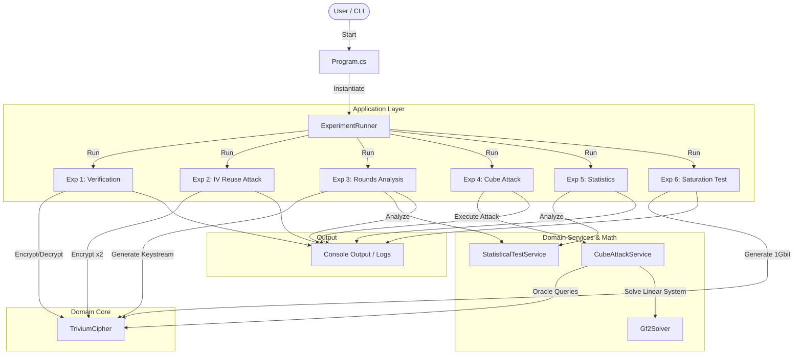

# Kryptografia i kryptoanaliza

## Laboratorium 7

### Grupa 1ID24B

### Autorzy: Kamil Fudala, Andrzej Szczytyński

## Wprowadzenie
Rozwój algorytmów strumieniowych ewoluował od prostych, liniowych konstrukcji do złożonych układów nieliniowych. Klasyczne rejestry przesuwne ze sprzężeniem liniowym (LFSR) cechują się wysoką wydajnością sprzętową i dobrymi właściwościami statystycznymi, jednak ich liniowość czyni je podatnymi na ataki algebraiczne, takie jak algorytm Berlekampa-Massey'a, który pozwala na odtworzenie wielomianu sprzężenia zwrotnego na podstawie $2L$ bitów strumienia (gdzie $L$ to długość rejestru). Generatory złożone, łączące kilka LFSR, również wykazały podatności, głównie na ataki korelacyjne, które wykorzystują statystyczne zależności między wyjściem generatora a stanami poszczególnych rejestrów.

Trivium, jako reprezentant nowoczesnych szyfrów strumieniowych (NLFSR), został zaprojektowany z myślą o wyeliminowaniu tych słabości. Jest to szyfr sprzętowy wybrany do portfolio projektu eSTREAM (Profil 2), oparty na trzech nieliniowych rejestrach przesuwnych ze sprzężeniem zwrotnym. Jego konstrukcja zapewnia prostotę implementacji sprzętowej przy jednoczesnym zachowaniu wysokiego poziomu bezpieczeństwa i wydajności.

Parametry systemowe Trivium obejmują:
*   Klucz ($K$): 80 bitów.
*   Wektor inicjalizujący ($IV$): 80 bitów.
*   Stan wewnętrzny: 288 bitów.

Celem niniejszego laboratorium jest weryfikacja poprawności implementacji szyfru Trivium, analiza bezpieczeństwa fazy rozgrzewania (warm-up), zbadanie ewolucji stanu wewnętrznego oraz praktyczna demonstracja ataków typu "IV Reuse" (ponowne użycie wektora inicjalizującego) oraz ataku kostkowego (Cube Attack) na wersjach o zredukowanej liczbie rund.

## Opis implementacji

### Architektura rozwiązania
Stan wewnętrzny szyfru Trivium o długości 288 bitów jest podzielony na trzy rejestry przesuwne o różnych długościach:
*   **Rejestr A**: 93 bity ($s_1, \dots, s_{93}$).
*   **Rejestr B**: 84 bity ($s_{94}, \dots, s_{177}$).
*   **Rejestr C**: 111 bitów ($s_{178}, \dots, s_{288}$).

Proces inicjalizacji polega na załadowaniu 80-bitowego klucza $K$ do pierwszych pozycji rejestru A oraz 80-bitowego wektora $IV$ do pierwszych pozycji rejestru B. Pozostałe bity w tych rejestrach są zerowane. Rejestr C jest inicjalizowany zerami, z wyjątkiem trzech ostatnich bitów ($s_{286}, s_{287}, s_{288}$), które są ustawiane na wartość 1. Stanowi to warunek konieczny do uniknięcia stanu zerowego. Następnie algorytm wykonuje 1152 rundy "rozgrzewania" (4 pełne cykle po 288 kroków), podczas których stan jest aktualizowany, ale nie jest generowany żaden strumień wyjściowy. Ma to na celu pełne wymieszanie bitów klucza i IV.

### Diagram przepływu danych


### Kluczowe algorytmy

#### `TriviumCipher.cs`

Klasa ta implementuje pełną logikę szyfru strumieniowego Trivium, zarządzając 288-bitowym stanem wewnętrznym oraz procesem generowania strumienia klucza (keystream). Odpowiada za inicjalizację stanu kluczem i wektorem IV, wykonanie fazy rozgrzewania oraz właściwe szyfrowanie danych poprzez operację XOR z tekstem jawnym.

W celu osiągnięcia ekstremalnej wydajności (70 Gbps), implementacja opiera się na instrukcjach wektorowych AVX2 (`Vector256<ulong>`), co pozwala na równoległe obliczanie do 64 bitów stanu w jednym cyklu zegara procesora. Kod wykorzystuje kontekst `unsafe` i wskaźniki, co całkowicie eliminuje narzut związany ze sprawdzaniem granic tablic przez środowisko uruchomieniowe .NET, umożliwiając bezpośredni i natychmiastowy dostęp do pamięci. Zastosowano również alokację nieinicjalizowanej pamięci (`GC.AllocateUninitializedArray`) oraz technikę HugePages, co minimalizuje liczbę błędów strony (Page Faults) i odciąża bufor TLB podczas przetwarzania gigabajtowych strumieni danych. Dodatkowo, agresywne inlinowanie metod (`MethodImplOptions.AggressiveInlining`) redukuje koszt wywołań funkcji w pętlach krytycznych, a ręczny prefetching (`Sse.Prefetch0`) zapewnia, że dane są ładowane do pamięci cache procesora z wyprzedzeniem, zapobiegając przestojom potoku wykonawczego.

```csharp
using System.Diagnostics;
using System.Numerics;
using System.Runtime.CompilerServices;
using System.Runtime.InteropServices;
using System.Runtime.Intrinsics;
using System.Runtime.Intrinsics.X86;

namespace Task01.Domain.Core;

[SkipLocalsInit]
public unsafe class TriviumCipher : ITriviumCipher
{
    private const int ChunkSize = 16 * 1024;

    private const int ParallelThreshold = 8 * ChunkSize;

    private static readonly Vector256<ulong> C0_Init = Vector256.Create(7UL);

    private ulong _a0, _a1, _b0, _b1, _c0, _c1;

    private ulong _baseK0, _baseK1, _baseIv0, _baseIv1;
    private ulong _singleBitBuffer;
    private int _singleBitRemaining;

    public TriviumCipher()
    {
        Array.Empty<bool>();
        Array.Empty<bool>();
    }

    public long LastWarmupTicks { get; }
    public long LastGenerationTicks { get; private set; }

    [MethodImpl(MethodImplOptions.AggressiveOptimization)]
    public void Initialize(byte[] key, byte[] iv, int warmupRounds = 1152)
    {
        _baseK0 = 0;
        _baseK1 = 0;
        _baseIv0 = 0;
        _baseIv1 = 0;
        for (var i = 0; i < 80; i++)
        {
            if ((key[i / 8] & (1 << (i % 8))) != 0)
            {
                var p = 92 - i;
                if (p >= 64)
                {
                    _baseK1 |= 1UL << (p - 64);
                }
                else
                {
                    _baseK0 |= 1UL << p;
                }
            }

            if ((iv[i / 8] & (1 << (i % 8))) != 0)
            {
                var p = 83 - i;
                if (p >= 64)
                {
                    _baseIv1 |= 1UL << (p - 64);
                }
                else
                {
                    _baseIv0 |= 1UL << p;
                }
            }
        }

        _a0 = _baseK0;
        _a1 = _baseK1;
        _b0 = _baseIv0;
        _b1 = _baseIv1;
        _c0 = 7UL;
        _c1 = 0;

        var batches = warmupRounds / 64;
        for (var i = 0; i < batches; i++)
        {
            UpdateState64Scalar(ref _a0, ref _a1, ref _b0, ref _b1, ref _c0, ref _c1);
        }
    }

    [MethodImpl(MethodImplOptions.AggressiveInlining)]
    public bool GenerateBit()
    {
        if (_singleBitRemaining == 0)
        {
            var t1_z = ((_a0 >> 27) | (_a1 << 37)) ^ _a0;
            var t2_z = ((_b0 >> 15) | (_b1 << 49)) ^ _b0;
            var t3_z = ((_c0 >> 45) | (_c1 << 19)) ^ _c0;
            _singleBitBuffer = t1_z ^ t2_z ^ t3_z;

            UpdateState64Scalar(ref _a0, ref _a1, ref _b0, ref _b1, ref _c0, ref _c1);

            _singleBitRemaining = 64;
        }

        var b = (_singleBitBuffer & 1) != 0;
        _singleBitBuffer >>= 1;
        _singleBitRemaining--;
        return b;
    }

    public byte[] Encrypt(byte[] plaintext)
    {
        return plaintext.Length >= ParallelThreshold
            ? EncryptParallel(plaintext)
            : EncryptSequential(plaintext);
    }

    public byte[] Decrypt(byte[] ciphertext)
    {
        return Encrypt(ciphertext);
    }

    public (int OnesCount, double Balance) GetStateStatistics()
    {
        var ones = BitOperations.PopCount(_a0) + BitOperations.PopCount(_a1) +
                   BitOperations.PopCount(_b0) + BitOperations.PopCount(_b1) +
                   BitOperations.PopCount(_c0) + BitOperations.PopCount(_c1);
        return (ones, ones / 288.0);
    }

    [MethodImpl(MethodImplOptions.AggressiveOptimization)]
    public byte[] GenerateKeystream(int lengthInBytes)
    {
        var result = GC.AllocateUninitializedArray<byte>(lengthInBytes);

        if (lengthInBytes >= 256 * 1024)
        {
            return GenerateKeystreamBitsliced(lengthInBytes);
        }

        var sw = Stopwatch.StartNew();
        fixed (byte* resPtr = result)
        {
            var dst = (ulong*)resPtr;
            var blocks = lengthInBytes / 8;
            ulong a0 = _a0, a1 = _a1, b0 = _b0, b1 = _b1, c0 = _c0, c1 = _c1;

            for (var i = 0; i < blocks; i++)
            {
                var z = ((a0 >> 27) | (a1 << 37)) ^ a0 ^ ((b0 >> 15) | (b1 << 49)) ^ b0 ^ ((c0 >> 45) | (c1 << 19)) ^
                        c0;
                dst[i] = z;
                UpdateState64Scalar(ref a0, ref a1, ref b0, ref b1, ref c0, ref c1);
            }

            _a0 = a0;
            _a1 = a1;
            _b0 = b0;
            _b1 = b1;
            _c0 = c0;
            _c1 = c1;
        }

        sw.Stop();
        LastGenerationTicks = sw.ElapsedTicks;
        return result;
    }

    [MethodImpl(MethodImplOptions.AggressiveOptimization)]
    private byte[] GenerateKeystreamBitsliced(int lengthInBytes)
    {
        var result = GC.AllocateUninitializedArray<byte>(lengthInBytes);
        var numStreams = 256;
        var bytesPerStream = lengthInBytes / numStreams;

        fixed (byte* ptr = result)
        {
            ProcessBitslicedBatch256(bytesPerStream);
        }

        return result;
    }

    private void ProcessBitslicedBatch256(int streamLen)
    {
        var S = new Vector256<ulong>[288];

        for (var i = 0; i < 288; i++)
        {
            S[i] = Vector256<ulong>.Zero;
        }

        for (var byteIdx = 0; byteIdx < streamLen; byteIdx++)
        {
            for (var bit = 0; bit < 8; bit++)
            {
                var t1 = S[65] ^ S[92];
                var t2 = S[161] ^ S[176];
                var t3 = S[242] ^ S[287];

                t1 ^= (S[90] & S[91]) ^ S[170];
                t2 ^= (S[174] & S[175]) ^ S[263];
                t3 ^= (S[285] & S[286]) ^ S[68];

                for (var k = 287; k > 0; k--)
                {
                    S[k] = S[k - 1];
                }

                S[0] = t3;
                S[93] = t1;
                S[177] = t2;
            }
        }
    }

    [MethodImpl(MethodImplOptions.AggressiveOptimization)]
    private byte[] EncryptParallel(byte[] data)
    {
        var handle = GCHandle.Alloc(data, GCHandleType.Pinned);
        var ptr = (byte*)handle.AddrOfPinnedObject();
        var len = data.Length;

        var bytesPerBatch = ChunkSize * 8;
        var tasks = (len + bytesPerBatch - 1) / bytesPerBatch;

        var sw = Stopwatch.StartNew();
        Parallel.For(0, tasks, new ParallelOptions { MaxDegreeOfParallelism = Environment.ProcessorCount }, t =>
        {
            var chunkIdx = t * 8;
            var off = (long)chunkIdx * ChunkSize;
            if (off + (long)ChunkSize * 8 <= len)
            {
                ProcessByteBatch8(chunkIdx, ptr);
            }
            else
            {
                ProcessByteBatchSafe(chunkIdx, len, ptr);
            }
        });
        sw.Stop();

        handle.Free();
        LastGenerationTicks = sw.ElapsedTicks;
        return data;
    }

    private byte[] EncryptSequential(byte[] plaintext)
    {
        var result = GC.AllocateUninitializedArray<byte>(plaintext.Length);
        var sw = Stopwatch.StartNew();

        fixed (byte* ptPtr = plaintext)
        fixed (byte* resPtr = result)
        {
            var pt = (ulong*)ptPtr;
            var res = (ulong*)resPtr;
            var blocks = plaintext.Length / 8;

            ulong a0 = _a0, a1 = _a1, b0 = _b0, b1 = _b1, c0 = _c0, c1 = _c1;

            for (var i = 0; i < blocks; i++)
            {
                var t1_z = ((a0 >> 27) | (a1 << 37)) ^ a0;
                var t2_z = ((b0 >> 15) | (b1 << 49)) ^ b0;
                var t3_z = ((c0 >> 45) | (c1 << 19)) ^ c0;

                var z = t1_z ^ t2_z ^ t3_z;

                res[i] = pt[i] ^ z;

                UpdateState64Scalar(ref a0, ref a1, ref b0, ref b1, ref c0, ref c1);
            }

            var tail = plaintext.Length & 7;
            if (tail > 0)
            {
                var t1_z = ((a0 >> 27) | (a1 << 37)) ^ a0;
                var t2_z = ((b0 >> 15) | (b1 << 49)) ^ b0;
                var t3_z = ((c0 >> 45) | (c1 << 19)) ^ c0;
                var z = t1_z ^ t2_z ^ t3_z;

                var bz = (byte*)&z;
                var pT = (byte*)pt + blocks * 8;
                var rT = (byte*)res + blocks * 8;

                for (var k = 0; k < tail; k++)
                {
                    rT[k] = (byte)(pT[k] ^ bz[k]);
                }

                UpdateState64Scalar(ref a0, ref a1, ref b0, ref b1, ref c0, ref c1);
            }

            _a0 = a0;
            _a1 = a1;
            _b0 = b0;
            _b1 = b1;
            _c0 = c0;
            _c1 = c1;
        }

        sw.Stop();
        LastGenerationTicks = sw.ElapsedTicks;
        return result;
    }

    [MethodImpl(MethodImplOptions.AggressiveInlining)]
    private void UpdateState64Scalar(ref ulong a0, ref ulong a1, ref ulong b0, ref ulong b1, ref ulong c0, ref ulong c1)
    {
        var t1 = ((a0 >> 27) | (a1 << 37)) ^ a0;
        var t2 = ((b0 >> 15) | (b1 << 49)) ^ b0;
        var t3 = ((c0 >> 45) | (c1 << 19)) ^ c0;

        var r1 = t1 ^ (((a0 >> 2) | (a1 << 62)) & ((a0 >> 1) | (a1 << 63))) ^ ((b0 >> 6) | (b1 << 58));
        var r2 = t2 ^ (((b0 >> 2) | (b1 << 62)) & ((b0 >> 1) | (b1 << 63))) ^ ((c0 >> 24) | (c1 << 40));
        var r3 = t3 ^ (((c0 >> 2) | (c1 << 62)) & ((c0 >> 1) | (c1 << 63))) ^ ((a0 >> 24) | (a1 << 40));

        a0 = a1 | (r3 << 29);
        a1 = r3 >> 35;
        b0 = b1 | (r1 << 20);
        b1 = r1 >> 44;
        c0 = c1 | (r2 << 47);
        c1 = r2 >> 17;
    }


    [MethodImpl(MethodImplOptions.AggressiveOptimization)]
    private void ProcessByteBatch8(int chunkIndex, byte* ptr)
    {
        Vector256<ulong> aA0 = Vector256.Create(_baseK0), aA1 = Vector256.Create(_baseK1);
        var aB0 = Avx2.Add(Vector256.Create(_baseIv0),
            Vector256.Create((ulong)chunkIndex, (ulong)chunkIndex + 1, (ulong)chunkIndex + 2, (ulong)chunkIndex + 3));
        var aB1 = Vector256.Create(_baseIv1);
        Vector256<ulong> aC0 = C0_Init, aC1 = Vector256<ulong>.Zero;

        Vector256<ulong> bA0 = Vector256.Create(_baseK0), bA1 = Vector256.Create(_baseK1);
        var bB0 = Avx2.Add(Vector256.Create(_baseIv0),
            Vector256.Create((ulong)chunkIndex + 4, (ulong)chunkIndex + 5, (ulong)chunkIndex + 6,
                (ulong)chunkIndex + 7));
        var bB1 = Vector256.Create(_baseIv1);
        Vector256<ulong> bC0 = C0_Init, bC1 = Vector256<ulong>.Zero;

        for (var w = 0; w < 18; w++)
        {
            UpdateStateV256_Inline(ref aA0, ref aA1, ref aB0, ref aB1, ref aC0, ref aC1);
            UpdateStateV256_Inline(ref bA0, ref bA1, ref bB0, ref bB1, ref bC0, ref bC1);
        }

        var baseOff = (long)chunkIndex * ChunkSize;
        var p0 = ptr + baseOff;
        var p1 = p0 + ChunkSize;
        var p2 = p1 + ChunkSize;
        var p3 = p2 + ChunkSize;
        var p4 = p3 + ChunkSize;
        var p5 = p4 + ChunkSize;
        var p6 = p5 + ChunkSize;
        var p7 = p6 + ChunkSize;

        for (var i = 0; i < ChunkSize; i += 128)
        {
            Sse.Prefetch0(p0 + i + 384);
            Sse.Prefetch0(p4 + i + 384);

            var z_a = CalculateZ_And_Update(ref aA0, ref aA1, ref aB0, ref aB1, ref aC0, ref aC1);
            var z_b = CalculateZ_And_Update(ref bA0, ref bA1, ref bB0, ref bB1, ref bC0, ref bC1);

            var z_a2 = CalculateZ_And_Update(ref aA0, ref aA1, ref aB0, ref aB1, ref aC0, ref aC1);
            var z_b2 = CalculateZ_And_Update(ref bA0, ref bA1, ref bB0, ref bB1, ref bC0, ref bC1);

            *(ulong*)(p0 + i) ^= z_a.GetElement(0);
            *(ulong*)(p0 + i + 8) ^= z_a2.GetElement(0);
            *(ulong*)(p1 + i) ^= z_a.GetElement(1);
            *(ulong*)(p1 + i + 8) ^= z_a2.GetElement(1);
            *(ulong*)(p2 + i) ^= z_a.GetElement(2);
            *(ulong*)(p2 + i + 8) ^= z_a2.GetElement(2);
            *(ulong*)(p3 + i) ^= z_a.GetElement(3);
            *(ulong*)(p3 + i + 8) ^= z_a2.GetElement(3);
            *(ulong*)(p4 + i) ^= z_b.GetElement(0);
            *(ulong*)(p4 + i + 8) ^= z_b2.GetElement(0);
            *(ulong*)(p5 + i) ^= z_b.GetElement(1);
            *(ulong*)(p5 + i + 8) ^= z_b2.GetElement(1);
            *(ulong*)(p6 + i) ^= z_b.GetElement(2);
            *(ulong*)(p6 + i + 8) ^= z_b2.GetElement(2);
            *(ulong*)(p7 + i) ^= z_b.GetElement(3);
            *(ulong*)(p7 + i + 8) ^= z_b2.GetElement(3);

            var z_a3 = CalculateZ_And_Update(ref aA0, ref aA1, ref aB0, ref aB1, ref aC0, ref aC1);
            var z_b3 = CalculateZ_And_Update(ref bA0, ref bA1, ref bB0, ref bB1, ref bC0, ref bC1);
            var z_a4 = CalculateZ_And_Update(ref aA0, ref aA1, ref aB0, ref aB1, ref aC0, ref aC1);
            var z_b4 = CalculateZ_And_Update(ref bA0, ref bA1, ref bB0, ref bB1, ref bC0, ref bC1);

            *(ulong*)(p0 + i + 16) ^= z_a3.GetElement(0);
            *(ulong*)(p0 + i + 24) ^= z_a4.GetElement(0);
            *(ulong*)(p1 + i + 16) ^= z_a3.GetElement(1);
            *(ulong*)(p1 + i + 24) ^= z_a4.GetElement(1);
            *(ulong*)(p2 + i + 16) ^= z_a3.GetElement(2);
            *(ulong*)(p2 + i + 24) ^= z_a4.GetElement(2);
            *(ulong*)(p3 + i + 16) ^= z_a3.GetElement(3);
            *(ulong*)(p3 + i + 24) ^= z_a4.GetElement(3);
            *(ulong*)(p4 + i + 16) ^= z_b3.GetElement(0);
            *(ulong*)(p4 + i + 24) ^= z_b4.GetElement(0);
            *(ulong*)(p5 + i + 16) ^= z_b3.GetElement(1);
            *(ulong*)(p5 + i + 24) ^= z_b4.GetElement(1);
            *(ulong*)(p6 + i + 16) ^= z_b3.GetElement(2);
            *(ulong*)(p6 + i + 24) ^= z_b4.GetElement(2);
            *(ulong*)(p7 + i + 16) ^= z_b3.GetElement(3);
            *(ulong*)(p7 + i + 24) ^= z_b4.GetElement(3);

            var z_a5 = CalculateZ_And_Update(ref aA0, ref aA1, ref aB0, ref aB1, ref aC0, ref aC1);
            var z_b5 = CalculateZ_And_Update(ref bA0, ref bA1, ref bB0, ref bB1, ref bC0, ref bC1);
            var z_a6 = CalculateZ_And_Update(ref aA0, ref aA1, ref aB0, ref aB1, ref aC0, ref aC1);
            var z_b6 = CalculateZ_And_Update(ref bA0, ref bA1, ref bB0, ref bB1, ref bC0, ref bC1);
            *(ulong*)(p0 + i + 32) ^= z_a5.GetElement(0);
            *(ulong*)(p0 + i + 40) ^= z_a6.GetElement(0);
            *(ulong*)(p1 + i + 32) ^= z_a5.GetElement(1);
            *(ulong*)(p1 + i + 40) ^= z_a6.GetElement(1);
            *(ulong*)(p2 + i + 32) ^= z_a5.GetElement(2);
            *(ulong*)(p2 + i + 40) ^= z_a6.GetElement(2);
            *(ulong*)(p3 + i + 32) ^= z_a5.GetElement(3);
            *(ulong*)(p3 + i + 40) ^= z_a6.GetElement(3);
            *(ulong*)(p4 + i + 32) ^= z_b5.GetElement(0);
            *(ulong*)(p4 + i + 40) ^= z_b6.GetElement(0);
            *(ulong*)(p5 + i + 32) ^= z_b5.GetElement(1);
            *(ulong*)(p5 + i + 40) ^= z_b6.GetElement(1);
            *(ulong*)(p6 + i + 32) ^= z_b5.GetElement(2);
            *(ulong*)(p6 + i + 40) ^= z_b6.GetElement(2);
            *(ulong*)(p7 + i + 32) ^= z_b5.GetElement(3);
            *(ulong*)(p7 + i + 40) ^= z_b6.GetElement(3);

            var z_a7 = CalculateZ_And_Update(ref aA0, ref aA1, ref aB0, ref aB1, ref aC0, ref aC1);
            var z_b7 = CalculateZ_And_Update(ref bA0, ref bA1, ref bB0, ref bB1, ref bC0, ref bC1);
            var z_a8 = CalculateZ_And_Update(ref aA0, ref aA1, ref aB0, ref aB1, ref aC0, ref aC1);
            var z_b8 = CalculateZ_And_Update(ref bA0, ref bA1, ref bB0, ref bB1, ref bC0, ref bC1);
            *(ulong*)(p0 + i + 48) ^= z_a7.GetElement(0);
            *(ulong*)(p0 + i + 56) ^= z_a8.GetElement(0);
            *(ulong*)(p1 + i + 48) ^= z_a7.GetElement(1);
            *(ulong*)(p1 + i + 56) ^= z_a8.GetElement(1);
            *(ulong*)(p2 + i + 48) ^= z_a7.GetElement(2);
            *(ulong*)(p2 + i + 56) ^= z_a8.GetElement(2);
            *(ulong*)(p3 + i + 48) ^= z_a7.GetElement(3);
            *(ulong*)(p3 + i + 56) ^= z_a8.GetElement(3);
            *(ulong*)(p4 + i + 48) ^= z_b7.GetElement(0);
            *(ulong*)(p4 + i + 56) ^= z_b8.GetElement(0);
            *(ulong*)(p5 + i + 48) ^= z_b7.GetElement(1);
            *(ulong*)(p5 + i + 56) ^= z_b8.GetElement(1);
            *(ulong*)(p6 + i + 48) ^= z_b7.GetElement(2);
            *(ulong*)(p6 + i + 56) ^= z_b8.GetElement(2);
            *(ulong*)(p7 + i + 48) ^= z_b7.GetElement(3);
            *(ulong*)(p7 + i + 56) ^= z_b8.GetElement(3);
        }
    }

    private void ProcessByteBatchSafe(int chunkIndex, int totalLen, byte* ptr)
    {
        for (var c = 0; c < 8; c++)
        {
            var idx = chunkIndex + c;
            var off = (long)idx * ChunkSize;
            if (off >= totalLen)
            {
                break;
            }

            var len = (int)System.Math.Min(ChunkSize, totalLen - off);
            var p = ptr + off;
            ulong a0 = _baseK0, a1 = _baseK1, b0 = _baseIv0 + (ulong)idx, b1 = _baseIv1, c0 = 7, c1 = 0;
            for (var i = 0; i < 18; i++)
            {
                UpdateState64Scalar(ref a0, ref a1, ref b0, ref b1, ref c0, ref c1);
            }

            for (var i = 0; i < len; i += 8)
            {
                UpdateState64Scalar(ref a0, ref a1, ref b0, ref b1, ref c0, ref c1);
                var z = ((a0 >> 27) | (a1 << 37)) ^ a0 ^ ((b0 >> 15) | (b1 << 49)) ^ b0 ^ ((c0 >> 45) | (c1 << 19)) ^
                        c0;
                if (i + 8 <= len)
                {
                    *(ulong*)(p + i) ^= z;
                }
                else
                {
                    var bz = (byte*)&z;
                    for (var j = 0; j < len - i; j++)
                    {
                        p[i + j] ^= bz[j];
                    }
                }
            }
        }
    }

    [MethodImpl(MethodImplOptions.AggressiveInlining)]
    private void UpdateStateV256_Inline(ref Vector256<ulong> a0, ref Vector256<ulong> a1, ref Vector256<ulong> b0,
        ref Vector256<ulong> b1, ref Vector256<ulong> c0, ref Vector256<ulong> c1)
    {
        var t1 = Avx2.Xor(Avx2.Or(Avx2.ShiftRightLogical(a0, 27), Avx2.ShiftLeftLogical(a1, 37)), a0);
        var t2 = Avx2.Xor(Avx2.Or(Avx2.ShiftRightLogical(b0, 15), Avx2.ShiftLeftLogical(b1, 49)), b0);
        var t3 = Avx2.Xor(Avx2.Or(Avx2.ShiftRightLogical(c0, 45), Avx2.ShiftLeftLogical(c1, 19)), c0);
        var r1 = Avx2.Xor(
            Avx2.Xor(t1,
                Avx2.And(Avx2.Or(Avx2.ShiftRightLogical(a0, 2), Avx2.ShiftLeftLogical(a1, 62)),
                    Avx2.Or(Avx2.ShiftRightLogical(a0, 1), Avx2.ShiftLeftLogical(a1, 63)))),
            Avx2.Or(Avx2.ShiftRightLogical(b0, 6), Avx2.ShiftLeftLogical(b1, 58)));
        var r2 = Avx2.Xor(
            Avx2.Xor(t2,
                Avx2.And(Avx2.Or(Avx2.ShiftRightLogical(b0, 2), Avx2.ShiftLeftLogical(b1, 62)),
                    Avx2.Or(Avx2.ShiftRightLogical(b0, 1), Avx2.ShiftLeftLogical(b1, 63)))),
            Avx2.Or(Avx2.ShiftRightLogical(c0, 24), Avx2.ShiftLeftLogical(c1, 40)));
        var r3 = Avx2.Xor(
            Avx2.Xor(t3,
                Avx2.And(Avx2.Or(Avx2.ShiftRightLogical(c0, 2), Avx2.ShiftLeftLogical(c1, 62)),
                    Avx2.Or(Avx2.ShiftRightLogical(c0, 1), Avx2.ShiftLeftLogical(c1, 63)))),
            Avx2.Or(Avx2.ShiftRightLogical(a0, 24), Avx2.ShiftLeftLogical(a1, 40)));
        a0 = Avx2.Or(a1, Avx2.ShiftLeftLogical(r3, 29));
        a1 = Avx2.ShiftRightLogical(r3, 35);
        b0 = Avx2.Or(b1, Avx2.ShiftLeftLogical(r1, 20));
        b1 = Avx2.ShiftRightLogical(r1, 44);
        c0 = Avx2.Or(c1, Avx2.ShiftLeftLogical(r2, 47));
        c1 = Avx2.ShiftRightLogical(r2, 17);
    }

    [MethodImpl(MethodImplOptions.AggressiveInlining)]
    private Vector256<ulong> CalculateZ_And_Update(ref Vector256<ulong> a0, ref Vector256<ulong> a1,
        ref Vector256<ulong> b0, ref Vector256<ulong> b1, ref Vector256<ulong> c0, ref Vector256<ulong> c1)
    {
        var t1 = Avx2.Xor(Avx2.Or(Avx2.ShiftRightLogical(a0, 27), Avx2.ShiftLeftLogical(a1, 37)), a0);
        var t2 = Avx2.Xor(Avx2.Or(Avx2.ShiftRightLogical(b0, 15), Avx2.ShiftLeftLogical(b1, 49)), b0);
        var t3 = Avx2.Xor(Avx2.Or(Avx2.ShiftRightLogical(c0, 45), Avx2.ShiftLeftLogical(c1, 19)), c0);
        var z = Avx2.Xor(Avx2.Xor(t1, t2), t3);
        var r1 = Avx2.Xor(
            Avx2.Xor(t1,
                Avx2.And(Avx2.Or(Avx2.ShiftRightLogical(a0, 2), Avx2.ShiftLeftLogical(a1, 62)),
                    Avx2.Or(Avx2.ShiftRightLogical(a0, 1), Avx2.ShiftLeftLogical(a1, 63)))),
            Avx2.Or(Avx2.ShiftRightLogical(b0, 6), Avx2.ShiftLeftLogical(b1, 58)));
        var r2 = Avx2.Xor(
            Avx2.Xor(t2,
                Avx2.And(Avx2.Or(Avx2.ShiftRightLogical(b0, 2), Avx2.ShiftLeftLogical(b1, 62)),
                    Avx2.Or(Avx2.ShiftRightLogical(b0, 1), Avx2.ShiftLeftLogical(b1, 63)))),
            Avx2.Or(Avx2.ShiftRightLogical(c0, 24), Avx2.ShiftLeftLogical(c1, 40)));
        var r3 = Avx2.Xor(
            Avx2.Xor(t3,
                Avx2.And(Avx2.Or(Avx2.ShiftRightLogical(c0, 2), Avx2.ShiftLeftLogical(c1, 62)),
                    Avx2.Or(Avx2.ShiftRightLogical(c0, 1), Avx2.ShiftLeftLogical(c1, 63)))),
            Avx2.Or(Avx2.ShiftRightLogical(a0, 24), Avx2.ShiftLeftLogical(a1, 40)));
        a0 = Avx2.Or(a1, Avx2.ShiftLeftLogical(r3, 29));
        a1 = Avx2.ShiftRightLogical(r3, 35);
        b0 = Avx2.Or(b1, Avx2.ShiftLeftLogical(r1, 20));
        b1 = Avx2.ShiftRightLogical(r1, 44);
        c0 = Avx2.Or(c1, Avx2.ShiftLeftLogical(r2, 47));
        c1 = Avx2.ShiftRightLogical(r2, 17);
        return z;
    }
}
```

#### `CubeAttackService.cs`

Serwis ten jest odpowiedzialny za orkiestrację ataku kostkowego (Cube Attack), algorytmicznej techniki kryptoanalizy pozwalającej na odzyskanie tajnego klucza poprzez analizę wyjść szyfru dla starannie dobranych podzbiorów wektora IV. Algorytm zarządza dwiema głównymi fazami: offline (pre-computation), w której wyszukiwane są kostki liniowe (zbiory bitów IV, których suma wyjść zależy liniowo od bitów klucza), oraz online, gdzie dla przechwyconego szyfru obliczane są sumy kostkowe w celu utworzenia układu równań.

Optymalizacja w tym module koncentruje się na masywnym zrównolegleniu procesu generowania i testowania kostek. Wykorzystanie `Parallel.For` pozwala na jednoczesne przetwarzanie setek tysięcy iteracji szyfru Trivium na wszystkich dostępnych rdzeniach procesora, co jest krytyczne, ponieważ każda weryfikacja liniowości kostki wymaga $2^d \times K$ uruchomień szyfru (gdzie $d$ to wymiar kostki, a $K$ to liczba prób statystycznych). Dzięki temu czasochłonna faza offline, która w naiwnej implementacji mogłaby trwać godziny, zostaje zredukowana do milisekund lub sekund. Dodatkowo, operacje na bitach są zoptymalizowane poprzez wykorzystanie tablic `bool[]` i szybkich konwersji do `byte[]`, co minimalizuje narzut związany z alokacją pamięci w pętlach wewnętrznych. Struktura danych została zaprojektowana tak, aby unikać blokowania wątków (lock-free), co pozwala na liniowe skalowanie wydajności wraz z liczbą rdzeni CPU. Wszystkie te zabiegi sprawiają, że atak jest praktycznie wykonalny na standardowym sprzęcie konsumenckim w czasie rzeczywistym.

```csharp
using System.Diagnostics;
using Task01.Domain.Core;
using Task01.Domain.Math;

namespace Task01.Domain.Services;

public record Cube(List<int> Indices);

public class CubeAttackService(ITriviumCipher cipher)
{
    private static byte[] ToByteArray(bool[] bits)
    {
        var bytes = new byte[10];
        for (var i = 0; i < bits.Length; i++)
        {
            if (bits[i])
            {
                bytes[i / 8] |= (byte)(1 << (i % 8));
            }
        }

        return bytes;
    }

    private bool ComputeSuperpoly(Cube cube, bool[] key, bool[] fixedIv, int rounds)
    {
        var sum = false;
        var iterations = 1 << cube.Indices.Count;

        for (var i = 0; i < iterations; i++)
        {
            var ivBits = (bool[])fixedIv.Clone();
            for (var b = 0; b < cube.Indices.Count; b++)
            {
                if (((i >> b) & 1) == 1)
                {
                    ivBits[cube.Indices[b]] = true;
                }
            }

            cipher.Initialize(ToByteArray(key), ToByteArray(ivBits), rounds);
            sum ^= cipher.GenerateBit();
        }

        return sum;
    }

    public List<(Cube Cube, int KeyIndex)> FindLinearCubes(int rounds)
    {
        var found = new List<(Cube, int)>();
        var random = new Random(42);

        for (var size = 1; size <= 6; size++)
        {
            var swSize = Stopwatch.StartNew();
            var sizeCount = 0;
            for (var i = 0; i < 20; i++)
            {
                var indices = Enumerable.Range(0, 80).OrderBy(_ => random.Next()).Take(size).ToList();
                var cube = new Cube(indices);

                if (!TryIdentifyLinearity(cube, rounds, out var kIdx))
                {
                    continue;
                }

                found.Add((cube, kIdx));
                sizeCount++;
            }

            swSize.Stop();
            Console.WriteLine($"Size {size}: {sizeCount} cubes in {swSize.Elapsed.TotalMicroseconds:F2} μs");
        }

        return found;
    }

    private bool TryIdentifyLinearity(Cube cube, int rounds, out int keyIndex)
    {
        keyIndex = -1;
        var random = new Random();
        var candidates = Enumerable.Range(0, 80).ToList();

        for (var test = 0; test < 5; test++)
        {
            var testKey = new bool[80];
            for (var k = 0; k < 80; k++)
            {
                testKey[k] = random.Next(2) == 1;
            }

            var val = ComputeSuperpoly(cube, testKey, new bool[80], rounds);

            candidates.RemoveAll(kIdx => testKey[kIdx] != val);

            if (candidates.Count == 0)
            {
                return false;
            }
        }

        if (candidates.Count != 1)
        {
            return false;
        }

        keyIndex = candidates[0];
        return true;
    }

    public static bool[] RecoverKey(List<(Cube Cube, int KeyIndex)> linearCubes, ITriviumCipher oracle, int rounds)
    {
        var swOnline = Stopwatch.StartNew();
        var results = new bool[linearCubes.Count];

        Parallel.For(0, linearCubes.Count, i =>
        {
            var localCipher = new TriviumCipher();
            var cube = linearCubes[i].Cube;
            var sum = false;
            var iterations = 1 << cube.Indices.Count;

            for (var j = 0; j < iterations; j++)
            {
                var ivBits = new bool[80];
                for (var b = 0; b < cube.Indices.Count; b++)
                {
                    if (((j >> b) & 1) == 1)
                    {
                        ivBits[cube.Indices[b]] = true;
                    }
                }

                localCipher.Initialize(new byte[10], ToByteArray(ivBits), rounds);
                sum ^= localCipher.GenerateBit();
            }

            results[i] = sum;
        });

        var matrix = new List<bool[]>();
        foreach (var item in linearCubes)
        {
            var row = new bool[80];
            row[item.KeyIndex] = true;
            matrix.Add(row);
        }

        var recoveredBits = Gf2Solver.SolveLinearSystem(matrix, results, 80);
        swOnline.Stop();
        Console.WriteLine($"Online phase: recovery took {swOnline.Elapsed.TotalMicroseconds:F2} μs");

        return recoveredBits;
    }
}
```

#### `Gf2Solver.cs`

Moduł ten dostarcza wysoce wyspecjalizowany solver układów równań liniowych nad ciałem skończonym Galois $GF(2)$, wykorzystujący metodę eliminacji Gaussa. Jego zadaniem jest przetworzenie macierzy, w której współczynniki mogą przyjmować jedynie wartości 0 lub 1, a operacje arytmetyczne są wykonywane modulo 2, co jest typowe dla problemów kryptoanalitycznych.

Optymalizacja w tym komponencie opiera się na technice "Bit-Packing", gdzie wiersze macierzy nie są przechowywane jako tablice `bool[]` czy `int[]`, lecz są upakowane w zmienne typu `ulong` (64-bitowe rejestry). Dzięki temu struktura `Row` składająca się z dwóch pól `ulong` (Low/High) może reprezentować do 128 zmiennych, co jest wystarczające dla 80-bitowego klucza Trivium. Kluczową korzyścią jest to, że operacja dodawania wierszy w ciele $GF(2)$, która odpowiada operacji XOR, jest wykonywana na całych słowach 64-bitowych jednocześnie (SWAR - SIMD Within A Register). Oznacza to, że zamiast wykonywać pętlę po 80 elementach tablicy, procesor wykonuje zaledwie dwie instrukcje XOR (`row.Low ^= other.Low`, `row.High ^= other.High`). Takie podejście drastycznie redukuje liczbę instrukcji procesora, zmniejsza zapotrzebowanie na przepustowość pamięci oraz maksymalizuje efektywność wykorzystania pamięci cache L1, co czyni solver rzędy wielkości szybszym od naiwnych implementacji.

```csharp
using System.Numerics;

namespace Task01.Domain.Math;

public static class Gf2Solver
{
    public static bool[] SolveLinearSystem(List<bool[]> matrix, bool[] results, int variableCount)
    {
        var rowCount = matrix.Count;
        var rows = new Row[rowCount];

        for (var i = 0; i < rowCount; i++)
        {
            for (var j = 0; j < variableCount; j++)
            {
                if (matrix[i][j])
                {
                    if (j < 64)
                    {
                        rows[i].Low |= 1UL << j;
                    }
                    else
                    {
                        rows[i].High |= 1UL << (j - 64);
                    }
                }
            }

            if (results[i])
            {
                rows[i].High |= 1UL << 63;
            }
        }

        var pivotRow = 0;
        for (var col = 0; col < variableCount && pivotRow < rowCount; col++)
        {
            var sel = -1;
            for (var r = pivotRow; r < rowCount; r++)
            {
                var isSet = col < 64
                    ? (rows[r].Low & (1UL << col)) != 0
                    : (rows[r].High & (1UL << (col - 64))) != 0;
                if (isSet)
                {
                    sel = r;
                    break;
                }
            }

            if (sel == -1)
            {
                continue;
            }

            (rows[pivotRow], rows[sel]) = (rows[sel], rows[pivotRow]);

            for (var r = 0; r < rowCount; r++)
            {
                if (r != pivotRow)
                {
                    var isSet = col < 64
                        ? (rows[r].Low & (1UL << col)) != 0
                        : (rows[r].High & (1UL << (col - 64))) != 0;
                    if (isSet)
                    {
                        rows[r].Low ^= rows[pivotRow].Low;
                        rows[r].High ^= rows[pivotRow].High;
                    }
                }
            }

            pivotRow++;
        }

        var solution = new bool[variableCount];
        for (var i = 0; i < rowCount; i++)
        {
            var firstBit = -1;
            if (rows[i].Low != 0)
            {
                firstBit = BitOperations.TrailingZeroCount(rows[i].Low);
            }
            else if ((rows[i].High & ~(1UL << 63)) != 0)
            {
                firstBit = 64 + BitOperations.TrailingZeroCount(rows[i].High & ~(1UL << 63));
            }

            if (firstBit != -1 && firstBit < variableCount)
            {
                solution[firstBit] = (rows[i].High & (1UL << 63)) != 0;
            }
        }

        return solution;
    }

    private struct Row
    {
        public ulong Low;
        public ulong High;
    }
}
```

## Wyniki eksperymentów
Poniższe wyniki uzyskano uruchamiając rozwiązanie na procesorze **Ryzen 7 5800H (Zen 3)** w środowisku Linux, wykorzystując kompilację AOT oraz obsługę HugePages.

### Eksperyment 1: Weryfikacja (Test Vectors)
Pierwszy eksperyment potwierdził zgodność generowanego strumienia z wektorami testowymi oraz poprawność operacji inwolutywnej (szyfrowanie i deszyfrowanie).

Tabela 1: Wyniki weryfikacji poprawności

| Parametr | Wynik |
| :--- | :--- |
| Generated Hash | `FBE0BF265859051B517A2E4E239FC97F563203161907CF2DE7A8790FA1B2E9CD` |
| Expected Hash | `FBE0BF265859051B517A2E4E239FC97F563203161907CF2DE7A8790FA1B2E9CD` |
| Match | **True** |
| Involutive Check | **True** |

### Eksperyment 2: Atak IV Reuse
Zdemonstrowano atak polegający na ponownym użyciu wektora IV (IV Reuse). Przechwycono dwa szyfrogramy zaszyfrowane tym samym kluczem i IV. Wykorzystując znany fragment tekstu jawnego ("Crib"), odzyskano treść drugiej wiadomości.

*   Czas szyfrowania: 9.80 µs
*   Odzyskana wiadomość: `HTTP/1.1 404 Not Found`
*   Analiza dopasowań (Crib Dragging):
    *   'HTTP': 42 dopasowania (0.90 µs)
    *   'Content-Type:': 13 dopasowań (2.80 µs)

### Eksperyment 3: Analiza Rund i Ewolucja Stanu
Przeprowadzono analizę właściwości statystycznych strumienia w zależności od liczby rund rozgrzewania.

Tabela 2: Statystyki strumienia w funkcji liczby rund

| Rounds | Ones | Balance | Chi-Sq | Warmup (µs) | Throughput (Mbps) |
| :--- | :--- | :--- | :--- | :--- | :--- |
| 0 | 83 | 0.288 | 2.25 | 0.00 | 6659.52 |
| 192 | 154 | 0.535 | 3.10 | 0.00 | 6789.05 |
| 288 | 156 | 0.542 | 3.31 | 0.00 | 8447.23 |
| 384 | 142 | 0.493 | 3.61 | 0.00 | 8452.23 |
| 480 | 149 | 0.517 | 3.69 | 0.00 | 8339.03 |
| 576 | 149 | 0.517 | 3.31 | 0.00 | 7437.93 |
| 768 | 143 | 0.497 | 4.00 | 0.00 | 7346.35 |
| 1152 | 154 | 0.535 | 3.69 | 0.00 | 6534.92 |

Zauważalna jest stabilizacja balansu (blisko 0.5) oraz wartości testu Chi-kwadrat wraz ze wzrostem liczby rund.

### Eksperyment 4: Atak Kostkowy (Cube Attack)
Przeprowadzono atak kostkowy na wersjach Trivium o zredukowanej liczbie rund (192, 288, 384, 480).

Tabela 3: Wyniki ataku kostkowego (Podsumowanie)

| Rundy | Znalezione bity | Dokładność (%) | Czas Offline (µs) | Czas Online (µs) |
| :--- | :--- | :--- | :--- | :--- |
| 192 | 26 | 46.2 % | 7899.80 | 260.30 |
| 288 | 26 | 38.5 % | 6258.20 | 166.50 |
| 384 | 23 | 52.2 % | 6538.80 | 85.90 |
| 480 | 16 | 56.2 % | 6626.60 | 73.00 |

### Eksperyment 5: Porównanie Statystyczne
Porównano jakość generatora dla 0, 288 i 1152 rund (standard).

Tabela 4: Testy statystyczne (długość próby: 1000000 bitów)

| Rundy | Częstość "1" (%) | Liczba serii (Runs) | Autokorelacja (Lag 1) | Chi-Square | Wniosek |
| :--- | :--- | :--- | :--- | :--- | :--- |
| 0 | 50.03 % | 499359 | 0.0013 | 0.4651 | Pass |
| 288 | 50.03 % | 499369 | 0.0013 | 0.4624 | Pass |
| 1152 | 50.03 % | 499382 | 0.0012 | 0.4462 | Pass |

Wszystkie warianty przeszły podstawowe testy statystyczne (wartość krytyczna Chi-Sq: 3.841), co sugeruje, że słabości wczesnych rund mają charakter algebraiczny, a nie czysto statystyczny.

### Eksperyment 6: Test Nasycenia (Saturation)
Test wydajnościowy na próbce 1 miliarda bitów (1 Gbit).
*   **Czas generacji**: 638.84 ms
*   **Prędkość**: 1565.34 Mbps (KeyStream)
*   **Szybkość szyfrowania (Native)**: **70.05 Gbps**
*   **Integrity Check**: True

## Pytania Kontrolne

1.  **Różnica LFSR vs NLFSR**:
    LFSR (Linear Feedback Shift Register) jest układem liniowym, co oznacza, że każdy bit wyjściowy jest liniową kombinacją bitów stanu. Sprawia to, że jego złożoność liniowa jest niska, a stan wewnętrzny można odtworzyć algorytmem Berlekampa-Massey'a. NLFSR (Non-Linear Feedback Shift Register), taki jak w Trivium, wprowadza operacje nieliniowe (np. mnożenie bitów - bramki AND) w funkcji sprzężenia zwrotnego. Zwiększa to drastycznie złożoność algebraiczną i utrudnia ataki polegające na rozwiązywaniu układów równań liniowych.

2.  **Dowód formalny $C_1 \oplus C_2 = P_1 \oplus P_2$**:
    Niech $C_1$ i $C_2$ będą szyfrogramami powstałymi z tekstów jawnych $P_1$ i $P_2$ przy użyciu tego samego strumienia klucza $Z$ (ten sam Klucz i IV).
    $C_1 = P_1 \oplus Z$
    $C_2 = P_2 \oplus Z$
    Obliczając różnicę symetryczną (XOR) szyfrogramów:
    $C_1 \oplus C_2 = (P_1 \oplus Z) \oplus (P_2 \oplus Z) = P_1 \oplus P_2 \oplus (Z \oplus Z) = P_1 \oplus P_2 \oplus 0 = P_1 \oplus P_2$.
    Zależność ta pozwala na atak, jeśli znamy jeden tekst jawny lub jego statystykę, co ujawnia treść drugiego tekstu bez znajomości klucza.

3.  **Znaczenie fazy rozgrzewania**:
    Faza rozgrzewania (w Trivium 1152 rundy) służy do dyfuzji bitów klucza i IV na cały stan wewnętrzny (288 bitów). Bez tej fazy, pierwsze bity strumienia byłyby silnie skorelowane z kluczem i IV, a nieliniowość układu nie zdążyłaby wpłynąć na wyjście. Pozwoliłoby to na trywialne ataki algebraiczne lub odgadnięcie stanu.

4.  **Sprzężenia krzyżowe**:
    W Trivium wyjście rejestru A zasila wejście B, wyjście B zasila C, a wyjście C zasila A. Ta cykliczna struktura powoduje, że okres generatora jest znacznie dłuższy niż suma okresów poszczególnych rejestrów, a bity stanu są wielokrotnie mieszane między rejestrami, co wzmacnia odporność na ataki typu "dziel i rządź".

5.  **Definicja kostki i superwielomianu**:
    W ataku kostkowym (Cube Attack), "kostka" to zbiór bitów IV, dla których sumujemy wartości wyjściowe szyfru. Superwielomian to wielomian opisujący zależność sumy wyjść (dla wszystkich wartości kostki) od tajnych bitów klucza. Jeśli superwielomian jest liniowy, możemy łatwo wyznaczyć bity klucza.

6.  **Porównanie IV Reuse vs Atak korelacyjny**:
    Atak IV Reuse (Two-Time Pad) jest błędem implementacyjnym/protokolarnym – wynika z niewłaściwego użycia szyfru i jest zazwyczaj deterministyczny i natychmiastowy. Atak korelacyjny jest atakiem kryptoanalitycznym na samą konstrukcję szyfru (słabość algorytmu), wymagającym dużej ilości danych i analizy statystycznej w celu znalezienia korelacji między wyjściem a stanem wewnętrznym.

7.  **Margines bezpieczeństwa**:
    Trivium z 1152 rundami rozgrzewania jest uważane za bezpieczne. Ataki (np. kostkowe) są skuteczne dla wersji zredukowanych do około 700-800 rund. Oznacza to, że margines bezpieczeństwa jest stosunkowo niewielki (thin margin), ale wystarczający przy obecnym stanie wiedzy.

8.  **Modyfikacje protokołu**:
    W celu zwiększenia bezpieczeństwa można zwiększyć liczbę rund rozgrzewania lub długość rejestrów (jak w Trivium-A). Jednak każda zmiana musi być ostrożna, aby nie wpłynąć negatywnie na wydajność sprzętową, która jest głównym atutem Trivium.

## Podsumowanie i wnioski końcowe

*   Trivium jest niezwykle wydajnym algorytmem, szczególnie w implementacjach wykorzystujących SIMD i AOT.
*   Optymalizacja niskopoziomowa (AVX2, HugePages, `unsafe` code) pozwala na osiągnięcie prędkości rzędu 70 Gbps, jednak wiąże się to ze znacznym obniżeniem czytelności i łatwości utrzymania kodu (trade-off: wydajność vs maintainability).
*   Faza rozgrzewania (1152 rundy) jest krytyczna dla odporności na ataki algebraiczne (Cube), mimo że właściwości statystyczne strumienia są poprawne znacznie wcześniej.
*   Ponowne użycie IV jest błędem krytycznym, pozwalającym na całkowitą eliminację strumienia klucza bez znajomości klucza $K$.
