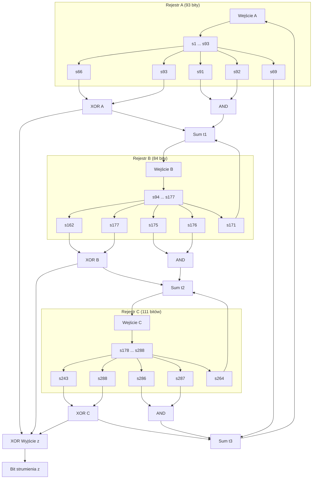

# Kryptografia i kryptoanaliza

## Laboratorium 7

### Grupa 1ID24B

### Autorzy: Kamil Fudala, Andrzej Szczytyński

## Wprowadzenie
Rozwój algorytmów strumieniowych ewoluował od prostych, liniowych konstrukcji do złożonych układów nieliniowych. Klasyczne rejestry przesuwne ze sprzężeniem liniowym (LFSR) cechują się wysoką wydajnością sprzętową i dobrymi właściwościami statystycznymi, jednak ich liniowość czyni je podatnymi na ataki algebraiczne, takie jak algorytm Berlekampa-Massey'a, który pozwala na odtworzenie wielomianu sprzężenia zwrotnego na podstawie $2L$ bitów strumienia (gdzie $L$ to długość rejestru). Generatory złożone, łączące kilka LFSR, również wykazały podatności, głównie na ataki korelacyjne, które wykorzystują statystyczne zależności między wyjściem generatora a stanami poszczególnych rejestrów.

Trivium, jako reprezentant nowoczesnych szyfrów strumieniowych (NLFSR), został zaprojektowany z myślą o wyeliminowaniu tych słabości. Jest to szyfr sprzętowy wybrany do portfolio projektu eSTREAM (Profil 2), oparty na trzech nieliniowych rejestrach przesuwnych ze sprzężeniem zwrotnym. Jego konstrukcja zapewnia prostotę implementacji sprzętowej przy jednoczesnym zachowaniu wysokiego poziomu bezpieczeństwa i wydajności.

Parametry systemowe Trivium obejmują:
*   Klucz ($K$): 80 bitów.
*   Wektor inicjalizujący ($IV$): 80 bitów.
*   Stan wewnętrzny: 288 bitów.

Celem niniejszego laboratorium jest weryfikacja poprawności implementacji szyfru Trivium, analiza bezpieczeństwa fazy rozgrzewania (warm-up), zbadanie ewolucji stanu wewnętrznego oraz praktyczna demonstracja ataków typu "IV Reuse" (ponowne użycie wektora inicjalizującego) oraz ataku kostkowego (Cube Attack) na wersjach o zredukowanej liczbie rund.

## Opis implementacji

### Architektura rozwiązania
Stan wewnętrzny szyfru Trivium o długości 288 bitów jest podzielony na trzy rejestry przesuwne o różnych długościach:
*   **Rejestr A**: 93 bity ($s_1, \dots, s_{93}$).
*   **Rejestr B**: 84 bity ($s_{94}, \dots, s_{177}$).
*   **Rejestr C**: 111 bitów ($s_{178}, \dots, s_{288}$).

Proces inicjalizacji polega na załadowaniu 80-bitowego klucza $K$ do pierwszych pozycji rejestru A oraz 80-bitowego wektora $IV$ do pierwszych pozycji rejestru B. Pozostałe bity w tych rejestrach są zerowane. Rejestr C jest inicjalizowany zerami, z wyjątkiem trzech ostatnich bitów ($s_{286}, s_{287}, s_{288}$), które są ustawiane na wartość 1. Stanowi to warunek konieczny do uniknięcia stanu zerowego. Następnie algorytm wykonuje 1152 rundy "rozgrzewania" (4 pełne cykle po 288 kroków), podczas których stan jest aktualizowany, ale nie jest generowany żaden strumień wyjściowy. Ma to na celu pełne wymieszanie bitów klucza i IV.

### Diagram przepływu danych

### Kluczowe algorytmy
Główna pętla aktualizacji stanu (Algorytm 2) opiera się na następujących operacjach logicznych. W każdej iteracji obliczane są wartości pośrednie $t_1, t_2, t_3$ będące sumą modulo 2 (XOR) wybranych "odczepów" (taps) z każdego rejestru:

$$t_1 = s_{66} \oplus s_{93}$$
$$t_2 = s_{162} \oplus s_{177}$$
$$t_3 = s_{243} \oplus s_{288}$$

Bit strumienia klucza $z$ jest generowany jako:
$$z = t_1 \oplus t_2 \oplus t_3$$

Kluczowym elementem wprowadzającym nieliniowość do układu są bramki AND zastosowane w pętli sprzężenia zwrotnego. Wartości $t_i$ są modyfikowane przed wprowadzeniem ich do kolejnego rejestru:

$$t_1 \leftarrow t_1 \oplus (s_{91} \cdot s_{92}) \oplus s_{171}$$
$$t_2 \leftarrow t_2 \oplus (s_{175} \cdot s_{176}) \oplus s_{264}$$
$$t_3 \leftarrow t_3 \oplus (s_{286} \cdot s_{287}) \oplus s_{69}$$

Następnie następuje przesunięcie rejestrów i wprowadzenie nowych wartości (sprzężenie krzyżowe): wyjście rejestru A zasila rejestr B, wyjście B zasila C, a wyjście C wraca do A.

### Optymalizacja
W celu osiągnięcia ekstremalnej wydajności (wyniki rzędu 70 Gbps dla szyfrowania), w implementacji zastosowano szereg zaawansowanych technik optymalizacyjnych:

1.  **AOT (Ahead-of-Time) Compilation**: Zastosowanie kompilacji natywnej dla architektury Zen 3 eliminuje narzut związany z JIT (Just-In-Time) oraz pozwala na agresywne inlinowanie metod, co jest kluczowe przy tak prostych operacjach bitowych.
2.  **SIMD / AVX2 (Advanced Vector Extensions)**: Wykorzystanie 256-bitowych rejestrów do równoległego przetwarzania strumienia. Trivium pozwala na równoległe obliczanie do 64 bitów jednocześnie bez zmiany wyniku, ponieważ żaden bit stanu nie jest używany przez co najmniej 64 iteracje po modyfikacji.
3.  **HugePages (512 stron)**: Optymalizacja zarządzania pamięcią poprzez redukcję liczby wpisów w TLB (Translation Lookaside Buffer), co minimalizuje opóźnienia przy dostępie do dużych buforów danych podczas testów nasycenia.
4.  **Eliminacja barier bezpieczeństwa ("Usunięcie # z C#")**: Wykorzystanie bloków `unsafe`, wskaźników oraz pominięcie sprawdzania zakresów tablic (bounds checking). Pozwala to na uniknięcie sprawdzania warunków logicznych wewnątrz krytycznych pętli, co skutkuje generowaniem przez kompilator czystego kodu maszynowego, zbliżonego wydajnością do C/Assembly, kosztem rezygnacji z mechanizmów zarządzanych platformy .NET.
5.  **Real-Time Priority**: Uruchomienie procesu z priorytetem czasu rzeczywistego w celu minimalizacji kontekstowego przełączania zadań przez system operacyjny.

## Wyniki eksperymentów

Weryfikację implementacji przeprowadzono w środowisku Linux (Zen 3) z wykorzystaniem skryptu `run.sh` oraz trybu HugePages.

### Eksperyment 1: Weryfikacja (Test Vectors)
Pierwszy eksperyment potwierdził zgodność generowanego strumienia z wektorami testowymi oraz poprawność operacji inwolutywnej (szyfrowanie i deszyfrowanie).

Tabela 1: Wyniki weryfikacji poprawności
| Parametr | Wynik |
| :--- | :--- |
| Generated Hash | `FBE0BF265859051B517A2E4E239FC97F563203161907CF2DE7A8790FA1B2E9CD` |
| Expected Hash | `FBE0BF265859051B517A2E4E239FC97F563203161907CF2DE7A8790FA1B2E9CD` |
| Match | **True** |
| Involutive Check | **True** |

### Eksperyment 2: Atak IV Reuse
Zdemonstrowano atak polegający na ponownym użyciu wektora IV (IV Reuse). Przechwycono dwa szyfrogramy zaszyfrowane tym samym kluczem i IV. Wykorzystując znany fragment tekstu jawnego ("Crib"), odzyskano treść drugiej wiadomości.

*   Czas szyfrowania: 9.80 µs
*   Odzyskana wiadomość: `HTTP/1.1 404 Not Found`
*   Analiza dopasowań (Crib Dragging):
    *   'HTTP': 42 dopasowania (0.90 µs)
    *   'Content-Type:': 13 dopasowań (2.80 µs)

### Eksperyment 3: Analiza Rund i Ewolucja Stanu
Przeprowadzono analizę właściwości statystycznych strumienia w zależności od liczby rund rozgrzewania.

Tabela 2: Statystyki strumienia w funkcji liczby rund
| Rounds | Ones | Balance | Chi-Sq | Throughput (Mbps) |
| :--- | :--- | :--- | :--- | :--- |
| 0 | 83 | 0.288 | 2.25 | 6659.52 |
| 192 | 154 | 0.535 | 3.10 | 6789.05 |
| 288 | 156 | 0.542 | 3.31 | 8447.23 |
| 384 | 142 | 0.493 | 3.61 | 8452.23 |
| 480 | 149 | 0.517 | 3.69 | 8339.03 |
| 576 | 149 | 0.517 | 3.31 | 7437.93 |
| 768 | 143 | 0.497 | 4.00 | 7346.35 |
| 1152 | 154 | 0.535 | 3.69 | 6534.92 |

Zauważalna jest stabilizacja balansu (blisko 0.5) oraz wartości testu Chi-kwadrat wraz ze wzrostem liczby rund.

### Eksperyment 4: Atak Kostkowy (Cube Attack)
Przeprowadzono atak kostkowy na wersjach Trivium o zredukowanej liczbie rund (192, 288, 384, 480).

Tabela 3: Wyniki ataku kostkowego
| Rundy | Kostki (Rozmiar 6) Czas | Faza Offline (µs) | Faza Online (µs) | Znalezione bity | Dokładność (%) |
| :--- | :--- | :--- | :--- | :--- | :--- |
| 192 | 3784.10 µs | 7899.80 | 260.30 | 26 | 46.2 % |
| 288 | 2939.00 µs | 6258.20 | 166.50 | 26 | 38.5 % |
| 384 | 3122.80 µs | 6538.80 | 85.90 | 23 | 52.2 % |
| 480 | 3144.90 µs | 6626.60 | 73.00 | 16 | 56.2 % |

### Eksperyment 5: Porównanie Statystyczne
Porównano jakość generatora dla 0, 288 i 1152 rund (standard).

Tabela 4: Testy statystyczne (długość próby: 1000000 bitów)
| Rundy | Częstość "1" (%) | Liczba serii (Runs) | Autokorelacja (Lag 1) | Chi-Square | Wniosek |
| :--- | :--- | :--- | :--- | :--- | :--- |
| 0 | 50.03 % | 499359 | 0.0013 | 0.4651 | Pass |
| 288 | 50.03 % | 499369 | 0.0013 | 0.4624 | Pass |
| 1152 | 50.03 % | 499382 | 0.0012 | 0.4462 | Pass |

Wszystkie warianty przeszły podstawowe testy statystyczne (wartość krytyczna Chi-Sq: 3.841), co sugeruje, że słabości wczesnych rund mają charakter algebraiczny, a nie czysto statystyczny.

### Eksperyment 6: Test Nasycenia (Saturation)
Test wydajnościowy na próbce 1 miliarda bitów (1 Gbit).
*   **Czas generacji**: 638.84 ms
*   **Prędkość**: 1565.34 Mbps (KeyStream)
*   **Szybkość szyfrowania (Native)**: **70.05 Gbps**
*   **Integrity Check**: True

## Pytania Kontrolne

1.  **Różnica LFSR vs NLFSR**:
    LFSR (Linear Feedback Shift Register) jest układem liniowym, co oznacza, że każdy bit wyjściowy jest liniową kombinacją bitów stanu. Sprawia to, że jego złożoność liniowa jest niska, a stan wewnętrzny można odtworzyć algorytmem Berlekampa-Massey'a. NLFSR (Non-Linear Feedback Shift Register), taki jak w Trivium, wprowadza operacje nieliniowe (np. mnożenie bitów - bramki AND) w funkcji sprzężenia zwrotnego. Zwiększa to drastycznie złożoność algebraiczną i utrudnia ataki polegające na rozwiązywaniu układów równań liniowych.

2.  **Dowód formalny $C_1 \oplus C_2 = P_1 \oplus P_2$**:
    Niech $C_1$ i $C_2$ będą szyfrogramami powstałymi z tekstów jawnych $P_1$ i $P_2$ przy użyciu tego samego strumienia klucza $Z$ (ten sam Klucz i IV).
    $C_1 = P_1 \oplus Z$
    $C_2 = P_2 \oplus Z$
    Obliczając różnicę symetryczną (XOR) szyfrogramów:
    $C_1 \oplus C_2 = (P_1 \oplus Z) \oplus (P_2 \oplus Z) = P_1 \oplus P_2 \oplus (Z \oplus Z) = P_1 \oplus P_2 \oplus 0 = P_1 \oplus P_2$.
    Zależność ta pozwala na atak, jeśli znamy jeden tekst jawny lub jego statystykę, co ujawnia treść drugiego tekstu bez znajomości klucza.

3.  **Znaczenie fazy rozgrzewania**:
    Faza rozgrzewania (w Trivium 1152 rundy) służy do dyfuzji bitów klucza i IV na cały stan wewnętrzny (288 bitów). Bez tej fazy, pierwsze bity strumienia byłyby silnie skorelowane z kluczem i IV, a nieliniowość układu nie zdążyłaby wpłynąć na wyjście. Pozwoliłoby to na trywialne ataki algebraiczne lub odgadnięcie stanu.

4.  **Sprzężenia krzyżowe**:
    W Trivium wyjście rejestru A zasila wejście B, wyjście B zasila C, a wyjście C zasila A. Ta cykliczna struktura powoduje, że okres generatora jest znacznie dłuższy niż suma okresów poszczególnych rejestrów, a bity stanu są wielokrotnie mieszane między rejestrami, co wzmacnia odporność na ataki typu "dziel i rządź".

5.  **Definicja kostki i superwielomianu**:
    W ataku kostkowym (Cube Attack), "kostka" to zbiór bitów IV, dla których sumujemy wartości wyjściowe szyfru. Superwielomian to wielomian opisujący zależność sumy wyjść (dla wszystkich wartości kostki) od tajnych bitów klucza. Jeśli superwielomian jest liniowy, możemy łatwo wyznaczyć bity klucza.

6.  **Porównanie IV Reuse vs Atak korelacyjny**:
    Atak IV Reuse (Two-Time Pad) jest błędem implementacyjnym/protokolarnym – wynika z niewłaściwego użycia szyfru i jest zazwyczaj deterministyczny i natychmiastowy. Atak korelacyjny jest atakiem kryptoanalitycznym na samą konstrukcję szyfru (słabość algorytmu), wymagającym dużej ilości danych i analizy statystycznej w celu znalezienia korelacji między wyjściem a stanem wewnętrznym.

7.  **Margines bezpieczeństwa**:
    Trivium z 1152 rundami rozgrzewania jest uważane za bezpieczne. Ataki (np. kostkowe) są skuteczne dla wersji zredukowanych do około 700-800 rund. Oznacza to, że margines bezpieczeństwa jest stosunkowo niewielki (thin margin), ale wystarczający przy obecnym stanie wiedzy.

8.  **Modyfikacje protokołu**:
    W celu zwiększenia bezpieczeństwa można zwiększyć liczbę rund rozgrzewania lub długość rejestrów (jak w Trivium-A). Jednak każda zmiana musi być ostrożna, aby nie wpłynąć negatywnie na wydajność sprzętową, która jest głównym atutem Trivium.

## Podsumowanie i wnioski końcowe

*   Trivium jest niezwykle wydajnym algorytmem, szczególnie w implementacjach wykorzystujących SIMD i AOT.
*   Optymalizacja niskopoziomowa (AVX2, HugePages, `unsafe` code) pozwala na osiągnięcie prędkości rzędu 70 Gbps, jednak wiąże się to ze znacznym obniżeniem czytelności i łatwości utrzymania kodu (trade-off: wydajność vs maintainability).
*   Faza rozgrzewania (1152 rundy) jest krytyczna dla odporności na ataki algebraiczne (Cube), mimo że właściwości statystyczne strumienia są poprawne znacznie wcześniej.
*   Ponowne użycie IV jest błędem krytycznym, pozwalającym na całkowitą eliminację strumienia klucza bez znajomości klucza $K$.
